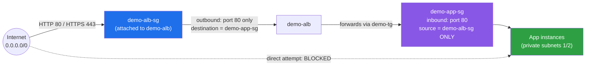

# 04 - Load Balancer Security Group Design (Hands-On)

> Goal: build the **security-group chaining pattern** that makes your backend instances completely unreachable from the internet except through `demo-alb`. We create a new `demo-alb-sg` and then tighten (or create) an application-tier security group, `demo-app-sg`, to only trust it. Continues Note 03 (network prerequisites confirmed); Note 05 uses both security groups built here to actually create `demo-alb`.

---

## 1. The problem with an unprotected setup

If your application-tier security group (`demo-app-sg`) currently allows inbound traffic on the app port from a broad source — the public internet, "My IP," or even just the load balancer's subnet CIDR blocks — you have a gap. Opening it to a subnet CIDR, for example, works but also lets *anything else* in those subnets reach the app tier, not just the load balancer itself.

Without a dedicated ALB security group referenced as the source, you'd be tempted to either:
- Open `demo-app-sg` inbound 80 to `0.0.0.0/0` (defeats the entire purpose of the private subnet), or
- Open it to the ALB's **subnet CIDRs** — works, but also lets *anything else* in those subnets reach the app tier, not just the load balancer itself.

The correct pattern: give the load balancer **its own security group**, and reference *that security group* (not a CIDR) as the only trusted source on the app tier.

---

## 2. The SG-chaining pattern

```
Internet (0.0.0.0/0)
    │  HTTP 80 / HTTPS 443
    ▼
demo-alb-sg  (attached to demo-alb)
    │  outbound → demo-app-sg only, on the app port
    ▼
demo-app-sg  (attached to your app instances)
    │  inbound ONLY from demo-alb-sg
    ▼
App instances
```

- **`demo-alb-sg`** (new, built here): attached to `demo-alb`. Inbound from the whole internet on the ports clients use; outbound restricted to only what the backend needs.
- **`demo-app-sg`** (create it if it doesn't already exist, or update it if it does): inbound rule's **source** becomes `demo-alb-sg` itself, not a CIDR, not "My IP."

> 🧠 This is a general tiered security-group chaining pattern — a security group in front (load balancer) references a security group behind it (application tier) as the only trusted source, one hop at a time: **internet → alb-sg → app-sg → instances**.

**Why this is more secure:** with `demo-app-sg` only trusting `demo-alb-sg` as a source, your instances become **completely unreachable directly from the internet**, even if someone discovers their private IPs (which shouldn't be routable from outside anyway, but defense in depth matters). Every single request **must** physically pass through `demo-alb` first — there is no way to bypass it at the network layer.

---

## 3. Hands-on: create `demo-alb-sg`

1. **EC2 console** → left nav → **Security Groups** → **Create security group**.
2. **Security group name**: `demo-alb-sg`.
3. **Description**: `Security group for demo-alb - allows inbound web traffic from the internet`.
4. **VPC**: your VPC.
5. **Inbound rules** → **Add rule** (twice):

   | Type | Protocol | Port range | Source |
   |---|---|---|---|
   | HTTP | TCP | 80 | `0.0.0.0/0` |
   | HTTPS | TCP | 443 | `0.0.0.0/0` |

6. **Outbound rules** — remove the default "all traffic" rule and add a scoped one instead:

   | Type | Protocol | Port range | Destination |
   |---|---|---|---|
   | Custom TCP | TCP | 80 | `demo-app-sg` (select the security group, not a CIDR) |

   This says: "`demo-alb-sg` can only send traffic onward to whatever currently has `demo-app-sg` attached, on port 80" — the load balancer can't accidentally (or maliciously, if compromised) reach anything else in the VPC.
7. **Create security group**.

> ⚠️ AWS Security Groups are **stateful** — so you do **not** need a separate outbound rule to allow the *response* traffic back to clients; that's automatic. The outbound rule above only governs the ALB's **new, outbound-initiated** connections toward its targets.

---

## 4. Hands-on: create/update `demo-app-sg` to trust only `demo-alb-sg`

1. **Security Groups** → select (or create) **`demo-app-sg`**, attached to your application-tier instances.
2. **Inbound rules** tab → **Edit inbound rules**.
3. Locate (or add) the rule for the application's listening port (HTTP:80, matching `demo-tg`'s configuration in Note 05).
4. Set its **Source** to **Custom** → start typing `demo-alb-sg` → select it from the dropdown (it resolves to the security group's ID, `sg-xxxxxxxx`).
5. **Remove** any inbound rule on this port sourced from `0.0.0.0/0` or a specific "My IP" — those defeat the purpose here.
6. **Save rules**.

`demo-app-sg`'s inbound rules now look like:

| Type | Port | Source | Purpose |
|---|---|---|---|
| HTTP | 80 | `demo-alb-sg` | Application traffic — **only from the load balancer** |
| SSH (demo/emergency) | 22 | Bastion/Session Manager path only | Admin access, not app traffic |

---

## 5. Diagram: the complete SG chain



A direct connection attempt from the internet straight to an instance's private IP never even reaches the SG evaluation stage in practice (private IPs aren't internet-routable), but even *if* traffic somehow arrived at the ENI, `demo-app-sg` would drop it — the only permitted source is `demo-alb-sg`.

---

## 6. Exam tips

🎯 **Exam tip:** referencing a **security group as a rule's source** (instead of a CIDR block) means the rule automatically covers **any instance that currently has that security group attached** — including instances launched later by scale-out, or ones that replace terminated instances. This is exactly why `demo-app-sg` trusting `demo-alb-sg` (rather than the ALB's subnet CIDRs or specific IPs) keeps working correctly as your fleet scales in and out, with zero rule maintenance — if the target group is attached to an Auto Scaling group, instances register/deregister automatically as it scales, and each new instance automatically inherits the trust relationship simply by having `demo-app-sg` attached.

🎯 **Exam tip:** "how do you ensure backend instances are only reachable through the load balancer, never directly from the internet" → the expected answer is this exact SG-chaining pattern: create a dedicated SG for the load balancer, then scope the backend SG's inbound rule to that load balancer SG as the source — not a CIDR, not "0.0.0.0/0 restricted by NACL," and not relying on the instances simply lacking a public IP (defense in depth still applies even to private-subnet resources).

---

## 7. Troubleshooting

| Symptom | Likely cause | Fix |
|---|---|---|
| `demo-alb-sg` doesn't appear in `demo-app-sg`'s source dropdown | Trying to reference a security group from a **different VPC** | Security group references only work within the same VPC (or specifically peered VPCs with extra config) — confirm both SGs are in the same VPC |
| ALB health checks fail after tightening `demo-app-sg` | The health check port doesn't match the newly scoped inbound rule's port | Ensure `demo-app-sg`'s inbound rule covers the same port as `demo-tg`'s health check port (Note 05), not just the "main" traffic port if they differ |
| Clients can't reach `demo-alb` at all | `demo-alb-sg`'s inbound rule for 80/443 was scoped too narrowly (e.g. left as "My IP" from testing) | Re-open the appropriate port(s) to `0.0.0.0/0` (or your intended client CIDR) on `demo-alb-sg` |
| Instances still reachable via an old rule | A leftover inbound rule (e.g. an earlier `0.0.0.0/0` test rule, or a stale reference to some other security group) wasn't removed | Audit all inbound rules on `demo-app-sg` and delete anything that isn't `demo-alb-sg` or the controlled admin-access rule |

---

## 8. Recap

- Built **`demo-alb-sg`**: inbound 80/443 from `0.0.0.0/0`, outbound restricted to `demo-app-sg` on port 80 only.
- Created/updated **`demo-app-sg`** to allow inbound **only from `demo-alb-sg`**, removing any CIDR-based or "My IP" rules on the app port.
- This SG chain (`internet → demo-alb-sg → demo-alb → demo-app-sg → app instances`) makes the backend fleet unreachable from the internet by any path other than through the load balancer.
- Referencing a security group as a source (not a CIDR) is the exam-favored pattern precisely because it auto-covers instances added/replaced later — no rule maintenance needed as the fleet scales.
- Next: Note 05 — build `demo-alb`, `demo-tg`, and the HTTP:80 listener using exactly these two security groups.

---

### Sources
- [Security groups for your Application Load Balancer – AWS docs](https://docs.aws.amazon.com/elasticloadbalancing/latest/application/application-load-balancers.html#load-balancer-security-groups)
- [Update security groups for your Application Load Balancer – AWS docs](https://docs.aws.amazon.com/elasticloadbalancing/latest/application/load-balancer-update-security-groups.html)
- [Security groups for your VPC – AWS docs](https://docs.aws.amazon.com/vpc/latest/userguide/vpc-security-groups.html)
