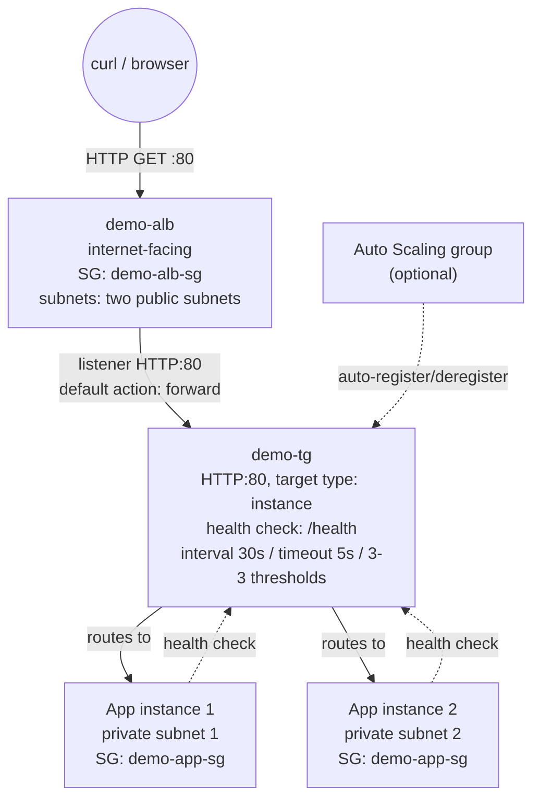

# 05 - Create an Application Load Balancer (Hands-On)

> Goal: the core build of this whole folder — actually create **`demo-alb`**, its default target group **`demo-tg`**, and an HTTP:80 listener, then verify traffic is really load balanced across backend instances. Uses the network from Note 03 and the security groups from Note 04.

---

## 1. Prerequisites checklist (already built in earlier notes)

- Your VPC, with two public subnets across two Availability Zones — confirmed ALB-ready in Note 03.
- Security groups `demo-alb-sg` (inbound 80/443 from `0.0.0.0/0`) and `demo-app-sg` (inbound 80 from `demo-alb-sg` only) — built in Note 04.
- One or more backend instances (standalone, or managed by an Auto Scaling group) running in your private application subnets, serving HTTP on port 80, with a simple page (e.g. one that prints the instance ID) and a `/health` path returning `200 OK`. If you don't already have such instances, launch a couple of small EC2 instances with `httpd` installed via user data before continuing — any minimal web server works for this demo.

---

## 2. Create the target group — `demo-tg`

You can create the target group ahead of time, or inline during the ALB wizard's listener step (both produce the same result). Doing it first, standalone, makes the settings easier to see:

1. **EC2 console** → left nav → **Load Balancing** → **Target Groups** → **Create target group**.
2. **Choose a target type**: **Instances**.
3. **Target group name**: `demo-tg`.
4. **Protocol : Port**: **HTTP : 80**.
5. **VPC**: your VPC.
6. **Protocol version**: HTTP/1.1 (default).
7. **Health checks**:
   - **Health check protocol**: HTTP.
   - **Health check path**: `/health`.
   - **Advanced health check settings**:

     | Setting | Value | AWS console default |
     |---|---|---|
     | Healthy threshold | **3** | 5 |
     | Unhealthy threshold | **3** | 2 |
     | Timeout | **5 seconds** | 5 seconds |
     | Interval | **30 seconds** | 30 seconds |
     | Success codes | 200 | 200 |

     We deliberately override the healthy/unhealthy thresholds to **3/3** (a symmetric, moderate setting) instead of AWS's asymmetric defaults (5 healthy / 2 unhealthy) — 3 consecutive failures marks a target down reasonably fast without being trigger-happy on a single blip, and 3 consecutive successes brings it back without waiting through 5 full intervals (~150s).
8. Click **Next**.
9. **Register targets** page: if you already have backend instances running, select and register them here. If a target group is attached to an Auto Scaling group instead, skip this page and leave it empty — the ASG registers/deregisters its own instances automatically, and manually registering here would just be redundant.

---

## 3. Create the load balancer — `demo-alb`

1. **EC2 console** → left nav → **Load Balancers** → **Create load balancer**.
2. Under **Application Load Balancer**, click **Create**.
3. **Basic configuration**:
   - **Load balancer name**: `demo-alb`.
   - **Scheme**: **Internet-facing**.
   - **Load balancer IP address type**: **IPv4**.
4. **Network mapping**:
   - **VPC**: your VPC (only VPCs with an Internet Gateway are selectable for an internet-facing scheme — confirms Note 03's checks).
   - **Availability Zones and subnets**: check the first AZ → select your first public subnet; check the second AZ → select your second public subnet.
5. **Security groups**: remove the pre-selected default VPC security group, select **`demo-alb-sg`** instead (built in Note 04).
6. **Listeners and routing**:
   - Default listener: **Protocol HTTP, Port 80** (leave as-is).
   - **Default action**: **Forward to** → select the existing target group **`demo-tg`**.
7. Skip **Secure listener settings** (no HTTPS listener yet — no certificate needed for this demo).
8. Skip **Optimize with service integrations** and **Load balancer tags**.
9. **Review** → **Create load balancer**. State starts as `Provisioning`, then becomes `Active` within a minute or two.

---

## 4. What just got created

| Resource | Key configuration |
|---|---|
| `demo-alb` | Internet-facing, IPv4, two public subnets across two AZs, SG `demo-alb-sg` |
| Listener | HTTP : 80 → default action: forward to `demo-tg` |
| `demo-tg` | HTTP : 80, target type Instance, health check `/health`, interval 30s / timeout 5s / healthy 3 / unhealthy 3 |

---

## 5. Auto-registration into `demo-tg` — no manual step needed (if using an ASG)

If your backend instances are managed by an Auto Scaling group that's attached to `demo-tg` (rather than registered manually):

- Every instance the ASG launches is **automatically registered** with `demo-tg` the moment it's `InService` — you never manually add instance IDs to the target group yourself.
- Every instance the ASG terminates is **automatically deregistered** first (entering the `draining` state for up to the deregistration delay — Note 02 §8) before actually being terminated.
- `demo-alb`'s own health checks against `demo-tg` feed back into the ASG's replacement decisions when **ELB health checks** are enabled on the ASG — an unhealthy target is reported by the target group, and the ASG is what actually decides to terminate and replace the instance.

This is the payoff of attaching a target group to an Auto Scaling group: the ASG never needs manual target registration, ever. If you're using standalone instances instead, you register/deregister them manually on the target group's **Targets** tab.

---

## 6. Verify: DNS name, curl test, and load-balanced instance IDs

1. **Load Balancers** → select `demo-alb` → copy the **DNS name** shown under **Description**, e.g. `demo-alb-1234567890.us-east-1.elb.amazonaws.com`.
2. **Target Groups** → `demo-tg` → **Targets** tab: confirm your backend instances show **Health status = healthy** (give it a minute after they launch — a target passes `initial` only after its first successful health check).
3. From your own machine, `curl` the DNS name a few times:

   ```
   curl http://demo-alb-1234567890.us-east-1.elb.amazonaws.com/
   curl http://demo-alb-1234567890.us-east-1.elb.amazonaws.com/
   curl http://demo-alb-1234567890.us-east-1.elb.amazonaws.com/
   ```

4. You should see the response body alternate between **different instance IDs** — e.g. `<h1>Hello from i-0abc123...</h1>` on one call and `<h1>Hello from i-0def456...</h1>` on the next — proving `demo-alb` is genuinely distributing requests across all your backend instances.
5. Open the same DNS name in a browser as an easier visual check — refresh a few times and watch the instance ID change.



---

## 7. Troubleshooting

| Symptom | Likely cause | Fix |
|---|---|---|
| **502 Bad Gateway** from `curl`/browser | `demo-tg` has no healthy targets, or `demo-app-sg` is blocking the ALB's traffic (SG chain from Note 04 broken) | Check **Targets** tab health status; re-verify `demo-app-sg` inbound allows port 80 from `demo-alb-sg` specifically |
| **502 Bad Gateway**, targets show healthy | Target closed the connection with a TCP RST/FIN while a request was in flight, or an SSL handshake error on the backend | Check `httpd`'s keep-alive isn't shorter than the ALB's idle timeout (60s default); confirm no HTTPS mismatch between listener and target |
| Targets stuck in `unhealthy` | Health check path `/health` doesn't match what the instance actually serves, or the health check port is blocked by `demo-app-sg` | Confirm the instance's web server actually serves `/health`; confirm SG allows the health check port |
| Targets stuck in `initial` | Instance hasn't passed its **first** health check yet, or is still booting | Wait through the instance's boot/grace period plus at least one 30s health check interval |
| `curl` to the DNS name hangs/times out entirely | `demo-alb-sg` doesn't allow inbound 80 from your test client, or you selected private subnets by mistake when creating `demo-alb` | Re-check `demo-alb-sg` inbound rule from Note 04; re-check Note 03's subnet selection guidance |
| Only ever see **one** instance ID in responses | Cross-zone/health issue is masking the second instance, or it genuinely isn't registered yet | Check `demo-tg`'s **Targets** tab shows all expected healthy entries; give the fleet a minute to finish registering |
| Target group doesn't appear when attaching an Auto Scaling group to it | The target group wasn't created yet, or was created in the wrong VPC | Confirm this note's steps ran first, and that `demo-tg`'s VPC matches your ASG's VPC |

---

## 8. Clean up to avoid charges

`demo-alb` is billed **hourly plus Load Balancer Capacity Units (LCU)** regardless of how much traffic it actually handles — a common source of surprise charges if a demo is left running.

1. **Load Balancers** → select `demo-alb` → **Actions** → **Delete load balancer** → confirm.
2. **Target Groups** → select `demo-tg` → **Actions** → **Delete** (only possible after the load balancer referencing it is gone, or after removing it from the listener).
3. If you're not continuing to later notes, also terminate/scale down your backend instances so they stop billing too — an ALB with no targets still costs its hourly + LCU charge on its own.
4. Security groups (`demo-alb-sg`, `demo-app-sg`) are free to leave in place; delete them only if you're tearing down the whole demo VPC.

---

## 9. Recap

- Built **`demo-tg`** (HTTP:80, target type Instance, health check `/health`, interval 30s / timeout 5s / healthy 3 / unhealthy 3 — a deliberate override of the AWS defaults of 5 healthy / 2 unhealthy).
- Built **`demo-alb`** (internet-facing, IPv4, two public subnets, SG `demo-alb-sg`) with an HTTP:80 listener whose default action forwards to `demo-tg`.
- If backend instances are managed by an Auto Scaling group attached to `demo-tg`, they register/deregister automatically — no manual target registration, ever.
- Verified via the ALB's DNS name that requests are genuinely load-balanced across different backend instance IDs.
- This folder's demo is now a complete, load-balanced two-tier setup, independent of how the VPC or backend instances were originally built.
- Next: Note 06 introduces **path-based vs host-based routing** — adding `demo-tg-api` and `demo-tg-admin` behind this same `demo-alb` via additional listener rules.

---

### Sources
- [Create an Application Load Balancer – AWS docs](https://docs.aws.amazon.com/elasticloadbalancing/latest/application/create-application-load-balancer.html)
- [Health checks for your Application Load Balancer target groups – AWS docs](https://docs.aws.amazon.com/elasticloadbalancing/latest/application/target-group-health-checks.html)
- [Troubleshoot your Application Load Balancers – AWS docs](https://docs.aws.amazon.com/elasticloadbalancing/latest/application/load-balancer-troubleshooting.html)
- [Attach a target group to your Auto Scaling group – AWS docs](https://docs.aws.amazon.com/autoscaling/ec2/userguide/attach-load-balancer-asg.html)
