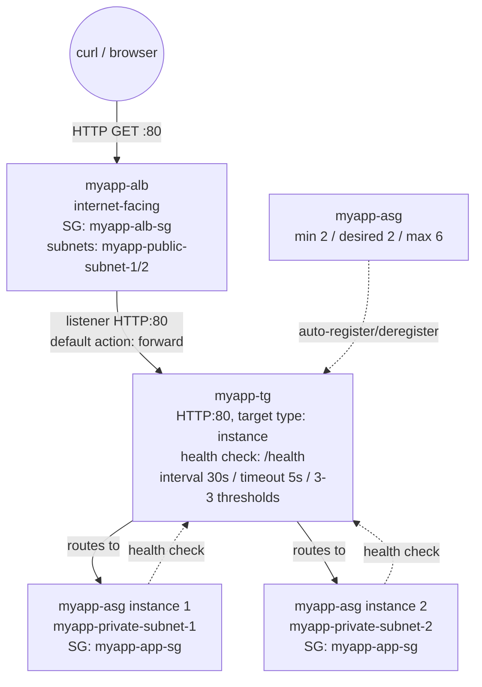

# 05 - Create an Application Load Balancer (Hands-On)

> Goal: the core build of this whole folder — actually create **`myapp-alb`**, its default target group **`myapp-tg`**, and an HTTP:80 listener, then verify traffic is really load balanced across `myapp-asg`'s instances. Uses the network from Note 03 and the security groups from Note 04. This is the exact target group `EC2\ASG\02-Launch-Template-and-ASG-HandsOn.md` already assumed existed and registers into.

---

## 1. Prerequisites checklist (already built in earlier notes)

- `myapp-vpc`, public subnets `myapp-public-subnet-1` (`ap-south-1a`) / `myapp-public-subnet-2` (`ap-south-1b`) — confirmed ALB-ready in Note 03.
- Security groups `myapp-alb-sg` (inbound 80/443 from `0.0.0.0/0`) and updated `myapp-app-sg` (inbound 80 from `myapp-alb-sg` only) — built in Note 04.
- `myapp-asg` (min 2 / desired 2 / max 6) already running healthy instances in `myapp-private-subnet-1/2`, per `EC2\ASG\02-Launch-Template-and-ASG-HandsOn.md` — its user data installs `httpd`, serves `index.html` with the instance ID, and serves `/health` returning `OK`.

> Note that `EC2\ASG\02` was written **assuming** `myapp-tg` and `myapp-alb` already existed, since building an ASG's "integrate with load balancing" step requires picking an existing target group. **This note is where that assumption becomes real** — if you're following the whole series in order, build this note's resources first, then `EC2\ASG\02`'s ASG will actually find `myapp-tg` in its target group dropdown.

AWS's own build order (per the official create-ALB flow) creates the target group **as part of** the load balancer wizard's "Listeners and routing" step — so you don't need a separate, earlier pass to create it; the walkthrough below does it in one flow, exactly as the console presents it.

---

## 2. Create the target group — `myapp-tg`

You can create the target group ahead of time, or inline during the ALB wizard's listener step (both produce the same result). Doing it first, standalone, makes the settings easier to see:

1. **EC2 console** → left nav → **Load Balancing** → **Target Groups** → **Create target group**.
2. **Choose a target type**: **Instances**.
3. **Target group name**: `myapp-tg`.
4. **Protocol : Port**: **HTTP : 80**.
5. **VPC**: `myapp-vpc`.
6. **Protocol version**: HTTP/1.1 (default).
7. **Health checks**:
   - **Health check protocol**: HTTP.
   - **Health check path**: `/health`.
   - **Advanced health check settings**:

     | Setting | Value | AWS console default |
     |---|---|---|
     | Healthy threshold | **3** | 5 |
     | Unhealthy threshold | **3** | 2 |
     | Timeout | **5 seconds** | 5 seconds |
     | Interval | **30 seconds** | 30 seconds |
     | Success codes | 200 | 200 |

     We deliberately override the healthy/unhealthy thresholds to **3/3** (a symmetric, moderate setting) instead of AWS's asymmetric defaults (5 healthy / 2 unhealthy) — 3 consecutive failures marks a target down reasonably fast without being trigger-happy on a single blip, and 3 consecutive successes brings it back without waiting through 5 full intervals (~150s).
8. Click **Next**.
9. **Register targets** page: **skip this** — leave it empty and click **Create target group**. `myapp-asg` registers its own instances automatically (see Section 5) — manually registering here would just be redundant and gets undone by the ASG's own target-tracking anyway.

---

## 3. Create the load balancer — `myapp-alb`

1. **EC2 console** → left nav → **Load Balancers** → **Create load balancer**.
2. Under **Application Load Balancer**, click **Create**.
3. **Basic configuration**:
   - **Load balancer name**: `myapp-alb`.
   - **Scheme**: **Internet-facing**.
   - **Load balancer IP address type**: **IPv4**.
4. **Network mapping**:
   - **VPC**: `myapp-vpc` (only VPCs with an Internet Gateway are selectable for an internet-facing scheme — confirms Note 03's checks).
   - **Availability Zones and subnets**: check **`ap-south-1a`** → select subnet **`myapp-public-subnet-1`**; check **`ap-south-1b`** → select subnet **`myapp-public-subnet-2`**.
5. **Security groups**: remove the pre-selected default VPC security group, select **`myapp-alb-sg`** instead (built in Note 04).
6. **Listeners and routing**:
   - Default listener: **Protocol HTTP, Port 80** (leave as-is).
   - **Default action**: **Forward to** → select the existing target group **`myapp-tg`**.
7. Skip **Secure listener settings** (no HTTPS listener yet — no certificate needed for this demo).
8. Skip **Optimize with service integrations** and **Load balancer tags**.
9. **Review** → **Create load balancer**. State starts as `Provisioning`, then becomes `Active` within a minute or two.

---

## 4. What just got created

| Resource | Key configuration |
|---|---|
| `myapp-alb` | Internet-facing, IPv4, subnets `myapp-public-subnet-1/2`, SG `myapp-alb-sg` |
| Listener | HTTP : 80 → default action: forward to `myapp-tg` |
| `myapp-tg` | HTTP : 80, target type Instance, health check `/health`, interval 30s / timeout 5s / healthy 3 / unhealthy 3 |

---

## 5. `myapp-asg` auto-registers into `myapp-tg` — no manual step needed

Per `EC2\ASG\02-Launch-Template-and-ASG-HandsOn.md` §3 step 4 ("Load balancing → Attach to an existing load balancer → choose `myapp-tg`"), `myapp-asg` is configured to attach directly to this target group. Once both this note's resources and that ASG exist:

- Every instance `myapp-asg` launches is **automatically registered** with `myapp-tg` the moment it's `InService` — you never manually add instance IDs to the target group yourself.
- Every instance `myapp-asg` terminates is **automatically deregistered** first (entering the `draining` state for up to the deregistration delay — Note 02 §8) before actually being terminated.
- `myapp-alb`'s own health checks against `myapp-tg` feed back into the ASG's replacement decisions when **ELB health checks** are enabled on the ASG (which `EC2\ASG\02` does) — see `EC2\ASG\12-Auto-Scaling-vs-Elastic-Load-Balancer.md` for the full feedback-loop explanation.

This is the payoff of building the target group and load balancer first (or at least, having their names/settings agreed on first, per the spec both notes share): the ASG never needs manual target registration, ever.

---

## 6. Verify: DNS name, curl test, and load-balanced instance IDs

1. **Load Balancers** → select `myapp-alb` → copy the **DNS name** shown under **Description**, e.g. `myapp-alb-1234567890.ap-south-1.elb.amazonaws.com`.
2. **Target Groups** → `myapp-tg` → **Targets** tab: confirm both `myapp-asg` instances show **Health status = healthy** (give it a minute after the ASG launches them — the target passes `initial` only after its first successful health check).
3. From your own machine, `curl` the DNS name a few times:

   ```
   curl http://myapp-alb-1234567890.ap-south-1.elb.amazonaws.com/
   curl http://myapp-alb-1234567890.ap-south-1.elb.amazonaws.com/
   curl http://myapp-alb-1234567890.ap-south-1.elb.amazonaws.com/
   ```

4. You should see the response body alternate between **different instance IDs** — e.g. `<h1>Hello from i-0abc123...</h1>` on one call and `<h1>Hello from i-0def456...</h1>` on the next — proving `myapp-alb` is genuinely distributing requests across both of `myapp-asg`'s instances, using the exact user-data script from `EC2\ASG\02` §2.
5. Open the same DNS name in a browser as an easier visual check — refresh a few times and watch the instance ID change.



---

## 7. Troubleshooting

| Symptom | Likely cause | Fix |
|---|---|---|
| **502 Bad Gateway** from `curl`/browser | `myapp-tg` has no healthy targets, or `myapp-app-sg` is blocking the ALB's traffic (SG chain from Note 04 broken) | Check **Targets** tab health status; re-verify `myapp-app-sg` inbound allows port 80 from `myapp-alb-sg` specifically |
| **502 Bad Gateway**, targets show healthy | Target closed the connection with a TCP RST/FIN while a request was in flight, or an SSL handshake error on the backend | Check `httpd`'s keep-alive isn't shorter than the ALB's idle timeout (60s default); confirm no HTTPS mismatch between listener and target |
| Targets stuck in `unhealthy` | Health check path `/health` doesn't match what the instance actually serves, or the health check port is blocked by `myapp-app-sg` | Confirm the user-data script created `/var/www/html/health` (per `EC2\ASG\02` §2); confirm SG allows the health check port |
| Targets stuck in `initial` | Instance hasn't passed its **first** health check yet, or is still booting | Wait through the grace period (90s, per `EC2\ASG\02`) + at least one 30s health check interval |
| `curl` to the DNS name hangs/times out entirely | `myapp-alb-sg` doesn't allow inbound 80 from your test client, or you selected private subnets by mistake when creating `myapp-alb` | Re-check `myapp-alb-sg` inbound rule from Note 04; re-check Note 03's subnet selection guidance |
| Only ever see **one** instance ID in responses | Cross-zone/health issue is masking the second instance, or it genuinely isn't registered yet | Check `myapp-tg`'s **Targets** tab shows 2 healthy entries; give the ASG a minute to finish registering both |
| `myapp-tg` doesn't appear when configuring `myapp-asg`'s load balancing step | `myapp-tg` wasn't created yet, or was created in the wrong VPC | Confirm this note's steps ran first, and that `myapp-tg`'s VPC is `myapp-vpc` |

---

## 8. ⚠️ Clean up to avoid charges

`myapp-alb` is billed **hourly plus Load Balancer Capacity Units (LCU)** regardless of how much traffic it actually handles — a common source of surprise charges if a demo is left running.

1. **Load Balancers** → select `myapp-alb` → **Actions** → **Delete load balancer** → confirm.
2. **Target Groups** → select `myapp-tg` → **Actions** → **Delete** (only possible after the load balancer referencing it is gone, or after removing it from the listener).
3. If you're not continuing to later notes, also zero out `myapp-asg` (see `EC2\ASG\02` §6 cleanup) so its instances stop billing too — an ALB with no targets still costs its hourly + LCU charge on its own.
4. Security groups (`myapp-alb-sg`, `myapp-app-sg`) are free to leave in place; delete them only if you're tearing down the whole `myapp-vpc` build.

---

## 9. Recap

- Built **`myapp-tg`** (HTTP:80, target type Instance, health check `/health`, interval 30s / timeout 5s / healthy 3 / unhealthy 3 — a deliberate override of the AWS defaults of 5 healthy / 2 unhealthy).
- Built **`myapp-alb`** (internet-facing, IPv4, `myapp-public-subnet-1/2`, SG `myapp-alb-sg`) with an HTTP:80 listener whose default action forwards to `myapp-tg`.
- `myapp-asg` (from `EC2\ASG\02`) registers/deregisters its own instances into `myapp-tg` automatically — no manual target registration, ever.
- Verified via the ALB's DNS name that requests are genuinely load-balanced across different `myapp-asg` instance IDs.
- This closes the loop between the `VPC\` network, the `EC2\ASG\` compute fleet, and this folder's load balancer — `myapp` is now a complete, load-balanced, self-healing two-tier application.
- Next: Note 06 introduces **path-based vs host-based routing** — adding `myapp-tg-api` and `myapp-tg-admin` behind this same `myapp-alb` via additional listener rules.

---

### Sources
- [Create an Application Load Balancer – AWS docs](https://docs.aws.amazon.com/elasticloadbalancing/latest/application/create-application-load-balancer.html)
- [Health checks for your Application Load Balancer target groups – AWS docs](https://docs.aws.amazon.com/elasticloadbalancing/latest/application/target-group-health-checks.html)
- [Troubleshoot your Application Load Balancers – AWS docs](https://docs.aws.amazon.com/elasticloadbalancing/latest/application/load-balancer-troubleshooting.html)
- [Attach a target group to your Auto Scaling group – AWS docs](https://docs.aws.amazon.com/autoscaling/ec2/userguide/attach-load-balancer-asg.html)
