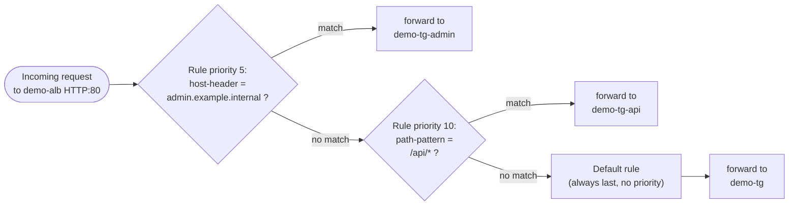

# 06 - Path-Based vs Host-Based Routing

> Goal: understand **listener rules** — the mechanism that lets one ALB (`demo-alb`, built in Note 05) split traffic across *multiple* backend services instead of forwarding everything to one target group. This note is concepts-only; Notes 07 and 08 build path-based and host-based routing for real on top of `demo-alb`.

---

## 1. Recap: what `demo-alb` looks like today

At the end of Note 05, `demo-alb` has exactly one listener (`HTTP:80`) with exactly one rule: the **default rule**, which forwards every request to `demo-tg` (the target group behind the backend instances). There's no branching — every single request, regardless of URL or hostname, goes to the same place.

That's fine for a single service. But real applications often need one ALB to front **several** backend services — an API, an admin panel, a marketing site — without paying for (and managing DNS for) a separate load balancer per service. **Listener rules** are how you teach `demo-alb` to look at each incoming request and decide *which* target group it should actually go to.

---

## 2. What is a listener rule?

A listener (e.g. `demo-alb`'s `HTTP:80` listener) can hold **multiple rules**. Each rule (per AWS docs) has:

- A **priority** — an integer from 1 to 50,000.
- One or more **conditions** — what must be true about the request for this rule to match.
- An **action** — what to do if it matches: `forward` (to a target group), `redirect`, or `fixed-response`.

Every listener always has exactly one **default rule**: no conditions, can't be given a priority, and can't be deleted — it's simply whatever the last-resort action should be. In `demo-alb`'s case, the default rule forwards to `demo-tg`.

> 🧠 **Mental model:** listener rules are an **if/elif/elif/.../else** chain. AWS evaluates each `if` (rule) in priority order; the first one that matches wins and its action runs; if nothing matches, the final `else` (the default rule) runs.

---

## 3. Rule evaluation order — the detail the exam loves

This is the single most exam-tested mechanic in this note:

- Rules are evaluated **in priority order, from the lowest number to the highest number**. Priority `1` is checked before priority `50`.
- The **first rule that matches wins** — evaluation stops there. Rule order after the first match is irrelevant.
- The **default rule is always evaluated last**, regardless of what priority number you'd want to give it (you can't give it one at all).
- If you add a broad rule at a **lower priority number** than a more specific one, the broad rule will "shadow" (steal traffic from) the specific rule — a classic misconfiguration bug: for example, a catch-all `/*` rule accidentally created at a lower priority number than a more specific `/api/*` rule will intercept API traffic before the API rule ever gets a chance to match.

> ⚠️ **Gotcha:** "lower priority number = evaluated first" trips people up because it's the opposite of what "higher priority" means in plain English. Priority **1** is the *most* important / first-checked rule, not the least.

---

## 4. Path-based routing

**Path-based routing** matches on the **URL path** of the request (the part after the host, before any `?query`). It's the classic way to split one domain across multiple backend services — i.e. **microservices behind one ALB**.

Example: everything under `demo-alb`'s domain should mostly hit the normal web app, except calls under `/api/*`, which should go to a separate API service:

| Path | Routed to |
|---|---|
| `/`, `/home`, `/products` | `demo-tg` (default rule) |
| `/api/anything` | `demo-tg-api` |

This is a `path-pattern` condition. Path patterns are **case-sensitive**, support wildcards `*` (zero or more characters) and `?` (exactly one character), and match only against the path — never the query string. Note 07 builds this exact scenario against `demo-tg-api`.

---

## 5. Host-based routing

**Host-based routing** matches on the **`Host` HTTP header** of the request — i.e. which hostname/subdomain the client asked for — not the path. It's the way to run **multiple domains or subdomains behind one ALB**, saving you from provisioning a dedicated load balancer (and its hourly + LCU cost) per site.

Example: one ALB serving both the main app and an internal admin console on a different subdomain:

| Host header | Routed to |
|---|---|
| `www.example.internal` / anything else | `demo-tg` (default rule) |
| `admin.example.internal` | `demo-tg-admin` |

Host header conditions are **not case-sensitive**, support the same `*`/`?` wildcards, and must contain at least one `.` (e.g. `*.example.internal` is valid, `example` alone is not). Note 08 builds this exact scenario against `demo-tg-admin`.

---

## 6. Combining conditions in one rule

A single rule isn't limited to one condition type. Per AWS's own rule model, a rule can include **up to one of each** of `host-header`, `http-request-method`, `path-pattern`, and `source-ip` **simultaneously** (plus any number of `http-header`/`query-string` conditions), up to five match evaluations total per rule. All conditions in a rule are combined with **AND** logic — every condition must match for the rule to fire.

So you could write one rule like:

> IF host-header = `admin.example.internal` **AND** path-pattern = `/reports/*` → forward to a reports-specific target group

This is exactly how you'd narrow a rule to "only this subdomain, only this specific path" without creating two separate broad rules that might overlap.

---

## 7. Other condition types (for completeness)

Beyond host and path, ALB listener rules also support:

| Condition | Matches on |
|---|---|
| `http-header` | Any HTTP request header (e.g. route mobile clients differently based on `User-Agent`) |
| `http-request-method` | The HTTP verb (`GET`, `POST`, custom methods) — exact match only, no wildcards |
| `query-string` | Key/value pairs or bare values in the query string (e.g. `?version=v2`) |
| `source-ip` | The client's (or proxy's) source IP, in CIDR form — not the same as an `X-Forwarded-For` header value |

These are less common on the exam than host/path routing but worth recognizing by name.

---

## 8. Diagram: rule evaluation flow on `demo-alb`

Note the rule numbers here are illustrative of *relative* order (host rule checked before path rule) — Notes 07/08 assign the actual priority values used on `demo-alb`.

---

## 9. Exam tips

🎯 **Exam tip:** "Lowest priority number is evaluated first, first match wins, default rule is always last" — expect a direct question on this, often phrased as "which rule applies if a request matches both rule 10 and rule 20?" (answer: whichever has the **lower number**).

🎯 **Exam tip:** if a scenario says "route `/api` requests to one fleet and everything else to another, same domain" → **path-based routing**. If it says "route `admin.example.com` and `www.example.com` to different fleets" → **host-based routing**. If it mixes both, that's one rule with combined conditions.

🎯 **Exam tip:** the underlying business driver the exam wants you to recognize is **consolidation** — one ALB (one bill, one DNS name, one set of listener rules) serving many backend services, instead of provisioning a dedicated load balancer per microservice/subdomain.

---

## 10. Recap

- A listener holds **rules**: priority + conditions + action (`forward`/`redirect`/`fixed-response`), evaluated lowest-priority-number-first, first match wins, with an always-last **default rule**.
- **Path-based routing** splits traffic by URL path (`path-pattern` condition) — great for microservices under one domain.
- **Host-based routing** splits traffic by the `Host` header (`host-header` condition) — great for multiple domains/subdomains sharing one ALB.
- Conditions can be **combined** (AND logic) in a single rule, and other condition types (`http-header`, `http-request-method`, `query-string`, `source-ip`) exist for more advanced matching.
- Next: Note 07 builds path-based routing for real — a new `demo-tg-api` target group and demo instance `demo-api-1`, with a `/api/*` rule added to `demo-alb`.

---

### Sources
- [Listener rules for your Application Load Balancer – AWS docs](https://docs.aws.amazon.com/elasticloadbalancing/latest/application/listener-rules.html)
- [Condition types for listener rules – AWS docs](https://docs.aws.amazon.com/elasticloadbalancing/latest/application/rule-condition-types.html)
- [Add a listener rule for your Application Load Balancer – AWS docs](https://docs.aws.amazon.com/elasticloadbalancing/latest/application/add-rule.html)
