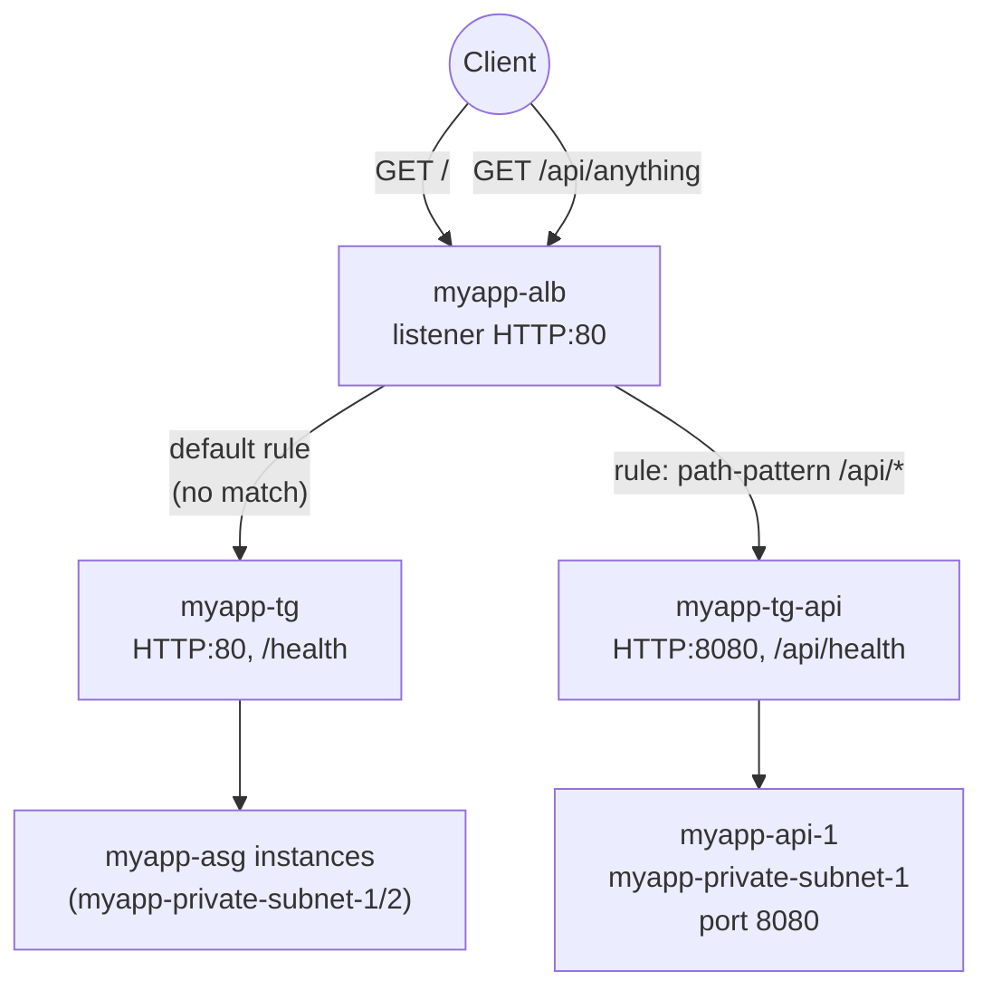

# 07 - ALB Path-Based Routing (Hands-On)

> Goal: add a **second backend service** behind `myapp-alb` and route to it purely by URL path — `/api/*` goes to a new "API service", everything else keeps going to `myapp-tg` as before. Continues Note 06 (concepts) and Note 05 (`myapp-alb` build); Note 08 does the same thing with host-based routing.

---

## 0. Prerequisites

- `myapp-vpc`, `myapp-private-subnet-1` (`10.0.11.0/24`, `ap-south-1a`) — from `VPC\05`.
- `myapp-alb` (internet-facing, `myapp-alb-sg`, listener `HTTP:80` → default rule → `myapp-tg`) — from Note 05.
- `myapp-app-sg` — from `VPC\13`, chained so only `myapp-alb-sg` can reach app-tier instances.

---

## 1. What we're building

A small standalone EC2 instance, `myapp-api-1`, simulating a separate "API" microservice on port `8080` — deliberately **not** part of `myapp-asg`, to make it obvious this is an independent backend service with its own target group, not just another web-tier instance.



---

## 2. Launch the demo instance — `myapp-api-1`

1. **EC2 console** → **Instances** → **Launch instances**.
2. **Name**: `myapp-api-1`.
3. **AMI**: Amazon Linux 2023. **Instance type**: `t3.micro`.
4. **Key pair**: `myapp-key`.
5. **Network settings**: **VPC** = `myapp-vpc`, **Subnet** = `myapp-private-subnet-1`, **Auto-assign public IP** = Disable (it's a private-subnet instance, reaches the internet only via NAT for updates).
6. **Firewall (security groups)**: select existing `myapp-app-sg` — but see step 7 below, since `myapp-app-sg` as built in `VPC\13` only opens port 80, not 8080.
7. Before or after launch, edit `myapp-app-sg` (or use a dedicated `myapp-api-sg` if you prefer to keep the API port isolated) to add an inbound rule: **HTTP custom TCP 8080, source = `myapp-alb-sg`** — same SG-chaining pattern as the rest of the build; never open 8080 to `0.0.0.0/0`.
8. **Advanced details → User data**:

```bash
#!/bin/bash
dnf install -y python3
mkdir -p /opt/api-demo
cat << 'EOF' > /opt/api-demo/server.py
import http.server, socketserver

class Handler(http.server.BaseHTTPRequestHandler):
    def do_GET(self):
        if self.path == "/api/health":
            body = b"OK"
        else:
            body = b"<h1>API service</h1><p>You hit: " + self.path.encode() + b"</p>"
        self.send_response(200)
        self.send_header("Content-Type", "text/html")
        self.end_headers()
        self.wfile.write(body)

with socketserver.TCPServer(("0.0.0.0", 8080), Handler) as httpd:
    httpd.serve_forever()
EOF
nohup python3 /opt/api-demo/server.py &
```

   This is a deliberately minimal Python `http.server` script — good enough to prove routing works; not production code.
9. **Launch instance.**

---

## 3. Create the target group — `myapp-tg-api`

1. **EC2 console** → left nav (**Load Balancing** section) → **Target Groups** → **Create target group**.
2. **Target type**: **Instances**.
3. **Target group name**: `myapp-tg-api`.
4. **Protocol : Port**: **HTTP : 8080**.
5. **VPC**: `myapp-vpc`.
6. **Health checks**: Protocol **HTTP**, path **`/api/health`**. Leave thresholds/interval at their defaults (healthy threshold 5, unhealthy threshold 2, interval 30s, timeout 5s — standard ALB target group defaults).
7. **Next** → **Register targets**: select `myapp-api-1` → **Include as pending below** → **Create target group**.
8. Confirm the **Targets** tab eventually shows `myapp-api-1` as **healthy**.

---

## 4. Add the listener rule to `myapp-alb`

1. **Load Balancers** → `myapp-alb` → **Listeners and rules** tab → select the `HTTP:80` listener → **Manage rules** (or **View/edit rules**).
2. **Add rule**.
3. **Name**: `route-api-traffic` (rule names are just labels; the enforced ordering is the numeric priority).
4. **Add condition** → **Path** → **is** → `/api/*`.
5. **Add action** → **Forward to** → `myapp-tg-api`.
6. **Set priority**: give it a number **lower than** the default rule could ever be (any explicit number, e.g. `10`, works — the default rule always evaluates last regardless).
7. **Create** / **Save**.

`myapp-alb`'s `HTTP:80` listener now has two rules:

| Priority | Condition | Action |
|---|---|---|
| 10 | `path-pattern`: `/api/*` | forward → `myapp-tg-api` |
| default | (none) | forward → `myapp-tg` |

---

## 5. Verify

Grab `myapp-alb`'s DNS name (**Load Balancers** → `myapp-alb` → **DNS name**), e.g. `myapp-alb-123456789.ap-south-1.elb.amazonaws.com`.

```bash
# Hits the default rule -> myapp-tg -> one of the myapp-asg instances
curl http://myapp-alb-123456789.ap-south-1.elb.amazonaws.com/

# Hits the path rule -> myapp-tg-api -> myapp-api-1
curl http://myapp-alb-123456789.ap-south-1.elb.amazonaws.com/api/anything

# Health check path itself also routes correctly
curl http://myapp-alb-123456789.ap-south-1.elb.amazonaws.com/api/health
```

You should see the ASG's "Hello from `<instance-id>`" page for `/`, and "API service — You hit: /api/anything" for the second call. That contrast — same ALB, same DNS name, two totally different backends — is the whole point of path-based routing.

---

## 6. Troubleshooting

| Symptom | Likely cause / fix |
|---|---|
| `/api/anything` still returns the default app's page | **Missing wildcard** — path pattern was entered as `/api` or `/api/` instead of `/api/*`; without the trailing `*` it only matches that literal path, never sub-paths. |
| `/api/*` rule never fires, even for `/api/health` | **Priority ordering mistake** — if another broad rule (e.g. `/*`) was accidentally created at a lower priority number than the API rule, it shadows it. Check **Manage rules** and confirm the API rule's priority number is lower (evaluated earlier) than any catch-all rule. |
| `myapp-tg-api` targets show **unhealthy** | Health check path/port mismatch — confirm the target group health check is `HTTP:8080` + `/api/health`, and that `myapp-api-1`'s Python server actually responds `200` on that exact path. |
| `curl` to `/api/anything` times out or connection refused | Security group gap — `myapp-app-sg` (or a dedicated API SG) isn't allowing **TCP 8080 inbound from `myapp-alb-sg`**; opening it from your own IP instead of the ALB's SG is a common mistake. |
| Rule saved but console still shows only the default rule active | Rule priority collided with an existing rule number — AWS requires unique priorities per listener; pick an unused number. |
| `myapp-api-1`'s user data never started the server | Check `/var/log/cloud-init-output.log` via SSM Session Manager — a syntax error in the heredoc, or `python3` not installed, are the usual causes. |

---

## 7. Recap

- Built a second, independent backend service: `myapp-api-1` (private subnet, port 8080) behind a new target group `myapp-tg-api` (`HTTP:8080`, health check `/api/health`).
- Added a **path-based routing rule** (priority 10, `path-pattern = /api/*` → `myapp-tg-api`) to `myapp-alb`'s existing `HTTP:80` listener, leaving the default rule (→ `myapp-tg`) untouched as the catch-all.
- Verified with `curl`: `/` still reaches the ASG's instances via `myapp-tg`, `/api/*` now reaches `myapp-api-1` via `myapp-tg-api` — one ALB, one DNS name, two backend services.
- Next: Note 08 adds a **third** target group and a **host-based** rule (`admin.myapp.internal` → `myapp-tg-admin`), then recaps all of `myapp-alb`'s rules together.

---

### Sources
- [Listener rules for your Application Load Balancer – AWS docs](https://docs.aws.amazon.com/elasticloadbalancing/latest/application/listener-rules.html)
- [Add a listener rule for your Application Load Balancer – AWS docs](https://docs.aws.amazon.com/elasticloadbalancing/latest/application/add-rule.html)
- [Health checks for your target groups – AWS docs](https://docs.aws.amazon.com/elasticloadbalancing/latest/application/target-group-health-checks.html)
- [Target groups for your Application Load Balancers – AWS docs](https://docs.aws.amazon.com/elasticloadbalancing/latest/application/load-balancer-target-groups.html)
