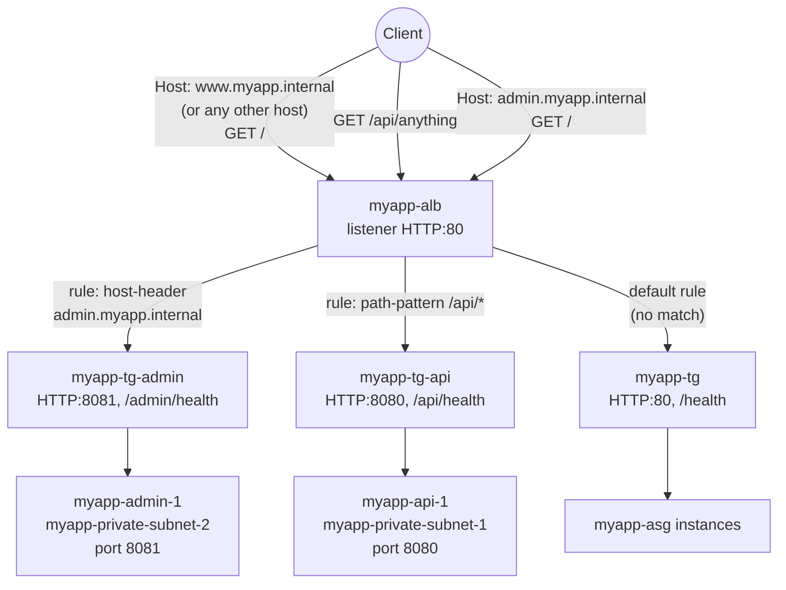

# 08 - ALB Host-Based Routing (Hands-On)

> Goal: add a **third** backend service behind `myapp-alb`, this time routed by the **`Host` header** instead of the URL path — requests for `admin.myapp.internal` go to a new "Admin service", everything else keeps working exactly as Notes 05/07 left it. Continues Note 07; wraps up with a full recap of every rule on `myapp-alb`.

---

## 0. Prerequisites

- `myapp-vpc`, `myapp-private-subnet-2` (`10.0.12.0/24`, `ap-south-1b`) — from `VPC\05`.
- `myapp-alb` with listener `HTTP:80`, default rule → `myapp-tg`, plus the path rule from Note 07 (`/api/*` → `myapp-tg-api`).
- `myapp-app-sg` — SG-chaining pattern from `VPC\13`.

---

## 1. What we're building

A second standalone demo instance, `myapp-admin-1`, in the **other** AZ's private subnet this time (`myapp-private-subnet-2`), simulating an "Admin service" on port `8081`.



---

## 2. Launch the demo instance — `myapp-admin-1`

1. **EC2 console** → **Instances** → **Launch instances**.
2. **Name**: `myapp-admin-1`. **AMI**: Amazon Linux 2023. **Instance type**: `t3.micro`. **Key pair**: `myapp-key`.
3. **Network settings**: **VPC** = `myapp-vpc`, **Subnet** = `myapp-private-subnet-2`, **Auto-assign public IP** = Disable.
4. **Firewall (security groups)**: `myapp-app-sg`, plus (as in Note 07) an inbound rule for the new port: **TCP 8081, source = `myapp-alb-sg`**.
5. **Advanced details → User data**:

```bash
#!/bin/bash
dnf install -y python3
mkdir -p /opt/admin-demo
cat << 'EOF' > /opt/admin-demo/server.py
import http.server, socketserver

class Handler(http.server.BaseHTTPRequestHandler):
    def do_GET(self):
        if self.path == "/admin/health":
            body = b"OK"
        else:
            body = b"<h1>Admin service</h1><p>You hit: " + self.path.encode() + b"</p>"
        self.send_response(200)
        self.send_header("Content-Type", "text/html")
        self.end_headers()
        self.wfile.write(body)

with socketserver.TCPServer(("0.0.0.0", 8081), Handler) as httpd:
    httpd.serve_forever()
EOF
nohup python3 /opt/admin-demo/server.py &
```

6. **Launch instance.**

---

## 3. Create the target group — `myapp-tg-admin`

1. **Target Groups** → **Create target group**.
2. **Target type**: **Instances**. **Name**: `myapp-tg-admin`.
3. **Protocol : Port**: **HTTP : 8081**. **VPC**: `myapp-vpc`.
4. **Health checks**: Protocol **HTTP**, path **`/admin/health`**, defaults otherwise.
5. **Register targets**: select `myapp-admin-1` → **Create target group**.
6. Confirm **Targets** tab shows `myapp-admin-1` as **healthy**.

---

## 4. Add the host-based rule to `myapp-alb`

1. **Load Balancers** → `myapp-alb` → **Listeners and rules** → `HTTP:80` → **Manage rules** → **Add rule**.
2. **Name**: `route-admin-traffic`.
3. **Add condition** → **Host header** → **is** → `admin.myapp.internal`.
4. **Add action** → **Forward to** → `myapp-tg-admin`.
5. **Set priority**: any unused number lower than the default rule (e.g. `5`) — see Section 6 for why its relative position versus the path rule doesn't actually matter here.
6. **Create.**

---

## 5. Verify without real DNS — override the `Host` header

In a real deployment, you'd create Route 53 records so both `www.myapp.internal` and `admin.myapp.internal` resolve (e.g. via a CNAME/alias) to `myapp-alb`'s DNS name, and clients would naturally send the right `Host` header just by typing the hostname in a browser. For this hands-on demo there's no real DNS zone for `myapp.internal`, so instead you connect **directly to the ALB's DNS name** and manually set the `Host` header on the request:

```bash
# Connects to the real ALB DNS name, but claims to be asking for admin.myapp.internal
curl -H "Host: admin.myapp.internal" http://myapp-alb-123456789.ap-south-1.elb.amazonaws.com/

# No Host override -> falls through path/host rules -> default rule -> myapp-tg
curl http://myapp-alb-123456789.ap-south-1.elb.amazonaws.com/
```

**Why this works:** DNS resolution and HTTP host-based routing are two independent layers. `curl`'s hostname in the URL is only used to *resolve an IP address and open the TCP connection* — it has nothing to do with what's inside the HTTP request. The `Host` header is a separate piece of data sent **inside** the HTTP request after the connection is already open, and that's the only thing `myapp-alb`'s `host-header` condition ever looks at. So you can connect to the ALB by its real DNS name (or even its raw IP) while telling it, via the header, "treat this request as if it were for `admin.myapp.internal`" — which is exactly what a properly configured DNS setup would cause a real browser to do automatically.

You should see "Admin service — You hit: /" from the first call, and the normal ASG page from the second.

---

## 6. Recap: all listener rules on `myapp-alb`

After Notes 05, 07, and 08, `myapp-alb`'s single `HTTP:80` listener now has three rules total:

| Priority | Condition | Action | Built in |
|---|---|---|---|
| 5 | `host-header` = `admin.myapp.internal` | forward → `myapp-tg-admin` | Note 08 |
| 10 | `path-pattern` = `/api/*` | forward → `myapp-tg-api` | Note 07 |
| default (always last) | *(none)* | forward → `myapp-tg` | Note 05 |

Because the host rule and the path rule test **different, non-overlapping condition types** (`host-header` vs `path-pattern`), their relative priority to each other doesn't change behavior here — a request either has `Host: admin.myapp.internal` or it has path `/api/*`, and in this demo no single request matches both. Relative ordering only matters when two rules' conditions could **both** match the same request (see Note 06 §3 and the Note 07 troubleshooting table for what goes wrong when that's not accounted for).

---

## 7. Exam tip recap

🎯 **Exam tip:** a request's `Host` header is independent of the DNS name/IP used to reach the load balancer — this is exactly why host-based routing works, and exactly why you can test it with `curl -H "Host: ..."` without owning real DNS for the hostname.

🎯 **Exam tip:** one ALB, one listener, many target groups via rules — this is the standard "consolidate N backend services behind one load balancer" pattern the exam rewards over "provision one ALB per service."

---

## 8. Recap

- Built a third backend service: `myapp-admin-1` (in `myapp-private-subnet-2`, port 8081) behind `myapp-tg-admin` (`HTTP:8081`, health check `/admin/health`).
- Added a **host-based routing rule** (`host-header = admin.myapp.internal` → `myapp-tg-admin`) to `myapp-alb`.
- Verified with `curl -H "Host: admin.myapp.internal" ...` against the ALB's real DNS name — confirmed the Host header, not the connection target, drives the routing decision.
- `myapp-alb` now fronts **three** independent backend services (`myapp-tg`, `myapp-tg-api`, `myapp-tg-admin`) behind one listener, one DNS name, one bill.
- Next: Note 09 introduces the **Network Load Balancer** — Layer 4, static IPs, extreme throughput — for workloads where ALB's Layer 7 smarts aren't the right tool.

---

### Sources
- [Listener rules for your Application Load Balancer – AWS docs](https://docs.aws.amazon.com/elasticloadbalancing/latest/application/listener-rules.html)
- [Condition types for listener rules – AWS docs](https://docs.aws.amazon.com/elasticloadbalancing/latest/application/rule-condition-types.html)
- [What is an Application Load Balancer? – AWS docs](https://docs.aws.amazon.com/elasticloadbalancing/latest/application/introduction.html)
- [Add a listener rule for your Application Load Balancer – AWS docs](https://docs.aws.amazon.com/elasticloadbalancing/latest/application/add-rule.html)
