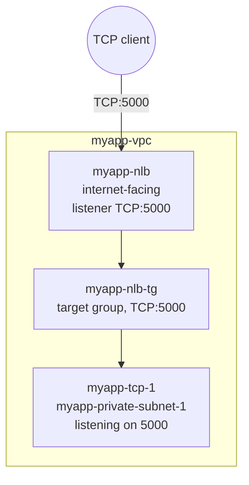

# 09 - Network Load Balancer

> Goal: understand **NLB** — the Layer 4 sibling of `myapp-alb` — and recognize the specific scenarios (static IPs, source IP preservation, extreme scale/latency, non-HTTP protocols) where the exam expects NLB instead of ALB. Concepts-only; Note 10 builds `myapp-nlb` for real.

---

## 1. What is a Network Load Balancer?

A **Network Load Balancer (NLB)** operates at **Layer 4** of the OSI model — it load-balances **TCP, UDP, and TLS** connections. Unlike `myapp-alb`, it does **not** parse HTTP requests, look at paths, headers, or hostnames, and has no concept of listener rules with conditions like `path-pattern` or `host-header`. It simply forwards **connections** (or, for UDP, packet flows) to a healthy target based on a flow hash — it doesn't understand or care what's inside them.

> 🧠 **Mental model:** if `myapp-alb` is a smart receptionist reading the contents of every visitor's request before deciding where to send them, an NLB is a **switchboard operator** — it just connects call A to line B as fast and as reliably as physically possible, without listening in on the conversation.

---

## 2. Why use NLB instead of ALB?

`myapp-alb` is the right default for HTTP/HTTPS web applications. NLB earns its place when one of these specific needs shows up:

### a) Ultra-low latency, extreme throughput
NLB is designed to handle **millions of requests per second** while sustaining **very low latency** — it does almost no per-request processing (no HTTP parsing), so it adds minimal overhead versus ALB.

### b) Static IP per Availability Zone
NLB provisions **one fixed IP address per enabled AZ** automatically, and for an internet-facing NLB you can additionally attach **one Elastic IP per AZ** at creation time. `myapp-alb`, by contrast, is only reachable through a DNS name — its underlying IPs can and do change, so you can never safely allowlist an ALB by IP. Whenever a requirement says "a partner needs to allowlist our load balancer by a fixed IP," that's an NLB (or NLB + EIP) requirement, not an ALB one.

### c) Preserves the client's source IP by default
NLB forwards the original client IP straight through to the target at the TCP/IP level — **no proxy protocol or extra header needed** in the common case. `myapp-alb` (and ALB in general), by design, **terminates** the client connection and opens a new one to the target, so the target only sees the ALB's own IP as the source — client IP is only recoverable via the `X-Forwarded-For` HTTP header, which requires an HTTP-aware application to read it.

### d) Non-HTTP / non-application protocols
Anything that isn't HTTP/HTTPS/gRPC has no business going through an ALB in the first place: raw TCP protocols for gaming servers, IoT device fleets speaking **MQTT**, financial services systems using custom binary TCP protocols, DNS over TCP/UDP, etc. NLB just forwards the bytes; it doesn't need to understand the protocol.

---

## 3. Comparison: ALB vs NLB

| | **Application Load Balancer (ALB)** | **Network Load Balancer (NLB)** |
|---|---|---|
| **OSI Layer** | 7 (Application) | 4 (Transport) |
| **Protocols** | HTTP, HTTPS, gRPC, WebSocket | TCP, UDP, TLS |
| **Routing intelligence** | Content-aware: path, host, header, method, query-string, source-IP rules | Connection/flow-aware only — no content inspection |
| **Static IP** | No — DNS name only, backing IPs can change | Yes — one static IP per AZ, optional Elastic IP per AZ |
| **Preserves client source IP** | No by default (needs `X-Forwarded-For` header) | Yes by default |
| **Typical targets** | Web apps, microservices, container/EKS ingress | Gaming, IoT/MQTT brokers, financial/custom TCP protocols, extreme-scale services, anything needing static IPs |
| **Health checks** | HTTP/HTTPS/gRPC-aware | TCP or HTTP/HTTPS |
| **Cross-zone load balancing** | Always on, no extra charge | Off by default, chargeable for inter-AZ data if enabled |

---

## 4. Diagram: `myapp-nlb` — TCP passthrough to a demo instance

Note 10 builds this exact pair: `myapp-nlb` fronting a target group `myapp-nlb-tg` that forwards to a single demo instance `myapp-tcp-1`.

---

## 5. Listener protocols in more detail

An NLB listener (like the `TCP:5000` one Note 10 builds for `myapp-nlb`) can be one of:

| Listener protocol | What it does |
|---|---|
| **TCP** | Pure Layer 4 passthrough — no inspection, no termination. What `myapp-nlb` uses. |
| **UDP** | Same idea for connectionless traffic — common for gaming, DNS, streaming telemetry. |
| **TLS** | The NLB **terminates TLS** using a certificate from AWS Certificate Manager, then forwards **plaintext** (or optionally re-encrypted) TCP to the target — useful when you want centralized certificate management but still want NLB's performance/static-IP characteristics rather than ALB's HTTP awareness. |
| **TCP_UDP** | A single listener that accepts both TCP and UDP on the same port, when a protocol genuinely needs both (e.g. certain VPN or media protocols). |

`myapp-nlb`'s listener stays plain **TCP** since `myapp-tcp-1` is a raw, unencrypted demo service — no certificate involved.

---

## 6. How NLB picks a target

NLB distributes traffic using a **flow hash algorithm** based on the protocol, source/destination IP, source/destination port, and (for TCP) the TCP sequence number. In practice this means: **all packets belonging to the same connection consistently go to the same target** for the life of that connection — there's no per-packet re-balancing mid-connection, which is part of what keeps latency so low and behavior predictable for stateful TCP workloads.

Health checks work similarly to ALB target groups conceptually (healthy/unhealthy thresholds, interval, protocol/port) but the check itself can be plain **TCP** (just "can I open a connection on this port?") or **HTTP/HTTPS** if the target exposes a real health endpoint — `myapp-nlb-tg` in Note 10 uses a simple TCP check since `myapp-tcp-1` has no HTTP endpoint to probe.

---

## 7. What NLB does NOT give you

Don't overcorrect — NLB isn't strictly "better," it's a different tool:

- No path/host-based routing, no HTTP header inspection, no WAF integration (WAF attaches to ALB/CloudFront, not NLB).
- No connection termination/re-encryption smarts the way ALB offers for HTTP workloads (though NLB does support **TLS listeners** that terminate TLS at the load balancer if you want that).
- If your workload genuinely is an HTTP web app that just wants to split traffic by URL or domain (Notes 06–08), NLB is the wrong tool — you'd have to reinvent that logic yourself downstream.

---

## 8. Exam tips

🎯 **Exam tip:** "Need a static IP for the load balancer" / "a partner wants to allowlist us by IP" / "need to preserve the original client IP address" / "need to handle millions of connections with the lowest possible latency" — any of these phrases in a question is almost always pointing at **NLB**, not ALB.

🎯 **Exam tip:** ALB = Layer 7 (content-aware routing), NLB = Layer 4 (raw TCP/UDP/TLS, no content awareness) — a guaranteed "which layer" question appears somewhere on the exam.

🎯 **Exam tip:** cross-zone load balancing is **always on and free** for ALB, but **off by default and billed for inter-AZ data transfer** if you turn it on for NLB — a favorite trick in cost-optimization scenario questions (covered in depth in Note 11).

---

## 9. Recap

- **NLB** = Layer 4 load balancer for TCP/UDP/TLS — no content inspection, just flow-level forwarding.
- Reach for NLB over ALB when you need: a **static IP per AZ** (optionally with attached Elastic IPs), **preserved client source IP** by default, **extreme throughput/low latency**, or you're load-balancing a **non-HTTP** protocol.
- ALB stays the default choice for ordinary HTTP/HTTPS web applications and microservices needing path/host-based routing.
- Next: Note 10 builds `myapp-nlb` + `myapp-nlb-tg` + `myapp-tcp-1` end-to-end in the console, including attaching an Elastic IP per AZ.

---

### Sources
- [What is a Network Load Balancer? – AWS docs](https://docs.aws.amazon.com/elasticloadbalancing/latest/network/introduction.html)
- [Network Load Balancers – AWS docs](https://docs.aws.amazon.com/elasticloadbalancing/latest/network/network-load-balancers.html)
- [HTTP headers and Application Load Balancers (X-Forwarded-For) – AWS docs](https://docs.aws.amazon.com/elasticloadbalancing/latest/application/x-forwarded-headers.html)
- [Elastic Load Balancing features (ALB vs NLB vs GWLB vs CLB comparison) – AWS](https://aws.amazon.com/elasticloadbalancing/features/)
