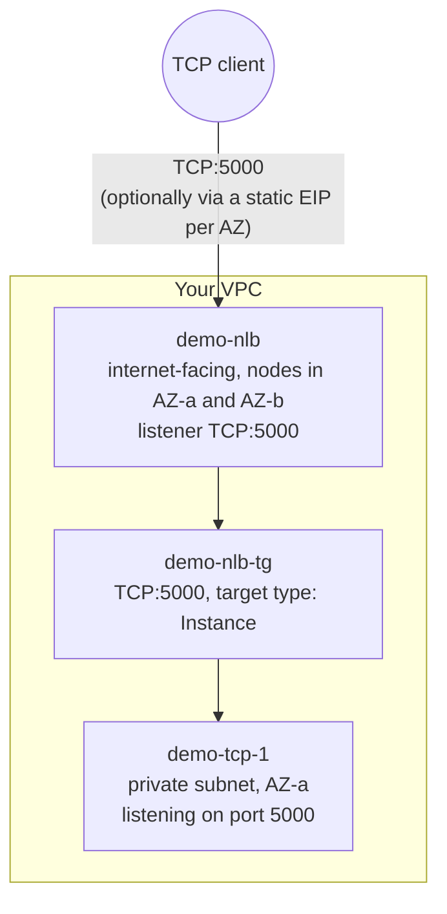

# 10 - Network Load Balancer (Hands-On)

> Goal: build `demo-nlb` end-to-end — a Layer 4 TCP load balancer fronting a minimal demo TCP service — and see NLB's core promises (a static IP per AZ, and raw TCP passthrough with no packet rewriting) working in practice.

---

## 0. Prerequisites

- An existing VPC with at least two public subnets, one in each of two Availability Zones (call them AZ-a and AZ-b) — these will host the NLB's nodes.
- At least one private subnet (in AZ-a is enough for this note) that the private subnet's route table sends outbound traffic from via a NAT Gateway or NAT instance, so the demo instance can still reach the internet for package installs even though it has no public IP itself.
- An existing EC2 key pair for SSH access (or plan to use SSM Session Manager instead, which needs no key pair at all).

---

## 1. Launch the demo instance — `demo-tcp-1`

A minimal TCP service is enough to prove NLB passthrough — this is illustrative only, not a real product.

1. **EC2 console** → **Instances** → **Launch instances**.
2. **Name**: `demo-tcp-1`. **AMI**: Amazon Linux 2023. **Instance type**: `t3.micro`. **Key pair**: your existing key pair.
3. **Network settings**: **VPC** = your VPC, **Subnet** = the private subnet in AZ-a, **Auto-assign public IP** = Disable.
4. **Firewall (security groups)**: create a new security group `demo-tcp-sg` — inbound **TCP 5000** from the VPC CIDR (e.g. `10.0.0.0/16`) (NLB doesn't have its own security group concept the way ALB does when targets are registered by **instance ID**: the load balancer nodes connect using their own IPs drawn from the VPC, so opening the rule to the VPC CIDR — or more narrowly, the NLB's subnets — is the standard approach). Also allow SSH/SSM as usual for management.
5. **Advanced details → User data** — a tiny Python TCP echo service on port 5000:

```bash
#!/bin/bash
dnf install -y python3
mkdir -p /opt/tcp-demo
cat << 'EOF' > /opt/tcp-demo/echo.py
import socket

srv = socket.socket(socket.AF_INET, socket.SOCK_STREAM)
srv.setsockopt(socket.SOL_SOCKET, socket.SO_REUSEADDR, 1)
srv.bind(("0.0.0.0", 5000))
srv.listen(5)

while True:
    conn, addr = srv.accept()
    data = conn.recv(1024)
    conn.sendall(b"echo: " + data)
    conn.close()
EOF
nohup python3 /opt/tcp-demo/echo.py &
```

   This is a bare-bones blocking echo server — one connection at a time, good enough to prove the NLB forwards raw TCP bytes untouched.
6. **Launch instance.**

---

## 2. Create the target group — `demo-nlb-tg`

1. **EC2 console** → **Target Groups** → **Create target group**.
2. **Target type**: **Instances**.
3. **Target group name**: `demo-nlb-tg`.
4. **Protocol : Port**: **TCP : 5000**.
5. **VPC**: your VPC.
6. **Health checks**: Protocol **TCP** (simplest choice for a raw TCP echo service — a TCP health check just confirms port 5000 accepts connections; you could instead run an HTTP health check on a separate port if the app exposed one, but plain TCP is the natural fit here). Leave interval/threshold defaults.
7. **Next** → **Register targets** → select `demo-tcp-1` → **Create target group**.

---

## 3. Create the Network Load Balancer — `demo-nlb`

1. **EC2 console** → **Load Balancers** → **Create load balancer** → **Network Load Balancer** → **Create**.
2. **Basic configuration**: **Name**: `demo-nlb`. **Scheme**: **Internet-facing**. **IP address type**: **IPv4**.
3. **Network mapping**:
   - **VPC**: your VPC.
   - **Availability Zones and subnets**: select **AZ-a** → the public subnet in AZ-a, and **AZ-b** → the public subnet in AZ-b.
   - This is also where you'd pick an **Elastic IP per AZ** for a static IP — see Section 5, since it must be decided **now**, at creation time.
4. **Security groups**: NLB security groups are optional; you can attach one (e.g. a dedicated `demo-nlb-sg` allowing TCP 5000 inbound from `0.0.0.0/0`, following the same pattern you'd use for an ALB's security group) or leave none. **Important:** if you skip security groups now, you cannot attach any later — decide before creating.
5. **Listeners and routing**: change the default listener to **Protocol: TCP**, **Port: 5000**. **Default action**: forward to **`demo-nlb-tg`**.
6. **Summary** → **Create load balancer**. State starts as `Provisioning`, then becomes `Active` after a minute or two.

---

## 4. Verify

1. **Target Groups** → `demo-nlb-tg` → **Targets** tab → confirm `demo-tcp-1` shows **healthy**.
2. **Load Balancers** → `demo-nlb` → copy the **DNS name** (e.g. `demo-nlb-1234567890abcdef.elb.<region>.amazonaws.com`).
3. From a machine with network access to it, test the raw TCP connection:

```bash
# Using netcat
echo "hello" | nc demo-nlb-1234567890abcdef.elb.<region>.amazonaws.com 5000

# Or a tiny Python client
python3 - << 'EOF'
import socket
s = socket.create_connection(("demo-nlb-1234567890abcdef.elb.<region>.amazonaws.com", 5000))
s.sendall(b"hello")
print(s.recv(1024))
EOF
```

You should get back `echo: hello` — proving the NLB passed the raw bytes straight through to `demo-tcp-1` without touching them (no HTTP framing, no headers, nothing ALB-like happening in between).

---

## 5. Attaching an Elastic IP per Availability Zone

Per AWS's own creation wizard: **with an internet-facing NLB, you can select an Elastic IP address for each enabled Availability Zone** while creating the load balancer, under **Network mapping**. This is what gives `demo-nlb` a genuinely static, allowlist-able IP in each AZ instead of just a DNS name.

To do it: allocate one Elastic IP per AZ ahead of time (**VPC console → Elastic IPs → Allocate**), then in step 3 above, next to each AZ's subnet selection, pick the corresponding Elastic IP from the dropdown.

> ⚠️ **This is a creation-time-only decision.** AWS's own docs are explicit that the Availability Zones, subnets, and Elastic IP addresses of a Network Load Balancer **cannot be changed after creation** — there is no "attach an EIP later" option once the NLB exists. If you forgot to attach EIPs (or picked the wrong subnets/AZs), the only fix is to **delete and recreate** the NLB with the correct configuration. Plan static IP requirements before you click **Create**.

---

## 6. Diagram: the complete `demo-nlb` setup



---

## 7. Troubleshooting

| Symptom | Likely cause / fix |
|---|---|
| Target stuck in `unhealthy`/`initial` in `demo-nlb-tg` | `demo-tcp-sg` isn't allowing inbound TCP 5000 from the NLB's subnets/VPC CIDR, or `echo.py` never started — check `/var/log/cloud-init-output.log` via SSM Session Manager. |
| Connection to the NLB DNS name times out | NLB is still `Provisioning`, or (if you attached a security group to the NLB) it doesn't allow inbound TCP 5000 from your test client's IP. |
| Connects, but no response / hangs | The demo echo server only handles one connection at a time in a blocking loop — a prior test client left a connection open. Restart `echo.py` or add basic threading if testing concurrently. |
| Wanted a static IP but forgot to select Elastic IPs at creation | Cannot be added after the fact — the NLB's AZs/subnets/EIPs are fixed at creation. Delete and recreate `demo-nlb` with the EIPs selected during the **Network mapping** step. |
| Health check passes but real client traffic still fails | Confirm the **listener** (TCP:5000 → `demo-nlb-tg`) and the **target group** protocol/port actually match — a mismatch between the listener port and what the target listens on is easy to typo. |

---

## 8. ⚠️ Clean up to avoid charges

NLB is billed **hourly plus Load Balancer Capacity Units (LCU-hours)**, exactly like ALB, regardless of how much traffic actually flows through it — an idle demo NLB still costs money every hour it exists.

1. **Load Balancers** → select `demo-nlb` → **Actions** → **Delete load balancer** → confirm.
2. **Target Groups** → select `demo-nlb-tg` → **Actions** → **Delete**.
3. **Instances** → select `demo-tcp-1` → **Instance state** → **Terminate instance**.
4. If you allocated Elastic IPs for this demo, release them (**VPC console → Elastic IPs → Release**) — an EIP not associated with a running resource is billed hourly.

---

## 9. Recap

- Built `demo-tcp-1` (private subnet, minimal Python TCP echo server on port 5000), target group `demo-nlb-tg` (TCP:5000, target type Instance, TCP health check), and `demo-nlb` (internet-facing, public subnets, listener TCP:5000 → `demo-nlb-tg`).
- Verified raw TCP passthrough with `nc`/a Python socket client — confirmed the NLB doesn't alter the bytes in transit.
- Elastic IPs per AZ can only be attached **at NLB creation time** — there's no way to add them afterward; a wrong choice means delete-and-recreate.
- Cleanup: delete the NLB, delete the target group, terminate `demo-tcp-1`, release any Elastic IPs — NLB bills hourly + LCU regardless of traffic.
- Next: Note 11 — Cross-Zone Load Balancing (Hands-On), which extends this same `demo-nlb` setup to a 3-instance layout (2 in one AZ, 1 in another) to demonstrate traffic-distribution differences between ALB and NLB.

---

### Sources
- [Create a Network Load Balancer – AWS docs](https://docs.aws.amazon.com/elasticloadbalancing/latest/network/create-network-load-balancer.html)
- [Target groups for your Network Load Balancers – AWS docs](https://docs.aws.amazon.com/elasticloadbalancing/latest/network/load-balancer-target-groups.html)
- [Health checks for Network Load Balancer target groups – AWS docs](https://docs.aws.amazon.com/elasticloadbalancing/latest/network/target-group-health-checks.html)
- [Elastic Load Balancing pricing – AWS](https://aws.amazon.com/elasticloadbalancing/pricing/)
