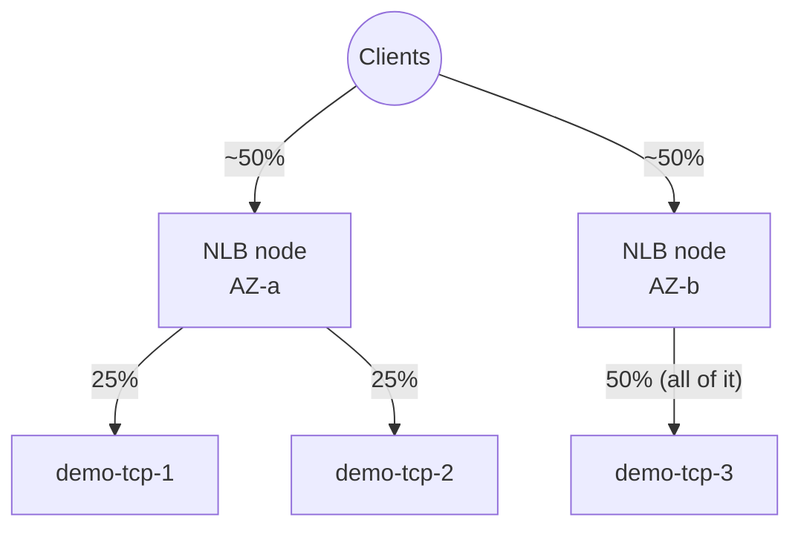
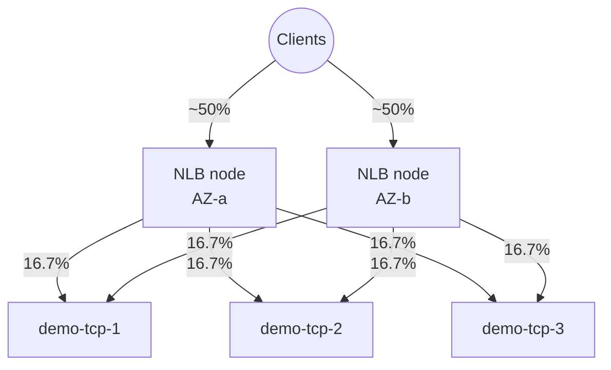

# 11 - Cross-Zone Load Balancing (Hands-On)

> Goal: understand exactly **how a load balancer node decides which targets it's allowed to send traffic to**, why that can silently cause uneven per-instance load across AZs, and how to fix it with **cross-zone load balancing**. Builds directly on the `demo-nlb` / `demo-nlb-tg` set up in the previous note, and closes out the "core" load balancer concepts before we move into the advanced **Gateway Load Balancer** track next.

---

## 1. The thing beginners miss: a load balancer isn't one box, it's one node *per AZ*

When you enable an Availability Zone for a load balancer (by picking subnets in it), AWS provisions a **load balancer node in that AZ** — a physical piece of the load balancer's own fleet, not something you see or manage directly. An internet-facing NLB with subnets in AZ-a and AZ-b really has **two nodes**, one per AZ, each with its own IP address. DNS (with a 60-second TTL) hands clients a mix of both nodes' addresses.

The key question this note answers: **once a request lands on one specific node, which registered targets is that node allowed to forward it to?**

> 🧠 **Mental model:** think of each AZ's load balancer node as a **local dispatcher who only knows about the workers on their own floor** — unless you tell them "you can also dispatch to the other floors" (cross-zone load balancing), they will only ever assign work to whoever is on their own floor, no matter how busy that floor gets relative to the others.

---

## 2. Without cross-zone load balancing: each node only sees its own AZ's targets

**When cross-zone load balancing is disabled**, each load balancer node distributes traffic **only across the registered targets in its own AZ**. If every AZ has the same number of targets, this is invisible — the split looks even. The problem appears the moment AZs have **different target counts**.

### Our demo layout (reusing `demo-nlb-tg` from the previous note)

The previous note registered a single target, `demo-tcp-1`, in the private subnet in AZ-a. For this note, we temporarily add two more standalone TCP-echo instances to build the exact uneven layout used across this series:

| Instance | AZ | Subnet |
|---|---|---|
| `demo-tcp-1` | AZ-a | Private subnet in AZ-a |
| `demo-tcp-2` (new) | AZ-a | Private subnet in AZ-a |
| `demo-tcp-3` (new) | AZ-b | Private subnet in AZ-b |

All three are registered with `demo-nlb-tg` (TCP:5000). Both `demo-nlb`'s AZs (AZ-a, AZ-b) are enabled, so there are exactly **2 NLB nodes**. Assuming clients' DNS resolution spreads requests roughly evenly across the two nodes (AWS's own documentation illustrates the effect this way), each node receives about **50% of total traffic**.

### The math — without cross-zone

- **Node A** (AZ-a) gets 50% of traffic, and can only forward to targets in its own AZ: `demo-tcp-1` and `demo-tcp-2`. It splits its 50% between them → **25% each**.
- **Node B** (AZ-b) gets 50% of traffic, and can only forward to its own AZ's target: `demo-tcp-3`. All of Node B's 50% goes to **one instance**.

| Instance | AZ | Share of total traffic |
|---|---|---|
| `demo-tcp-1` | AZ-a | 25% |
| `demo-tcp-2` | AZ-a | 25% |
| `demo-tcp-3` | AZ-b | **50%** |

`demo-tcp-3` is a single instance carrying **twice the per-instance load** of either instance in AZ-a — even though nothing about that instance is "special." It's purely an artifact of uneven target counts per AZ combined with cross-zone being off.

---

## 3. With cross-zone load balancing enabled: every node can reach every target

**When cross-zone load balancing is enabled**, each load balancer node distributes its share of traffic across **all registered targets in all enabled AZs**, regardless of which AZ the node itself lives in.

Each of the 3 targets now receives traffic from **both** nodes, so each ends up with roughly `100% ÷ 3 ≈ 33.3%` — an even per-instance share regardless of how the 3 instances happen to be spread across the 2 AZs.

| Instance | AZ | Share of total traffic |
|---|---|---|
| `demo-tcp-1` | AZ-a | ~33.3% |
| `demo-tcp-2` | AZ-a | ~33.3% |
| `demo-tcp-3` | AZ-b | ~33.3% |

> ⚠️ Cross-zone load balancing fixes the **per-instance** imbalance, but it does so by sending more cross-AZ traffic (Node A now regularly talks to `demo-tcp-3` in AZ-b, and Node B talks to `demo-tcp-1`/`demo-tcp-2` in AZ-a). For NLB and GWLB, that cross-AZ hop can carry a **real data transfer charge** — see the table below.

---

## 4. Defaults by load balancer type — a favorite exam table

| Load balancer | Cross-zone default | Can you change it? | Extra charge when enabled? |
|---|---|---|---|
| **ALB** | **Always enabled** at the load balancer level | Cannot be disabled at the LB level; *can* be turned off per **target group** | No charge — always free |
| **NLB** | **Disabled** by default (LB-level attribute `load_balancing.cross_zone.enabled = false`) | Yes — at the LB level, and per target group (which can override the LB setting, or inherit it) | **Yes** — cross-AZ data transfer charges apply when traffic actually crosses an AZ boundary |
| **GWLB** | **Disabled** by default | Yes, as a load balancer attribute, any time after creation | **Yes** — cross-AZ data transfer charges apply, same model as NLB |
| **CLB (legacy)** | Depends on how it's created: **enabled by default via the Console**, **disabled by default via API/CLI** | Yes, at any time | **No** extra charge — CLB predates the current per-GB cross-AZ billing model |

🎯 **Exam tip:** "ALB cross-zone load balancing is always on and free; NLB/GWLB are off by default and can incur cross-AZ data transfer charges when turned on" is a guaranteed comparison point. If a question describes **one instance getting far more traffic than others of the same size**, and the AZs have an **uneven number of registered targets**, the answer is almost always "cross-zone load balancing is disabled" — not a health check or security group issue.

---

## 5. Hands-on: toggle cross-zone load balancing on `demo-nlb-tg`

### Step 1 — Check the current (default) state

1. EC2 console → left nav, **Load Balancing** → **Target Groups**.
2. Select **`demo-nlb-tg`** → **Attributes** tab.
3. Note **Cross-zone load balancing** — for a target group backing an NLB, this defaults to **"Use load balancer setting"**, and the load balancer itself defaults to **Off**. So out of the box, `demo-nlb-tg` is running the "25% / 25% / 50%" scenario from Section 2.

### Step 2 — Turn it On at the target group level

1. Still on `demo-nlb-tg` → **Attributes** → **Edit**.
2. Find **Cross-zone load balancing** → select **On** (this explicitly overrides the load balancer-level setting for this target group only).
3. **Save changes.**

### Step 3 — (Alternative) toggle it at the load balancer level instead

1. **Load Balancers** → select `demo-nlb` → **Attributes** tab → **Edit**.
2. Toggle **Cross-zone load balancing**.
3. **Save changes.** Any target group still set to "Use load balancer setting" now inherits this value.

> ⚠️ **Target group setting wins.** If cross-zone is enabled at the LB level but a specific target group explicitly sets it to **Off**, traffic to *that* target group is not distributed across AZs, even though the LB-level switch says "on." Always check both levels when troubleshooting.

---

## 6. Observing the traffic-distribution difference

CloudWatch's built-in NLB metrics (`ActiveFlowCount`, `NewFlowCount`, `ProcessedBytes`, etc.) are published with **LoadBalancer**, **TargetGroup**, and **AvailabilityZone** dimensions — there's no native per-individual-target dimension, since that would be too high-cardinality for a managed metric. So to actually *see* the per-instance imbalance from Section 2, combine two views:

1. **CloudWatch, filtered by the `AvailabilityZone` dimension** on `demo-nlb-tg` — confirms the aggregate ~50/50 split is landing correctly on each AZ's node.
2. **Per-instance evidence** — since our demo target is a minimal TCP echo service, the simplest approach is to have it log (or increment a counter for) every connection it accepts, then compare counts across `demo-tcp-1`, `demo-tcp-2`, and `demo-tcp-3` after a test run. Alternatively, each instance's own `NetworkPacketsIn`/`NetworkIn` EC2 CloudWatch metrics will visibly show `demo-tcp-3` running roughly double the traffic of `demo-tcp-1`/`demo-tcp-2` when cross-zone is off, and roughly equal to them once it's turned on.

Generate test traffic against `demo-nlb`'s DNS name (e.g. a short loop of TCP connections from a client), let it run for a few minutes with cross-zone **off**, note the per-instance counts, then repeat with cross-zone **on** and compare.

---

## 7. Common beginner problems

| Symptom | Likely cause | Fix |
|---|---|---|
| One instance in a smaller AZ is consistently "hotter" than others of the same size | Cross-zone load balancing disabled + uneven target count per AZ | Enable cross-zone load balancing (LB-level or target-group-level) |
| Enabled cross-zone at the LB level but nothing changed for one target group | Target group has its own override set to **Off** | Edit that target group's attribute directly — it takes precedence over the LB-level setting |
| Unexpected line item for cross-AZ data transfer after enabling cross-zone on an NLB | Traffic that used to stay within an AZ now regularly crosses AZ boundaries | Expected cost of the fix — weigh it against the availability/evenness benefit; for ALB this cost never applies |
| Assumed ALB could also be "turned off" for cross-zone at the LB level | ALB's LB-level cross-zone is **always on**, non-negotiable | Only the **target group**-level override can disable it for ALB, not the LB itself |
| Forgot one AZ has zero registered targets after disabling cross-zone | An empty AZ is treated as unhealthy when cross-zone is off | Make sure every enabled AZ has at least one healthy registered target before disabling cross-zone |

---

## 8. Exam tips

🎯 **Exam tip:** know the always-on-and-free vs off-by-default-and-billable split cold: **ALB = always on, free**; **NLB / GWLB = off by default, chargeable when enabled and traffic crosses AZs**; **CLB = console defaults on, API/CLI defaults off, never billed extra** (legacy billing model).

🎯 **Exam tip:** "why does one instance get roughly double (or more) the traffic of otherwise-identical instances" with an uneven AZ distribution described in the scenario → the answer is **cross-zone load balancing is disabled**, not an unhealthy target or a misconfigured listener.

---

## 9. Recap

- A load balancer is really **one node per enabled AZ** — each node makes its own routing decision.
- **Without cross-zone load balancing**, a node only forwards to targets registered in its own AZ — uneven target counts per AZ directly translate into uneven **per-instance** traffic.
- **With cross-zone load balancing**, every node can reach every registered target in every enabled AZ, evening out the per-instance share.
- Demonstrated with `demo-nlb-tg`: 2 targets in AZ-a + 1 in AZ-b → 25%/25%/50% without cross-zone, ~33.3% each with it on.
- **ALB** = always on, free. **NLB/GWLB** = off by default, billable cross-AZ data transfer when enabled. **CLB** = console-default on, API/CLI-default off, never billed extra.
- Toggled cross-zone on `demo-nlb-tg` via **Target Groups → Attributes → Edit**, and at the LB level via **Load Balancers → Attributes → Edit**; target-group-level setting always wins over the LB-level one.
- Next: Note 12 — Gateway Load Balancer, a completely different use case (transparent traffic inspection) that still relies on the same underlying ELB node/target model covered here.

---

### Sources
- [How Elastic Load Balancing works — cross-zone load balancing](https://docs.aws.amazon.com/elasticloadbalancing/latest/userguide/how-elastic-load-balancing-works.html)
- [Cross-zone load balancing for target groups (NLB)](https://docs.aws.amazon.com/elasticloadbalancing/latest/network/edit-target-group-attributes.html)
- [Network Load Balancers — cross-zone load balancing attribute](https://docs.aws.amazon.com/elasticloadbalancing/latest/network/network-load-balancers.html)
- [CloudWatch metrics for your Network Load Balancer](https://docs.aws.amazon.com/elasticloadbalancing/latest/network/load-balancer-cloudwatch-metrics.html)
