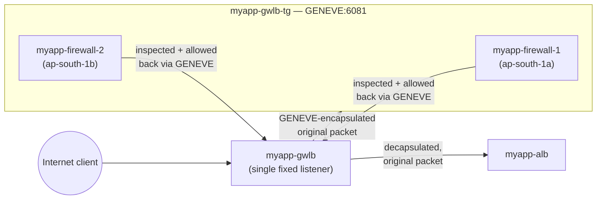

# 12 - Gateway Load Balancer

> Goal: understand **what a Gateway Load Balancer (GWLB) is and why it's fundamentally different** from the ALB (Note 05-08) and NLB (Note 09-10) we've built so far. This note is pure concept — no console work yet. Note 13 explains the **VPC ingress routing** mechanism that makes GWLB transparent, and Notes 14-17 build the actual `myapp-gwlb` scenario end to end.

---

## 1. The problem GWLB solves

Imagine you want every packet flowing into `myapp-vpc` to first pass through a third-party **firewall / IDS / IPS / deep-packet-inspection appliance** before it's allowed to reach `myapp-alb`. Two hard sub-problems show up immediately:

1. **Scaling the appliance fleet.** A single firewall instance is a single point of failure and a throughput ceiling. You need a *fleet* of appliance instances, and something has to distribute traffic across them, health-check them, and scale them — exactly the kind of job a load balancer already does for application servers.
2. **Making the detour invisible.** Neither the client nor `myapp-alb` should need to know an inspection hop exists. No client-side reconfiguration, no changing `myapp-alb`'s listener, no NAT tricks that would hide the original source/destination from the appliance itself.

**Gateway Load Balancer** is AWS's purpose-built answer to both problems at once. Per AWS's own definition, it *"combines a transparent network gateway (that is, a single entry and exit point for all traffic) and distributes traffic while scaling your virtual appliances with the demand."*

> 🧠 **Mental model:** GWLB is two services fused into one — a **transparent tollbooth** (every car must pass through, but nobody has to look up a special exit ramp to find it) plus **traffic-cop staffing** behind that tollbooth (a scalable pool of inspectors, load balanced automatically as traffic grows).

---

## 2. Two jobs, one service

| Job | What it means in practice |
|---|---|
| **Transparent network gateway** | A single, well-known entry/exit point in the traffic path. Traffic is redirected to it at the routing layer (Note 13), so appliances never need their own public IPs or client-visible hostnames. |
| **Load balancer** | Distributes that redirected traffic across a registered fleet of appliance instances (`myapp-firewall-1`, `myapp-firewall-2`), health-checks them, and scales the pool as throughput grows — just like ALB/NLB do for application servers, but for security appliances instead. |

This is why GWLB is genuinely a distinct product from ALB/NLB rather than "NLB with extra settings" — the *gateway* half has no equivalent in ALB or NLB at all.

---

## 3. Layer 3, GENEVE, and a single fixed listener

**GWLB operates at Layer 3 (the network layer)** of the OSI model — the only ELB type that does. It listens for **all IP packets across all ports** and forwards them to the target group specified by its (only) listener.

| | **ALB** | **NLB** | **GWLB** |
|---|---|---|---|
| OSI layer | 7 (Application) | 4 (Transport) | **3 (Network)** |
| Understands | HTTP/HTTPS: paths, headers, host | TCP/UDP/TLS connections | Raw IP packets — no protocol awareness above L3 |
| Listener(s) | Multiple, with configurable rules (path/host-based, Note 06-08) | One or more, per protocol/port | **Exactly one, fixed** — no listener rules to configure |
| Load balancer ↔ target protocol | HTTP/HTTPS/gRPC | TCP/UDP/TLS | **GENEVE, always UDP port 6081** |
| Typical target | Web/app servers | Any TCP/UDP service | Virtual security appliances |

Because GWLB only ever has the one fixed listener/target-group pairing, there's nothing analogous to Note 06-08's path-based or host-based routing rules to configure here — every packet that reaches the GWLB goes to the same target group.

### GENEVE — the encapsulation that makes inspection possible

**GENEVE (Generic Network Virtualization Encapsulation, [RFC 8926](https://datatracker.ietf.org/doc/html/rfc8926))** is the protocol GWLB and its registered appliances use to exchange traffic, always over **UDP port 6081**. In plain terms: GWLB wraps the client's *original, untouched* IP packet inside a GENEVE envelope (adding metadata about the flow) and forwards that envelope to whichever appliance instance was selected for the flow.

- The appliance unwraps the envelope, inspects (or modifies) the **original packet** inside it, decides allow/deny, then sends its verdict/traffic back through the same GENEVE tunnel to the GWLB.
- Because the original packet travels intact inside the envelope, the appliance sees real client/server IPs and ports — it can do genuine deep packet inspection, not just inspect a NAT'd proxy connection.
- GWLB maintains **flow stickiness** to a specific appliance instance using a 5-tuple hash (default; 3-tuple or 2-tuple configurable) — every packet belonging to the same connection/flow consistently reaches the *same* appliance instance, which matters for stateful inspection (Note 13 covers why this also constrains routing symmetry).
- Target group health checks use a **separate, configurable protocol/port** you choose (e.g. TCP or HTTP on some port your appliance exposes) — GENEVE:6081 is only for the actual data-plane traffic, not health checking.

🎯 **Exam tip:** "GENEVE, UDP port 6081, fixed" is the single most exam-tested GWLB fact — if a question mentions transparent appliance insertion and asks for the protocol/port, the answer is always this, never a configurable value.

---

## 4. High-level architecture

Nothing about `myapp-alb` or the client changes — the whole inspection detour happens at the routing layer, which is exactly what Note 13's **VPC ingress routing** mechanism provides.

---

## 5. Key components (previewed here, built in Notes 14-17)

| Component | Role | Built in |
|---|---|---|
| **`myapp-gwlb`** | The Gateway Load Balancer itself — one fixed GENEVE:6081 listener | Note 15 |
| **`myapp-gwlb-tg`** | Target group, protocol **GENEVE**, port **6081**, target type **instance**, registers `myapp-firewall-1`/`myapp-firewall-2` | Note 15 |
| **VPC Endpoint Service** (`myapp-gwlb-endpoint-service`) | What makes `myapp-gwlb` *consumable* as a private endpoint — the PrivateLink-style wrapper around it | Note 16 |
| **GWLB Endpoint** (`myapp-gwlbe-1`) | The consumer-side resource (behaves like an ENI) that other subnets route traffic *to*, in order to reach the GWLB/appliance fleet through the endpoint service | Note 16-17 |
| **VPC ingress routing** | The route table trick (Note 13) that forces inbound traffic through the GWLB Endpoint before it ever reaches `myapp-alb`'s subnet | Note 13, wired up in Note 17 |

---

## 6. Common architecture patterns

**1. Centralized inspection VPC (hub-and-spoke).** One dedicated "inspection VPC" hosts the GWLB + appliance fleet + endpoint service. Many "spoke" application VPCs each create their own GWLB Endpoint consuming that one shared endpoint service, typically stitched together with **AWS Transit Gateway** (Note 17 in the VPC folder). This is the standard **enterprise** pattern — one appliance fleet inspects traffic for an entire organization's VPCs, so you pay for and patch appliances in exactly one place.

**2. Single-VPC self-inspection.** The GWLB, its appliance fleet, the endpoint service, and the GWLB Endpoint all live inside the *same* VPC as the workload being protected. This is simpler (no Transit Gateway, no cross-VPC PrivateLink concerns) and is exactly what **this note series demonstrates**: `myapp-gwlb` inspects traffic destined for `myapp-alb`, all within `myapp-vpc`.

🎯 **Exam tip:** if a scenario describes "one centralized fleet of security appliances protecting traffic across dozens of VPCs," that's the **hub-and-spoke / centralized inspection VPC + Transit Gateway** pattern — GWLB + VPC endpoint services are what make that fleet reachable from every spoke without duplicating appliances per VPC.

---

## 7. GWLB vs ALB vs NLB — the full picture

| | **ALB** | **NLB** | **GWLB** |
|---|---|---|---|
| Primary use case | HTTP(S) app traffic, path/host routing | Ultra-low-latency TCP/UDP, static IPs | Transparent 3rd-party appliance insertion |
| Client-facing? | Yes, directly | Yes, directly | **No** — reached only via VPC ingress routing or a GWLB Endpoint, never addressed directly by end clients |
| Cross-zone default | Always on | Off | Off |
| Billing unit | LCU-hours | LCU-hours | LCU-hours (GWLBCU) + endpoint hourly + data processed |

---

## 8. A few more real details worth knowing

- **MTU is different.** ALB, NLB, and CLB all support jumbo frames (9001 MTU). **GWLB supports 8500 MTU** — a smaller ceiling, because every packet also has to carry the GENEVE encapsulation overhead (roughly 68 extra bytes per packet) on top of the original payload.
- **Health checks are separate from the data path.** The GWLB target group's health check protocol/port is something *you* choose (e.g. plain TCP or HTTP on a port your appliance exposes) — it is never GENEVE:6081. Don't confuse "how GWLB talks data-plane traffic to targets" (always GENEVE:6081, fixed) with "how GWLB decides if a target is healthy" (configurable, like any other target group).
- **You choose and trust the appliance vendor.** AWS doesn't ship the firewall/IDS software itself — GWLB is the plumbing. AWS maintains a list of qualified **Elastic Load Balancing Partners**, but ultimately you're responsible for vetting whatever appliance image you register (in this series, `myapp-firewall-1`/`myapp-firewall-2` are simple illustrative EC2 instances running basic packet-forwarding logic, not a real vendor product).
- **Billing has more moving parts than ALB/NLB.** You pay for the GWLB itself (hourly + Gateway Load Balancer Capacity Units, GWLBCU-hours), **plus** the GWLB Endpoint (hourly + per-GB processed, like any VPC endpoint), **plus** the EC2 instance-hours for the appliance fleet itself. This stacks up faster than a plain ALB/NLB bill — worth remembering for the "why is this demo suddenly expensive" moment in Note 17's cleanup section.

---

## 9. Recap

- **GWLB** combines a **transparent network gateway** (one entry/exit point, invisible to clients and servers) with a **load balancer** for a scalable fleet of virtual security appliances.
- It operates at **Layer 3**, has exactly **one fixed listener** (no configurable rules), and exchanges traffic with its targets using **GENEVE over UDP port 6081** — encapsulating the original packet so appliances can genuinely inspect/modify it.
- Health checks to targets use a separate, configurable protocol/port — distinct from the fixed GENEVE:6081 data path.
- Key building blocks: the GWLB + target group (this note), a **VPC Endpoint Service** and **GWLB Endpoint** (Note 16-17), and **VPC ingress routing** (Note 13) to force traffic through it transparently.
- Two common patterns: **centralized inspection VPC** (hub-and-spoke via Transit Gateway) for many VPCs, or **single-VPC self-inspection** (this series' `myapp-gwlb` scenario) for one.
- Next: **Note 13** explains exactly how VPC ingress routing intercepts inbound internet traffic at the Internet Gateway itself, before it ever reaches a subnet.

---

### Sources
- [What is a Gateway Load Balancer? — AWS docs](https://docs.aws.amazon.com/elasticloadbalancing/latest/gateway/introduction.html)
- [How Elastic Load Balancing works — routing algorithm (GWLB 5-tuple flow hash, GENEVE)](https://docs.aws.amazon.com/elasticloadbalancing/latest/userguide/how-elastic-load-balancing-works.html)
- [Introducing AWS Gateway Load Balancer — AWS News Blog](https://aws.amazon.com/blogs/aws/introducing-aws-gateway-load-balancer-easy-deployment-scalability-and-high-availability-for-partner-appliances/)
- [Introducing AWS Gateway Load Balancer: Supported architecture patterns](https://aws.amazon.com/blogs/networking-and-content-delivery/introducing-aws-gateway-load-balancer-supported-architecture-patterns/)
