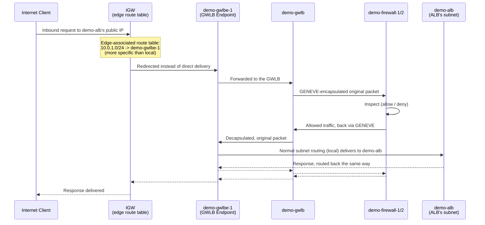

# 13 - VPC Ingress Routing for GWLB

> Goal: understand the exact mechanism — **VPC ingress routing** via a **gateway route table (edge association)** — that forces inbound internet traffic through `demo-gwlb`'s firewall appliances *before* it ever reaches `demo-alb`, with neither the client nor `demo-alb` needing any awareness of the detour. Continues the previous note's conceptual overview of GWLB; the next note starts the hands-on build that uses this exact mechanism.

---

## 1. The gap left open so far

The previous note established that GWLB is a *transparent* gateway — but transparent to whom, and how? Nothing about a Gateway Load Balancer by itself makes traffic go through it. Something has to actively **redirect** traffic on its way into the VPC. Normally, a **route table** can only be associated with a **subnet** — it governs what happens to traffic *leaving* that subnet. That's not good enough here: by the time traffic has already reached the ALB's subnet's route table, it has already arrived at the subnet the ALB lives in. We need to intercept it **before** that — at the moment it enters the VPC through the Internet Gateway itself.

AWS solves this with a special kind of route table association called a **gateway route table**, commonly referred to in the console as an **edge association**.

---

## 2. Gateway route tables (edge associations)

> 🧠 **Mental model:** a normal route table is a signpost standing *inside* a room (a subnet), telling traffic already in that room where to go next. A **gateway route table** is a signpost standing *at the building's front door* (the Internet Gateway) — it decides where traffic goes **before it's even assigned to a room**.

You can associate a route table with an **internet gateway** or a **virtual private gateway** instead of a subnet. When you do, AWS calls it a **gateway route table**, and the console names the tab where you configure this the **Edge associations** tab (VPC console → Route Tables → select a route table → **Edge associations**).

### What a gateway route table is allowed to do

A route table associated with an IGW supports routes with only these targets:
- The default **`local`** route
- A **Gateway Load Balancer endpoint**
- A **network interface** for a middlebox appliance

And only these destinations, when the target is a GWLB endpoint or ENI:
- The **entire VPC CIDR** (replacing the implicit `local` route's target entirely), or
- **A specific subnet's CIDR** — a more specific route than the VPC-wide `local` route, which only redirects traffic for that one subnet while everything else still uses `local`.

### Rules and restrictions (verified against AWS docs)

- You **cannot** associate a route table with a gateway if it already contains routes to targets other than `local`/GWLB-endpoint/ENI, routes to CIDRs outside the VPC's own ranges, or if route propagation is enabled on it.
- You **cannot** add a route to any CIDR outside your VPC's address ranges, and you **cannot** use a prefix list as a destination.
- A gateway route table only affects traffic **entering the VPC** through that gateway — it cannot be used to intercept traffic outside the VPC (e.g. traffic arriving via an attached Transit Gateway).
- **Best practice:** keep the IGW's gateway route table **dedicated** — do not also associate it with any subnet. Mixing the two roles on one route table is not the intended design.
- To ensure traffic actually reaches a middlebox appliance's ENI target, that ENI must be attached to a **running** instance, and (for traffic arriving via an IGW) must have a **public IP address**.

---

## 3. The exact route for our scenario

We want every internet-bound packet destined for `demo-alb`'s subnet to be inspected first. `demo-alb` sits in a public subnet — say the ALB's subnet has CIDR **`10.0.1.0/24`**. So:

1. Create a dedicated route table, associate it with your VPC's **Internet Gateway (IGW)** as an **edge association** (not with any subnet).
2. Add one route: destination **`10.0.1.0/24`** (the exact CIDR of the ALB's subnet) → target **`demo-gwlbe-1`** (the GWLB Endpoint, built in the hands-on notes ahead), instead of the default `local` handling.

| Destination | Target |
|---|---|
| `10.0.0.0/16` | `local` *(unaffected — everything else in the VPC)* |
| `10.0.1.0/24` | `demo-gwlbe-1` *(more specific — wins for this subnet)* |

Because `10.0.1.0/24` is a more specific match than the VPC-wide `local` route, **any packet arriving at the IGW destined for an address inside the ALB's subnet** — i.e., destined for `demo-alb` — gets diverted to the GWLB Endpoint instead of being delivered straight to the subnet. Every other destination in the VPC keeps using `local` as normal.

> ⚠️ **Important subnet-placement rule:** AWS documentation is explicit that the GWLB Endpoint and the application servers behind it must live in **different subnets**. That means `demo-gwlbe-1` cannot itself sit inside the ALB's own subnet — it needs its own small dedicated subnet, `gwlbe-subnet-1` (built in the hands-on notes ahead). This isn't a style choice; it's required for the routing model to work at all — the endpoint has to be reachable via a normal `local` route from the IGW's perspective, separate from the subnet whose traffic is being redirected.

---

## 4. Full request path — sequence diagram

Notice the return path retraces the **exact same** sequence of hops in reverse — that's not incidental, it's required.

---

## 5. Symmetric routing is mandatory — asymmetric routing breaks the flow

**AWS's documentation is explicit: when traffic routes through a middlebox appliance, the return traffic for that same flow must be routed through the *same* appliance. Asymmetric routing is not supported.**

Why this matters here specifically:

- GWLB uses a **5-tuple flow hash** (by default) to pin a flow to one specific appliance instance for its entire lifetime. If `demo-firewall-1` handled the inbound leg of a TCP connection, it — and only it — has that connection's state.
- Many appliances (stateful firewalls, IDS/IPS) need to see **both directions** of a flow to make sense of it at all — a firewall that only ever sees inbound SYN packets, never the matching outbound ACKs, can't properly track connection state, and will often just drop or flag the flow as suspicious.
- If `demo-alb`'s response instead tried to route directly back to the client (bypassing `demo-gwlbe-1`/`demo-gwlb`/`demo-firewall-1` entirely), the appliance never sees the reply — this is exactly the asymmetric-routing failure mode AWS calls out as unsupported.

This is why the sequence diagram above shows the response retracing every hop: `demo-alb → demo-gwlbe-1 → demo-gwlb → the same firewall appliance → demo-gwlbe-1 → IGW → client`. As long as the ALB subnet's own route table sends outbound-from-the-subnet traffic back out via `demo-gwlbe-1` (rather than straight to the IGW), this symmetry holds automatically.

🎯 **Exam tip:** "asymmetric routing is not supported" for middlebox/appliance architectures is a direct, verbatim AWS docs statement and a common trap — a design that only redirects the inbound leg through an appliance, without also routing the outbound leg back through the same appliance, is broken by design, not just suboptimal.

---

## 6. Egress ingress-routing (brief, advanced — not our worked example)

Everything above covers **inbound** inspection (internet → `demo-alb`). The same edge-association-style mechanism has an **egress** counterpart, used when you want to inspect **outbound** traffic (e.g. from a private app-tier subnet's instances) before it reaches the IGW or NAT Gateway:

- Instead of redirecting at the IGW, you edit the **subnet's own route table** (a normal, subnet-associated route table — not a gateway/edge one) so that its `0.0.0.0/0` (or a more specific destination) route points at a GWLB Endpoint instead of directly at the NAT Gateway/IGW.
- This lets outbound traffic get inspected by the same appliance fleet before it ever leaves the VPC, using the identical GWLB/GENEVE/endpoint building blocks — just applied to a subnet's normal egress route instead of the IGW's edge route.

This series keeps its worked example focused on the **inbound** case (matching `demo-alb`'s public-facing traffic), since that's the more common "why would I need this" scenario for an internet-facing application — but know that the egress variant exists and reuses the same core pieces.

---

## 7. Recap

- A **gateway route table** (console: **Edge associations** tab) attaches a route table to an **Internet Gateway** (or virtual private gateway) instead of a subnet, letting you intercept traffic **the moment it enters the VPC**, before any subnet-level routing applies.
- Allowed targets: `local`, a **GWLB Endpoint**, or a middlebox **network interface**. Allowed destinations: the whole VPC CIDR, or a **specific subnet's CIDR** (more specific than `local`).
- Our scenario: the IGW's edge-associated route table gets `10.0.1.0/24 → demo-gwlbe-1`, redirecting all traffic bound for `demo-alb`'s subnet through the firewall appliances first.
- The GWLB Endpoint must live in its **own subnet**, separate from the application subnet it protects — hence `gwlbe-subnet-1`, distinct from the ALB's public subnet.
- **Symmetric routing is mandatory** — the response must retrace the exact same path back through the same appliance; asymmetric routing is explicitly unsupported and breaks stateful inspection.
- An **egress** variant of ingress routing exists (redirecting a subnet's own outbound route table through a GWLB Endpoint) but isn't this series' focus.
- Next: Note 14 — VPC Ingress Routing for GWLB (Hands-On), which starts the hands-on build by creating the dedicated appliance subnets (`gwlb-appliance-subnet-1/2`) that will host `demo-firewall-1`/`demo-firewall-2`.

---

### Sources
- [Gateway route tables — Amazon VPC docs](https://docs.aws.amazon.com/vpc/latest/userguide/gateway-route-tables.html)
- [Route internet traffic to a single network interface — Amazon VPC docs](https://docs.aws.amazon.com/vpc/latest/userguide/igw-ingress-routing.html)
- [What is a Gateway Load Balancer? — AWS docs](https://docs.aws.amazon.com/elasticloadbalancing/latest/gateway/introduction.html)
- [New – VPC Ingress Routing – Simplifying Integration of Third-Party Appliances — AWS News Blog](https://aws.amazon.com/blogs/aws/new-vpc-ingress-routing-simplifying-integration-of-third-party-appliances/)
