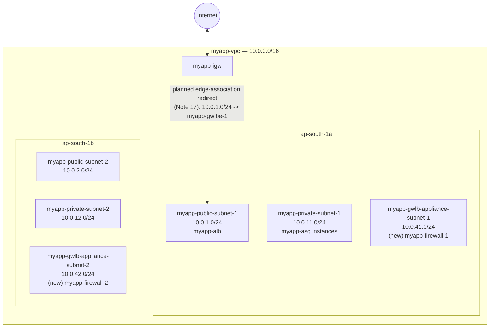

# 14 - VPC Ingress Routing for GWLB (Hands-On)

> Goal: lay the network groundwork for the GWLB build — create the two dedicated **appliance subnets** that will host `myapp-firewall-1`/`myapp-firewall-2`, and understand what a route table **edge association** looks like in the console before we actually wire one up. This is **Part 0** of the GWLB hands-on arc; Notes 15-17 build the GWLB itself, the endpoint service, and finally the edge-associated redirect route from Note 13.

---

## 1. Why dedicated subnets for the appliances?

`myapp-vpc` currently has two tiers, each duplicated across both AZs (Note 05, VPC folder):

| Tier | Subnets | Hosts |
|---|---|---|
| Public | `myapp-public-subnet-1` (`10.0.1.0/24`), `myapp-public-subnet-2` (`10.0.2.0/24`) | `myapp-alb`, `myapp-nlb` |
| Private (app) | `myapp-private-subnet-1` (`10.0.11.0/24`), `myapp-private-subnet-2` (`10.0.12.0/24`) | `myapp-asg` instances, demo instances |

The firewall appliance instances (`myapp-firewall-1`/`myapp-firewall-2`) that will register with `myapp-gwlb-tg` (Note 15) need their **own** subnets, separate from both existing tiers:

- They're not public-facing web servers — they shouldn't share a subnet (or its route table) with `myapp-alb`.
- They're not ordinary app-tier servers either — they run GENEVE-facing security software (Note 12 §3) and have their own security group / connectivity requirements distinct from `myapp-app-sg`.
- Keeping them isolated also matches the general AWS pattern for GWLB deployments: the appliance fleet lives in dedicated subnets, referenced only by `myapp-gwlb-tg`.

> 🧠 **Mental model:** if `myapp-public-subnet-1`/`2` are the "front desk" and `myapp-private-subnet-1`/`2` are the "back office," the new appliance subnets are the **security checkpoint** — a distinct area that traffic passes through, not a place where regular application work happens.

---

## 2. The two new subnets

| Subnet name | CIDR | AZ | Purpose |
|---|---|---|---|
| `myapp-gwlb-appliance-subnet-1` | `10.0.41.0/24` | `ap-south-1a` | Hosts `myapp-firewall-1` |
| `myapp-gwlb-appliance-subnet-2` | `10.0.42.0/24` | `ap-south-1b` | Hosts `myapp-firewall-2` |

Following the numbering habit established back in **VPC\03-Subnets-and-CIDR-Calculations.md §4** (public at `.1`/`.2`, private at `.11`/`.12`, with gaps deliberately left for a future DB tier at `.21`/`.22`), these appliance subnets sit at `.41`/`.42` — comfortably clear of everything already allocated, with room in between (`.22`-`.40`) for whatever gets built next.

### CIDR math check (per VPC\03's method)

Both are `/24`s: `2^(32-24) = 256` total addresses, `256 - 5 = 251` usable each (AWS's standard 5 reserved addresses per subnet) — far more than the one appliance instance each subnet needs to hold, leaving room to scale the appliance fleet later without re-subnetting.

---

## 3. Console steps — create both subnets

Same wizard as **VPC\05-Create-Subnets-HandsOn.md** — only the names, AZs, and CIDRs differ:

1. VPC console → left nav → **Subnets** → **Create subnet**.
2. **VPC ID**: `myapp-vpc`.
3. **Subnet 1**:
   - **Subnet name**: `myapp-gwlb-appliance-subnet-1`
   - **Availability Zone**: `ap-south-1a`
   - **IPv4 CIDR block**: **Manual input** → `10.0.41.0/24`
4. Click **Add new subnet** for the second row:
   - **Subnet name**: `myapp-gwlb-appliance-subnet-2`
   - **Availability Zone**: `ap-south-1b`
   - **IPv4 CIDR block**: `10.0.42.0/24`
5. Leave **IPv6 CIDR block** blank (this VPC remains IPv4-only, per VPC\04 §4).
6. **Create subnet** to create both at once.

### Auto-assign public IPv4?

Leave it **off** for both — the appliances are reached only via GENEVE traffic forwarded internally by `myapp-gwlb` (Note 12 §3), never addressed directly by clients. There's no need for a public IP here, unlike the public-facing tier.

### Route tables — not yet

For now, associate both new subnets with a plain route table that only has the default `local` route (or leave them on the VPC's main route table temporarily) — the same "no internet access wired up yet" state Note 05 used for the original 4 subnets. The appliances only need to talk to `myapp-gwlb` over GENEVE within the VPC at this stage; outbound internet access for the appliances themselves (e.g. software updates) is a separate concern addressed when the fleet is actually launched in Note 15.

---

## 4. What "Edge association" means in the console (preview only — wired up in Note 17)

Note 13 explained the concept: a **gateway route table** is a route table associated with the Internet Gateway itself rather than a subnet, letting you intercept traffic the instant it enters the VPC. In the console, this lives on a route table's own **Edge associations** tab:

1. VPC console → **Route Tables** → select (or create) a route table.
2. The **Edge associations** tab (alongside the familiar **Routes** and **Subnet associations** tabs) is where you'd click **Edit edge associations** and select `myapp-igw` as the target.

We are **not** creating this yet — it depends on `myapp-gwlbe-1` (the GWLB Endpoint) existing first, which requires `myapp-gwlb` and `myapp-gwlb-endpoint-service` to exist first (Notes 15-16). This note only previews *where* that redirect route will eventually point:

> Once built (Note 17), the edge-associated route table on `myapp-igw` will get one route: **`10.0.1.0/24` (`myapp-public-subnet-1`'s CIDR) → `myapp-gwlbe-1`**, overriding the implicit `local` delivery for that one subnet only — exactly the mechanism detailed in Note 13 §3.

Also recall from Note 13 §3: the GWLB Endpoint itself must live in a subnet **separate** from `myapp-public-subnet-1` (AWS's documented requirement that the endpoint and the protected application servers can't share a subnet). That dedicated endpoint subnet (`myapp-gwlbe-subnet-1`) is created alongside the endpoint in Note 16-17 — it's a third *new* subnet beyond the two appliance subnets built here.

---

## 5. Diagram: `myapp-vpc` with three tiers per AZ

The dotted arrow marks the **future** redirect — not yet configured. Right now, `myapp-igw` still delivers traffic to `myapp-public-subnet-1` normally via the existing `myapp-public-rt`; nothing changes in traffic behavior until Note 17.

---

## 6. Common beginner problems

| Mistake | Symptom / consequence | Fix |
|---|---|---|
| Picked a CIDR that overlaps an existing subnet (e.g. reused `10.0.11.0/24`) | Console rejects the new subnet — "CIDR conflicts with another subnet" | Recheck the third-octet allocation table above; `.41`/`.42` are clear of `.1`,`.2`,`.11`,`.12` (and the reserved `.21`,`.22` for a future DB tier per VPC\03) |
| Forgot to pin the Availability Zone explicitly | AWS might place both appliance subnets in the **same** AZ, defeating the whole point of an HA appliance fleet | Explicitly select `ap-south-1a` / `ap-south-1b`, same rule as VPC\05 §1 |
| Enabled auto-assign public IPv4 on the appliance subnets | Appliance instances get unnecessary public IPs they don't need for GENEVE traffic | Leave auto-assign **off** — these subnets aren't meant to be internet-reachable directly |
| Tried to add the IGW edge-association route now, before `myapp-gwlbe-1` exists | No GWLB Endpoint target available to select | Wait until Note 16-17 — this note only creates the subnets, the redirect route comes later |
| Assumed the GWLB Endpoint could reuse `myapp-public-subnet-1` | Violates AWS's documented rule that the endpoint and the protected application servers must be in different subnets | Plan for a dedicated `myapp-gwlbe-subnet-1`, built in Note 16-17 |

---

## 7. ⚠️ Clean up to avoid charges

Subnets themselves are **free** to create and hold — same as every subnet built so far (VPC\05 §10). Nothing to clean up yet at this stage; charges begin once `myapp-firewall-1`/`myapp-firewall-2` (EC2 instance-hours), `myapp-gwlb` (hourly + GWLBCU), and `myapp-gwlbe-1` (hourly + per-GB processed) are actually created in Notes 15-17.

---

## 8. Recap

- Created two new dedicated subnets inside `myapp-vpc`: **`myapp-gwlb-appliance-subnet-1`** (`10.0.41.0/24`, `ap-south-1a`) and **`myapp-gwlb-appliance-subnet-2`** (`10.0.42.0/24`, `ap-south-1b`) — homes for the firewall appliance fleet, kept separate from the public and private tiers.
- CIDR math confirms no overlap with any existing subnet, following the `.1`/`.2` (public), `.11`/`.12` (private), `.41`/`.42` (appliance) numbering convention.
- Auto-assign public IPv4 stays **off** — appliances are only reached via internal GENEVE traffic, never directly by clients.
- Previewed the console's **Edge associations** tab and exactly which redirect route (`10.0.1.0/24 → myapp-gwlbe-1`) will be added there in Note 17 — not created yet, since it depends on the GWLB Endpoint existing first.
- Flagged that the GWLB Endpoint itself will need its own dedicated subnet (`myapp-gwlbe-subnet-1`), separate from `myapp-public-subnet-1`, per AWS's documented same-subnet restriction (Note 13 §3).
- Next: **Note 15** creates `myapp-firewall-1`/`myapp-firewall-2` and the actual `myapp-gwlb` + `myapp-gwlb-tg`.

---

### Sources
- [Create a subnet — AWS docs](https://docs.aws.amazon.com/vpc/latest/userguide/create-subnets.html)
- [Gateway route tables — Amazon VPC docs](https://docs.aws.amazon.com/vpc/latest/userguide/gateway-route-tables.html)
- [What is a Gateway Load Balancer? — AWS docs](https://docs.aws.amazon.com/elasticloadbalancing/latest/gateway/introduction.html)
- [Subnet CIDR blocks — AWS docs](https://docs.aws.amazon.com/vpc/latest/userguide/subnet-sizing.html)
