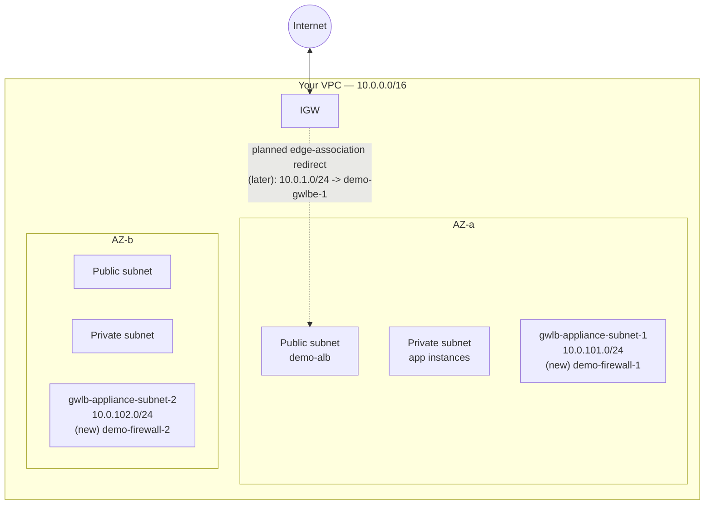

# 14 - VPC Ingress Routing for GWLB (Hands-On)

> Goal: lay the network groundwork for the GWLB build — create the two dedicated **appliance subnets** that will host `demo-firewall-1`/`demo-firewall-2`, and understand what a route table **edge association** looks like in the console before we actually wire one up. This is **Part 0** of the GWLB hands-on arc; the hands-on notes ahead build the GWLB itself, the endpoint service, and finally the edge-associated redirect route from the previous note.

---

## 1. Why dedicated subnets for the appliances?

Your VPC likely already has two tiers, each duplicated across both AZs:

| Tier | Subnets | Hosts |
|---|---|---|
| Public | Two public subnets, one per AZ | `demo-alb`, `demo-nlb` |
| Private (app) | Two private subnets, one per AZ | Your application instances (e.g. an Auto Scaling group, or standalone demo instances) |

The firewall appliance instances (`demo-firewall-1`/`demo-firewall-2`) that will register with `demo-gwlb-tg` (built in the next hands-on note) need their **own** subnets, separate from both existing tiers:

- They're not public-facing web servers — they shouldn't share a subnet (or its route table) with `demo-alb`.
- They're not ordinary app-tier servers either — they run GENEVE-facing security software and have their own security group / connectivity requirements distinct from your regular application security groups.
- Keeping them isolated also matches the general AWS pattern for GWLB deployments: the appliance fleet lives in dedicated subnets, referenced only by `demo-gwlb-tg`.

> 🧠 **Mental model:** if the public subnets are the "front desk" and the private subnets are the "back office," the new appliance subnets are the **security checkpoint** — a distinct area that traffic passes through, not a place where regular application work happens.

---

## 2. The two new subnets

| Subnet name | CIDR | AZ | Purpose |
|---|---|---|---|
| `gwlb-appliance-subnet-1` | `10.0.101.0/24` | AZ-a | Hosts `demo-firewall-1` |
| `gwlb-appliance-subnet-2` | `10.0.102.0/24` | AZ-b | Hosts `demo-firewall-2` |

These CIDRs are picked to sit well clear of whatever ranges your existing public/private subnets already use, with plenty of room left over for whatever tier gets added next — the exact numbers don't matter, only that they don't overlap anything already allocated in your VPC.

### CIDR math check

Both are `/24`s: `2^(32-24) = 256` total addresses, `256 - 5 = 251` usable each (AWS's standard 5 reserved addresses per subnet) — far more than the one appliance instance each subnet needs to hold, leaving room to scale the appliance fleet later without re-subnetting.

---

## 3. Console steps — create both subnets

1. VPC console → left nav → **Subnets** → **Create subnet**.
2. **VPC ID**: your VPC.
3. **Subnet 1**:
   - **Subnet name**: `gwlb-appliance-subnet-1`
   - **Availability Zone**: AZ-a
   - **IPv4 CIDR block**: **Manual input** → `10.0.101.0/24`
4. Click **Add new subnet** for the second row:
   - **Subnet name**: `gwlb-appliance-subnet-2`
   - **Availability Zone**: AZ-b
   - **IPv4 CIDR block**: `10.0.102.0/24`
5. Leave **IPv6 CIDR block** blank if your VPC is IPv4-only.
6. **Create subnet** to create both at once.

### Auto-assign public IPv4?

Leave it **off** for both — the appliances are reached only via GENEVE traffic forwarded internally by `demo-gwlb`, never addressed directly by clients. There's no need for a public IP here, unlike the public-facing tier.

### Route tables — not yet

For now, associate both new subnets with a plain route table that only has the default `local` route (or leave them on the VPC's main route table temporarily) — the appliances only need to talk to `demo-gwlb` over GENEVE within the VPC at this stage. Outbound internet access for the appliances themselves (e.g. software updates) is a separate concern addressed when the fleet is actually launched in the next hands-on note.

---

## 4. What "Edge association" means in the console (preview only — wired up later)

The previous note explained the concept: a **gateway route table** is a route table associated with the Internet Gateway itself rather than a subnet, letting you intercept traffic the instant it enters the VPC. In the console, this lives on a route table's own **Edge associations** tab:

1. VPC console → **Route Tables** → select (or create) a route table.
2. The **Edge associations** tab (alongside the familiar **Routes** and **Subnet associations** tabs) is where you'd click **Edit edge associations** and select your VPC's Internet Gateway as the target.

We are **not** creating this yet — it depends on `demo-gwlbe-1` (the GWLB Endpoint) existing first, which in turn requires `demo-gwlb` and `demo-gwlb-endpoint-service` to exist first (built across the next couple of hands-on notes). This note only previews *where* that redirect route will eventually point:

> Once built, the edge-associated route table on your VPC's IGW will get one route: **`10.0.1.0/24` (the ALB's subnet CIDR) → `demo-gwlbe-1`**, overriding the implicit `local` delivery for that one subnet only.

Also recall from the previous note: the GWLB Endpoint itself must live in a subnet **separate** from the ALB's public subnet (AWS's documented requirement that the endpoint and the protected application servers can't share a subnet). That dedicated endpoint subnet (`gwlbe-subnet-1`) is created alongside the endpoint in the next hands-on notes — it's a third *new* subnet beyond the two appliance subnets built here.

---

## 5. Diagram: your VPC with three tiers per AZ

The dotted arrow marks the **future** redirect — not yet configured. Right now, the IGW still delivers traffic to the ALB's public subnet normally via its existing route table; nothing changes in traffic behavior until the redirect is wired up.

---

## 6. Common beginner problems

| Mistake | Symptom / consequence | Fix |
|---|---|---|
| Picked a CIDR that overlaps an existing subnet | Console rejects the new subnet — "CIDR conflicts with another subnet" | Recheck your VPC's existing subnet CIDRs before picking `10.0.101.0/24`/`10.0.102.0/24`, or substitute any other non-overlapping range |
| Forgot to pin the Availability Zone explicitly | AWS might place both appliance subnets in the **same** AZ, defeating the whole point of an HA appliance fleet | Explicitly select AZ-a / AZ-b for the two subnets |
| Enabled auto-assign public IPv4 on the appliance subnets | Appliance instances get unnecessary public IPs they don't need for GENEVE traffic | Leave auto-assign **off** — these subnets aren't meant to be internet-reachable directly |
| Tried to add the IGW edge-association route now, before `demo-gwlbe-1` exists | No GWLB Endpoint target available to select | Wait until the endpoint is built in a later hands-on note — this note only creates the subnets, the redirect route comes later |
| Assumed the GWLB Endpoint could reuse the ALB's public subnet | Violates AWS's documented rule that the endpoint and the protected application servers must be in different subnets | Plan for a dedicated `gwlbe-subnet-1`, built in the next hands-on notes |

---

## 7. ⚠️ Clean up to avoid charges

Subnets themselves are **free** to create and hold. Nothing to clean up yet at this stage; charges begin once `demo-firewall-1`/`demo-firewall-2` (EC2 instance-hours), `demo-gwlb` (hourly + GWLBCU), and `demo-gwlbe-1` (hourly + per-GB processed) are actually created in the hands-on notes ahead.

---

## 8. Recap

- Created two new dedicated subnets inside your VPC: **`gwlb-appliance-subnet-1`** (`10.0.101.0/24`, AZ-a) and **`gwlb-appliance-subnet-2`** (`10.0.102.0/24`, AZ-b) — homes for the firewall appliance fleet, kept separate from the public and private tiers.
- CIDR math confirms no overlap with any existing subnet, following a simple, non-overlapping numbering convention.
- Auto-assign public IPv4 stays **off** — appliances are only reached via internal GENEVE traffic, never directly by clients.
- Previewed the console's **Edge associations** tab and exactly which redirect route (`10.0.1.0/24 → demo-gwlbe-1`) will be added there later — not created yet, since it depends on the GWLB Endpoint existing first.
- Flagged that the GWLB Endpoint itself will need its own dedicated subnet (`gwlbe-subnet-1`), separate from the ALB's public subnet, per AWS's documented same-subnet restriction.
- Next: Note 15 — Gateway Load Balancer Hands-On Part 1, which creates `demo-firewall-1`/`demo-firewall-2` and the actual `demo-gwlb` + `demo-gwlb-tg`.

---

### Sources
- [Create a subnet — AWS docs](https://docs.aws.amazon.com/vpc/latest/userguide/create-subnets.html)
- [Gateway route tables — Amazon VPC docs](https://docs.aws.amazon.com/vpc/latest/userguide/gateway-route-tables.html)
- [What is a Gateway Load Balancer? — AWS docs](https://docs.aws.amazon.com/elasticloadbalancing/latest/gateway/introduction.html)
- [Subnet CIDR blocks — AWS docs](https://docs.aws.amazon.com/vpc/latest/userguide/subnet-sizing.html)
