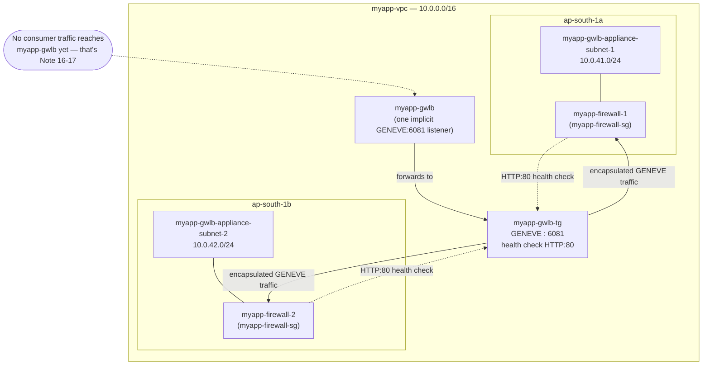

# 15 - Gateway Load Balancer Hands-On, Part 1: Appliance Instances and the GWLB

> Goal: build the **provider side** of the GWLB traffic-inspection scenario. Note 14 finished by creating the two dedicated subnets `myapp-gwlb-appliance-subnet-1` (`10.0.41.0/24`, `ap-south-1a`) and `myapp-gwlb-appliance-subnet-2` (`10.0.42.0/24`, `ap-south-1b`) inside `myapp-vpc`. In this note we launch the simulated firewall appliances into those subnets, register them behind a **GENEVE target group**, and stand up the **Gateway Load Balancer** itself. Note 16 then builds the endpoint-service/endpoint plumbing that lets real traffic reach it; Note 17 wires up the actual ingress redirect and verifies the whole thing end to end.

---

## 1. What we're building in this part

```
myapp-gwlb-appliance-subnet-1 (10.0.41.0/24, AZ-a) → myapp-firewall-1
myapp-gwlb-appliance-subnet-2 (10.0.42.0/24, AZ-b) → myapp-firewall-2
        ↓ registered into
myapp-gwlb-tg (GENEVE : 6081, target type = instance)
        ↓ target group of
myapp-gwlb (Gateway Load Balancer, one automatic listener)
```

Nothing here is reachable from real traffic yet — that's the point of splitting the build into three parts. Part 1 only proves the appliance fleet and the GWLB itself are healthy and correctly wired together.

> ⚠️ **This demo appliance is illustrative only.** A real production deployment would launch a proper security-vendor AMI from the **AWS Marketplace** (e.g. Palo Alto Networks VM-Series, Fortinet FortiGate, Check Point CloudGuard) — these ship with real deep packet inspection, IDS/IPS rule engines, and GENEVE decapsulation logic built in. Here we simulate the appliance with a plain Amazon Linux EC2 instance running a trivial IP-forwarding/`iptables` setup, purely so you can see the GWLB plumbing work without a commercial license.

---

## 2. Step 1 — Security group for the appliance instances

Before launching, create a dedicated SG so the appliances only accept the traffic a GWLB target actually needs: GENEVE data traffic and the health-check port.

1. VPC console → **Security Groups** → **Create security group**.
2. **Name**: `myapp-firewall-sg`. **VPC**: `myapp-vpc`.
3. **Inbound rules**:

   | Type | Protocol | Port | Source |
   |---|---|---|---|
   | Custom UDP | UDP | 6081 (GENEVE) | `10.0.41.0/24` and `10.0.42.0/24` (the appliance subnets — this is where the GWLB's own ENIs live) |
   | Custom TCP | TCP | 80 (health check port, see Step 3) | `10.0.41.0/24` and `10.0.42.0/24` |

4. **Outbound rules**: allow all (the appliance needs to forward decapsulated traffic back out).

> 🧠 **Mental model:** the GWLB doesn't have a single "front door" security group the way an ALB/NLB does — it reaches targets from ENIs placed directly inside the appliance subnets. So the *targets'* own SG has to explicitly trust traffic **from those subnets**, not from "the load balancer" as an abstract concept.

---

## 3. Step 2 — Launch the two simulated firewall appliances

1. EC2 console → **Launch instance**.
2. **Name**: `myapp-firewall-1`. AMI: Amazon Linux 2023. Instance type: `t3.micro`.
3. **Network**: `myapp-vpc` → subnet **`myapp-gwlb-appliance-subnet-1`**. Security group: `myapp-firewall-sg`.
4. **Advanced details → User data** (illustrative demo forwarding logic only):

   ```bash
   #!/bin/bash
   # DEMO ONLY - a real appliance would run vendor firewall/IDS software instead
   sysctl -w net.ipv4.ip_forward=1
   echo "net.ipv4.ip_forward = 1" >> /etc/sysctl.conf
   iptables -t nat -A POSTROUTING -o eth0 -j MASQUERADE
   iptables -A FORWARD -j ACCEPT
   # minimal HTTP responder on port 80 so the GWLB health check has something to hit
   yum install -y httpd
   echo "OK - myapp-firewall-1 demo appliance healthy" > /var/www/html/index.html
   systemctl enable --now httpd
   ```

5. **Launch.** Repeat identically for **`myapp-firewall-2`**, placed in **`myapp-gwlb-appliance-subnet-2`**.

> ⚠️ **Source/destination check.** Unlike a NAT Instance (Note 09), a GWLB target does **not** need you to manually disable the source/destination check on the ENI — the GENEVE-encapsulated packets arrive addressed *to* the instance itself (not merely passing through it), so no special forwarding exemption is required at the EC2 network-interface level. What the instance's own OS does with the decapsulated payload (forward it, drop it, inspect it) is entirely up to the appliance software.

---

## 4. Step 3 — Create the target group `myapp-gwlb-tg`

1. EC2 console → **Load Balancing → Target Groups** → **Create target group**.
2. **Target type**: **Instances**.
3. **Target group name**: `myapp-gwlb-tg`.
4. **Protocol : Port**: **GENEVE : 6081** — this is the only choice available; GWLB target groups always speak GENEVE on port 6081, it isn't a dropdown you pick freely.
5. **VPC**: `myapp-vpc`.
6. **Health checks**: protocol **HTTP**, port **80**, path **`/`** — this is a *separate* channel from the GENEVE data plane, used purely to ask "is this appliance instance alive?" Defaults: interval 10s, timeout 5s, healthy threshold 5, unhealthy threshold 2.
7. **Next** → register targets: check **`myapp-firewall-1`** and **`myapp-firewall-2`** → **Include as pending below** → **Create target group**.

> 🧠 **Mental model:** think of the target group as having **two different doors** into the same appliance instance — a GENEVE door (port 6081, real traffic) and a plain-HTTP door (port 80, "are you alive?"). They're deliberately separate so the health check doesn't depend on the appliance correctly handling encapsulated packets just to prove it's up.

---

## 5. Step 4 — Create the Gateway Load Balancer `myapp-gwlb`

1. EC2 console → **Load Balancing → Load Balancers** → **Create load balancer** → **Gateway Load Balancer** → **Create**.
2. **Name**: `myapp-gwlb`.
3. **VPC**: `myapp-vpc`.
4. **Mappings**: select **`myapp-gwlb-appliance-subnet-1`** (AZ-a) and **`myapp-gwlb-appliance-subnet-2`** (AZ-b) — one subnet per AZ you want the GWLB to have a presence in.
5. **Listener and routing**: unlike ALB/NLB, there is **no protocol/port to choose here at all** — a Gateway Load Balancer always gets **exactly one listener**, implicitly, forwarding to whichever target group you pick. Select **`myapp-gwlb-tg`**.
6. **Create load balancer.** State goes `Provisioning` → `Active` after a few minutes.

🎯 **Exam tip:** "A Gateway Load Balancer has exactly one listener, and it always speaks GENEVE on UDP port 6081" is a fact the exam expects you to know cold — there's no listener protocol/port picker in the console because there's nothing to pick.

---

## 6. Diagram: state at the end of Part 1



---

## 7. Common beginner problems

| Problem | Likely cause / fix |
|---|---|
| Target group shows `myapp-firewall-1/2` as **unhealthy** | Check the health check is hitting a port the appliance's own user-data actually listens on (here, HTTP:80 via `httpd`) — a GENEVE-only appliance with nothing bound to the health-check port will always fail. |
| Targets stuck in `initial` state | Registration/first health checks take a few minutes; also confirm the instance's AZ is one of the two subnets/AZs the GWLB itself is deployed into — a target in a non-enabled AZ shows `unused`, not `unhealthy`. |
| Targets `unhealthy` despite `httpd` running | `myapp-firewall-sg` doesn't allow inbound TCP:80 from the appliance subnet CIDRs — add/verify the rule from Section 2. |
| Can't pick a listener protocol when creating `myapp-gwlb` | Expected — GWLB has no listener configuration step; the console only asks which target group the single implicit listener forwards to. |
| Target type dropdown shows "Lambda"/"IP" options you don't need | Fine to ignore — GWLB target groups support **Instance** and **IP** target types only (no Lambda), we're using **Instance** here. |

---

## 8. Recap

- Reused `myapp-gwlb-appliance-subnet-1/2` from Note 14; launched two demo firewall instances, `myapp-firewall-1` and `myapp-firewall-2`, one per AZ, protected by a dedicated `myapp-firewall-sg`.
- A real deployment would replace these with a Marketplace security appliance AMI (Palo Alto, Fortinet, Check Point, etc.) — our `iptables`/`httpd` setup is illustrative only.
- Created `myapp-gwlb-tg`: fixed **GENEVE : 6081** protocol/port, target type **Instance**, health check on a separate **HTTP:80** channel.
- Created `myapp-gwlb` itself across both appliance subnets, with its **one automatic listener** forwarding to `myapp-gwlb-tg` — nothing consumes it yet.
- Next: **Note 16** creates the VPC Endpoint Service (`myapp-gwlb-endpoint-service`) backed by `myapp-gwlb`, and the consumer-side GWLB Endpoint (`myapp-gwlbe-1`) that real traffic will actually be routed to.

---

### Sources
- [What is a Gateway Load Balancer? – AWS docs](https://docs.aws.amazon.com/elasticloadbalancing/latest/gateway/introduction.html)
- [Target groups for your Gateway Load Balancers – AWS docs](https://docs.aws.amazon.com/elasticloadbalancing/latest/gateway/target-groups.html)
- [Health checks for Gateway Load Balancer target groups – AWS docs](https://docs.aws.amazon.com/elasticloadbalancing/latest/gateway/health-checks.html)
- [Getting started with Gateway Load Balancers – AWS docs](https://docs.aws.amazon.com/elasticloadbalancing/latest/gateway/getting-started.html)
