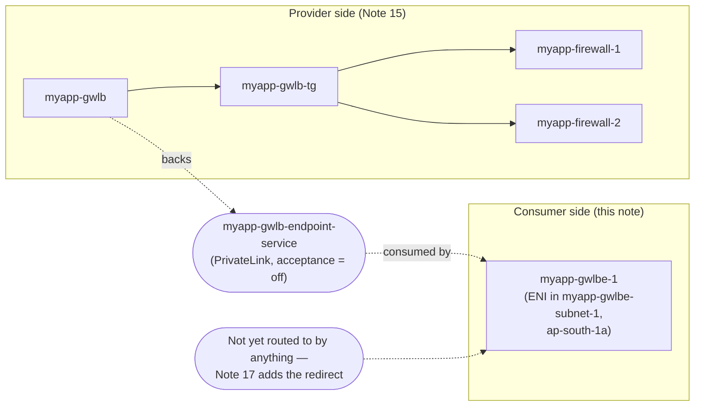

# 16 - Gateway Load Balancer Hands-On, Part 2: Endpoint Service and Endpoint

> Goal: build the **PrivateLink plumbing** that lets real traffic reach the `myapp-gwlb` fleet from Note 15. A Gateway Load Balancer is never addressed directly by consumer traffic — traffic is always redirected to a **Gateway Load Balancer Endpoint**, which privately connects back to the GWLB through a **VPC Endpoint Service**. This note builds both pieces; Note 17 wires up the actual ingress-routing redirect and verifies the whole path end to end.

---

## 1. Why an endpoint/endpoint-service even needed — recap the mechanism

This is the exact same underlying technology as **AWS PrivateLink**, covered in depth in `VPC\18-VPC-Endpoints-and-PrivateLink.md`. The difference here is only *what's on the provider side*:

| | Ordinary Interface Endpoint (VPC 18) | GWLB Endpoint (this note) |
|---|---|---|
| Provider side is backed by | A **Network Load Balancer** | A **Gateway Load Balancer** |
| Consumer creates | An **Interface Endpoint** (ENI with a private IP) | A **Gateway Load Balancer Endpoint** (also an ENI-backed resource, but consumed differently — see below) |
| What flows over it | Application-layer requests (HTTPS to Secrets Manager, etc.) | Raw IP traffic, GENEVE-encapsulated for inspection |
| Console location | VPC console → **Endpoint Services** / **Endpoints** | Same pages — **Load balancer type: Gateway** is just a different choice |

> 🧠 **Mental model:** it's the same mail-slot idea from VPC Note 18 — a private, one-directional pipe from a consumer VPC into a specific service, with no peering and no exposed internal topology. The only twist: instead of the "service" being an internal API sitting behind an NLB, the "service" here is the **inspection fleet** sitting behind `myapp-gwlb`, and consuming it doesn't just forward application requests — it silently interposes the appliance in the path of *any* IP traffic routed to it.

---

## 2. Step 1 — Create the endpoint service `myapp-gwlb-endpoint-service`

1. VPC console → left nav **Endpoint Services** → **Create endpoint service**.
2. **Load balancer type**: **Gateway**.
3. **Available load balancers**: select **`myapp-gwlb`** (from Note 15).
4. **Require acceptance for endpoint**: **leave unchecked** for this demo.
5. **Supported IP address types**: IPv4.
6. **Name**: (auto-generated as `com.amazonaws.vpce.ap-south-1.vpce-svc-xxxxxxxx`) — tag it `myapp-gwlb-endpoint-service` for readability in the console.
7. **Create.**

### About "Require acceptance"

- **Off (this demo)**: any Gateway Load Balancer endpoint created against this service connects **automatically** — appropriate because the consumer (`myapp-gwlbe-1`, Step 2 below) lives in the **same account and VPC** as the provider. There's no trust boundary to gate.
- **On (real hub-and-spoke inspection architecture)**: in production, a **centralized inspection VPC** typically serves *many* spoke VPCs, possibly in other AWS accounts, connecting via Transit Gateway or PrivateLink. There you'd require acceptance so the security team explicitly approves each new consumer before their traffic starts flowing through the shared appliance fleet — you don't want an unreviewed VPC silently attaching itself to your inspection service.

---

## 3. Step 2 — Create a dedicated subnet for the endpoint ENI

AWS's own PrivateLink documentation for GWLB endpoints is explicit that the **endpoint and the application servers it protects should sit in different subnets** — the standard prerequisite is "two subnets in the AZ: one for the application servers, one for the Gateway Load Balancer endpoint." (It's technically possible to place them in the same subnet, but then NACL rules get evaluated for east-west traffic between the app servers and the endpoint ENI inside that subnet, which adds a layer of complexity most designs avoid.) We follow the recommended pattern:

1. VPC console → **Subnets** → **Create subnet**.
2. **VPC**: `myapp-vpc`. **Name**: `myapp-gwlbe-subnet-1`. **AZ**: `ap-south-1a` (same AZ as `myapp-public-subnet-1`, so the endpoint stays in-zone with the traffic it will redirect). **CIDR**: `10.0.51.0/24`.
3. Leave it associated with the **main route table** for now — Note 17 gives it its own dedicated route table as part of wiring up the return path.

> ⚠️ This is a small deviation from a literal reading of "put the endpoint in `myapp-public-subnet-1`" — but it matches the AWS-documented prerequisite, and it's what makes the routing in Note 17 (a genuinely separate "next hop" for redirected traffic) work cleanly. The IGW-level route still targets `10.0.1.0/24` (`myapp-public-subnet-1`'s CIDR) as the *destination being protected* — the endpoint itself just physically lives one subnet over.

---

## 4. Step 3 — Create the GWLB Endpoint `myapp-gwlbe-1`

1. VPC console → **Endpoints** → **Create endpoint**.
2. **Name tag**: `myapp-gwlbe-1`.
3. **Type**: **Endpoint services that use NLBs and GWLBs**.
4. **Service name**: paste/select `myapp-gwlb-endpoint-service` → **Verify service**.
5. **VPC**: `myapp-vpc`.
6. **Subnets**: select **`myapp-gwlbe-subnet-1`** — exactly one subnet/AZ per GWLB endpoint; to cover AZ-b too you'd create a second endpoint (`myapp-gwlbe-2`) in an equivalent subnet there, but this demo scopes to AZ-a only, consistent with Notes 13–14.
7. **IP address type**: IPv4.
8. **Create endpoint.** Status: `Pending acceptance` → `Available` almost immediately (since acceptance isn't required).

`myapp-gwlbe-1` is the resource that **actual traffic gets redirected to** in Note 17 — it's an ENI-backed construct sitting in `myapp-gwlbe-subnet-1`, and any route table that names it as a target silently detours matching traffic through `myapp-gwlb-endpoint-service` → `myapp-gwlb` → the firewall fleet, before it continues on its way.

---

## 5. Diagram: provider side vs. consumer side

---

## 6. Why the indirection exists at all

It would be simpler if route tables could just point straight at `myapp-gwlb` — so why the endpoint-service/endpoint layer?

- **Many consumers, one fleet.** The whole point of GWLB is that dozens of VPCs (or the same VPC's multiple subnets) can send traffic through **one centralized, auto-scaling appliance fleet**, without each consumer needing VPC Peering, a Transit Gateway attachment, or any visibility into the provider's VPC layout.
- **Lightweight consumption.** Each consumer only needs a small ENI-backed endpoint in their own subnet — not a route into a whole foreign VPC's CIDR space.
- **Decoupled scaling and account boundaries.** The provider (security team) can resize, patch, or even move the appliance fleet, and consumers never notice — they only ever talk to the stable endpoint-service name. This is exactly the model used in AWS's reference "centralized inspection VPC" architecture, where a hub VPC hosts `myapp-gwlb`-equivalent fleets consumed by many spoke VPCs.

---

## 7. A few more GWLB-endpoint considerations worth knowing

- **One endpoint connects to one load balancer per AZ.** If `myapp-gwlb-endpoint-service` were ever associated with multiple Gateway Load Balancers (e.g. during a blue/green appliance-fleet migration), `myapp-gwlbe-1` would still only establish a connection with **one** of them per AZ — it's not a fan-out.
- **Bandwidth**: each GWLB endpoint supports up to **10 Gbps per AZ**, automatically scaling to **100 Gbps** — plenty of headroom for a learning demo, but a real sizing exercise for a production inspection VPC would factor this in per AZ.
- **Same-AZ traffic stays same-AZ.** AWS recommends creating one GWLB endpoint **per AZ** you send traffic from/to, specifically so inspected traffic never has to cross an AZ boundary just to reach the appliance fleet — cross-AZ data transfer is both extra latency and (outside of GWLB's own inter-AZ handling) extra cost.
- **Billing**: like any Interface-style endpoint, `myapp-gwlbe-1` bills **hourly + per-GB processed**, on top of `myapp-gwlb`'s own hourly + LCU charge. Two billing meters running for what is, from the client's point of view, one invisible detour — worth remembering when Note 17's cleanup section rolls around.

---

## 8. Common beginner problems

| Problem | Likely cause / fix |
|---|---|
| Endpoint stuck in `Pending acceptance` | `myapp-gwlb-endpoint-service` was created with **Require acceptance** turned on — either turn it off, or manually accept the connection request under the endpoint service's **Endpoint connections** tab. |
| "No available load balancers" when creating the endpoint service | `myapp-gwlb` isn't `Active` yet, or you're filtering by the wrong VPC/region — confirm Note 15's GWLB finished provisioning first. |
| Can only pick one subnet per endpoint | Expected — a GWLB endpoint is scoped to exactly **one AZ**; for multi-AZ coverage, create one endpoint per AZ (e.g. a future `myapp-gwlbe-2`). |
| Traffic doesn't seem to reach `myapp-gwlbe-1` yet | Expected at this stage — nothing routes to it until Note 17's ingress-routing step. |
| Endpoint and app servers in the same subnet, unexpected NACL denies | This is the exact edge case AWS's docs call out — traffic between same-subnet resources and the endpoint ENI still passes through NACL evaluation. Using a dedicated `myapp-gwlbe-subnet-1` (as we did) avoids this entirely. |

---

## 9. Recap

- A **GWLB-backed endpoint service** uses the identical PrivateLink mechanism as the Interface Endpoints in `VPC\18-VPC-Endpoints-and-PrivateLink.md`, just with a Gateway Load Balancer instead of an NLB on the provider side.
- Created `myapp-gwlb-endpoint-service`, backed by `myapp-gwlb`, with **Require acceptance off** (fine for this single-account demo; would be **on** in a real cross-account hub-and-spoke inspection design).
- Created a dedicated `myapp-gwlbe-subnet-1` (`10.0.51.0/24`, AZ-a) and the GWLB Endpoint **`myapp-gwlbe-1`** in it — following AWS's documented recommendation to keep the endpoint and the protected application servers in separate subnets.
- The endpoint-service/endpoint indirection is what lets many consumers share one centralized appliance fleet without peering or complex cross-VPC routing.
- Next: **Note 17** edits the IGW edge-associated route table (and the affected subnet route tables) to actually redirect inbound traffic through `myapp-gwlbe-1`, then verifies the complete request path end to end.

---

### Sources
- [Access an inspection system using a Gateway Load Balancer endpoint – AWS docs](https://docs.aws.amazon.com/vpc/latest/privatelink/gateway-load-balancer-endpoints.html)
- [Create an inspection system as a Gateway Load Balancer endpoint service – AWS docs](https://docs.aws.amazon.com/vpc/latest/privatelink/create-gateway-load-balancer-endpoint-service.html)
- [VPC endpoints – AWS docs](https://docs.aws.amazon.com/vpc/latest/privatelink/vpc-endpoints.html)
- [Gateway Load Balancer endpoint pricing – AWS](https://aws.amazon.com/privatelink/pricing/#Gateway_Load_Balancer_Endpoint_pricing)
