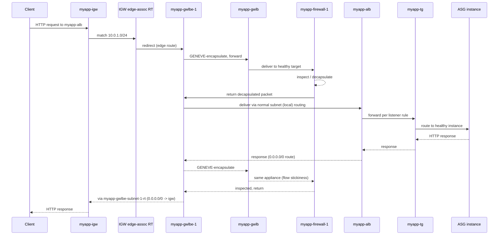

# 17 - Gateway Load Balancer Hands-On, Part 3: End-to-End Verification

> Goal: flip the switch. Everything built in Notes 15–16 (`myapp-gwlb`, `myapp-gwlb-tg`, `myapp-firewall-1/2`, `myapp-gwlb-endpoint-service`, `myapp-gwlbe-1`) exists but carries zero real traffic so far. This note edits the three route tables that actually redirect internet-bound traffic for `myapp-alb` through the firewall appliances, then walks through verifying the full round trip. This is the concept from `13-VPC-Ingress-Routing-for-GWLB.md` made real.

---

## 1. The three route tables that must change

AWS's documented procedure for this exact scenario ("configure routing" for a GWLB endpoint) touches **three** route tables, not one — this is the detail worth getting precisely right rather than guessing:

| # | Route table | New/changed route | Purpose |
|---|---|---|---|
| 1 | **IGW edge-associated route table** (associated with `myapp-igw` itself, not a subnet) | `10.0.1.0/24` → `myapp-gwlbe-1` | Intercepts internet traffic addressed to `myapp-public-subnet-1` (where `myapp-alb` lives) **before** it ever reaches ordinary VPC routing, and detours it to the endpoint. |
| 2 | **`myapp-public-subnet-1`'s own route table** | `0.0.0.0/0` → `myapp-gwlbe-1` (replacing the direct `0.0.0.0/0 → myapp-igw` route) | Return path: once the appliance has inspected inbound traffic and it's delivered into the subnet, *outbound* replies (and any subnet-initiated egress) must also detour back through the endpoint — otherwise replies leave directly via the IGW and you get **asymmetric routing**, which most stateful appliances silently break on. |
| 3 | **`myapp-gwlbe-subnet-1`'s own route table** | `0.0.0.0/0` → `myapp-igw` | Lets traffic that has passed through the endpoint (post-inspection, heading back out) actually reach the internet. |

> ⚠️ This is not a "the endpoint handles the return path automatically" situation — AWS's own routing procedure explicitly requires **all three** of these routes to be configured by hand (or via the console's "middlebox routing wizard," which automates exactly this). Skipping row 2 or row 3 is the single most common reason a GWLB ingress-inspection build "sort of works" for inbound but breaks replies.

---

## 2. Step 1 — Edit the IGW edge-associated route table

1. VPC console → **Route Tables** → **Create route table** (or select an existing one already edge-associated with `myapp-igw`, if Note 14 created it as part of the ingress-routing concept).
2. **Name**: `myapp-igw-edge-rt`. **VPC**: `myapp-vpc`.
3. **Edge associations** tab → **Edit edge associations** → select **`myapp-igw`** → **Save**. This is what makes it an *edge* route table rather than an ordinary subnet route table — it governs traffic **entering** the VPC through the gateway, before any subnet-level routing applies.
4. **Routes** tab → **Edit routes** → **Add route**:
   - **Destination**: `10.0.1.0/24` (exactly `myapp-public-subnet-1`'s CIDR).
   - **Target**: **VPC Endpoint** → `myapp-gwlbe-1`.
5. **Save changes.**

Resulting table:

| Destination | Target |
|---|---|
| `10.0.0.0/16` | `local` |
| `10.0.1.0/24` | `myapp-gwlbe-1` |

---

## 3. Step 2 — Edit `myapp-public-subnet-1`'s route table (return path)

`myapp-public-subnet-1` currently shares `myapp-public-rt` (Note 06) with `myapp-public-subnet-2`. Since only subnet-1 is in scope for this inspection demo, give it its **own** route table so subnet-2's routing is untouched:

1. **Route Tables** → **Create route table** → **Name**: `myapp-public-subnet-1-rt`. **VPC**: `myapp-vpc`.
2. **Routes** tab → add `10.0.0.0/16 → local` (present by default) and **`0.0.0.0/0` → `myapp-gwlbe-1`** (target: VPC Endpoint).
3. **Subnet associations** tab → **Edit subnet associations** → check **`myapp-public-subnet-1`** only.

`myapp-public-subnet-2` (and anything else still on `myapp-public-rt`) keeps its direct `0.0.0.0/0 → myapp-igw` route, unaffected.

> ⚠️ **Production nuance:** a complete two-AZ design would replicate this entire pattern for AZ-b too — a second `myapp-gwlbe-2` in an AZ-b endpoint subnet, a second edge route for `myapp-public-subnet-2`'s CIDR, and so on. This demo intentionally scopes to AZ-a only, matching the single-AZ appliance-subnet focus established in Notes 13–14; call this out explicitly if this pattern shows up in an exam scenario about *high availability* GWLB inspection.

---

## 4. Step 3 — Edit `myapp-gwlbe-subnet-1`'s route table (egress path)

1. **Route Tables** → **Create route table** → **Name**: `myapp-gwlbe-subnet-1-rt`. **VPC**: `myapp-vpc`.
2. **Routes**: `10.0.0.0/16 → local` plus **`0.0.0.0/0` → `myapp-igw`**.
3. **Subnet associations** → associate with **`myapp-gwlbe-subnet-1`**.

This is what lets traffic that has just emerged from the endpoint (inbound, post-inspection, heading to the ALB subnet's `local` route) and outbound replies (heading back to the internet) actually find their way to `myapp-igw`.

---

## 5. End-to-end verification

1. From a browser or `curl`, hit `myapp-alb`'s DNS name (`myapp-alb-xxxx.ap-south-1.elb.amazonaws.com`) — it should respond **exactly as before**, with no visible change to the client. The entire detour through the firewall fleet is invisible at the HTTP layer.
2. SSH (via Session Manager, since these are demo boxes) into **`myapp-firewall-1`** and **`myapp-firewall-2`** → check `iptables -L -v -n` counters, or tail whatever logging the user-data script wrote — packet/byte counters should be incrementing on the appliance that's currently handling the flow (only one appliance sees a given flow, per GWLB's flow-hashing/stickiness).
3. Confirm target health in **`myapp-gwlb-tg`** stays `Healthy` throughout — a spike in requests without a health dip is a good sign the appliance is keeping up.
4. Optional: temporarily stop the `httpd`/forwarding logic on one firewall instance mid-test and confirm the GWLB fails over new flows to the other appliance without the client noticing (existing flows may still drain to the now-unhealthy target per GWLB's "existing flows keep their target" behavior — see Note 15 troubleshooting).

---

## 6. Troubleshooting: classic GWLB ingress-routing failure modes

| Symptom | Likely cause / fix |
|---|---|
| Client requests time out entirely | Edge route table isn't actually **edge-associated** with `myapp-igw` (check the **Edge associations** tab, not just Routes) — an ordinary route table association does nothing for IGW-ingress traffic. |
| Requests succeed, but appliance logs/counters show nothing | The route destination CIDR doesn't exactly match `myapp-public-subnet-1` (`10.0.1.0/24`), so traffic bypasses the redirect entirely — double-check the CIDR, not just the subnet name. |
| Requests succeed inbound but responses never arrive back at the client | **Asymmetric routing** — `myapp-public-subnet-1`'s own route table still points `0.0.0.0/0` at `myapp-igw` directly instead of `myapp-gwlbe-1`; the appliance (often stateful) never sees the return leg and many appliances / the flow itself breaks. This is the single most common GWLB misconfiguration. |
| Traffic reaches the appliance but nothing comes out the other side | The appliance is **inspecting and dropping** instead of **inspecting and forwarding/NATing**. A real firewall appliance must actively forward allowed traffic back out — GWLB does not do any forwarding itself; that's entirely the appliance's job. Our demo's `iptables MASQUERADE`+`FORWARD ACCEPT` rules exist precisely to do this. |
| Targets flap unhealthy under load, dropping some flows | Security group gap — confirm `myapp-firewall-sg` allows inbound **UDP 6081** (GENEVE) and the health-check port from the appliance subnet CIDRs, not just from "the load balancer" (GWLB has no single SG of its own to reference). |
| `myapp-gwlbe-1` shows as the target but nothing routes to it | The endpoint isn't `Available` yet, or the route table you edited isn't the one actually associated with `myapp-igw` / `myapp-public-subnet-1` / `myapp-gwlbe-subnet-1` respectively — re-check each **Subnet associations** / **Edge associations** tab. |

---

## 7. ⚠️ Clean up to avoid charges

This three-part build is one of the **more expensive demo environments** in this repo — every piece bills hourly regardless of traffic:

1. **Delete `myapp-gwlbe-1`** (VPC console → Endpoints) — GWLB Endpoints bill hourly + per-GB, same as Interface Endpoints. You must first remove any route table entries pointing at it (Note 17 §2–4) or the delete will fail.
2. **Delete `myapp-gwlb-endpoint-service`** (VPC console → Endpoint Services).
3. **Delete the Gateway Load Balancer `myapp-gwlb`** (EC2 console → Load Balancers) — bills hourly + LCU-hours like any other ELB type.
4. **Delete target group `myapp-gwlb-tg`.**
5. **Terminate `myapp-firewall-1` and `myapp-firewall-2`** — two more EC2 instance-hours running continuously otherwise.
6. Optionally delete `myapp-gwlbe-subnet-1`, `myapp-gwlb-appliance-subnet-1/2`, and the three route tables created across Notes 14–17, if you're tearing down the whole scenario rather than just pausing it.

> ⚠️ Unlike a lone NAT Gateway or a single ALB, this scenario stacks **GWLB hourly + LCU + two GWLB Endpoint-hours + two appliance EC2 instances** simultaneously — leaving it running "just for a bit longer" is a fast way to rack up a surprising bill for a learning exercise.

---

## 8. Recap: the GWLB chapter, Notes 12–17

- **Note 12** — what a Gateway Load Balancer is: Layer 3/4 GENEVE-based traffic inspection, transparent to the traffic it forwards.
- **Note 13** — the concept of **VPC ingress routing**: an IGW edge-associated route table can redirect traffic destined for a subnet to a GWLB endpoint before it ever reaches ordinary `local` routing.
- **Note 14** — first hands-on step: created the dedicated appliance subnets `myapp-gwlb-appliance-subnet-1/2`.
- **Note 15** — launched `myapp-firewall-1/2`, created `myapp-gwlb-tg` (GENEVE:6081) and `myapp-gwlb` itself.
- **Note 16** — built the PrivateLink plumbing: `myapp-gwlb-endpoint-service` and the consumer-side `myapp-gwlbe-1`.
- **Note 17 (this note)** — wired the actual ingress redirect across three route tables and verified a real client request genuinely detours through `myapp-firewall-1`/`myapp-firewall-2` before ever reaching `myapp-alb`, invisibly to the client.
- Together this is the standard AWS reference pattern for **centralized traffic inspection using Gateway Load Balancer** — the same shape used in production hub-and-spoke architectures, just scoped down to one VPC and one AZ for learning purposes.
- Next: **Note 18** closes out the Load Balancer folder with the legacy **Classic Load Balancer**, comparing it against ALB/NLB/GWLB.

---

### Sources
- [Access an inspection system using a Gateway Load Balancer endpoint (routing configuration) – AWS docs](https://docs.aws.amazon.com/vpc/latest/privatelink/gateway-load-balancer-endpoints.html)
- [Configure middlebox traffic routing and inspection in a VPC – AWS docs](https://docs.aws.amazon.com/vpc/latest/userguide/gwlb-route.html)
- [What is a Gateway Load Balancer? – AWS docs](https://docs.aws.amazon.com/elasticloadbalancing/latest/gateway/introduction.html)
- [Gateway Load Balancer pricing – AWS](https://aws.amazon.com/elasticloadbalancing/pricing/)
