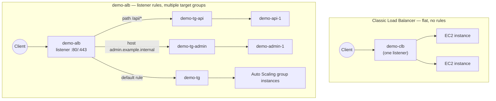

# 18 - Classic Load Balancer (Legacy)

> Goal: close out this folder with a comparison/legacy bookend. We won't build anything with `demo-clb` here; this note exists purely so you can recognize the **Classic Load Balancer (CLB)** on the exam and in older AWS accounts, and explain precisely why it's the wrong answer for anything new.

---

## 1. What CLB was

Elastic Load Balancing launched in **2009** with the Classic Load Balancer as its **only** offering — at the time it was simply called "Elastic Load Balancer," full stop. There was no ALB or NLB yet, so CLB had to do double duty:

- Basic **Layer 7** support: HTTP/HTTPS load balancing, with the ability to terminate TLS.
- Basic **Layer 4** support: plain TCP/SSL passthrough load balancing.

**AWS's own documentation now describes CLB explicitly as "the previous generation of load balancers" and recommends migrating to a current-generation load balancer** for any active use — it isn't a deprecated/shut-off service, but it's firmly legacy.

> 🧠 **Mental model:** CLB is a single load balancer trying to be both a hammer and a screwdriver — it handles both L4 and L7 traffic in one product, but does *neither* particularly well by modern standards, and does *none* of the advanced routing ALB/NLB were purpose-built for later.

---

## 2. Why ALB and NLB replaced it

| Milestone | Year | What changed |
|---|---|---|
| Elastic Load Balancing (Classic) launches | 2009 | Only option; one target group, no routing rules. |
| **Application Load Balancer (ALB)** launches | 2016 | Purpose-built Layer 7: path-based/host-based routing rules, multiple target groups per load balancer, native container (ECS) and Lambda targets. |
| **Network Load Balancer (NLB)** launches | 2017 | Purpose-built Layer 4: static IP per AZ, ultra-low latency, millions of requests/sec, preserves client source IP by default. |
| **Gateway Load Balancer (GWLB)** launches | 2020 | Purpose-built Layer 3/4 traffic inspection via GENEVE, covered earlier in this folder. |

Once ALB and NLB existed, CLB had no remaining advantage — everything it did, one of the two newer types did better:

- Need HTTP(S) routing intelligence (paths, hosts, headers), container/Lambda targets, or per-service health checks on one load balancer? **ALB** does all of it; CLB has **none** of it (path/host routing to separate target groups like `demo-tg-api`/`demo-tg-admin` is simply impossible on a CLB — there's only ever one target group, no listener rules at all).
- Need raw TCP/UDP performance, a static IP, or extreme scale? **NLB** outperforms CLB and adds static IPs, which CLB never supported.

AWS actively encourages migrating off CLB and even ships a **built-in migration wizard** (EC2 console → select a CLB → **Launch migration wizard** → migrate to ALB or NLB) plus load-balancer copy utilities on GitHub, precisely because so many old accounts still have CLBs quietly running from pre-2016 builds.

---

## 3. Full comparison: CLB vs ALB vs NLB vs GWLB

| | **CLB** (legacy) | **ALB** | **NLB** | **GWLB** |
|---|---|---|---|---|
| **OSI layer** | L4 + limited L7 | **L7** (application) | **L4** (transport) | **L3/L4** (network, GENEVE) |
| **Routing intelligence** | None — one listener, one flat pool of instances | Path-based, host-based, header/query-string/method-based listener rules; multiple target groups per LB | None — pure TCP/UDP/TLS forwarding to one target group per listener | None — transparently forwards for inspection, doesn't route by content at all |
| **Target types** | EC2 instances only | Instance, IP, Lambda, another ALB | Instance, IP, ALB (as a target) | Instance, IP (appliance targets only) |
| **Protocol(s)** | HTTP, HTTPS, TCP, SSL | HTTP, HTTPS, gRPC, WebSockets | TCP, UDP, TLS | GENEVE only (fixed, port 6081) |
| **Static IP per AZ** | No | No (use an NLB in front if you need one) | **Yes** | N/A (transparent inspection path, not a client-facing endpoint) |
| **Preserves client source IP** | Sometimes, via `X-Forwarded-For` only | Via `X-Forwarded-For` header | **Yes, natively**, by default | N/A — original packet headers pass through to the appliance |
| **Cross-zone load balancing default** | On, free | **Always on, free** | **Off by default**, chargeable if enabled | Off by default |
| **Container/Lambda targets** | No | **Yes** | Yes (IP targets), no Lambda | No |
| **Typical use today** | None recommended — legacy accounts only | Web apps, microservices, API routing (`demo-alb`) | Ultra-low-latency TCP/UDP, static IP requirements (`demo-nlb`) | Centralized firewall/IDS/IPS traffic inspection (`demo-gwlb`) |

🎯 **Exam tip:** if a scenario describes needing **path-based routing**, **host-based routing**, or **native container/Lambda target support** — **CLB is never the correct answer**. Those three phrases are AWS's standard "this is asking for ALB" signal, and the exam sometimes lists CLB as a distractor precisely to test whether you know it lacks all three.

---

## 4. Health checks and billing: another quiet downgrade

CLB's health checking is also more primitive than what a modern target group setup uses today:

| | **CLB** | **ALB / NLB / GWLB target groups** |
|---|---|---|
| Health check granularity | One health check **per load balancer** | One health check **per target group** — `demo-tg` can check `/health` while `demo-tg-api` independently checks `/api/health` on the same load balancer |
| Health check protocols | HTTP, HTTPS, TCP, SSL | HTTP, HTTPS, TCP (+ GENEVE targets use TCP/HTTP/HTTPS health checks) |
| Billing model | Hourly rate + **data processed** (GB) | Hourly rate + **Load Balancer Capacity Units (LCU-hours)** — LCU bundles new connections, active connections, bandwidth, and (for ALB) rule evaluations into one blended metric |

The LCU model on modern load balancers is generally more transparent and often cheaper for bursty or rule-heavy workloads, since CLB's flat per-GB model doesn't account for connection count or rule complexity at all (because CLB has no rules to evaluate in the first place).

> ⚠️ **If you ever inherit a CLB in a real account:** don't just leave it — (1) confirm what's actually registered behind it and whether health checks are even passing, (2) run the **migration wizard** to generate an equivalent ALB or NLB as a *new, separate* resource (it does not convert the CLB in place), (3) shift traffic gradually via weighted DNS, then (4) delete the CLB only once 100% of traffic and all in-flight requests have drained. If you're doing this as a "migrate to ALB" exercise, you'd be building a fresh ALB from scratch, following the same steps as any new ALB build.

---

## 5. When you'd still actually see a CLB

- **Older AWS accounts** with workloads built before 2016 that were never migrated — CLBs don't get force-migrated or auto-deleted, so plenty still run quietly in production.
- **Legacy EC2-Classic exam scenarios** — CLB's original design pre-dates VPC even being the default networking model. **EC2-Classic itself is fully retired** (AWS announced the retirement in mid-2021 and completed it by **August 2023**, switching off the last EC2-Classic instance 17 years after EC2 first launched), so any CLB you'd actually build or see today runs **inside a VPC** just like ALB/NLB/GWLB — the "EC2-Classic" association is now purely historical/exam trivia, not something you'll encounter operationally.
- **Exam questions testing whether you know it's outdated** — CLB frequently appears as a wrong-answer distractor precisely to see if you reach for ALB/NLB instead.

---

## 6. Diagram: CLB's flat model vs. `demo-alb`'s rule-based model

CLB has no equivalent of listener **rules** or **priority** at all — every request goes to the same undifferentiated pool. ALB's entire value proposition over CLB is exactly this rule engine.

---

## 7. Recap

- **CLB** was AWS's original (2009) load balancer — one flat listener, one target pool, basic L4/L7 support, no routing intelligence.
- **ALB** (2016) and **NLB** (2017) were purpose-built replacements — ALB owns Layer 7 (routing rules, containers, Lambda), NLB owns Layer 4 (static IP, extreme scale, source IP preservation). **GWLB** (2020) later added Layer 3/4 traffic inspection, a job none of the other three ever did.
- AWS labels CLB "previous generation," recommends migrating, and ships a **console migration wizard** plus **GitHub copy utilities** to make it easy.
- You'll see CLB today only in **old, un-migrated accounts** or as an **exam distractor** — never as a "build this" recommendation for new workloads. EC2-Classic (its original context) is fully retired; any CLB now runs inside a VPC.
- 🎯 **Exam tip:** path-based routing, host-based routing, container/Lambda targets → always **ALB**, never CLB.
- This closes the Load Balancer folder: earlier notes built `demo-alb` and `demo-nlb` with path/host routing and cross-zone balancing; the GWLB chapter built the full `demo-gwlb` traffic-inspection scenario; this note frames where CLB fits (or, mostly, doesn't) in that picture.

---

### Sources
- [What is a Classic Load Balancer? – AWS docs](https://docs.aws.amazon.com/elasticloadbalancing/latest/classic/introduction.html)
- [Migrate your Classic Load Balancer – AWS docs](https://docs.aws.amazon.com/elasticloadbalancing/latest/userguide/migrate-classic-load-balancer.html)
- [What is Elastic Load Balancing? – AWS docs](https://docs.aws.amazon.com/elasticloadbalancing/latest/userguide/what-is-load-balancing.html)
- [Elastic Load Balancing features (comparison) – AWS](https://aws.amazon.com/elasticloadbalancing/features/)
