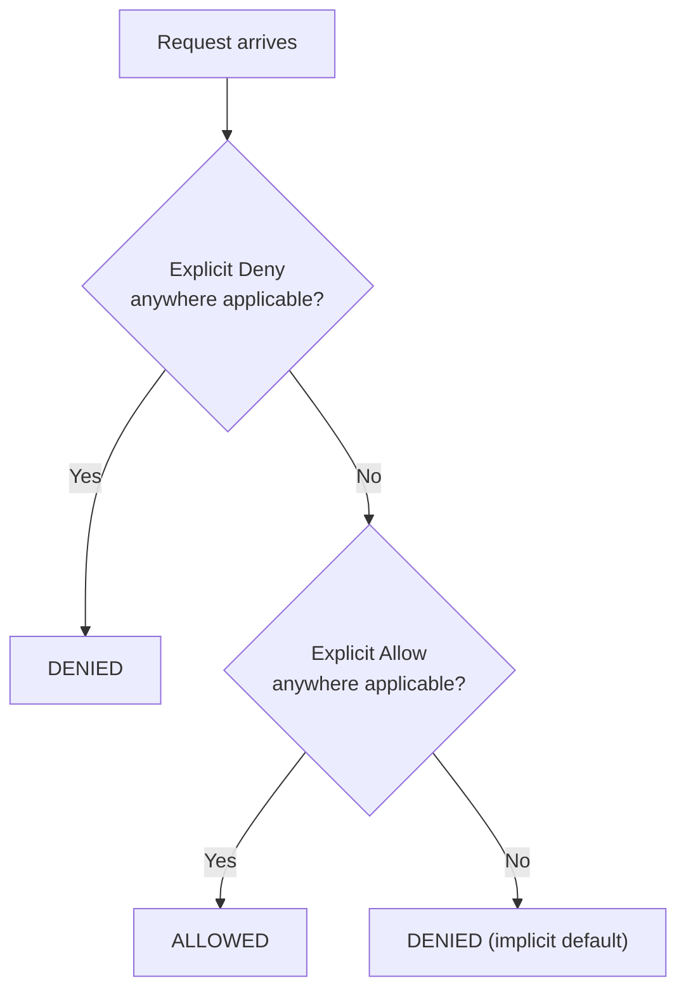

# 01 - AWS Identity and Access Management (IAM)

> Goal: understand what IAM actually controls, its core building blocks (users, groups, roles, policies), and the policy evaluation logic that decides "allow or deny" for every single AWS API call — the foundation every later note in this folder builds on.

---

## 1. What IAM is, and what it isn't

**AWS IAM** answers two questions for every single request made to AWS: **"who are you?"** (authentication) and **"what are you allowed to do?"** (authorization). It's a **global** service — IAM users, groups, roles, and policies aren't scoped to a Region, unlike almost everything else in AWS.

- IAM itself is **free** — you pay for the resources your IAM identities use, not for IAM.
- IAM is the **root** of security in AWS: every EC2 instance, every S3 bucket, every API call is gated by an IAM decision, even if that decision is "the root user can do anything."

> 🧠 **Mental model:** IAM is the bouncer and the guest list at the door of every AWS service, checked on every single request — not a one-time login gate. This is why enabling MFA or tightening a policy takes effect on the *next* API call, not just at "login."

---

## 2. The four core building blocks

| Entity | What it is | Analogy |
|---|---|---|
| **User** | A permanent identity for a person or an application, with long-term credentials (a password for console login, and/or access keys for programmatic access) | A named employee badge |
| **Group** | A named collection of users, used purely to attach policies to many users at once | A team distribution list — not itself a "who," just a way to manage many users together |
| **Role** | An identity **assumed temporarily** — by an AWS service, an application, a user in another account, or a federated external identity — that comes with short-lived credentials via AWS STS (Security Token Service) | A visitor badge, issued on check-in, that expires |
| **Policy** | A JSON document that actually defines permissions — attached to a user, group, or role to grant (or explicitly deny) specific actions on specific resources | The actual rules printed on/behind the badge |

> ⚠️ A **group is not a true identity** — it cannot be referenced as a "principal" in a resource-based policy, and it cannot be assumed like a role. It exists purely as a container to attach policies to multiple users at once.

---

## 3. Policies: what they're made of

A policy statement always answers: **Effect** (Allow/Deny) + **Action** (which API calls, e.g. `s3:GetObject`) + **Resource** (which specific ARNs, or `*` for all) + optionally **Condition** (e.g. only from a specific IP range, only with MFA present).

```json
{
  "Version": "2012-10-17",
  "Statement": [
    {
      "Effect": "Allow",
      "Action": ["ec2:StartInstances", "ec2:StopInstances"],
      "Resource": "*",
      "Condition": { "Bool": { "aws:MultiFactorAuthPresent": "true" } }
    }
  ]
}
```

Policies come in several flavors, each covered hands-on later in this folder: **AWS managed** (Note 02), **customer managed** (Note 03), and **inline** (Note 04) — the difference being *who maintains the policy document* and *how reusable it is*, not the JSON syntax itself.

---

## 4. Policy evaluation logic — the single most exam-tested IAM fact

Every request is evaluated against **every applicable policy** (identity-based, resource-based, permissions boundaries, SCPs, session policies — later notes cover which of these apply where), and the final decision follows this order:

1. **Default: implicit deny.** If nothing explicitly allows a request, it's denied.
2. **Any explicit `Allow`** in an applicable policy can flip that to allowed.
3. **Any explicit `Deny`**, anywhere in any applicable policy, **always wins** — no `Allow` anywhere else can override it.

> 🎯 **Exam tip:** "a user has an `Allow` on `s3:*` from one attached policy, but another attached policy has an explicit `Deny` on `s3:DeleteObject` — can they delete the object?" The answer is always **no** — explicit deny beats any allow, full stop, regardless of how many other policies grant broader access.



---

## 5. Authentication methods, at a glance

| Method | Used by |
|---|---|
| **Password** (+ optional MFA) | IAM users signing into the AWS Management Console |
| **Access keys** (access key ID + secret access key) | Programmatic access — AWS CLI, SDKs, direct API calls |
| **Temporary security credentials** (via STS) | Anything that assumes a **role** — EC2 instance profiles, federated users, cross-account access — always time-limited, never long-term |

> 🧠 The overwhelming theme across this entire folder: AWS consistently prefers **temporary, role-based credentials** over **long-term, hardcoded credentials** — this preference underlies almost every "best practice" note that follows (Notes 07, 12-14 especially).

---

## 6. Recap

- IAM is a free, global service that authenticates identities and authorizes their access to every AWS API call.
- Four building blocks: **Users** (permanent, human/app identities), **Groups** (policy-attachment containers, not true identities), **Roles** (temporary, assumable identities with STS credentials), **Policies** (the actual JSON permission documents).
- Evaluation logic: **implicit deny by default → explicit Allow can permit → explicit Deny always wins**, regardless of what else allows it.
- AWS consistently steers toward temporary role-based credentials over long-term access keys — a theme that recurs throughout this folder.
- Next: Note 02 — IAM Policies: AWS Managed Policies (Hands-On).

### Sources
- [What is IAM? — AWS docs](https://docs.aws.amazon.com/IAM/latest/UserGuide/introduction.html)
- [Policy evaluation logic — AWS docs](https://docs.aws.amazon.com/IAM/latest/UserGuide/reference_policies_evaluation-logic.html)
- [IAM identities (users, groups, roles) — AWS docs](https://docs.aws.amazon.com/IAM/latest/UserGuide/id.html)
- [Temporary security credentials — AWS docs](https://docs.aws.amazon.com/IAM/latest/UserGuide/id_credentials_temp.html)
