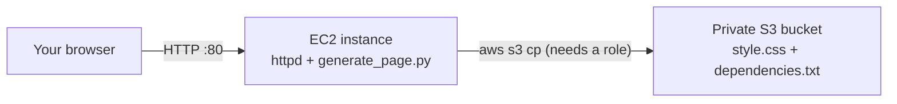

# 07 - IAM Entities: IAM Roles Practical With AWS Best Practices (Hands-On)

> Goal: create and attach an IAM role to an EC2 instance — the canonical "AWS service needs permissions" pattern — and understand exactly why this is always preferred over putting access keys on the instance itself.

---

## 1. What a role is, precisely

A **role** is an identity with **no long-term credentials of its own** — instead, whoever/whatever is allowed to assume it (defined by its **trust policy**) receives **temporary security credentials** from **AWS STS** (Security Token Service) for a limited session (by default up to 1 hour, configurable up to 12 hours for most role types).

A role has exactly **two** policy attachments, serving different purposes:

| Policy | Answers |
|---|---|
| **Trust policy** (a.k.a. assume-role policy) | *"Who is allowed to assume this role?"* |
| **Permissions policy** (one or more, same as a user's) | *"What can this role do, once assumed?"* |

> 🧠 **Mental model:** the trust policy is the guest list for who's allowed to pick up the visitor badge; the permissions policy is what the badge actually unlocks once someone's wearing it. Notes 02-04's policy types (managed/customer managed/inline) all describe the *permissions* side — every role also needs a trust policy on top of that, which users and groups simply don't have.

---

## 2. Why roles beat hardcoded access keys, for a service like EC2

If you instead put an IAM user's access keys directly onto an EC2 instance (in a config file, environment variable, or baked into an AMI):

- The credentials are **long-term** — they don't expire on their own, so a leak (e.g. an accidentally-public GitHub repo, a compromised instance) stays exploitable indefinitely until someone notices and manually revokes them.
- They must be **manually rotated**, and every instance using them needs to be updated in sync — operationally painful at any real fleet size.
- They have to be **distributed** to every instance somehow — itself a secret-management problem.

A role attached to the instance (as an **instance profile**) solves all three at once: EC2 automatically fetches and rotates short-lived credentials behind the scenes via the instance metadata service, no secret ever needs to be distributed or embedded, and a leaked credential expires on its own within the hour.

> ⚠️ **This is the single most consistently tested IAM best practice on SAA-C03**: whenever a scenario describes an AWS service (EC2, Lambda, ECS task, etc.) needing to call another AWS service, the correct answer is almost always "attach an IAM role" — never "create an IAM user and give it access keys."

---

## 3. What we're building

A small "devopswithdeepak" web page, served by **httpd** on EC2, generated by a **Python script**, that displays the instance's own ID and hostname and pulls its **CSS styling** and a **"core dependencies" file** from a **private S3 bucket** — reachable *only* if an IAM role is attached to the instance.



The lab is deliberately split into a **before** and **after**:

1. **Phase A** — launch the instance **without** any IAM role attached. The page loads, but unstyled, and the dependencies link is missing — direct, visual proof that the S3 fetch failed.
2. **Phase B** — attach the role afterward (no reboot, no redeploy) and re-run the same script. The page instantly gains its styling and working link — direct, visual proof the role (not a reboot, not a code change) is what fixed it.

This is the same "prove the boundary, then prove the fix" pattern used throughout `IAM_Practise_Handson_Answers.md`, applied to a real, visible web page instead of a CLI command.

---

## 4. Step 1 — Create the S3 bucket and the "core dependency" files

1. **S3 console** → **Create bucket** → name it something globally unique, e.g. `devopswithdeepak-webapp-assets-<yourname>` → leave **Block all public access** checked (default) — this bucket stays **private** the entire time; the role is the *only* way in.
2. **Create bucket**.
3. On your own machine, create a file named **`style.css`**:
   ```css
   body {
     font-family: 'Segoe UI', Arial, sans-serif;
     background: linear-gradient(135deg, #0f2027, #203a43, #2c5364);
     display: flex;
     justify-content: center;
     align-items: center;
     height: 100vh;
     margin: 0;
   }

   .card {
     background: #ffffff;
     border-radius: 12px;
     padding: 40px 60px;
     box-shadow: 0 10px 30px rgba(0, 0, 0, 0.3);
     text-align: center;
   }

   .card h1 {
     color: #ff6a00;
     margin-bottom: 10px;
   }

   .card p {
     color: #333;
     font-size: 15px;
   }

   .status.ok {
     color: green;
     font-weight: bold;
   }

   .status.fail {
     color: red;
     font-weight: bold;
   }

   a {
     display: inline-block;
     margin-top: 10px;
     color: #0f2027;
     text-decoration: none;
     font-weight: bold;
     border: 1px solid #0f2027;
     padding: 6px 14px;
     border-radius: 6px;
   }

   a:hover {
     background: #0f2027;
     color: #fff;
   }
   ```
4. Create a second file named **`dependencies.txt`**:
   ```
   Core Application Dependencies - devopswithdeepak
   =================================================
   Web Server        : httpd (Apache) 2.4+
   Runtime           : Python 3.9+
   AWS CLI           : v2 (bundled on Amazon Linux 2023)
   Access Model      : EC2 Instance Role (no static credentials)
   Fetched From      : Amazon S3 (private bucket, role-based s3:GetObject)
   ```
5. **S3 console** → your bucket → **Upload** → add both `style.css` and `dependencies.txt` → **Upload**.

---

## 5. Step 2 — Create the least-privilege IAM policy and role

1. **IAM console** → **Policies** → **Create policy** → **JSON** tab → paste (replace the bucket name with yours):
   ```json
   {
     "Version": "2012-10-17",
     "Statement": [
       {
         "Effect": "Allow",
         "Action": "s3:GetObject",
         "Resource": "arn:aws:s3:::devopswithdeepak-webapp-assets-<yourname>/*"
       },
       {
         "Effect": "Allow",
         "Action": "s3:ListBucket",
         "Resource": "arn:aws:s3:::devopswithdeepak-webapp-assets-<yourname>"
       }
     ]
   }
   ```
2. **Next** → name it `EC2-S3-WebApp-ReadOnly` → **Create policy**. This is scoped to **exactly this bucket** — the same least-privilege habit from Note 03, not `AmazonS3ReadOnlyAccess`'s account-wide read access.
3. **IAM console** → **Roles** → **Create role** → **Trusted entity type**: **AWS service** → **Use case**: **EC2** → **Next**.
4. **Add permissions**: attach **both**:
   - `EC2-S3-WebApp-ReadOnly` (the customer managed policy you just created — lets the app fetch its assets).
   - `AmazonSSMManagedInstanceCore` (an AWS managed policy — lets **Session Manager** connect to the instance later, with no SSH key needed, matching this repo's no-SSH convention).
5. **Role name**: `EC2-S3-WebApp-Role` → **Create role**.

> 🧠 A role commonly carries **more than one** permissions policy attached for different jobs — here, one for the app's own S3 access, one purely so you (the operator) can reach the instance via Session Manager. Neither policy knows about the other; they just both happen to be attached to the same role.

---

## 6. Step 3 — Launch the EC2 instance (no role yet) running httpd + the Python page generator

1. **EC2 console** → **Launch instance**.
2. **Name**: `devopswithdeepak-webserver`.
3. **AMI**: **Amazon Linux 2023** (free tier eligible).
4. **Instance type**: `t2.micro` or `t3.micro`.
5. **Key pair**: **Proceed without a key pair** — you'll connect via Session Manager, no SSH key required.
6. **Network settings**: check **Allow HTTP traffic from the internet** (opens port 80 in the auto-created security group) — SSH inbound isn't needed at all.
7. **Advanced details** → **IAM instance profile**: leave as **None** — this is Phase A, deliberately.
8. Still under **Advanced details**, scroll to **User data** and paste:
   ```bash
   #!/bin/bash
   dnf install -y httpd
   systemctl enable httpd
   systemctl start httpd

   mkdir -p /opt/app

   cat << 'PYEOF' > /opt/app/generate_page.py
   #!/usr/bin/env python3
   import urllib.request
   import subprocess

   BUCKET = "devopswithdeepak-webapp-assets-<yourname>"   # <-- change this to your bucket name
   REGION = "ap-south-1"                                   # <-- change this to your Region
   WEB_ROOT = "/var/www/html"


   def get_token():
       req = urllib.request.Request(
           "http://169.254.169.254/latest/api/token",
           method="PUT",
           headers={"X-aws-ec2-metadata-token-ttl-seconds": "21600"},
       )
       return urllib.request.urlopen(req).read().decode()


   def get_meta(path, token):
       req = urllib.request.Request(
           "http://169.254.169.254/latest/meta-data/" + path,
           headers={"X-aws-ec2-metadata-token": token},
       )
       return urllib.request.urlopen(req).read().decode()


   token = get_token()
   instance_id = get_meta("instance-id", token)
   hostname = subprocess.run(["hostname"], capture_output=True, text=True).stdout.strip()

   css_ok = subprocess.run(
       ["aws", "s3", "cp", f"s3://{BUCKET}/style.css", f"{WEB_ROOT}/style.css", "--region", REGION]
   ).returncode == 0

   deps_ok = subprocess.run(
       ["aws", "s3", "cp", f"s3://{BUCKET}/dependencies.txt", f"{WEB_ROOT}/dependencies.txt", "--region", REGION]
   ).returncode == 0

   css_link = '<link rel="stylesheet" href="style.css">' if css_ok else ""

   if css_ok:
       status_msg = '<p class="status ok">[OK] Core dependencies loaded from S3 via IAM Role</p>'
   else:
       status_msg = '<p class="status fail">[MISSING] Could not fetch dependencies from S3 -- no IAM role attached yet</p>'

   if deps_ok:
       deps_link = '<a href="dependencies.txt">View Core Dependencies</a>'
   else:
       deps_link = '<span>Core Dependencies file unavailable</span>'

   html = f"""<!DOCTYPE html>
   <html>
   <head>
   <title>devopswithdeepak</title>
   {css_link}
   </head>
   <body>
   <div class="card">
   <h1>devopswithdeepak</h1>
   <p><strong>EC2 Instance ID:</strong> {instance_id}</p>
   <p><strong>Hostname:</strong> {hostname}</p>
   {status_msg}
   <p>{deps_link}</p>
   </div>
   </body>
   </html>
   """

   with open(f"{WEB_ROOT}/index.html", "w") as f:
       f.write(html)

   subprocess.run(["chown", "apache:apache", f"{WEB_ROOT}/index.html"])
   PYEOF

   chmod +x /opt/app/generate_page.py
   python3 /opt/app/generate_page.py
   ```
9. **Launch instance**.

> ⚠️ Edit the `BUCKET` (and `REGION`, if different) placeholder inside the script **before** pasting it into User data — the script can't know your bucket name on its own.

---

## 7. Step 4 — Confirm the "before" state

1. Wait for the instance to reach **Running** with status checks passed (roughly 1-2 minutes), then copy its **Public IPv4 address** from the instance details.
2. Open `http://<public-ip>/` in your browser.
3. You should see the page **render**, but **unstyled** (plain black text, no card, no gradient background) — Apache served `index.html` fine, but `style.css` was never downloaded, because `aws s3 cp` had **no credentials at all** to use (no role attached, no access keys configured).
4. The page's status line should read **`[MISSING] Could not fetch dependencies from S3 -- no IAM role attached yet`**, and the dependencies link should be missing.

> 🎯 This is the exact failure mode Note 02's `AccessDenied` exercises describe, just made visible in a browser instead of a CLI error message — **no identity, no credentials, no access**, regardless of how "close" the code is to the data it needs.

---

## 8. Step 5 — Attach the role, and confirm the "after" state

1. **EC2 console** → select `devopswithdeepak-webserver` → **Actions** → **Security** → **Modify IAM role** → choose `EC2-S3-WebApp-Role` → **Update IAM role**.
2. Wait about **1-2 minutes** — both for the instance metadata service to reflect the new role, and for the SSM Agent (already running on the Amazon Linux 2023 AMI) to register the instance with Session Manager now that `AmazonSSMManagedInstanceCore` is attached.
3. **EC2 console** → select the instance → **Connect** → **Session Manager** tab → **Connect**. You should land in a shell — **no SSH key, no security group port 22, no password**, purely because the role now grants the SSM permissions needed.
4. Confirm the identity is the role, not a user:
   ```bash
   aws sts get-caller-identity
   ```
   The `Arn` in the output shows an **assumed role** (`arn:aws:sts::<account-id>:assumed-role/EC2-S3-WebApp-Role/...`), not an IAM user.
5. Re-run the same generator script — no reboot, no redeploy, just:
   ```bash
   sudo python3 /opt/app/generate_page.py
   ```
6. Refresh `http://<public-ip>/` in your browser: the page now shows the **styled card**, the **`[OK] Core dependencies loaded from S3 via IAM Role`** status line, and a working **View Core Dependencies** link that opens the fetched `dependencies.txt`.

> 🧠 Nothing about the *instance* changed between Phase A and Phase B — same code, same running httpd process, no reboot. The **only** thing that changed was which IAM role was attached — which is exactly the point: permissions live at the identity/role layer, completely decoupled from the application code itself.

---

## 9. Inspect the trust policy AWS generated

**Roles** → `EC2-S3-WebApp-Role` → **Trust relationships** tab:

```json
{
  "Version": "2012-10-17",
  "Statement": [
    {
      "Effect": "Allow",
      "Principal": { "Service": "ec2.amazonaws.com" },
      "Action": "sts:AssumeRole"
    }
  ]
}
```

The `Principal` here is the **EC2 service itself**, not a person or account — this is what makes the role "an EC2 role" rather than a role for a human or another account (those patterns come in Notes 08-11).

---

## 10. Least privilege still applies to roles

This role already demonstrates the habit, rather than just describing it: `EC2-S3-WebApp-ReadOnly` grants `s3:GetObject`/`s3:ListBucket` on **one specific bucket** — not `AmazonS3ReadOnlyAccess`'s account-wide read access to every bucket you own. If this app only ever needs `style.css` and `dependencies.txt`, the policy could be scoped even tighter, to those two exact object keys, instead of the whole bucket's `/*`.

> 🎯 **Exam tip:** "the instance only needs to read two specific files" is a signal to scope `Resource` down to those exact object ARNs — not to reach for `AmazonS3ReadOnlyAccess` out of convenience.

---

## 11. Recap

- A role has **no long-term credentials** — only a **trust policy** (who can assume it) and **permissions policies** (what it can do once assumed), with temporary STS credentials issued on assumption.
- This hands-on made that concrete: the **same instance, same code, same running process** went from a broken S3 fetch to a working one purely by attaching a role — no access key was ever created, distributed, or leaked.
- A role can carry **multiple permissions policies** for unrelated jobs at once (here: app-level S3 access, and operator-level Session Manager access) — each attached independently.
- This "use a role, not hardcoded keys" principle is the most heavily tested IAM best practice on the exam.
- Next: Note 08 — IAM Roles: AWS Account Assume Role (Hands-On), where a *human user* (not a service) assumes a role within the same account.

### Sources
- [IAM roles — AWS docs](https://docs.aws.amazon.com/IAM/latest/UserGuide/id_roles.html)
- [IAM roles for Amazon EC2 — AWS docs](https://docs.aws.amazon.com/AWSEC2/latest/UserGuide/iam-roles-for-amazon-ec2.html)
- [Temporary security credentials — AWS docs](https://docs.aws.amazon.com/IAM/latest/UserGuide/id_credentials_temp.html)
- [Instance metadata and user data — AWS docs](https://docs.aws.amazon.com/AWSEC2/latest/UserGuide/ec2-instance-metadata.html)
- [Setting up Session Manager — AWS docs](https://docs.aws.amazon.com/systems-manager/latest/userguide/session-manager-getting-started.html)
