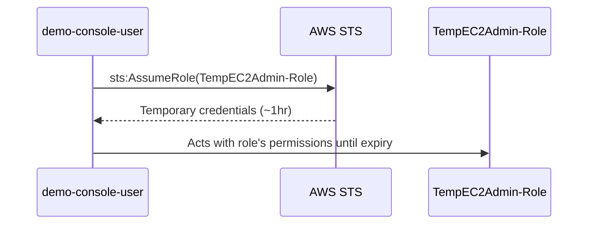

# 08 - IAM Entities: IAM Roles — AWS Account Assume Role (Hands-On)

> Goal: have a real **IAM user** (not an AWS service, like Note 07) temporarily assume a role within the **same** AWS account — the standard pattern for granting temporary, elevated, or job-specific access without permanently attaching those permissions to the user.

---

## 1. Why a user would assume a role in their own account

A user's normal, everyday permissions might be deliberately narrow (least privilege) — but some tasks need broader or different access **occasionally**, not all the time. Instead of permanently widening that user's policies (which would leave the extra access sitting there unused and risky whenever it's not needed), the user **assumes a role** for the duration of the task, gets temporary elevated credentials, does the work, and the extra access automatically expires when the session ends.

> 🧠 **Mental model:** this is the "break glass" pattern — like a supervisor's key that unlocks a restricted area, checked out for a shift and handed back, rather than every employee carrying a master key on their everyday badge all the time.

---

## 2. Create a role that trusts users in the same account

1. **IAM console** → **Roles** → **Create role**.
2. **Trusted entity type**: **AWS account** → **This account** (the account ID is pre-filled automatically).
3. **Add permissions**: attach `AmazonEC2FullAccess` (deliberately broader than a normal day-to-day read-only user would have).
4. **Role name**: `TempEC2Admin-Role` → **Create role**.

The generated trust policy looks like:

```json
{
  "Version": "2012-10-17",
  "Statement": [
    {
      "Effect": "Allow",
      "Principal": { "AWS": "arn:aws:iam::111122223333:root" },
      "Action": "sts:AssumeRole"
    }
  ]
}
```

> ⚠️ The `Principal` here is the **account root** (`:root` in the ARN) — this means trust is extended to the *whole account*, but that alone is **not** enough for any individual user to actually assume the role. Every user must **also** have their own permissions policy explicitly allowing `sts:AssumeRole` on this specific role's ARN — trusting the account is necessary, but each user's own permissions are the second half of the gate.

---

## 3. Grant a specific user permission to assume the role

1. On `demo-console-user` (from Note 05), add this inline policy (Note 04's pattern — this is a good, narrow, single-purpose fit for inline):
   ```json
   {
     "Version": "2012-10-17",
     "Statement": [
       {
         "Effect": "Allow",
         "Action": "sts:AssumeRole",
         "Resource": "arn:aws:iam::111122223333:role/TempEC2Admin-Role"
       }
     ]
   }
   ```
   (Replace the account ID with your real one.)

---

## 4. Assume the role and confirm elevated, temporary access

1. Sign in to the console as `demo-console-user`.
2. Top-right account menu → **Switch role** (or use `aws sts assume-role` via CLI for programmatic access).
3. Enter the **account ID** and **role name** (`TempEC2Admin-Role`) → **Switch Role**.
4. The console banner now shows you're operating **as** `TempEC2Admin-Role`, with `AmazonEC2FullAccess` in effect — far more than `demo-console-user`'s own normal permissions.
5. **Switch back** at any time to return to the underlying user's own, narrower permissions — or simply let the session credentials expire.

---

## 5. What's actually happening under the hood

Assuming a role calls `sts:AssumeRole` behind the scenes, which returns a **temporary access key ID, secret access key, and session token** — valid for a limited duration (default 1 hour, configurable up to the role's **maximum session duration**, up to 12 hours). Once expired, the user is back to whatever their own underlying identity's permissions actually are.



---

## 6. Recap

- Same-account role assumption lets a user **temporarily** gain a different (often broader, or just differently-scoped) permission set without that access being permanently attached to their identity.
- Two things must both be true for assumption to succeed: the role's **trust policy** must trust the account, **and** the specific user must have their own `sts:AssumeRole` permission on that role's ARN.
- Assumed-role sessions are always temporary (STS-issued, capped by the role's max session duration) — the access automatically disappears when the session ends.
- Next: Note 09 — IAM Roles: Assume Role Cross Account Access (Hands-On), the same mechanism extended across two separate AWS accounts.

### Sources
- [IAM roles — AWS docs](https://docs.aws.amazon.com/IAM/latest/UserGuide/id_roles.html)
- [Creating a role to delegate permissions to an IAM user — AWS docs](https://docs.aws.amazon.com/IAM/latest/UserGuide/id_roles_create_for-user.html)
- [Switching to an IAM role (console) — AWS docs](https://docs.aws.amazon.com/IAM/latest/UserGuide/id_roles_use_switch-role-console.html)
- [AssumeRole — AWS STS API reference](https://docs.aws.amazon.com/STS/latest/APIReference/API_AssumeRole.html)
