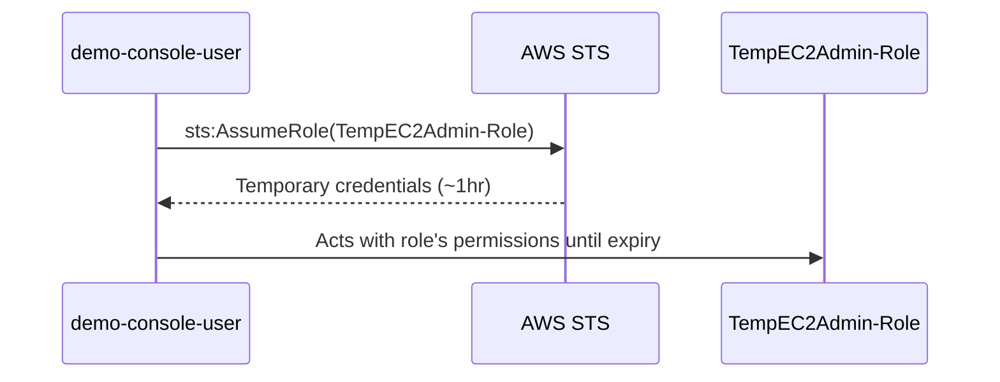

# 08 - IAM Entities: IAM Roles — AWS Account Assume Role (Hands-On)

> Goal: have a real **IAM user** (not an AWS service, like Note 07) temporarily assume a role within the **same** AWS account — the standard pattern for granting temporary, elevated, or job-specific access without permanently attaching those permissions to the user.

---

## 1. Why a user would assume a role in their own account

A user's normal, everyday permissions might be deliberately narrow (least privilege) — but some tasks need broader or different access **occasionally**, not all the time. Instead of permanently widening that user's policies (which would leave the extra access sitting there unused and risky whenever it's not needed), the user **assumes a role** for the duration of the task, gets temporary elevated credentials, does the work, and the extra access automatically expires when the session ends.

> 🧠 **Mental model:** this is the "break glass" pattern — like a supervisor's key that unlocks a restricted area, checked out for a shift and handed back, rather than every employee carrying a master key on their everyday badge all the time.

---

## 2. Create a role that trusts users in the same account

1. **IAM console** → **Roles** → **Create role**.
2. **Trusted entity type**: **AWS account** → **This account** (the account ID is pre-filled automatically).
3. **Add permissions**: attach `AmazonEC2FullAccess` (deliberately broader than a normal day-to-day read-only user would have).
4. **Role name**: `TempEC2Admin-Role` → **Create role**.

The generated trust policy looks like:

```json
{
  "Version": "2012-10-17",
  "Statement": [
    {
      "Effect": "Allow",
      "Principal": { "AWS": "arn:aws:iam::111122223333:root" },
      "Action": "sts:AssumeRole"
    }
  ]
}
```

> ⚠️ The `Principal` here is the **account root** (`:root` in the ARN) — this means trust is extended to the *whole account*, but that alone is **not** enough for any individual user to actually assume the role. Every user must **also** have their own permissions policy explicitly allowing `sts:AssumeRole` on this specific role's ARN — trusting the account is necessary, but each user's own permissions are the second half of the gate.

---

## 3. Grant a specific user permission to assume the role

1. On `demo-console-user` (from Note 05), add this inline policy (Note 04's pattern — this is a good, narrow, single-purpose fit for inline):
   ```json
   {
     "Version": "2012-10-17",
     "Statement": [
       {
         "Effect": "Allow",
         "Action": "sts:AssumeRole",
         "Resource": "arn:aws:iam::111122223333:role/TempEC2Admin-Role"
       }
     ]
   }
   ```
   (Replace the account ID with your real one.)

---

## 4. Assume the role and confirm elevated, temporary access

1. Sign in to the console as `demo-console-user`.
2. Top-right account menu → **Switch role** (or use `aws sts assume-role` via CLI for programmatic access).
3. Enter the **account ID** and **role name** (`TempEC2Admin-Role`) → **Switch Role**.
4. The console banner now shows you're operating **as** `TempEC2Admin-Role`, with `AmazonEC2FullAccess` in effect — far more than `demo-console-user`'s own normal permissions.
5. **Switch back** at any time to return to the underlying user's own, narrower permissions — or simply let the session credentials expire.

---

## 5. What's actually happening under the hood

Assuming a role calls `sts:AssumeRole` behind the scenes, which returns a **temporary access key ID, secret access key, and session token** — valid for a limited duration (default 1 hour, configurable up to the role's **maximum session duration**, up to 12 hours). Once expired, the user is back to whatever their own underlying identity's permissions actually are.


```mermaid
sequenceDiagram
    participant U as demo-console-user
    participant STS as AWS STS
    participant Role as TempEC2Admin-Role
    U->>STS: sts:AssumeRole(TempEC2Admin-Role)
    STS-->>U: Temporary credentials (~1hr)
    U->>Role: Acts with role's permissions until expiry
```

---
This is one of the most common enterprise IAM patterns. Let's implement it from scratch exactly as a company would.

---

# Scenario

**Developer (Deepak)**

Daily work:

* View EC2
* View S3
* View CloudWatch

Monthly work:

* Deploy infrastructure
* Modify IAM
* Delete resources

Instead of giving permanent admin access, we'll implement:

```text
                    AWS Account
+-----------------------------------------------------------+

      IAM User (Deepak)
              │
              │ Permanent Credentials
              ▼
      ReadOnly Permissions
              │
              │ sts:AssumeRole
              ▼
      Admin Role (1-hour temporary credentials)
              │
              ▼
        Full AWS Access

+-----------------------------------------------------------+
```

---

# Step 1: Create IAM User

IAM → Users

Create user

```
deepak
```

Do **NOT** attach AdministratorAccess.

---

# Step 2: Give Daily Permissions

Attach

```
ReadOnlyAccess
```

or a custom policy like

```json
{
  "Version":"2012-10-17",
  "Statement":[
    {
      "Effect":"Allow",
      "Action":[
        "ec2:Describe*",
        "s3:Get*",
        "cloudwatch:Get*",
        "cloudwatch:List*"
      ],
      "Resource":"*"
    }
  ]
}
```

Now Deepak can

✅ View EC2

✅ View S3

❌ Cannot delete

❌ Cannot create

---

# Step 3: Create Admin Role

IAM

Roles

Create Role

Choose

```
AWS Account
```

Current Account

Exactly like your screenshot.

---

# Step 4: Trust Policy

AWS creates something similar to

```json
{
    "Version":"2012-10-17",
    "Statement":[
        {
            "Effect":"Allow",
            "Principal":{
                "AWS":"arn:aws:iam::<ACCOUNT_ID>:root"
            },
            "Action":"sts:AssumeRole"
        }
    ]
}
```

Better practice is to trust only the specific IAM user (or a group/role), not the whole account:

```json
{
  "Version":"2012-10-17",
  "Statement":[
    {
      "Effect":"Allow",
      "Principal":{
        "AWS":"arn:aws:iam::<ACCOUNT_ID>:user/deepak"
      },
      "Action":"sts:AssumeRole"
    }
  ]
}
```

Even better in production is to trust a developer role rather than an individual user.

---

# Step 5: Attach Administrator Policy

Attach

```
AdministratorAccess
```

Now the role looks like

```text
AdminRole

Trust Policy
----------------
Deepak can assume me

Permission Policy
----------------
AdministratorAccess
```

---

# Step 6: Allow Deepak to Assume the Role

This is the step many people forget.

Deepak still cannot assume the role.

Why?

Because his IAM user needs permission to call

```
sts:AssumeRole
```

Attach this policy to the IAM user:

```json
{
    "Version":"2012-10-17",
    "Statement":[
        {
            "Effect":"Allow",
            "Action":"sts:AssumeRole",
            "Resource":"arn:aws:iam::<ACCOUNT_ID>:role/AdminRole"
        }
    ]
}
```

Now we have both sides configured:

```
User -------------can call------------> AssumeRole

Role -------------trusts--------------> User
```

Both are required.

---

# Step 7: Login Normally

Deepak logs into AWS Console.

He sees

```
EC2
S3
CloudWatch
```

Only ReadOnly access.

Trying

```
Delete EC2
```

fails.

---

# Step 8: Need Admin Access

Click

```
Account Name
↓

Switch Role
```

Enter

```
Account ID

339712902352

Role Name

AdminRole
```

Click

```
Switch Role
```

AWS performs

```text
STS AssumeRole
```

---

# What Happens Internally?

```
Deepak Logs In

        │
        ▼

Long-Term Credentials

        │
        │ STS AssumeRole
        ▼

AWS STS

        │

Creates

Temporary Credentials

Access Key

Secret Key

Session Token

Expires in 1 hour

        │

        ▼

Admin Role
```

Deepak is now Admin.

---

# Step 9: Verify

Now he can

```
Delete EC2

Create IAM

Modify VPC

Delete S3

Everything
```

because the active identity is now

```
AdminRole
```

not the IAM user.

---

# Step 10: Session Expires

After 1 hour

AWS deletes the temporary credentials.

Deepak automatically goes back to

```
ReadOnly User
```

No administrator access remains.

---

# CLI Version

Login as the IAM user

```bash
aws configure
```

Then

```bash
aws sts assume-role \
--role-arn arn:aws:iam::339712902352:role/AdminRole \
--role-session-name DeepakAdmin
```

AWS returns

```json
{
  "Credentials": {
    "AccessKeyId": "...",
    "SecretAccessKey": "...",
    "SessionToken": "...",
    "Expiration": "2026-07-26T12:30:00Z"
  }
}
```

Use those temporary credentials:

```bash
export AWS_ACCESS_KEY_ID=...
export AWS_SECRET_ACCESS_KEY=...
export AWS_SESSION_TOKEN=...
```

Now every AWS CLI command runs as **AdminRole**.

Verify with:

```bash
aws sts get-caller-identity
```

Before assuming:

```
arn:aws:iam::339712902352:user/deepak
```

After assuming:

```
arn:aws:sts::339712902352:assumed-role/AdminRole/DeepakAdmin
```

Notice the identity changes from an IAM user to an assumed role.

---

# End-to-End Permission Flow

```text
                +----------------------------------+
                |          IAM User                |
                |            Deepak                |
                |----------------------------------|
                | ReadOnlyAccess                   |
                | sts:AssumeRole(AdminRole)        |
                +---------------+------------------+
                                |
                                | 1. Calls STS AssumeRole
                                |
                                ▼
                    +-----------------------------+
                    |        AWS STS              |
                    |-----------------------------|
                    | Validates:                  |
                    | ✓ User has sts:AssumeRole   |
                    | ✓ Role trusts the user      |
                    +---------------+-------------+
                                    |
                                    | 2. Issues temporary credentials
                                    ▼
                    +-----------------------------+
                    |         AdminRole           |
                    |-----------------------------|
                    | AdministratorAccess         |
                    +---------------+-------------+
                                    |
                                    ▼
                             All AWS Resources
```

This pattern—**a low-privilege identity that temporarily assumes a high-privilege role via AWS STS**—is the standard approach used in enterprises because it enforces least privilege, provides temporary credentials, and improves auditability through CloudTrail.

---

## 6. Recap

- Same-account role assumption lets a user **temporarily** gain a different (often broader, or just differently-scoped) permission set without that access being permanently attached to their identity.
- Two things must both be true for assumption to succeed: the role's **trust policy** must trust the account, **and** the specific user must have their own `sts:AssumeRole` permission on that role's ARN.
- Assumed-role sessions are always temporary (STS-issued, capped by the role's max session duration) — the access automatically disappears when the session ends.
- Next: Note 09 — IAM Roles: Assume Role Cross Account Access (Hands-On), the same mechanism extended across two separate AWS accounts.

### Sources
- [IAM roles — AWS docs](https://docs.aws.amazon.com/IAM/latest/UserGuide/id_roles.html)
- [Creating a role to delegate permissions to an IAM user — AWS docs](https://docs.aws.amazon.com/IAM/latest/UserGuide/id_roles_create_for-user.html)
- [Switching to an IAM role (console) — AWS docs](https://docs.aws.amazon.com/IAM/latest/UserGuide/id_roles_use_switch-role-console.html)
- [AssumeRole — AWS STS API reference](https://docs.aws.amazon.com/STS/latest/APIReference/API_AssumeRole.html)
