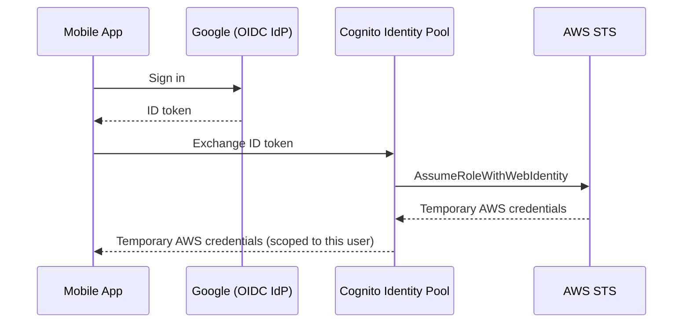

# 10 - IAM Entities: IAM Roles — Web Identity / SAML 2.0 Federation (Hands-On)

> Goal: cover the two flavors of **federated** role assumption — Web Identity Federation (for consumer app end-users) and SAML 2.0 Federation (for enterprise corporate identities) — where the identity being trusted was never an IAM user at all.

---

## 1. Federation, in one sentence

**Federation** lets an identity that lives **outside IAM entirely** — a mobile app user logged in with Google, or an employee already signed into a corporate Active Directory — assume an IAM role and get temporary AWS credentials, **without AWS ever creating (or needing to create) an IAM user for that person**.

> 🧠 **Mental model:** Notes 08-09 both still involve an actual IAM identity (a user or role) doing the assuming. Federation is different — the "who" on the other side of the trust is an **external identity provider (IdP)** vouching for someone, and IAM just has to decide whether to trust that IdP's word for it.

---

## 2. Web Identity Federation — for public, consumer-facing apps

**Use case:** a mobile or web app lets users sign in with **Google, Facebook, Amazon, Apple**, or any **OIDC-compatible** provider, and the app then needs those users to access specific AWS resources (e.g. their own private folder in an S3 bucket) directly — without embedding any AWS credentials in the app itself.

- **AWS recommends using Amazon Cognito** as the broker in front of this flow rather than talking to `sts:AssumeRoleWithWebIdentity` directly — Cognito handles token validation, user pools, and issuing scoped, temporary AWS credentials to the app.
- High-level flow:
  1. User signs into the app via Google (or another OIDC provider) → app receives a Google-issued ID token.
  2. App exchanges that token with **Cognito Identity Pools**, which validates it against the configured IdP.
  3. Cognito calls STS on the app's behalf (`AssumeRoleWithWebIdentity`) and returns temporary AWS credentials scoped to a role you configured.
  4. The app uses those credentials directly against AWS services (e.g. S3), often restricted via policy variables like `${cognito-identity.amazonaws.com:sub}` so each user can only reach their **own** slice of a shared resource.

> 🎯 **Exam tip:** "mobile app, users sign in with a social identity provider (Google/Facebook/Amazon), app needs direct, scoped access to AWS resources per user" is the signature Web Identity Federation scenario — and the AWS-recommended answer specifically routes through **Cognito**, not a hand-rolled OIDC integration.

---

## 3. SAML 2.0 Federation — for enterprise, corporate identities

**Use case:** employees already authenticate against a corporate directory (e.g. **Microsoft Active Directory** via **AD FS**, Okta, or another **SAML 2.0**-compliant IdP) and need **console or programmatic access to AWS** without AWS ever provisioning a separate IAM user per employee.

1. **IAM console** → **Identity providers** → **Add provider** → **SAML** → upload the corporate IdP's metadata XML document (this is how IAM learns to trust and validate SAML assertions from that specific IdP).
2. **Roles** → **Create role** → **Trusted entity type**: **SAML 2.0 federation** → select the identity provider just added → choose **Allow programmatic and AWS Management Console access**.
3. Attach the desired permissions policy (e.g. `ReadOnlyAccess`) → name the role (e.g. `Corporate-SSO-ReadOnly-Role`) → **Create role**.
4. The corporate IdP is configured (on its own side, outside AWS) to issue a **SAML assertion** naming this role's ARN — when an employee signs into the corporate portal, they're redirected straight into the AWS Console, already assuming the role, with **no separate AWS password to manage at all**.

> ⚠️ **SAML federation flows in the opposite direction from a normal console sign-in**: the user starts at the **corporate IdP's** portal, not at the AWS sign-in page — AWS refers to this as **IdP-initiated** SSO. This is exactly the mechanism behind "single sign-on to AWS" in most enterprises, and is also the foundation **AWS IAM Identity Center** (Notes 22-23) builds on and simplifies further.

---

## 4. Web Identity vs. SAML 2.0 — quick comparison

| | Web Identity Federation | SAML 2.0 Federation |
|---|---|---|
| Typical identity | Consumer end-user (Google/Facebook/Amazon/OIDC login) | Corporate employee (Active Directory, Okta, etc.) |
| AWS-recommended broker | Amazon Cognito | Direct SAML trust (or AWS IAM Identity Center, Note 22) |
| Typical access granted | Narrow, per-user, direct API/resource access (e.g. their own S3 objects) | Broader console/CLI access matching a job role |
| STS API call under the hood | `AssumeRoleWithWebIdentity` | `AssumeRoleWithSAML` |

---

## 5. Recap

- **Federation** lets identities that were never IAM users assume a role and get temporary AWS credentials, based on an external identity provider vouching for them.
- **Web Identity Federation** (via Cognito) fits consumer apps with social/OIDC sign-in, typically granting narrow, per-user resource access.
- **SAML 2.0 Federation** fits enterprise workforces with an existing corporate directory, typically granting broader console/CLI access with IdP-initiated single sign-on.
- Next: Note 11 — IAM Roles Custom Trust Policy (Hands-On), editing a role's trust policy JSON directly instead of relying on the console's guided wizards used in Notes 07-10.

### Sources
- [Identity providers and federation — AWS docs](https://docs.aws.amazon.com/IAM/latest/UserGuide/id_roles_providers.html)
- [About web identity federation — AWS docs](https://docs.aws.amazon.com/IAM/latest/UserGuide/id_roles_providers_oidc.html)
- [Creating a role for SAML 2.0 federation — AWS docs](https://docs.aws.amazon.com/IAM/latest/UserGuide/id_roles_create_for-idp_saml.html)
- [Amazon Cognito identity pools — AWS docs](https://docs.aws.amazon.com/cognito/latest/developerguide/identity-pools.html)
