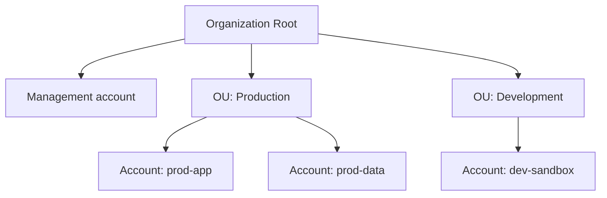

# 18 - AWS Organization, Part 1

> Goal: move from single-account identity governance (Notes 01-17) to managing **many** AWS accounts as one structured whole — the management account, member accounts, organizational units, and the two feature-set modes an organization can run in.

---

## 1. Why multiple accounts, instead of one big account

Real companies rarely run everything in a single AWS account — separate accounts per team, environment (dev/staging/prod), or business unit give **hard isolation boundaries** that no amount of IAM policy inside one account can fully replicate: a mistake, breach, or runaway cost in one account can't directly touch resources in another, and billing/permissions boundaries are naturally account-shaped. **AWS Organizations** exists to manage that multi-account reality centrally, instead of treating each account as a totally separate, disconnected relationship with AWS.

> 🧠 **Mental model:** if a single AWS account is one locked office, an Organization is the building that contains many offices, with one building manager (the **management account**) who can set building-wide rules, see the combined electricity bill, and grant/restrict what happens in each office — without needing a key to every individual office's internal filing cabinets.

---

## 2. Core structure

| Term | What it is |
|---|---|
| **Management account** (formerly called "master account") | The account that creates the Organization; the only account that can create/invite member accounts, and the account billed for everything under consolidated billing (Note 19) |
| **Member account** | Any other account that's part of the Organization |
| **Organizational Unit (OU)** | A folder-like grouping of accounts (and/or nested OUs) — used to apply policies (like SCPs, Notes 20-21) to a whole group of accounts at once instead of one at a time |
| **Root** (of the Organization) | The topmost container — every OU and every account lives underneath it |

> ⚠️ Don't confuse an OU with an IAM group (Note 06) — a group organizes **users within one account**; an OU organizes **whole accounts within an Organization**. Different layer entirely.

---

## 3. Adding accounts to an Organization

- **Invite an existing account** — the Organization sends an invitation; the existing account's owner must accept it before it joins.
- **Create a new account directly** from within the Organization — the management account provisions a brand-new AWS account programmatically, already a member from the moment it's created, with no separate accept step.

---

## 4. Two feature-set modes

| Mode | What it includes |
|---|---|
| **Consolidated billing only** | Just combines billing across accounts (Note 19) — no centralized policy control (no SCPs) |
| **All features** | Consolidated billing **plus** centralized governance: SCPs (Notes 20-21), centralized root access management (Note 14), delegated administration of other AWS services, and more |

An Organization can be **upgraded** from consolidated-billing-only to all-features, but member accounts must approve the switch (since it introduces new centralized controls, like SCPs, that can restrict what they can do) — it isn't purely a management-account-side flip.

> 🎯 **Exam tip:** "we only want combined billing across our accounts, nothing else" points to **consolidated billing only** mode; "we also want to enforce guardrails like blocking a whole region or preventing account closure across every dev account" requires **all features** mode, since that's what unlocks SCPs.

---

## 5. What Organizations does NOT do

- It doesn't replace IAM within each account — users, roles, and policies inside a member account still work exactly as covered in Notes 01-17. Organizations adds a layer **above** individual-account IAM, it doesn't replace it.
- Member accounts remain fully separate for resource isolation and (mostly) for their own root user's account-specific actions (Note 14's centralized root access management is the specific exception carved out for all-features mode).

---

## 6. Recap

- **AWS Organizations** centrally manages multiple AWS accounts: one **management account**, any number of **member accounts**, organized into **OUs** for group-level policy application.
- Accounts join either by **invitation** (existing account) or **direct creation** (brand-new account, no accept step needed).
- Two modes: **consolidated billing only** (billing consolidation alone) vs. **all features** (adds SCPs, centralized root management, delegated administration).
- Next: Note 19 — AWS Organization, Part 2 Practical: Consolidated Billing, the hands-on walkthrough of the billing side of this structure.

### Sources
- [What is AWS Organizations? — AWS docs](https://docs.aws.amazon.com/organizations/latest/userguide/orgs_introduction.html)
- [Organizational units (OUs) — AWS docs](https://docs.aws.amazon.com/organizations/latest/userguide/orgs_manage_ous.html)
- [Enabling all features in your organization — AWS docs](https://docs.aws.amazon.com/organizations/latest/userguide/orgs_manage_org_support-all-features.html)
