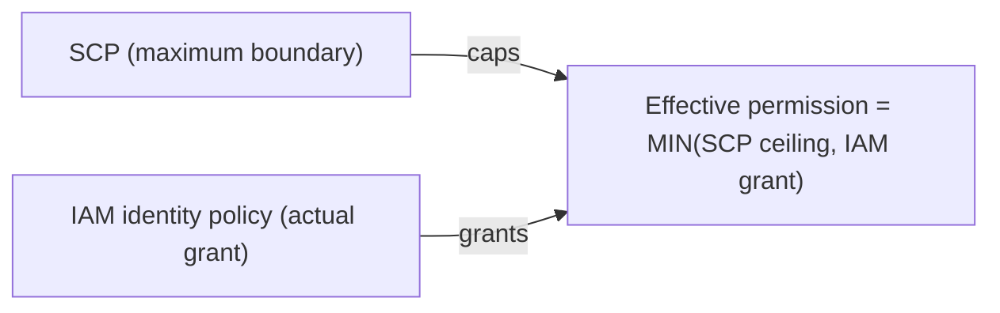

# 20 - AWS Organization: Service Control Policies (SCP)

> Goal: understand **Service Control Policies (SCPs)** — the centralized guardrail mechanism that requires Organizations' "all features" mode (Note 18) — and the single most important, most exam-tested fact about them: **SCPs are a maximum boundary, never a grant of permission.**

---

## 1. The single fact that governs everything about SCPs

**An SCP alone never grants anyone the ability to do anything.** It only ever **restricts** the maximum possible permissions available to accounts underneath it in the Organization. Even with the most permissive SCP imaginable (`Allow: *` on `Resource: *`), a user or role in that account **still needs their own IAM identity-based policy** (Notes 02-04) actually granting the action — the SCP just sets the ceiling; IAM policies inside the account are what actually grant anything.

> 🧠 **Mental model:** an SCP is the maximum speed limit sign on a stretch of road — it can only ever cap how fast you're *allowed* to go, never make the car actually move. IAM policies are the accelerator pedal — without pressing it (an Allow in an identity-based policy), the speed limit sign alone does nothing.

---

## 2. Where SCPs apply — and the one big exception

- SCPs are attached to the **Organization root**, an **OU**, or an **individual member account** — and they **inherit down** the hierarchy (an SCP on a parent OU applies to every account and nested OU beneath it).
- ⚠️ **SCPs do not apply to the management account** — this is a frequently tested, easy-to-forget exception. The management account is never restricted by any SCP in the Organization, regardless of where it's attached in the hierarchy. This is exactly why Note 14 called out that the management account's root user remains the single most sensitive credential in an entire Organization — no SCP can rein it in.

---

## 3. Two SCP strategies: allow list vs. deny list

| Strategy | How it works | Example |
|---|---|---|
| **Deny list** (most common, and the AWS-recommended default starting point) | Start from an implicit "everything allowed" baseline (AWS attaches a default `FullAWSAccess` SCP to every new OU/account), then attach explicit `Deny` statements for specific things you want to block | "Deny `ec2:*` in any Region except `ap-south-1`" |
| **Allow list** | Replace the default `FullAWSAccess` SCP with one that only explicitly `Allow`s a specific, narrow set of services/actions — everything else becomes implicitly denied | "Only allow S3, EC2, and CloudWatch — nothing else, anywhere" |

> ⚠️ Removing the default `FullAWSAccess` SCP and replacing it with a narrow allow-list SCP is powerful but risky — it's easy to accidentally lock an entire OU out of a service (like IAM itself, or STS) that's needed for basic account operation. Deny-list strategy is safer for most teams starting out.

---

## 4. Common real-world SCP examples

- **Deny leaving the Organization**: block `organizations:LeaveOrganization` account-wide, so member accounts can't unilaterally detach themselves.
- **Region restriction**: deny all actions in every Region except the ones the company is actually approved to operate in (a real, common compliance/data-residency requirement).
- **Prevent disabling security services**: deny actions that would turn off CloudTrail, GuardDuty, or Config in member accounts, so no one can quietly blind the organization's own monitoring.
- **Root user restriction**: deny most actions specifically when the calling principal is the account's own root user (member-account root, not the management account's — which SCPs can't touch at all per Section 2), pushing all real work toward IAM identities as Note 13 recommends.

---

## 5. SCPs vs. identity-based policies vs. resource-based policies

| | Identity-based policy (Notes 02-04) | Resource-based policy (e.g. S3 bucket policy) | SCP |
|---|---|---|---|
| Attached to | A user, group, or role | A resource | An OU or account |
| Can it grant permission by itself? | Yes | Yes | **No — ceiling only** |
| Scope | One account | One resource | One or more whole accounts |
| Affects the management account? | N/A (per-account) | N/A (per-account) | **No, never** |

> 🎯 **Exam tip:** any question where an SCP appears to be "granting" something is testing whether you know this is a trick — SCPs never grant; they only ever cap what an account's own IAM policies are allowed to actually permit. "A user has `AdministratorAccess` but still can't perform an action" is a classic SCP-ceiling scenario — the identity-based policy grants it, but an SCP somewhere above the account denies it, and deny (at any layer) always wins (Note 01's evaluation logic, now spanning across the SCP layer too).

---

## 6. Recap

- **SCPs are a maximum permission boundary for accounts/OUs, never a grant** — actual permissions still come entirely from identity-based (or resource-based) policies inside the account.
- SCPs inherit down the OU hierarchy, and apply to every member account — but **never** to the **management account**.
- Two strategies: **deny list** (safer default, block specific things on top of AWS's default full-access baseline) vs. **allow list** (narrower, riskier, replaces the baseline entirely).
- Requires Organizations' **all features** mode (Note 18) — unavailable under consolidated-billing-only mode.
- Next: Note 21 — AWS Organization Part 4: Service Control Policies (SCPs) Practical, creating and attaching a real SCP to an OU.

### Sources
- [Service control policies (SCPs) — AWS docs](https://docs.aws.amazon.com/organizations/latest/userguide/orgs_manage_policies_scps.html)
- [SCP effects on permissions — AWS docs](https://docs.aws.amazon.com/organizations/latest/userguide/orgs_manage_policies_about-scps.html#orgs_manage_policies_about-scps-effects)
- [Strategies for using SCPs — AWS docs](https://docs.aws.amazon.com/organizations/latest/userguide/orgs_manage_policies_scps_strategies.html)
