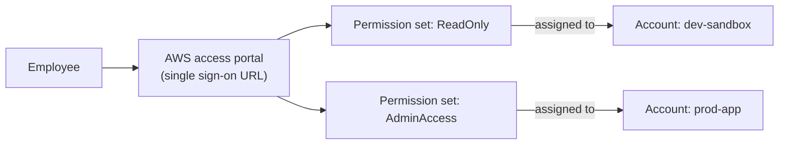

# 22 - AWS IAM Identity Center

> Goal: understand **AWS IAM Identity Center** (formerly AWS SSO) — the modern, recommended way to give a whole workforce single sign-on access across every account in an Organization, replacing the older pattern of creating separate IAM users in every single account.

---

## 1. The problem this solves

Without Identity Center, giving one employee access to, say, 5 different member accounts in an Organization means creating **5 separate IAM users** (or setting up 5 separate cross-account role-assumption chains, Note 09), each with its own credentials to manage, rotate, and eventually deactivate. This doesn't scale past a handful of accounts or a handful of people.

**IAM Identity Center** flips this: **one** central identity per person, with **permission sets** that can be assigned across **any number of accounts** in the Organization — the person signs in **once**, at one portal, and sees every account/role combination they're allowed to use.

> 🧠 **Mental model:** Identity Center is Note 10's SAML federation pattern, but built-in, purpose-made for AWS's own multi-account structure, and far easier to set up than wiring up your own SAML IdP trust relationships by hand into every single account.

---

## 2. Where identities actually come from

Identity Center doesn't have to be its own identity store — it can connect to whichever source of truth already exists:

| Identity source | Typical fit |
|---|---|
| **Identity Center's own built-in directory** | Small teams with no existing corporate directory |
| **External IdP via SAML/SCIM** (Okta, Azure AD/Entra ID, Ping, Google Workspace, etc.) | Enterprises with an existing corporate identity provider — employees keep using the same corporate login they already have |
| **AWS Managed Microsoft AD**, or an on-prem AD connected via **AD Connector** | Organizations whose identity source of truth is Active Directory specifically |

---

## 3. Core concepts

| Concept | What it is |
|---|---|
| **Permission set** | A template defining what a user/group can do once signed in to a specific account — conceptually very close to an IAM role's permissions policy, but managed centrally and deployable to many accounts at once |
| **Assignment** | The link connecting a specific user (or group) + a specific permission set + a specific AWS account — this is what actually grants access |
| **AWS access portal** | The single URL every assigned user signs into, seeing a personalized list of every account + permission-set combination they have access to |

Under the hood, when a user selects an account/role in the access portal, Identity Center provisions (and keeps in sync) a corresponding **IAM role** in that target account, and the user effectively **assumes** it — very much the same STS-backed temporary-credential mechanism from Notes 07-11, just orchestrated centrally instead of configured per account by hand.

---

## 4. Identity Center vs. per-account IAM users/roles

| | Per-account IAM users (Notes 05-06) | Cross-account role assumption (Note 09) | IAM Identity Center |
|---|---|---|---|
| Credentials per person | One set **per account** | One identity, but manual trust wiring per account | **One** identity, centrally managed |
| Sign-in experience | Separate login per account | Single identity, manual "Switch Role" per account | **Single portal**, sees every assigned account at a glance |
| Scales to many accounts | Poorly | Manually, one trust relationship at a time | Designed exactly for this |
| Requires AWS Organizations | No | No (but common in multi-account setups) | **Yes** |

> 🎯 **Exam tip:** "workforce needs single sign-on across many AWS accounts in an Organization, ideally integrated with our existing corporate directory" is the textbook **IAM Identity Center** scenario — the AWS-recommended answer over hand-rolling per-account SAML federation (Note 10) or per-account IAM users whenever multiple accounts are involved.

---

## 5. Recap

- **IAM Identity Center** provides centralized workforce single sign-on across every account in an AWS Organization, replacing per-account IAM users or manually-wired cross-account role assumption at scale.
- It can source identities from its own built-in directory, or federate from an external IdP (Okta, Azure AD, etc.) or Active Directory.
- **Permission sets** + **assignments** (user/group × account × permission set) are the core building blocks — functionally provisioning an IAM role per account behind the scenes.
- Requires AWS Organizations to be in place, since it's fundamentally a multi-account tool.
- Next: Note 23 — AWS IAM Identity Center Practical (Hands-On), setting one up and signing in through the access portal for real.

### Sources
- [What is IAM Identity Center? — AWS docs](https://docs.aws.amazon.com/singlesignon/latest/userguide/what-is.html)
- [IAM Identity Center identity source — AWS docs](https://docs.aws.amazon.com/singlesignon/latest/userguide/identity-source.html)
- [Permission sets — AWS docs](https://docs.aws.amazon.com/singlesignon/latest/userguide/permissionsetsconcept.html)
