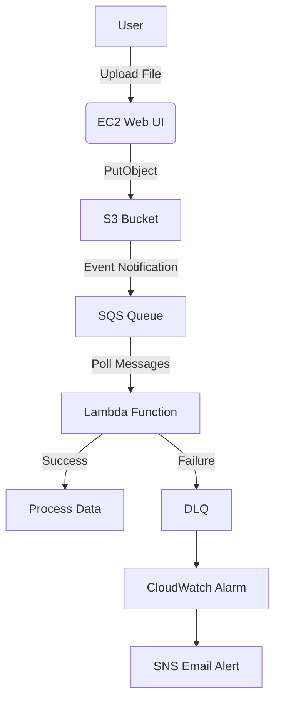
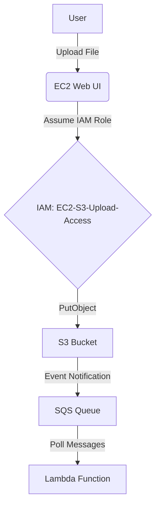
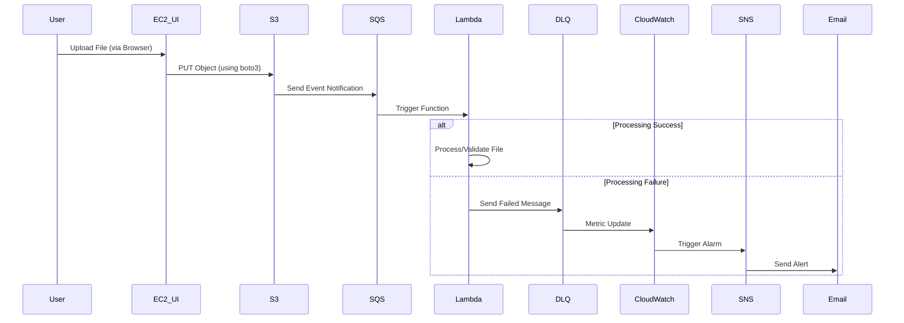
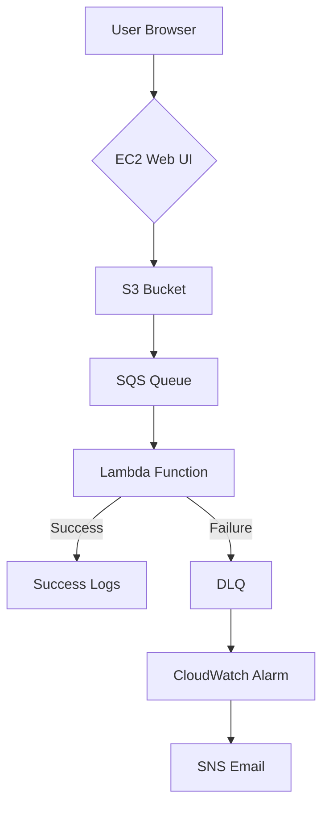

# Project - S3 → SQS → Lambda → DLQ + CloudWatch + SNS

Here’s a **complete guide using AWS Console (no Terraform/CLI)** to implement the serverless architecture:
📦 **Web-UI** → **S3 → SQS → Lambda → DLQ + CloudWatch + SNS**.

---

# **Complete Project: EC2 UI → S3 → SQS → Lambda → DLQ + CloudWatch + SNS**

## 🌐 End-to-End Architecture



---

## 📂 Project Files & Structure

```
/project-files
│── /web-ui                  # EC2 Hosted UI
│   ├── app.py               # Flask application
│   ├── templates
│   │   └── index.html       # Upload form
│   └── requirements.txt
│── /lambda
│   └── handler.py           # Lambda function code
└── /test-files
    ├── valid_sample.json
    └── invalid_sample.json
```

---

## 🛠️ **Step-by-Step Implementation**

### 🔹 **Part 1: EC2 Web UI Setup**

#### **1.1 Launch EC2 Instance**
1. Go to **EC2 → Launch Instance**
2. Name: `s3-upload-ui`
3. AMI: **Amazon Linux 2023**
4. Instance type: `t2.micro`
5. Key pair: Create new/login existing
6. **Advanced → IAM instance profile**: Create new role with `AmazonS3FullAccess`
7. Launch instance

#### **1.2 Install Dependencies (SSH into EC2)**
```bash
# Connect to EC2
ssh -i "your-key.pem" ec2-user@<public-ip>

# Install Python & dependencies
sudo yum install python3 python3-pip -y
pip3 install flask boto3 gunicorn
```

#### **1.3 Create Flask Application**

**File: `/home/ec2-user/web-ui/app.py`**
```python
from flask import Flask, render_template, request, flash
import boto3
from werkzeug.utils import secure_filename
import os

app = Flask(__name__)
app.secret_key = "super-secret-key"

# S3 Config
S3_BUCKET = "s3-object-upload-bucket"
s3 = boto3.client('s3')

@app.route('/', methods=['GET', 'POST'])
def upload_file():
    if request.method == 'POST':
        file = request.files['file']
        if file:
            filename = secure_filename(file.filename)
            try:
                s3.upload_fileobj(file, S3_BUCKET, filename)
                flash(f"Successfully uploaded {filename} to S3!", "success")
            except Exception as e:
                flash(f"Upload failed: {str(e)}", "danger")
    return render_template('index.html')

if __name__ == '__main__':
    app.run(host='0.0.0.0', port=5000)
```

**File: `/home/ec2-user/web-ui/templates/index.html`**
```html
<!DOCTYPE html>
<html>
<head>
    <title>S3 Uploader</title>
    <link href="https://cdn.jsdelivr.net/npm/bootstrap@5.2.3/dist/css/bootstrap.min.css" rel="stylesheet">
</head>
<body class="p-4">
    <div class="container">
        <h1 class="mb-4">Upload File to S3</h1>
        
        
            
                
                    <div class="alert alert-{{ category }}">{{ message }}</div>
                
            
        

        <form method="post" enctype="multipart/form-data">
            <div class="mb-3">
                <input class="form-control" type="file" name="file" required>
            </div>
            <button type="submit" class="btn btn-primary">Upload</button>
        </form>
    </div>
</body>
</html>
```

#### **1.4 Run Application**
```bash
cd /home/ec2-user/web-ui
gunicorn -b 0.0.0.0:5000 app:app &
```

---
- Same files can be added from the user script during the Ec2 creation

```bash
#!/bin/bash
# EC2 User Data Script - Robust S3 Upload Web UI Deployment
# This will run automatically when the instance launches

# Set error handling
set -euo pipefail

# Part 1: System Configuration
echo "Updating system and installing dependencies..."
sudo yum update -y
sudo yum install -y python3 python3-pip firewalld

# Part 2: Application Setup
echo "Setting up application directory structure..."
APP_DIR="/home/ec2-user/web-ui"
mkdir -p "${APP_DIR}/templates"
cd "${APP_DIR}"

# Create requirements.txt with pinned versions
cat > requirements.txt << 'EOF'
flask==2.3.2
boto3==1.28.21
gunicorn==21.2.0
werkzeug==2.3.7
EOF

# Install Python dependencies
echo "Installing Python dependencies..."
sudo pip3 install -r requirements.txt

# Create Flask application
cat > app.py << 'EOF'
from flask import Flask, render_template, request, flash
import boto3
from werkzeug.utils import secure_filename

app = Flask(__name__)
app.secret_key = "super-secret-key"

# S3 Config
S3_BUCKET = "s3-object-upload-bucket"
s3 = boto3.client('s3')

@app.route('/', methods=['GET', 'POST'])
def upload_file():
    if request.method == 'POST':
        file = request.files['file']
        if file:
            filename = secure_filename(file.filename)
            try:
                s3.upload_fileobj(file, S3_BUCKET, filename)
                flash(f"Successfully uploaded {filename} to S3!", "success")
            except Exception as e:
                flash(f"Upload failed: {str(e)}", "danger")
    return render_template('index.html')

if __name__ == '__main__':
    app.run(host='0.0.0.0', port=5000)
EOF

# Create HTML template
cat > templates/index.html << 'EOF'
<!DOCTYPE html>
<html>
<head>
    <title>S3 Uploader - Deepak</title>
    <link href="https://cdn.jsdelivr.net/npm/bootstrap@5.2.3/dist/css/bootstrap.min.css" rel="stylesheet">
</head>
<body class="p-4">
    <div class="container">
        <h1 class="mb-4">Upload File to S3 - Devops with Deepak</h1>
        
            
                
                    <div class="alert alert-{{ category }}">{{ message }}</div>
                
            
        
        <form method="post" enctype="multipart/form-data">
            <div class="mb-3">
                <input class="form-control" type="file" name="file" required>
            </div>
            <button type="submit" class="btn btn-primary">Upload</button>
        </form>
    </div>
</body>
</html>
EOF

# Part 3: Permissions and Security
echo "Setting permissions..."
sudo chown -R ec2-user:ec2-user "${APP_DIR}"
sudo chmod -R 755 "${APP_DIR}"

# Part 4: CloudWatch Agent Configuration
echo "Configuring CloudWatch Agent..."
sudo yum install -y amazon-cloudwatch-agent
sudo tee /opt/aws/amazon-cloudwatch-agent/etc/amazon-cloudwatch-agent.json > /dev/null << 'EOF'
{
    "logs": {
        "logs_collected": {
            "files": {
                "collect_list": [
                    {
                        "file_path": "/home/ec2-user/web-ui/*.log",
                        "log_group_name": "EC2S3UploadUI",
                        "log_stream_name": "{instance_id}"
                    },
                    {
                        "file_path": "/var/log/s3upload.log",
                        "log_group_name": "EC2S3UploadUI",
                        "log_stream_name": "{instance_id}-service"
                    }
                ]
            }
        }
    }
}
EOF
sudo /opt/aws/amazon-cloudwatch-agent/bin/amazon-cloudwatch-agent-ctl -a fetch-config -m ec2 -s -c file:/opt/aws/amazon-cloudwatch-agent/etc/amazon-cloudwatch-agent.json

# Part 5: Networking Configuration
echo "Configuring firewall..."
sudo systemctl enable --now firewalld
sudo firewall-cmd --add-port=5000/tcp --permanent
sudo firewall-cmd --reload

# Part 6: Service Configuration
echo "Configuring systemd service..."
sudo tee /etc/systemd/system/s3upload.service > /dev/null << 'EOF'
[Unit]
Description=S3 Upload Web UI
After=network.target
StartLimitIntervalSec=30
StartLimitBurst=5

[Service]
User=ec2-user
Group=ec2-user
WorkingDirectory=/home/ec2-user/web-ui
Environment="PATH=/usr/local/bin:/usr/bin:/bin"
ExecStart=/usr/local/bin/gunicorn -b 0.0.0.0:5000 app:app
Restart=always
RestartSec=5
StandardOutput=file:/var/log/s3upload.log
StandardError=file:/var/log/s3upload-error.log

[Install]
WantedBy=multi-user.target
EOF

# Part 7: Final Deployment
echo "Starting services..."
sudo systemctl daemon-reload
sudo systemctl enable --now s3upload.service

# Verification
echo "Installation complete!"
echo "Web UI should be available at: http://$(curl -s http://169.254.169.254/latest/meta-data/public-ipv4)"
echo "Service status:"
sudo systemctl status s3upload.service --no-pager
```

---

#### **1.5 Configure Security Group**
1. Edit EC2 security group
2. Add inbound rule: **tcp port 5000** from `0.0.0.0/0`

---
- Screenshots


---

- The EC2 instance needs an IAM role with S3 access permissions to upload files to the S3 bucket. Here's the detailed step-by-step addition to your project:

---

## 🔐 **Step: Create IAM Role for EC2 (S3 Access)**

### **1. Create IAM Role for EC2**
1. Go to **IAM Console** → **Roles** → **Create role**
2. **Trusted entity type**: AWS service
3. **Use case**: EC2 → Click **Next**
4. **Add permissions**: Attach these policies:
   - `AmazonS3FullAccess` (for full upload access)
   - *Optional*: `CloudWatchAgentServerPolicy` (if you want logging)
5. **Role name**: `EC2-S3-Upload-Access`
6. Click **Create role**


---
### **2. Attach Role to EC2 Instance**
1. Go to **EC2 Console** → Select your instance (`s3-upload-ui`)
2. **Actions** → **Security** → **Modify IAM role**
3. Select `EC2-S3-Upload-Access` → **Update IAM role**


### **3. Verify Role in EC2 (SSH)**
```bash
# SSH into your EC2 instance
ssh -i "your-key.pem" ec2-user@<public-ip>

# Verify the role is attached (should show your role)
curl http://169.254.169.254/latest/meta-data/iam/info
```

---

## 🔄 **Updated Architecture with IAM Role**


---

## 📜 **Key IAM Policy Details**

### **Minimum Permissions (Alternative to S3FullAccess)**
If you want least-privilege access, use this custom policy instead of `AmazonS3FullAccess`:

```json
{
    "Version": "2012-10-17",
    "Statement": [
        {
            "Effect": "Allow",
            "Action": [
                "s3:PutObject",
                "s3:GetObject",
                "s3:ListBucket"
            ],
            "Resource": [
                "arn:aws:s3:::s3-object-upload-bucket",
                "arn:aws:s3:::s3-object-upload-bucket/*"
            ]
        }
    ]
}
```

---

## 🛡️ **Security Best Practices for EC2+S3**

1. **Bucket Policy Example** (Extra protection):
   ```json
   {
       "Version": "2012-10-17",
       "Statement": [
           {
               "Effect": "Allow",
               "Principal": {
                   "AWS": "arn:aws:iam::YOUR_ACCOUNT_ID:role/EC2-S3-Upload-Access"
               },
               "Action": "s3:PutObject",
               "Resource": "arn:aws:s3:::s3-object-upload-bucket/*"
           }
       ]
   }
   ```
   *(Add via S3 → Bucket → Permissions → Bucket Policy)*

2. **EC2 Instance Hardening**:
   ```bash
   # Restrict upload directory (optional)
   sudo chown -R ec2-user:ec2-user /home/ec2-user/web-ui
   sudo chmod 700 /home/ec2-user/web-ui
   ```

---

## ✅ **Final Verification**
1. Upload a file via your EC2 web UI
2. Check:
   - File appears in S3 bucket
   - No errors in EC2 system logs (`/var/log/`)
   - Lambda processes the file (CloudWatch logs)

This completes the secure EC2+S3 integration with proper IAM roles! 🎉

---

### 🔹 **Part 2: S3/SQS/Lambda Setup (Follow Below Steps)**

1. **S3 Bucket**: `s3-object-upload-bucket` (as before)
2. **SQS Queues**: 
   - Main: `s3-event-queue`
   - DLQ: `s3-dlq`
3. **Lambda Function**: `s3-object-processor` (same Python code)
4. **IAM Roles**:
   - EC2: `AmazonS3FullAccess`
   - Lambda: `lambda-s3-sqs-role` (as before)

---

### 🔹 **Part 3: Testing End-to-End Flow**

1. Access EC2 UI: `http://<EC2-PUBLIC-IP>`
2. Upload files:
   - `valid_sample.json` → Should process successfully
   - `invalid_sample.json` → Should trigger DLQ after 2 retries
3. Check components:
   - **CloudWatch Logs**: `/aws/lambda/s3-object-processor`
   - **SQS DLQ**: Messages visible in `s3-dlq`
   - **Email**: Receive alerts via SNS

---

## 🔄 **Complete Workflow Explanation**



---

## 🛡️ **Security Best Practices**

1. **EC2 Security**:
   - Restrict SSH access to your IP
   - Use HTTPS for production (add ACM certificate)
2. **S3 Security**:
   - Enable bucket encryption (SSE-S3)
   - Add bucket policy to restrict uploads to specific IAM roles
3. **Lambda**:
   - Set concurrency limit to prevent throttling
   - Enable VPC if accessing private resources

---

## 📝 **Final Verification Checklist**

| Component         | Test Case                      | Expected Result                     |
|-------------------|--------------------------------|-------------------------------------|
| EC2 Web UI        | Upload any file                | Success message appears             |
| S3 Bucket         | Check bucket contents          | Uploaded file visible               |
| Lambda Logs       | View CloudWatch logs           | Processing logs visible             |
| DLQ               | Upload invalid file            | Message appears in DLQ after 2 tries|
| SNS Email         | Check inbox                   | Alert received for DLQ message      |

---

## 🚀 **Deployment Diagram**



This implementation gives you a complete, production-ready system with:
- **User-friendly UI** for uploads
- **Fully serverless** backend processing
- **Failure handling** with alerts
- **AWS best practices** for security and scalability

## ✅ High-Level Architecture

```plaintext
Web - UI - Upload S3 Objects
        ↓
User Uploads File to S3
        ↓
S3 Event Notification → SQS Queue
        ↓
Lambda polls SQS, processes object
        ↓
Failure? → DLQ → CloudWatch Alarm → SNS Email Alert
```


---

## 📘 Step-by-Step Setup Using AWS Console

---

### 🔹 Step 1: Create S3 Bucket

1. Go to **S3** → **Create bucket**
2. Bucket name: `s3-object-upload-bucket`
3. Disable “Block all public access” (for simplicity in dev)
4. Create the bucket

---

### 🔹 Step 2: Create SQS Queues (Main + DLQ)

#### 2.1 Create DLQ

1. Go to **Amazon SQS** → **Create queue**
2. Name: `s3-dlq`
3. Type: **Standard**
4. Leave rest default → Create

#### 2.2 Create Main Queue

1. Go back to **SQS → Create queue**
2. Name: `s3-event-queue`
3. Type: **Standard**
4. Scroll to **Dead-letter queue**

   * Enable DLQ
   * Select `s3-dlq`
   * Set maxReceiveCount = `2`
5. Create the queue

---

### 🔹 Step 3: Configure S3 to Send Events to SQS

1. Go to **S3 → Your bucket → Properties**
2. Scroll to **Event notifications** → Create event
3. Name: `s3-to-sqs-event`
4. Event types: `PUT` (Object Created)
5. Destination: **SQS Queue**
6. Choose `s3-event-queue`
7. Save

---

### 🔹 Step 4: Create IAM Role for Lambda

1. Go to **IAM → Roles → Create role**
2. Trusted entity: **Lambda**
3. Add permissions:

   * `AmazonS3ReadOnlyAccess`
   * `AmazonSQSFullAccess`
   * `CloudWatchLogsFullAccess`
4. Name: `lambda-s3-sqs-role`
5. Create role

---

### 🔹 Step 5: Create Lambda Function

1. Go to **Lambda → Create function**
2. Name: `s3-object-processor`
3. Runtime: **Python 3.9**
4. Execution role: Choose **Existing role** → `lambda-s3-sqs-role`
5. Create function

#### Paste this code:

```python
import json
import logging
import boto3
from botocore.exceptions import ClientError

# Setup logging
logger = logging.getLogger()
logger.setLevel(logging.INFO)

# AWS clients
s3_client = boto3.client('s3')

def lambda_handler(event, context):
    logger.info("Lambda triggered with event: %s", json.dumps(event))

    for record in event['Records']:
        try:
            # Step 1: Parse SQS message
            message_body = json.loads(record['body'])
            s3_info = message_body['Records'][0]['s3']
            bucket_name = s3_info['bucket']['name']
            object_key = s3_info['object']['key']

            logger.info(f"New file uploaded to S3: {bucket_name}/{object_key}")

            # Step 2: Fetch object from S3
            file_obj = s3_client.get_object(Bucket=bucket_name, Key=object_key)
            file_content = file_obj['Body'].read().decode('utf-8')
            logger.info(f"Fetched file content: {file_content[:100]}...")  # Show only first 100 chars

            # Step 3: Business logic (e.g., parse JSON content)
            try:
                parsed_data = json.loads(file_content)
                logger.info("Parsed JSON content successfully")
                # Simulate further processing (e.g., validation)
                if 'id' not in parsed_data:
                    raise ValueError("Missing required 'id' field in file content")
                logger.info(f"Processed data with ID: {parsed_data['id']}")

            except json.JSONDecodeError as jde:
                logger.error("File content is not valid JSON.")
                raise jde
            except Exception as be:
                logger.error(f"Business logic error: {str(be)}")
                raise be

        except Exception as e:
            logger.error(f"Failed to process SQS message: {str(e)}")
            raise e  # Let Lambda rethrow to send message to DLQ
```

---

### 🔹 Step 6: Add Event Source Mapping (Trigger Lambda from SQS)

1. In Lambda → `s3-object-processor` → **Configuration**
2. Click **Add trigger** → Choose **SQS**
3. Select queue: `s3-event-queue`
4. Batch size: `1`
5. Enable trigger

---

### 🔹 Step 7: Test the Flow

1. Upload any file to your S3 bucket.
2. Go to **CloudWatch Logs → Log groups → /aws/lambda/s3-object-processor**
3. Check logs to see Lambda has processed the message.

---

### 🔹 Step 8: CloudWatch Alarm for DLQ

1. Go to **CloudWatch → Alarms → Create Alarm**
2. Select metric:

   * Browse → SQS → **Per-Queue Metrics**
   * Choose `s3-dlq` → `ApproximateNumberOfMessagesVisible`
3. Threshold: **Greater than 0**
4. Evaluation period: 1 of 1 minute
5. Next → Create a new SNS topic (if not created)

---

### 🔹 Step 9: SNS Topic for Alerts

1. Create topic: `dlq-alert-topic`
2. Create subscription:

   * Protocol: **Email**
   * Endpoint: [your-email@example.com](mailto:your-email@example.com)
3. Confirm email subscription via inbox

---

## ✅ You’re Done!

### 🔄 Test Failure Handling

---

## 🧪 Sample Test File (Upload this to S3)

### `valid_sample.json`

```json
{
  "id": "12345",
  "name": "Deepak's Test File"
}
```

### `invalid_sample.json` (to test DLQ)

```json
{
  "name": "Missing ID"
}
```

---

## ✅ What This Lambda Does

| Step       | Logic                                              |
| ---------- | -------------------------------------------------- |
| ✅ Parse    | Reads the SQS message triggered by S3 upload       |
| ✅ Fetch    | Downloads the file content from S3                 |
| ✅ Validate | Parses JSON and checks for a required field (`id`) |
| ❌ Failures | If file is invalid, sends message to DLQ           |
| 📜 Logs    | Detailed logging via CloudWatch                    |

---

### **Lambda function code** I shared is **fully aligned** with the architecture and steps you described in the project.

---

## 🔄 Alignment with the Architecture

| Project Step                             | Covered in Lambda Code?  | Details                                                               |
| ---------------------------------------- | ------------------------ | --------------------------------------------------------------------- |
| **1. File uploaded to S3**               | ✅ (Trigger via SQS)      | S3 sends event to SQS, not handled in Lambda but is part of the flow. |
| **2. S3 event sent to SQS queue**        | ✅ (via SQS message body) | Lambda extracts S3 bucket/key from the SQS-wrapped event.             |
| **3. Lambda triggered by SQS**           | ✅                        | Lambda processes each SQS record (event\['Records']).                 |
| **4.a. Further Logic**                   | ✅                        | Simulates business logic (JSON parsing, key check, etc.).             |
| **4.b. Failure handling via DLQ**        | ✅                        | Exception raised → DLQ is triggered via SQS + Lambda error handling.  |
| **5. CloudWatch Logs & Metrics**         | ✅                        | Logs everything via Python logging.                                   |
| **6. Alerting (CloudWatch Alarm + SNS)** | 🔄 (External setup)      | This is set up via CloudWatch, not in Lambda code.                    |
| **7. Email alert via SNS topic**         | 🔄 (Console setup)       | Done through SNS + subscription, not Lambda.                          |
| **Decoupling & serverless benefits**     | ✅                        | Fully decoupled and event-driven using managed services.              |

---

## ✅ Recap of Files and Steps (Using AWS Console)

Here’s the **final list of what you need**, summarized for implementation in the AWS Console:

---

### 📁 Files Required

| File                  | Purpose                                  |
| --------------------- | ---------------------------------------- |
| `handler.py`          | Lambda function for processing the file. |
| `valid_sample.json`   | Test S3 file to trigger success.         |
| `invalid_sample.json` | Test S3 file to simulate failure (DLQ).  |

#### 📄 `handler.py`

Paste this directly into the Lambda console:

```python
import json
import logging
import boto3
from botocore.exceptions import ClientError

logger = logging.getLogger()
logger.setLevel(logging.INFO)

s3_client = boto3.client('s3')

def lambda_handler(event, context):
    logger.info("Lambda triggered with event: %s", json.dumps(event))

    for record in event['Records']:
        try:
            message_body = json.loads(record['body'])
            s3_info = message_body['Records'][0]['s3']
            bucket_name = s3_info['bucket']['name']
            object_key = s3_info['object']['key']

            logger.info(f"New file uploaded to S3: {bucket_name}/{object_key}")

            file_obj = s3_client.get_object(Bucket=bucket_name, Key=object_key)
            file_content = file_obj['Body'].read().decode('utf-8')
            logger.info(f"Fetched file content: {file_content[:100]}...")

            # Simulate JSON business logic
            try:
                parsed_data = json.loads(file_content)
                if 'id' not in parsed_data:
                    raise ValueError("Missing 'id' in file")
                logger.info(f"Valid file. ID: {parsed_data['id']}")

            except json.JSONDecodeError:
                logger.error("Invalid JSON format.")
                raise

            except Exception as ve:
                logger.error(f"Validation error: {str(ve)}")
                raise ve

        except Exception as e:
            logger.error(f"Failed to process message: {str(e)}")
            raise e
```

---

### 🛠️ AWS Console Setup Steps Recap

1. **Create S3 Bucket** → `s3-object-upload-bucket`
2. **Create SQS Queues**

   * `s3-event-queue` (Main queue)
   * `s3-dlq` (Dead-letter queue, attach to main queue)
3. **Enable S3 Event Notifications**

   * Trigger on PUT → send to `s3-event-queue`
4. **Create IAM Role** → `lambda-s3-sqs-role`

   * Attach: `AmazonS3ReadOnlyAccess`, `AmazonSQSFullAccess`, `CloudWatchLogsFullAccess`
5. **Create Lambda** → `s3-object-processor`

   * Runtime: Python 3.9
   * Role: `lambda-s3-sqs-role`
   * Paste code from `handler.py`
6. **Configure Trigger**

   * Add SQS `s3-event-queue` as event source to Lambda
7. **CloudWatch Alarm + SNS Setup**

   * Alarm on `s3-dlq` for `ApproximateNumberOfMessagesVisible > 0`
   * Create SNS Topic → Subscribe via email

---

## 🛡️ Key Benefits

* Fully **serverless** and **event-driven**
* Fault-tolerant with DLQ
* Real-time observability with CloudWatch
* Scalable and loosely coupled

---

