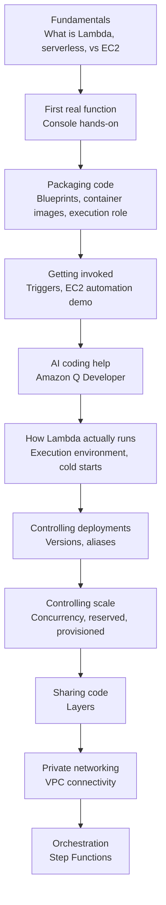

# 01 - AWS Lambda Roadmap

> Goal: get a bird's-eye view of everything this folder covers, in the order it's covered, before diving into any single topic — so each later note makes sense as "the next piece" rather than an isolated fact.

---

## 1. Why a roadmap note first

Lambda has a lot of moving parts — the function itself is simple, but everything **around** it (roles, triggers, versions, aliases, concurrency, layers, VPC access, orchestration with Step Functions) is where the real exam-relevant depth lives. This folder builds those pieces up in a deliberate order: first understand *what* Lambda is and *why* it exists, then get hands dirty creating a real function, then layer on the operational concepts one at a time.

---

## 2. The learning path

| Group | Notes | What it answers |
|---|---|---|
| Fundamentals | [Introduction to AWS Lambda](02-Introduction-to-AWS-Lambda.md), [Serverless With Lambda](03-Serverless-With-Lambda.md), [Lambda vs EC2](04-Lambda-vs-EC2.md) | What Lambda actually is, what "serverless" means, when to pick it over a server |
| First function | [Create Your First Lambda Function](05-Create-First-Lambda-Function-HandsOn.md) | A real, working function end-to-end via the console |
| Packaging code | [Lambda Blueprints](06-Lambda-Blueprints.md), [Lambda Container Images](07-Lambda-Container-Images.md), [Lambda Execution Role](08-Lambda-Execution-Role.md) | The three ways to get code into Lambda, and the permissions it runs with |
| Getting invoked | [Lambda EC2 Automation hands-on](09-Lambda-EC2-Automation-HandsOn.md), [Lambda Triggers](10-Lambda-Triggers.md) | A real automation use case, then the general trigger model behind it |
| AI coding help | [Introduction to Amazon Q](11-Introduction-to-Amazon-Q.md), [Amazon Q Developer](12-Amazon-Q-Developer.md), [Amazon Q vs ChatGPT](13-Amazon-Q-vs-ChatGPT.md), [Lambda + Amazon Q](14-Lambda-Plus-Amazon-Q.md) | AWS's AI assistant, and where it shows up inside the Lambda console — including an important 2026 status update |
| How Lambda runs | [AWS Lambda Execution Environment](15-Lambda-Execution-Environment.md) | Cold starts, warm starts, and why they matter |
| Deployments | [Version Control In AWS Lambda](16-Lambda-Versions.md), [Aliases In AWS Lambda](17-Lambda-Aliases.md) | Freezing code safely, routing traffic without changing client config |
| Scale control | [Understanding AWS Lambda Concurrency](18-Lambda-Concurrency.md), [Understanding Reserved Concurrency](19-Lambda-Reserved-Concurrency.md), [Configure Provisioned Concurrency](20-Lambda-Provisioned-Concurrency-HandsOn.md) | How many requests Lambda can handle at once, and how to protect/pre-warm specific functions |
| Sharing code | [Lambda Layers](21-Lambda-Layers.md), [Lambda Layers Lab](22-Lambda-Layers-Lab-HandsOn.md) | Reusing a library across many functions without duplicating it |
| Private networking | [Lambda VPC Connectivity](23-Lambda-VPC-Connectivity-HandsOn.md) | Letting a function reach a private RDS database or internal service |
| Orchestration | [AWS Step Functions](24-AWS-Step-Functions-Intro.md), [Step Functions Lab](25-Step-Functions-Lab-HandsOn.md), [AWS Step Function Types](26-Step-Functions-Types.md) | Coordinating multiple Lambda functions into one reliable workflow |

---

## 3. How to use this folder

- Every hands-on note is **AWS Console only** — no CLI, no Infrastructure-as-Code, no automation scripts. This is a learning-stage decision: doing every click yourself is what makes the console's actual options stick.
- Diagrams show **where** something happens (which AWS component, viewer vs. Lambda vs. another service) and **when** (which stage of a request or deployment) — not just what the feature is called.
- Console field names and options are verified against AWS's current documentation, not memorized from an older course recording — AWS changes console layouts often enough that this matters (see the [Amazon Q Developer](12-Amazon-Q-Developer.md) note for a concrete example of something that changed significantly in 2026).

---

## 4. Recap

- This folder moves from **what Lambda is**, to a **real hands-on function**, to the **operational knobs** (versions, aliases, concurrency, layers, VPC, Step Functions) that actually get tested on the SAA-C03 exam in scenario form.
- Next: the [Introduction to AWS Lambda](02-Introduction-to-AWS-Lambda.md) note.
