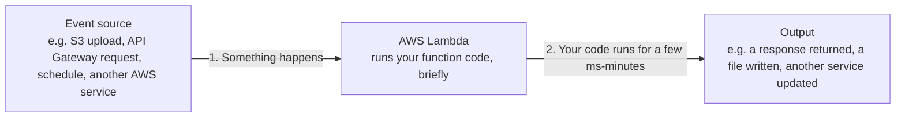

# 02 - Introduction Of AWS Lambda

> Goal: understand, in plain language, what AWS Lambda actually is and what problem it solves — before any of the deeper operational topics in this folder.

---

## 1. The simplest possible explanation

**AWS Lambda runs a small piece of your code, only when something needs it to run, and you never manage the computer it runs on.**

Think of a light switch versus a light that's always on. A traditional server (like an EC2 instance) is a light that's always on — it's running 24/7 whether anyone needs it or not, and you're paying for that electricity the whole time. Lambda is a **motion-sensor light** — it turns on the instant it's needed, does its job, and turns back off. You only "pay" for the moments it was actually lit.

That "piece of code" is called a **Lambda function**. It could be: resize an uploaded image, validate a form submission, respond to an API request, start/stop an EC2 instance on a schedule, or process a row that just landed in a database.

---

## 2. Architecture & workflow — the basic shape of every Lambda invocation

Every single Lambda use case, no matter how different it looks on the surface, follows this exact shape: **something triggers it → your code runs briefly → it produces some effect → it stops.** There's no long-running process sitting around waiting — AWS itself decides when to start a copy of your code, runs it, and throws that copy away (or keeps it briefly "warm" — covered in the [AWS Lambda Execution Environment](15-Lambda-Execution-Environment.md) note).

---

## 3. A simple, concrete example

Say you want to send a "Thank you for signing up" email every time someone registers on your website:

1. **Without Lambda**: you'd need a server running all the time, just waiting for new signups, doing nothing the other 99% of the day.
2. **With Lambda**: your signup form calls a Lambda function directly (or writes to a database that triggers one). The function runs for maybe 200 milliseconds — checks the new user's email, sends the email via a service like Amazon SES — and then stops. No server was ever "on" waiting.

---

## 4. What you don't have to think about with Lambda

| You'd normally worry about with a server | Lambda handles this for you |
|---|---|
| Which OS, patches, security updates | AWS manages the underlying OS entirely |
| How many servers to run for traffic spikes | Lambda automatically runs more copies of your function in parallel |
| Paying for idle time | You're billed per invocation and per execution time, not per hour the "server" existed |
| Setting up load balancers for scaling | Not needed — Lambda scales invocation-by-invocation |

This idea — not managing servers at all — is called **serverless**, covered in depth in the next note, [Serverless With Lambda](03-Serverless-With-Lambda.md).

---

## 5. What Lambda is NOT good at

Being honest about the trade-off up front avoids a lot of confusion later:

- **Long-running work**: a Lambda function has a hard maximum runtime of **15 minutes**. A video encoding job that takes 2 hours doesn't belong in Lambda.
- **Stateful, always-connected workloads**: Lambda functions are short-lived; if you need a persistent WebSocket connection or in-memory state shared across thousands of requests, a traditional server (or a different AWS service) fits better.
- **Very predictable, constant, high-volume traffic**: at large enough sustained scale, a reserved EC2 fleet can sometimes be cheaper than paying per-invocation — this exact trade-off is the subject of the [Lambda vs EC2](04-Lambda-vs-EC2.md) note.

> 🎯 **Exam tip:** "event-driven," "no servers to manage," "pay only for what you use," and "automatically scales" are the phrases the SAA-C03 exam uses to point at Lambda. "Long-running," "needs a persistent connection," or "requires a specific OS/runtime not supported by Lambda" are the phrases that point **away** from it.

---

## 6. Recap

- Lambda runs your code **only when triggered**, for a short duration, without you ever provisioning or managing a server.
- Every use case follows the same shape: **event → your code runs briefly → some effect happens**.
- Lambda is not suited to long-running (>15 minute) or persistently-connected workloads.
- Next: the [Serverless With Lambda](03-Serverless-With-Lambda.md) note, unpacking what "serverless" really means as a concept.

### Sources
- [What is AWS Lambda? — AWS docs](https://docs.aws.amazon.com/lambda/latest/dg/welcome.html)
- [AWS Lambda features — AWS](https://aws.amazon.com/lambda/features/)
