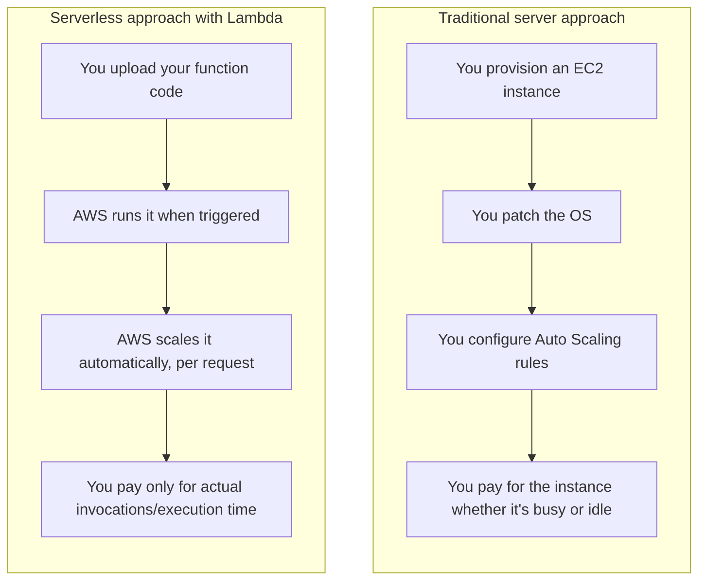

# 03 - Serverless With Lambda

> Goal: understand what the word "serverless" actually means (and doesn't mean) — it's one of the most-used, least-precisely-understood words in cloud computing, and the SAA-C03 exam expects you to know the real definition.

---

## 1. "Serverless" doesn't mean "no servers"

There's still a physical server running your code somewhere in an AWS data center — someone has to execute your Python or Node.js code on real hardware. "Serverless" doesn't mean servers vanish; it means **you never see, touch, choose, patch, or scale that server yourself.** AWS owns that entire responsibility.

> 🧠 **Simple analogy**: taking a taxi is "driverless" from *your* point of view even though someone is obviously driving — you didn't hire the driver, maintain the car, or plan the route yourself. You just said where you wanted to go. Serverless computing is the same idea: you just say "run this code when X happens," and AWS handles literally everything about *how* and *where* it actually runs.

---

## 2. The four things that make something genuinely "serverless"

| Property | What it means in practice |
|---|---|
| **No server management** | You never launch, patch, or configure an OS/VM |
| **Automatic scaling** | Going from 1 request/second to 10,000 requests/second needs zero action from you |
| **Pay-per-use** | Billing is based on actual invocations/execution time, not on a server sitting there 24/7 |
| **Built-in availability** | AWS runs your function across multiple Availability Zones automatically — you don't design that yourself |

Lambda checks **all four boxes**, which is why it's the flagship example of serverless compute on AWS — but Lambda isn't the *only* serverless service. S3, DynamoDB (on-demand mode), and API Gateway are also serverless by this same definition — none of them require you to provision a server, and all four properties above apply to them too.

---

## 3. Architecture & workflow — where "serverless" actually removes work

The diagram isn't showing two different technical architectures for the *same* problem — it's showing that an entire category of **operational work** (provisioning, patching, scaling policy, idle-cost) simply doesn't exist on the serverless side. That removed work is the whole point.

---

## 4. A simple example: a "contact us" form handler

Imagine a small business website with a "Contact Us" form that gets submitted maybe 20 times a day.

- **Server approach**: you'd run a small EC2 instance 24 hours a day, 365 days a year, to handle those 20 daily requests — meaning it's idle **99.98%** of the time, but you're billed for all of it.
- **Serverless approach**: a Lambda function only "exists" (in billing terms) for the handful of seconds across the day it's actually processing those 20 submissions. If traffic suddenly spiked to 2,000 submissions during a viral moment, Lambda would just run 2,000 parallel copies automatically — no capacity planning needed from you either way.

---

## 5. The trade-off: what you give up

Serverless isn't free of trade-offs — it's a genuine exam-relevant distinction:

- **Less control**: you can't SSH into a Lambda function, install arbitrary system packages, or tune the OS.
- **Cold starts**: the very first request after a period of inactivity can be slower while AWS initializes an execution environment (the [AWS Lambda Execution Environment](15-Lambda-Execution-Environment.md) note covers this in depth).
- **Execution limits**: the 15-minute max runtime and other Lambda-specific limits (covered across this folder) simply don't apply to a server you control yourself.

> 🎯 **Exam tip:** a scenario that says "minimize operational overhead," "no infrastructure to manage," or "automatically scale based on demand with no capacity planning" is describing **serverless** — Lambda is almost always the correct answer among the choices unless the scenario also mentions something serverless explicitly can't do (very long-running jobs, needing full OS control, etc.), which is exactly what the [Lambda vs EC2](04-Lambda-vs-EC2.md) note explores next.

---

## 6. Recap

- **Serverless** means AWS fully owns server provisioning, patching, and scaling — not that servers don't exist.
- The four defining properties are: no server management, automatic scaling, pay-per-use billing, and built-in multi-AZ availability.
- Lambda is the flagship serverless **compute** service, but S3, DynamoDB on-demand, and API Gateway are serverless too, by the same definition.
- The trade-off for that convenience is less low-level control and the possibility of cold starts.
- Next: the [Lambda vs EC2](04-Lambda-vs-EC2.md) note, comparing Lambda directly against the traditional server approach it's replacing.

### Sources
- [Serverless on AWS — AWS](https://aws.amazon.com/serverless/)
- [What is AWS Lambda? — AWS docs](https://docs.aws.amazon.com/lambda/latest/dg/welcome.html)
