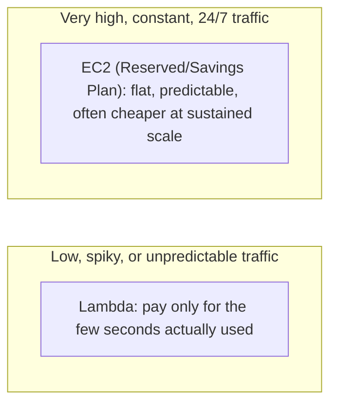

# 04 - AWS Lambda Vs EC2 Instance

> Goal: build a clear, practical mental model for choosing between Lambda and EC2 — one of the most common "which service should I pick" scenarios on the SAA-C03 exam.

---

## 1. The core difference, in one sentence

**EC2 gives you a computer you control and pay for by the hour (or second); Lambda gives you a function AWS runs for you and you pay for by the invocation.** Everything else in this note is a consequence of that one distinction.

---

## 2. Side-by-side comparison

| | AWS Lambda | EC2 Instance |
|---|---|---|
| **What you manage** | Just your code | OS, patches, security groups, scaling, everything |
| **Billing model** | Per invocation + execution duration (rounded to the millisecond) | Per second/hour the instance is running, whether busy or idle |
| **Scaling** | Automatic, per-request, up to account concurrency limits | Manual, or via Auto Scaling Groups you configure yourself |
| **Max runtime per task** | 15 minutes, hard limit | Unlimited — can run forever |
| **Startup time** | Milliseconds (warm) to a couple seconds (cold start) | Minutes to boot a new instance |
| **OS/runtime control** | Limited to supported runtimes (or a container image implementing the Lambda Runtime API) | Full control — any OS, any software, any configuration |
| **Persistent local storage** | Ephemeral `/tmp` only (up to 10GB), wiped between cold starts | Full, persistent EBS-backed disk |
| **Idle cost** | Zero — nothing to pay for when not invoked | You pay for the instance the whole time it's running, idle or not |
| **Best for** | Short, event-driven, spiky, or infrequent workloads | Long-running processes, full OS control, predictable steady-state load |

---

## 3. Architecture & workflow — the cost curve is the real deciding factor

There isn't a single "always better" answer — it genuinely depends on **how busy the workload is, all the time**. A function invoked 50 times a day is almost always cheaper on Lambda. A service handling millions of requests per second, every second, 24/7, can become cheaper on a well-utilized, reserved EC2 fleet — because Lambda's convenience is priced per-use, and at very high sustained utilization that per-use pricing adds up faster than a flat, already-fully-utilized server.

---

## 4. A simple example to make the trade-off concrete

Imagine a company needs to resize a few hundred product images a day, uploaded at random times throughout the day.

- **On EC2**: you'd run an instance 24/7 just in case an image gets uploaded at 3 AM — that instance is idle almost all day, and you're still paying the full hourly rate.
- **On Lambda**: the function only "turns on" for the handful of seconds it takes to resize each image, whenever an image happens to be uploaded — including the 3 AM one, without you needing to plan for it.

Now flip it: imagine that same company processes 5 million image resizes **every hour**, all day, every day, forever. At that volume the traffic is no longer "spiky" — it's constant, predictable, and enormous. A carefully-sized, always-busy EC2 fleet (or an Auto Scaling Group tuned to that steady load) can end up cheaper per-image than paying Lambda's per-invocation rate 5 million times an hour, every hour.

---

## 5. Other real reasons to pick EC2 over Lambda (beyond just cost)

- The workload genuinely needs to run **longer than 15 minutes** in one continuous execution.
- You need **full control of the OS** — specific kernel modules, custom networking setups, or software that simply isn't compatible with Lambda's execution model.
- You need a **persistent, stateful process** — e.g. a game server holding many active player connections in memory at once.
- You're migrating an existing application that wasn't designed to be broken into small, stateless functions, and re-architecting it isn't currently worth the effort.

---

## 6. It's rarely "pick one forever" — hybrid is normal

In real architectures, Lambda and EC2 frequently coexist: EC2 (or ECS/EKS) runs the main, steady-state application, while Lambda handles the bursty, event-driven side jobs around it — resizing an uploaded profile picture, sending a notification, running a nightly cleanup task. The [Lambda EC2 Automation hands-on demo](09-Lambda-EC2-Automation-HandsOn.md) later in this folder is a great concrete example of this pattern: Lambda doesn't replace EC2 there, it **automates** EC2 (starting/stopping instances on a schedule).

> 🎯 **Exam tip:** look for the specific constraint in the scenario. "Runs for over 15 minutes," "needs a persistent connection," or "requires full OS-level access" → **EC2**. "Infrequent," "unpredictable spikes," "event-driven," or "minimize idle cost" → **Lambda**. A scenario mentioning **extremely high, constant, sustained** throughput is the one case where the "obvious" serverless answer (Lambda) might actually not be the cost-optimal one — read carefully.

---

## 7. Recap

- Lambda charges per invocation/duration with zero idle cost; EC2 charges for uptime regardless of how busy it is.
- Lambda scales automatically per-request; EC2 scaling has to be configured (Auto Scaling Groups).
- EC2 wins for long-running (>15 min), stateful, or full-OS-control workloads, and can be cheaper at very high sustained, predictable volume.
- Lambda wins for short, unpredictable, event-driven, or infrequent workloads — which describes most "glue code" and automation tasks.
- The two are frequently used **together**, not as a strict either/or choice.
- Next: the [Create Your First Lambda Function](05-Create-First-Lambda-Function-HandsOn.md) note — time to actually build one.

### Sources
- [AWS Lambda pricing — AWS](https://aws.amazon.com/lambda/pricing/)
- [Amazon EC2 pricing — AWS](https://aws.amazon.com/ec2/pricing/)
- [AWS Lambda quotas — AWS docs](https://docs.aws.amazon.com/lambda/latest/dg/gettingstarted-limits.html)
