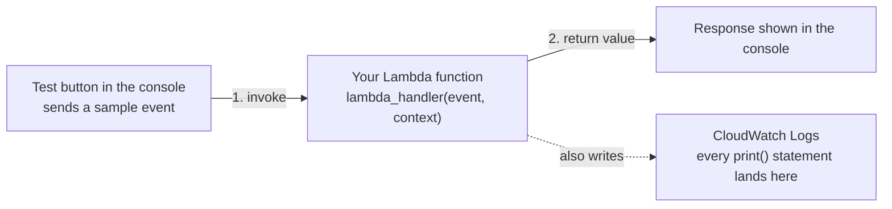

# 05 - Hands-On: Create Your First Lambda Function

> Goal: create, deploy, and test a real Lambda function end-to-end using nothing but the AWS Console — see exactly where your code lives, how it runs, and where its output goes. Entirely via the **AWS Console**, no CLI.

---

## 1. What you're about to build

A tiny Python function that takes a name as input and returns a greeting — simple enough to focus entirely on the **mechanics** of Lambda (create, deploy, test, view logs) rather than on the code itself.



---

## 2. Create the function

1. **Lambda console** → **Functions** → **Create function**.
2. **Author from scratch** (the default; the other two options, **Use a blueprint** and **Container image**, are covered in the [Lambda Blueprints](06-Lambda-Blueprints.md) and [Lambda Container Images](07-Lambda-Container-Images.md) notes).
3. **Basic information**:
   - **Function name**: `hello-lambda-demo`.
   - **Runtime**: pick the newest **Python 3.x** version in the dropdown (AWS periodically adds newer versions and marks old ones deprecated — always prefer the newest non-deprecated one offered, rather than memorizing a specific version number).
   - **Architecture**: leave at **x86_64** (the default; **arm64** uses AWS Graviton processors and is usually cheaper/faster for compatible workloads, but not needed for this demo).
4. **Permissions** → **Change default execution role** (expand it): leave at **Create a new role with basic Lambda permissions** — this auto-creates an IAM role that only allows writing logs to CloudWatch. The [Lambda Execution Role](08-Lambda-Execution-Role.md) note covers exactly what this role is and how to extend it.
5. Leave **Advanced settings** collapsed (VPC, tags, etc. — not needed here).
6. **Create function**.

---

## 3. Write and deploy the code

1. On the function's page, scroll to the **Code source** panel — the console's built-in code editor.
2. Replace the default template in `lambda_function.py` with:
   ```python
   import json

   def lambda_handler(event, context):
       name = event.get("name", "World")
       message = f"Hello, {name}! This response came from AWS Lambda."
       print(f"Received a request for: {name}")   # this shows up in CloudWatch Logs

       return {
           "statusCode": 200,
           "body": json.dumps({"message": message})
       }
   ```
3. **Deploy** (the orange button above the editor) — this is the step that actually saves your code changes to the function; editing the code alone doesn't take effect until you deploy it.

---

## 4. Test it

1. Click **Test** (next to Deploy) → **Configure test event**.
2. **Event name**: `MyTestEvent`.
3. **Event JSON**: replace the sample with:
   ```json
   {
     "name": "Deepak"
   }
   ```
4. **Save**, then click **Test** again.
5. The console shows an **Execution results** panel with: the returned value (`"message": "Hello, Deepak! ..."`), the **Duration**, **Billed Duration**, **Memory Used**, and a link to the invocation's logs.

---

## 5. View the logs

1. In the Execution results panel, expand **Details** or click the **CloudWatch Logs** link.
2. This opens the function's **log group** in CloudWatch — you'll see your `print("Received a request for: Deepak")` line, plus Lambda's own `START`/`END`/`REPORT` lines for that invocation (duration, memory used, whether it was a cold start).

> 🧠 Every Lambda function automatically gets its own CloudWatch log group (named `/aws/lambda/<function-name>`) — this is possible because of the basic execution role from Section 2, Step 4, which specifically grants permission to write there. No extra setup needed for basic logging.

---

## 6. Recap

- Creating a function needs three real decisions: **how the code gets in** (author from scratch here), **what runtime it runs on**, and **what permissions it runs with** (its execution role).
- **Deploy** saves your code; **Test** actually invokes the function with a sample event and shows you the real result.
- Every invocation's `print()` output and Lambda's own execution metadata land automatically in **CloudWatch Logs**, thanks to the default execution role.
- Next: the [Lambda Blueprints](06-Lambda-Blueprints.md) note, covering a faster way to start a function that's already wired up for a common use case.

### Sources
- [Create your first Lambda function — AWS docs](https://docs.aws.amazon.com/lambda/latest/dg/getting-started.html)
- [Lambda function handler in Python — AWS docs](https://docs.aws.amazon.com/lambda/latest/dg/python-handler.html)
