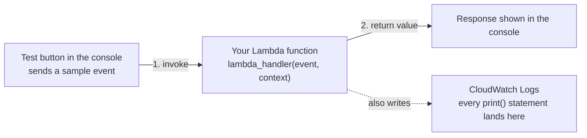

# 05 - Hands-On: Create Your First Lambda Function

> Goal: create, deploy, and test a real Lambda function end-to-end using nothing but the AWS Console — see exactly where your code lives, how it runs, and where its output goes. Entirely via the **AWS Console**, no CLI.

---

## 1. What you're about to build

A tiny Python function that takes a name as input and returns a greeting — simple enough to focus entirely on the **mechanics** of Lambda (create, deploy, test, view logs) rather than on the code itself.



---

## 2. Create the function

1. **Lambda console** → **Functions** → **Create function**.
2. **Author from scratch** (the default; the other two options, **Use a blueprint** and **Container image**, are covered in the [Lambda Blueprints](06-Lambda-Blueprints.md) and [Lambda Container Images](07-Lambda-Container-Images.md) notes).
3. **Basic information**:
   - **Function name**: `hello-lambda-demo`.
   - **Runtime**: pick the newest **Python 3.x** version in the dropdown — at the time of writing this is **Python 3.14** (AWS periodically adds newer versions and marks old ones deprecated, so always prefer the newest non-deprecated one offered, rather than memorizing a specific version number).
   - **Permissions**: this section is now just informational text — *"By default, Lambda will create an execution role with permissions to upload logs to Amazon CloudWatch Logs."* There's no separate expandable control here anymore; picking a **different** role is done under **Additional settings** → **Custom execution role** (Step 5 below) if you ever need it. For this demo, leave it at the default.
4. **Custom settings** — two toggles the console now shows directly on this page, both **off** by default:
   - **Durable execution**: adds automatic failure recovery for stateful applications — a more advanced capability, not needed here.
   - **EC2 capacity provider**: runs the function on your own chosen EC2 instance types instead of Lambda's default serverless compute.
   - Leave both **off** — note the console's own warning here: **"Cannot add or remove after creation"**, so this is a real, one-time decision if you ever do need either later.
5. **Additional settings** (collapsed by default, expand with the ▶ arrow) — inside, the **General** subsection has an **ARM64 architecture** toggle (**off** by default, meaning x86_64 — turn it on to switch to arm64) and a **Custom execution role** toggle (also off by default). Turning *that* one on slides out a separate **Configure custom execution role** panel on the right side of the page, with a **Choose an existing role** dropdown or a **Create new role** button — that's the actual current path to a non-default execution role, not an inline field on the main page. VPC, code signing, KMS key, and tags also live in this same expanded section. Leave everything here at its default (collapsed, both toggles off) for this demo — the defaults (x86_64 architecture, the auto-created basic execution role) are exactly what you want.
6. **Create function**.

---

## 3. Write and deploy the code

1. On the function's page, scroll to the **Code source** panel — the console's built-in code editor.
2. Replace the default template in `lambda_function.py` with:
   ```python
   import json

   def lambda_handler(event, context):
       name = event.get("name", "World")
       message = f"Hello, {name}! This response came from AWS Lambda."
       print(f"Received a request for: {name}")   # this shows up in CloudWatch Logs

       return {
           "statusCode": 200,
           "body": json.dumps({"message": message})
       }
   ```
3. **Deploy** (the orange button above the editor) — this is the step that actually saves your code changes to the function; editing the code alone doesn't take effect until you deploy it.

---

## 4. Test it

1. Click **Test** (next to Deploy) → **Configure test event**.
2. **Event name**: `MyTestEvent`.
3. **Event JSON**: replace the sample with:
   ```json
   {
     "name": "Deepak"
   }
   ```
4. **Save**, then click **Test** again.
5. The console shows an **Execution results** panel with the returned value (`"message": "Hello, Deepak! ..."`) and the invocation's **Duration**, **Billed Duration**, and **Memory Used** — Section 5 below covers where the full logs for this invocation actually live now (the **Monitor** tab, not this panel).


---

## 5. View the logs

The function page's top-level tabs are **Code**, **Test**, **Monitor**, **Configuration**, **Aliases**, **Versions** — logs live under **Monitor**, not tucked inside the Test tab's result panel:

1. Click the **Monitor** tab.
2. At the top, **CloudWatch metrics** shows graphs for **Invocations**, **Duration**, **Error count and success rate**, **Throttles**, **Total concurrent executions**, and **Recursive invocations** — a quick visual health check across all recent activity, with a **View CloudWatch logs** button in the top-right if you want the full CloudWatch console.
3. Scroll down on the same **Monitor** tab to **CloudWatch Logs** — this is the fastest way to see an individual invocation's output without leaving the Lambda console at all:
   - **Recent invocations**: a table listing each recent request's **Timestamp**, **RequestId**, **LogStream**, **DurationInMS**, **BilledDurationInMS**, **MemorySetInMB**, and **MemoryUsedInMB**. Click the ▶ next to any row to expand it and see that invocation's actual `print()` output inline.
   - **Most expensive invocations in GB-seconds**: the same kind of table, sorted by cost (memory assigned × billed duration) — useful once you're optimizing rather than just debugging.
   - **Failed invocations**: populated only when something actually errors.
   - Click a row's **LogStream** link to jump straight into that specific stream in the full CloudWatch console if you need more context than the inline table shows.

If you'd rather go straight to CloudWatch: **Configuration** tab → **Monitoring and operations tools** (in the left-hand list) → **Logging configuration** shows the exact **CloudWatch log group** name (`/aws/lambda/hello-lambda-demo`) as a clickable link.

> 🧠 Every Lambda function automatically gets its own CloudWatch log group (named `/aws/lambda/<function-name>`) — this is possible because of the basic execution role from Section 2, which specifically grants permission to write there. No extra setup needed for basic logging.


---

## 6. Recap

- Creating a function needs three real decisions: **how the code gets in** (author from scratch here), **what runtime it runs on**, and **what permissions it runs with** (its execution role).
- **Deploy** saves your code; **Test** actually invokes the function with a sample event and shows you the real result.
- Every invocation's `print()` output and Lambda's own execution metadata land automatically in **CloudWatch Logs**, thanks to the default execution role.
- Next: the [Lambda Blueprints](06-Lambda-Blueprints.md) note, covering a faster way to start a function that's already wired up for a common use case.

### Sources
- [Create your first Lambda function — AWS docs](https://docs.aws.amazon.com/lambda/latest/dg/getting-started.html)
- [Lambda function handler in Python — AWS docs](https://docs.aws.amazon.com/lambda/latest/dg/python-handler.html)
