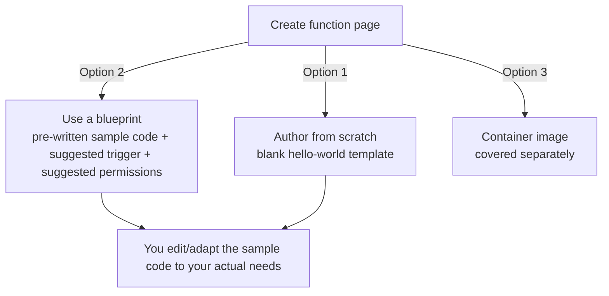

# 06 - Lambda Blueprints

> Goal: understand what a Lambda Blueprint is and when reaching for one saves real time — a starting point for common patterns, not a separate AWS service.

---

## 1. What a Blueprint actually is

The [Create Your First Lambda Function](05-Create-First-Lambda-Function-HandsOn.md) note used **Author from scratch** — a blank template with a bare-minimum "hello world" handler. A **Blueprint** is the alternative: a **pre-written sample function**, already wired up for a common, specific use case (e.g. "resize an image uploaded to S3," "process a DynamoDB stream," "respond to an Alexa skill"), that AWS maintains and lets you start from instead of a blank file.

> 🧠 **Simple analogy**: Author from scratch is a blank document. A Blueprint is a **template document** — like starting a resume from a pre-formatted template instead of a blank page. You still edit and adapt it, but the structure and the boilerplate are already there.

---

## 2. Architecture & workflow — where Blueprints fit into function creation

A Blueprint doesn't create anything different from what "Author from scratch" produces — it's still a normal Lambda function afterward, editable the exact same way. The only difference is what code (and sometimes what trigger/permission suggestions) you **start** with.

---

## 3. What a Blueprint typically includes

- **Sample handler code** in a specific language, already solving a specific problem (not just a "hello world").
- Often, **suggested IAM permissions** relevant to that use case (e.g. an S3-processing blueprint suggests S3 read permissions on the execution role).
- Sometimes, a **suggested trigger configuration** to go with it.

---

## 4. Use a Blueprint (Console)

1. **Lambda console** → **Functions** → **Create function**.
2. **Use a blueprint**.
3. In the **Blueprints** filter box, search for a keyword — e.g. type `s3` to see blueprints related to S3 events, or `hello-world` for a simple starting example.
4. Select a blueprint from the results (its description explains what it does) → **Configure**.
5. **Basic information**: give it a **Function name**, confirm the **Execution role** option (same choices as [Create Your First Lambda Function](05-Create-First-Lambda-Function-HandsOn.md)'s Section 2).
6. Some blueprints show additional configuration fields specific to that use case (e.g. which S3 bucket/event type to suggest a trigger for) — fill these in or leave them for later.
7. **Create function**.
8. The function opens with the blueprint's sample code already in the editor — read through it, adapt it to your actual requirement, then **Deploy** exactly like in note 05.

---

## 5. When to use a Blueprint vs. Author from scratch

| Situation | Better choice |
|---|---|
| You're learning a new event source pattern (e.g. "how do people usually structure an S3-triggered function?") | **Blueprint** — see a working example first |
| Your use case is genuinely novel or doesn't match any available blueprint closely | **Author from scratch** |
| You want the absolute minimum boilerplate, fully under your control from line one | **Author from scratch** |
| You want a faster starting point for a well-known, common integration | **Blueprint** |

> 🎯 **Exam tip:** Blueprints are a minor, practical-knowledge exam topic — the key fact to retain is that a Blueprint is just a **starting template with sample code**, not a distinct deployment mechanism or a different kind of function. Don't confuse it with **Lambda Layers** (the [Lambda Layers](21-Lambda-Layers.md) note) — a Layer shares *reusable code/libraries* across functions; a Blueprint is a one-time *starting point* for a single function's own code.

---

## 6. Recap

- A Blueprint is a **pre-written sample function** for a common use case — a faster starting point than a blank file, not a different service or deployment type.
- Blueprints often come with suggested permissions and trigger configuration relevant to their use case.
- After creation, a function built from a Blueprint behaves and is edited exactly like one built from scratch.
- Next: the [Lambda Container Images](07-Lambda-Container-Images.md) note, covering the third way to package Lambda code — as a full container image instead of a small code snippet.

### Sources
- [Using AWS Lambda blueprints — AWS docs](https://docs.aws.amazon.com/lambda/latest/dg/gettingstarted-features.html)
- [Create your first Lambda function — AWS docs](https://docs.aws.amazon.com/lambda/latest/dg/getting-started.html)
