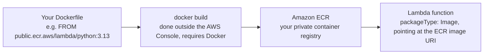

# 07 - Lambda Container Images

> Goal: understand the third way to package Lambda code — a **container image** instead of a small `.zip` — what problem it solves, and why this particular topic is explained conceptually here rather than as a console hands-on (the AWS Console alone can't build a container image; that genuinely needs Docker).

---

## 1. The two ways to package a Lambda function

Every Lambda function is deployed as one of two **package types**:

| Package type | What it is | Size limit |
|---|---|---|
| **Zip** (what notes 05 and 06 used) | Your code + any dependencies, zipped up | **250 MB** unzipped (function + all attached [Lambda Layers](21-Lambda-Layers.md) combined) |
| **Image** (this note) | A full **container image**, stored in **Amazon ECR** | **10 GB** |

> 🧠 **Simple analogy**: a `.zip` package is like mailing a single folder of documents — small, fast, simple. A container image is like shipping an entire pre-built toolbox — much bigger, but it can contain a whole operating environment (specific OS libraries, large ML models, custom binaries) that wouldn't fit, or wouldn't even be installable, in a small zip.

---

## 2. Why container images exist — the problem they solve

The 250MB zip limit is genuinely restrictive for some real workloads:

- **Large machine learning libraries** (PyTorch, TensorFlow) can easily be several hundred MB to multiple GB on their own.
- **Custom system dependencies** — e.g. `ffmpeg` for video processing, or a specific compiled binary — sometimes can't be installed as a simple zipped folder at all.
- **Teams already using Docker** for every other service (ECS, EKS) want Lambda to fit the same build/deploy pipeline, instead of maintaining a totally separate zip-packaging process just for Lambda.

Container image support directly answers all three: up to **10 GB**, and the image can contain almost anything a normal container can — as long as it also satisfies one specific requirement (Section 3).

---

## 3. Architecture & workflow — how a container image becomes a Lambda function

The critical requirement: whatever image you build **must implement the Lambda Runtime API** — either by starting from one of AWS's official base images (which already implement it), or by adding AWS's open-sourced **Runtime Interface Client (RIC)** to your own custom base image. Without this, Lambda has no way to actually invoke code inside your container — a container image built for, say, a plain web server wouldn't work as-is.

> ⚠️ **Why this note has no hands-on console walkthrough**: building the container image itself (writing a Dockerfile, running `docker build`, pushing to ECR with `docker push`) happens **outside** the AWS Console entirely, using Docker on your own machine or in a CI pipeline. This is a genuine, unavoidable exception to "everything via the console" — the AWS Console can create a Lambda function **from** an image that already exists in ECR (picking "Container image," browsing your ECR repositories, selecting a tag), but it cannot build that image from source code for you. Rather than present a workaround that isn't really console-only, this note stays conceptual.

---

## 4. Zip vs. Container image — choosing between them

| | Zip (+ Layers) | Container image |
|---|---|---|
| Max size | 250 MB unzipped | 10 GB |
| Build tooling needed | None — edit directly in the console | Docker, locally or in CI |
| Good for | Typical small functions, glue code, simple automation | Large ML models, custom binaries/OS dependencies, teams standardized on Docker |
| Console-editable after creation | Yes — inline code editor | No — you must rebuild and push a new image, then point Lambda at the new tag |

---

## 5. What stays the same either way

This is worth remembering for the exam: switching to a container image doesn't change Lambda's fundamental behavior. It's still billed the same way (per invocation/duration), still has the same 15-minute maximum execution time, still scales automatically per-request, and still uses an execution role for permissions (the [Lambda Execution Role](08-Lambda-Execution-Role.md) note). Packaging format is purely about **how the code gets in**, not how Lambda runs it.

> 🎯 **Exam tip:** "a function needs to package a large ML library" or "a team wants to reuse their existing Docker build pipeline for Lambda" → **container image packaging**. A scenario that's just "the function is a bit too big for the zip's default limits" doesn't automatically mean container images — check the [Lambda Layers](21-Lambda-Layers.md) note first, since layers can also help fit more code in, up to that same 250MB combined ceiling.

---

## 6. Recap

- Lambda supports two package types: **Zip** (250MB unzipped, editable in-console) and **Container image** (10GB, stored in ECR).
- A container image must implement the **Lambda Runtime API** — either via an AWS base image or the Runtime Interface Client added to a custom one.
- Building and pushing the image genuinely requires Docker outside the AWS Console — this is a real, acknowledged limit of a console-only workflow, not something worked around here.
- Everything else about how Lambda runs (billing, 15-minute limit, scaling, execution role) is unaffected by which packaging format you choose.
- Next: the [Lambda Execution Role](08-Lambda-Execution-Role.md) note, covering the permissions every Lambda function runs with, regardless of packaging format.

### Sources
- [Deploying Lambda functions as container images — AWS docs](https://docs.aws.amazon.com/lambda/latest/dg/images-create.html)
- [Lambda quotas — AWS docs](https://docs.aws.amazon.com/lambda/latest/dg/gettingstarted-limits.html)
- [AWS base images for Lambda — AWS docs](https://docs.aws.amazon.com/lambda/latest/dg/images-create.html#images-create-from-base)
