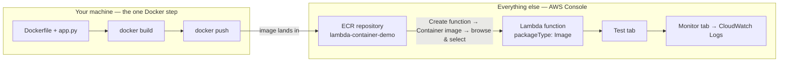

# 07.01 - Hands-On Demo: Lambda Container Images in Practice

> Goal: actually build, push, and deploy a real container-image Lambda function — not just read about it. Every **AWS-side** action (creating the ECR repository, creating the Lambda function, testing it, viewing its logs) is via the **AWS Console**. The one unavoidable exception, exactly as flagged in the [Lambda Container Images](07-Lambda-Container-Images.md) note's Section 4, is building and pushing the Docker image itself — that genuinely requires Docker, run locally, once. Nothing else in this demo uses the CLI.

---

## 1. Why this one demo needs a local step, and what stays console-only

The [Lambda Container Images](07-Lambda-Container-Images.md) note explained *why* this is the one topic in this whole series that can't be 100% console-only: the AWS Console can create a Lambda function **from** an image that already exists in ECR, but it cannot build that image **from source code**. This demo draws the line exactly there:

| Action | Where it happens |
|---|---|
| Create the ECR repository | **AWS Console** |
| Write the Dockerfile and handler code | Locally (just text files, no AWS interaction) |
| `docker build` the image | **Locally — the one Docker step** |
| Authenticate Docker to ECR (`aws ecr get-login-password`) | **Locally — requires the AWS CLI installed/configured, purely to log Docker in, not to create or configure any AWS resource** |
| `docker push` the image to ECR | **Locally — the other half of the one Docker step** |
| Create the Lambda function from that image | **AWS Console** |
| Test the function, view its logs, update it later | **AWS Console** |

> 🧠 This mirrors the exact precedent the [Lambda Layers Lab](22-Lambda-Layers-Lab-HandsOn.md) note set: one clearly-flagged, minimal local step to produce an artifact (there, a `.zip`; here, a container image) that the AWS Console genuinely cannot produce on its own — everything that touches an actual AWS resource still happens in the console.

---

## 2. What you're building

A tiny Python Lambda handler, packaged as a Docker image built on top of AWS's own official Lambda base image, pushed to a private ECR repository, then deployed and tested exactly like any other function.



---

## 3. Step 1 — Create the ECR repository (Console)

1. **Amazon ECR console** → **Repositories** → **Create repository**.
2. **Visibility settings**: **Private**.
3. **Repository name**: `lambda-container-demo`.
4. Leave **Tag immutability**, **Scan on push**, and **Encryption settings** at their defaults.
5. **Create repository**.
6. Open the new repository → **View push commands** (top-right button). This shows the **exact** authenticate/build/tag/push commands for *your* account and region — copy these rather than retyping the ones below, since your account ID and region will differ.

---

## 4. Step 2 — Write the function code and Dockerfile (locally)

Create a new folder locally, e.g. `lambda-container-demo/`, with two files:

**`app.py`**
```python
import platform

def lambda_handler(event, context):
    name = event.get("name", "World")
    message = f"Hello, {name}! This response came from a CONTAINER IMAGE running Python {platform.python_version()}."
    print(f"Container image invoked for: {name}")   # shows up in CloudWatch Logs, same as any other function

    return {
        "statusCode": 200,
        "body": message
    }
```

**`Dockerfile`**
```dockerfile
FROM public.ecr.aws/lambda/python:3.13

COPY app.py ${LAMBDA_TASK_ROOT}

CMD ["app.lambda_handler"]
```

> 🧠 `public.ecr.aws/lambda/python:3.13` is one of AWS's own official base images — it already implements the Lambda Runtime API (the [Lambda Container Images](07-Lambda-Container-Images.md) note's Section 4 requirement), so all this Dockerfile needs to do is copy your code in and tell it which function to call. `${LAMBDA_TASK_ROOT}` is an environment variable the base image already defines, pointing at the correct working directory.

---

## 5. Step 3 — Build and push the image (the one local/Docker step)

From inside the `lambda-container-demo/` folder, run the four commands from Section 3, Step 6 (yours will have your actual account ID and region in place of the placeholders):

```bash
aws ecr get-login-password --region ap-south-1 | \
  docker login --username AWS --password-stdin 339712902352.dkr.ecr.ap-south-1.amazonaws.com/lambda-container-demo

docker build -t lambda-container-demo .

docker tag lambda-container-demo:latest 339712902352.dkr.ecr.ap-south-1.amazonaws.com/lambda-container-demo
  
docker push 339712902352.dkr.ecr.ap-south-1.amazonaws.com/lambda-container-demo:latest
```

Once the push finishes, refresh the repository's **Images** tab in the ECR console — you should see a new image with the `latest` tag and a real size (typically 60-70MB+ for this small Python base image).

---

## 6. Step 4 — Create the Lambda function from the image (Console)

1. **Lambda console** → **Functions** → **Create function**.
2. **Container image**.
3. **Function name**: `container-image-demo`.
4. **Container image URI** → **Browse images** → select the `lambda-container-demo` repository → select the `latest` tag → **Select image**.
5. Expand **Additional settings** → **General** → leave the **ARM64 architecture** toggle **off** (i.e. x86_64 — must match what your local Docker build produced; see Section 9's troubleshooting if this mismatches). This is the same **Additional settings** location the [Create Your First Lambda Function](05-Create-First-Lambda-Function-HandsOn.md) note's Section 2 describes for zip-based functions — architecture isn't a separate top-level field for container images either.
6. Leave the rest at their defaults (the **Permissions** box stays informational text only — the auto-created basic execution role every other function in this folder has used; don't turn on the **Custom execution role** toggle).
7. **Create function**. This step alone can take noticeably longer than a zip-based function — Lambda is pulling and preparing your actual container image, not just a small code file.


---

## 7. Step 5 — Test it (Console)

1. **Test** tab → **Create new event**.
2. **Event name**: `ContainerTest`. **Event JSON**:
   ```json
   { "name": "Deepak" }
   ```
3. **Save** → **Test**.
4. Expected result: `"Hello, Deepak! This response came from a CONTAINER IMAGE running Python 3.13."` — proof the function is genuinely running your code from inside the container image, not some fallback zip behavior.
5. **Monitor** tab → scroll to **CloudWatch Logs** → **Recent invocations** (the same flow the [Create Your First Lambda Function](05-Create-First-Lambda-Function-HandsOn.md) note's Section 5 corrected) → expand the row → confirm your `print("Container image invoked for: Deepak")` line is there, exactly like a zip-based function's logs.


---

## 8. Step 6 — Update the code and redeploy a new image

This is the part that's genuinely different from a zip-based function's workflow, and worth experiencing directly:

1. Locally, edit `app.py` — change the message to something like `"UPDATED container image response!"`.
2. Rebuild and push **the same way** as Section 5 (`docker build` → `docker tag` → `docker push`, same `latest` tag).
3. Back in the **Lambda console** → the function's **Image** tab (replaces the **Code** tab you'd see on a zip-based function) → **Deploy new image**.
4. Browse to the same repository/tag again → **Save**.
5. **Test** again with the same event — you should now see the updated message.

> ⚠️ Notice there was no inline code editor anywhere in this whole demo — this is exactly the [Lambda Container Images](07-Lambda-Container-Images.md) note's Section 5 trade-off made concrete: *"Console-editable after creation? No — you must rebuild and push a new image, then point Lambda at the new tag."* Every code change here means a full local rebuild-and-push cycle, unlike notes 05's or 06's in-console edit-and-Deploy.

---

## 9. Troubleshooting

| Symptom | Likely cause |
|---|---|
| `docker push` fails with `no basic auth credentials` | The `docker login` command (Section 5's first command) either wasn't run, or its output/token expired — ECR login tokens are short-lived; re-run it |
| Lambda function creation fails with an architecture mismatch error | Your local machine built an `arm64` image (common on newer Apple Silicon Macs by default) but the function was created expecting `x86_64`, or vice versa — either add `--platform linux/amd64` to your `docker build` command, or set the function's **Architecture** (Section 6, Step 5) to match whatever your build actually produced |
| Function times out or errors with "Runtime.InvalidEntrypoint" | The Dockerfile's `CMD` doesn't match the actual file/function name — confirm it's `["app.lambda_handler"]` matching `app.py`'s `def lambda_handler(...)` |
| "Deploy new image" doesn't seem to pick up your code change | You pushed to a **different** tag than the one Lambda is pointed at, or the push in Section 8 didn't actually complete — re-check the ECR console's Images tab for a recent **Pushed at** timestamp |

---

## 10. Cleanup

1. **Lambda console** → delete `container-image-demo`.
2. **ECR console** → `lambda-container-demo` repository → delete all images, then delete the repository itself.
3. Locally: `docker image rm lambda-container-demo` (and the tagged ECR-URI version) to remove the images from your own machine if you don't need them anymore.

---

## 11. Recap

- Every **AWS-side** action in this demo — creating the ECR repo, creating the function, testing it, viewing logs, redeploying — was done entirely in the **AWS Console**, exactly like every other note in this folder.
- The one unavoidable exception was building and pushing the Docker image itself, done locally with Docker (and the AWS CLI, only for the one-time ECR login) — the same kind of minimal, clearly-scoped exception the [Lambda Layers Lab](22-Lambda-Layers-Lab-HandsOn.md) note already established for packaging a `.zip`.
- Unlike a zip-based function, a container-image function has **no inline code editor** — every code change requires a full local rebuild-and-push, then an explicit **Deploy new image** step in the console.
- Everything else about how the function actually runs — testing, logs, execution role, billing — is identical to every zip-based function built earlier in this folder.

### Sources
- [Create a Lambda function using a container image — AWS docs](https://docs.aws.amazon.com/lambda/latest/dg/images-create.html)
- [AWS base images for Lambda — AWS docs](https://docs.aws.amazon.com/lambda/latest/dg/images-create.html#images-create-from-base)
- [Pushing an image to an Amazon ECR repository — AWS docs](https://docs.aws.amazon.com/AmazonECR/latest/userguide/getting-started-cli.html)
