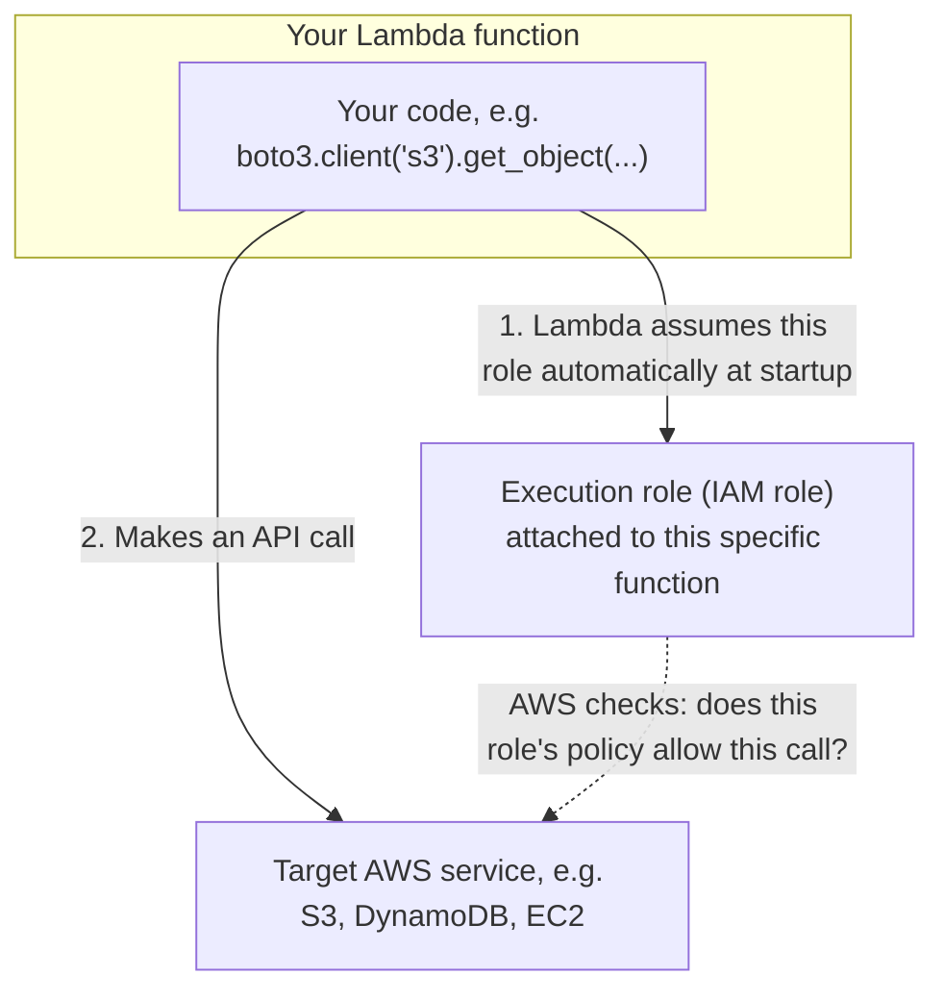

# 08 - Lambda Execution Role

> Goal: understand exactly what a Lambda function is (and isn't) allowed to do, and why — a genuinely exam-critical topic, since almost every real Lambda "it doesn't work" scenario on the SAA-C03 traces back to this.

---

## 1. What an execution role actually is

A Lambda function has **no permissions of its own** by default — none. Every single AWS API call your code makes inside the function (read an S3 object, write to DynamoDB, start an EC2 instance) is only allowed if the function's **execution role** — an IAM role — explicitly grants it.

> 🧠 **Simple analogy**: think of the execution role as a **name badge with a list of doors it can open**, worn by your function every time it runs. Your code can *try* to open any door, but if that door isn't on the badge's list, AWS blocks it with an "Access Denied" error — regardless of how correct your code otherwise is.

---

## 2. Architecture & workflow — where the execution role sits

You never manually "log in" as the role inside your code — the [AWS SDK](https://docs.aws.amazon.com/sdkref/latest/guide/overview.html) (e.g. `boto3` in Python) automatically picks up the execution role's temporary credentials from the function's environment. This is exactly why the [Create Your First Lambda Function](05-Create-First-Lambda-Function-HandsOn.md) note's demo function never had to handle any AWS access keys.

---

## 3. What's in the role by default

The [Create Your First Lambda Function](05-Create-First-Lambda-Function-HandsOn.md) note's Section 2 chose **"Create a new role with basic Lambda permissions"** — this automatically attaches the AWS-managed policy **`AWSLambdaBasicExecutionRole`**, which grants exactly three actions, all scoped to CloudWatch Logs:

- `logs:CreateLogGroup`
- `logs:CreateLogStream`
- `logs:PutLogEvents`

That's it — no S3 access, no DynamoDB access, no EC2 access. Any function that needs to touch another AWS service needs that permission **added** to its role first.

---

## 4. View and extend the execution role (Console)

1. Open the `hello-lambda-demo` function from the [Create Your First Lambda Function](05-Create-First-Lambda-Function-HandsOn.md) note → **Configuration** tab → **Permissions**.
2. Under **Execution role**, click the **Role name** link — this opens the role directly in the **IAM console**.
3. **Permissions** tab → you'll see `AWSLambdaBasicExecutionRole` already attached.
4. **Add permissions** → **Attach policies** → search for, e.g., `AmazonS3ReadOnlyAccess` → select it → **Add permissions**.
5. Your Lambda function can now call S3 read operations (`GetObject`, `ListBucket`, etc.) the next time it runs — no redeployment of the function's code needed, since the role is checked at call-time, not baked into the code.

> ⚠️ **Least privilege matters here.** `AmazonS3ReadOnlyAccess` above grants read access to **every** S3 bucket in the account — fine for a quick demo, risky in production. A real function should get a **custom policy** scoped to only the specific bucket(s) and actions it actually needs (e.g. `s3:GetObject` on `arn:aws:s3:::my-specific-bucket/*` only) — the same least-privilege principle covered for other services elsewhere in this repo's `IAM` folder.

---

## 5. Execution role vs. resource-based policy — a commonly confused pair

This is worth separating clearly, because the exam loves testing the difference:

| | Execution role | Resource-based (Lambda) policy |
|---|---|---|
| **Question it answers** | "What can **my function** do to other AWS services?" | "**Who** is allowed to invoke my function?" |
| **Attached to** | The function, as an IAM role | The function, as a resource policy |
| **Example** | Grants the function permission to read from S3 | Grants S3 (as a service) permission to invoke the function when a new object is uploaded |

When you add an S3 trigger to a function (covered in the [Lambda Triggers](10-Lambda-Triggers.md) note), the console automatically adds a **resource-based policy** statement allowing S3 to invoke the function — that's a completely separate permission from the execution role, and it's a different direction: one is "what I can do to others," the other is "who can do something to me."

> 🎯 **Exam tip:** "Lambda function gets Access Denied calling another AWS service" → check the **execution role**. "An event source (S3, SNS, EventBridge) can't seem to trigger the function at all" → check the **resource-based policy** (usually auto-added by the console when you add a trigger, but can be missing if the trigger was configured a different way).

---

## 6. Recap

- A Lambda function has **zero permissions by default** — every AWS API call it makes must be explicitly allowed by its **execution role**.
- The default role from "Create a new role with basic Lambda permissions" only allows writing to CloudWatch Logs — nothing else.
- Extending a function's permissions means editing its execution role's IAM policies, not its code — and takes effect immediately, no redeploy needed.
- The execution role (what the function can do) is a completely different mechanism from a **resource-based policy** (who can invoke the function).
- Next: the [Lambda EC2 Automation hands-on demo](09-Lambda-EC2-Automation-HandsOn.md) — a real, practical use of exactly this execution-role mechanism, where a function needs EC2 permissions added before it can start/stop an instance.

### Sources
- [Lambda execution role — AWS docs](https://docs.aws.amazon.com/lambda/latest/dg/lambda-intro-execution-role.html)
- [AWSLambdaBasicExecutionRole managed policy — AWS docs](https://docs.aws.amazon.com/aws-managed-policy/latest/reference/AWSLambdaBasicExecutionRole.html)
- [Using resource-based policies for Lambda — AWS docs](https://docs.aws.amazon.com/lambda/latest/dg/access-control-resource-based.html)
