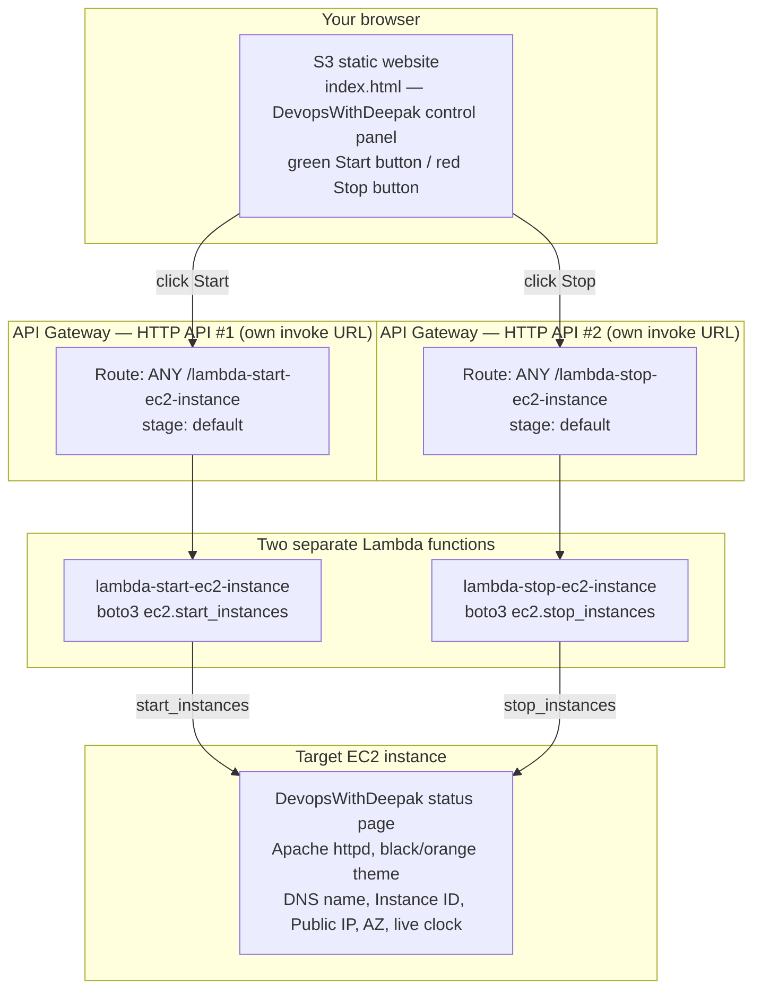

# 09-10.01 - Hands-On Demo: EC2 Start/Stop Automation via Lambda, API Gateway, and an S3 Control Panel

> Goal: combine the [Lambda EC2 Automation hands-on demo](09-Lambda-EC2-Automation-HandsOn.md) note's "Lambda controls EC2" idea with the [Lambda Triggers](10-Lambda-Triggers.md) note's "something else presses the invoke button" idea, and take both all the way to a real, clickable web page — a themed EC2 status page, two separate Lambda functions (one to start, one to stop), each with **its own dedicated API Gateway HTTP API** created directly from the Lambda console's own **+ Add trigger** button, and an S3-hosted static control panel with a green **Start** button and a red **Stop** button that actually trigger them. Every AWS-side action is via the **AWS Console**, no CLI, no automation — only the EC2 **User data** box (the console's own way of accepting a boot script, same exception already used in the [CloudFront Origin Group Failover demo](../Cloudfront_CDN/15.01-Origin-Group-Failover_Demo.md)).

---

## 1. What you're building



This is deliberately the same shape as a real "internal ops tool" pattern: a tiny static front end, a thin API layer, and small single-purpose Lambda functions doing exactly one thing each — no framework, no server to manage anywhere in the chain. Each function gets its **own** API Gateway HTTP API (its own API ID, its own invoke URL) rather than sharing one API with multiple routes — the simplest possible path when creating the trigger straight from each function's own page.

---

## 2. Step 1 — Launch and theme the target EC2 instance

### Step 1a — Launch the instance
1. **EC2 console** → **Instances** → **Launch instances**.
2. **Name**: `DevopsWithDeepak-Lambda-Target`.
3. **Application and OS Images**: **Amazon Linux 2023 AMI** (Free tier eligible).
4. **Instance type**: `t2.micro` (Free tier eligible).
5. **Key pair**: **Proceed without a key pair** — nothing here needs SSH; the page is built entirely by the user data script at boot.
6. **Network settings** → **Edit**:
   - **Auto-assign public IP**: **Enable**.
   - **Firewall (security groups)**: **Create security group** → **Add security group rule**: **Type**: `HTTP`, **Source type**: `Anywhere` (`0.0.0.0/0`), so you can view the status page in a browser.
7. **Configure storage**: leave the default (8 GiB gp3).
8. **Advanced details** → scroll to **User data** → paste:
   ```bash
   #!/bin/bash
   dnf install -y httpd
   systemctl enable --now httpd

   TOKEN=$(curl -s -X PUT "http://169.254.169.254/latest/api/token" -H "X-aws-ec2-metadata-token-ttl-seconds: 21600")
   PUBLIC_IP=$(curl -s -H "X-aws-ec2-metadata-token: $TOKEN" http://169.254.169.254/latest/meta-data/public-ipv4)
   PUBLIC_DNS=$(curl -s -H "X-aws-ec2-metadata-token: $TOKEN" http://169.254.169.254/latest/meta-data/public-hostname)
   INSTANCE_ID=$(curl -s -H "X-aws-ec2-metadata-token: $TOKEN" http://169.254.169.254/latest/meta-data/instance-id)
   AZ=$(curl -s -H "X-aws-ec2-metadata-token: $TOKEN" http://169.254.169.254/latest/meta-data/placement/availability-zone)

   cat > /var/www/html/index.html <<'PAGE'
   <!DOCTYPE html>
   <html lang="en">
   <head>
   <meta charset="UTF-8">
   <title>DevopsWithDeepak - Lambda</title>
   <style>
     :root { --aws-orange:#FF9900; --aws-dark:#131A22; --aws-darker:#0F1111; --aws-text:#E9ECEF; }
     * { box-sizing:border-box; margin:0; padding:0; }
     body {
       background: radial-gradient(circle at top, #1B2430, var(--aws-darker));
       color: var(--aws-text);
       font-family: 'Segoe UI', Arial, sans-serif;
       min-height: 100vh;
       display: flex; align-items: center; justify-content: center;
       padding: 20px;
     }
     .card {
       background: var(--aws-dark);
       border: 1px solid #2b3542;
       border-top: 4px solid var(--aws-orange);
       border-radius: 12px;
       max-width: 640px; width: 100%;
       padding: 36px 40px;
       box-shadow: 0 20px 60px rgba(0,0,0,0.5);
     }
     .badge {
       display: inline-block;
       background: var(--aws-orange);
       color: #131A22;
       font-weight: 700; font-size: 12px; letter-spacing: 1px;
       padding: 6px 14px; border-radius: 999px;
       text-transform: uppercase;
       margin-bottom: 18px;
     }
     h1 { font-size: 28px; margin-bottom: 4px; }
     h1 span { color: var(--aws-orange); }
     .subtitle { color:#9AA5B1; margin-bottom:28px; font-size:14px; }
     .clock {
       font-size: 42px; font-weight: 700;
       color: var(--aws-orange); letter-spacing: 2px;
       margin-bottom: 28px;
       font-variant-numeric: tabular-nums;
     }
     .grid { display:grid; grid-template-columns:1fr 1fr; gap:16px; }
     .field { background:#0F1111; border:1px solid #2b3542; border-radius:8px; padding:14px 16px; }
     .field .label { color:#9AA5B1; font-size:11px; text-transform:uppercase; letter-spacing:1px; margin-bottom:6px; }
     .field .value { color:#fff; font-size:14px; font-family:Consolas,Monaco,monospace; word-break:break-all; }
     footer { margin-top:28px; text-align:center; color:#5C6773; font-size:12px; }
   </style>
   </head>
   <body>
     <div class="card">
       <span class="badge">EC2 Automation Target</span>
       <h1>DevopsWith<span>Deepak</span> - Lambda</h1>
       <div class="subtitle">This instance is remotely started/stopped by a Lambda function, via API Gateway</div>
       <div class="clock" id="clock">--:--:--</div>
       <div class="grid">
         <div class="field"><div class="label">Public DNS</div><div class="value">__PUBLIC_DNS__</div></div>
         <div class="field"><div class="label">Public IP</div><div class="value">__PUBLIC_IP__</div></div>
         <div class="field"><div class="label">Instance ID</div><div class="value">__INSTANCE_ID__</div></div>
         <div class="field"><div class="label">Availability Zone</div><div class="value">__AZ__</div></div>
       </div>
       <footer>Served by Apache httpd on EC2 — if you're seeing this, the instance is running.</footer>
     </div>
     <script>
       function tick() {
         var d = new Date();
         var pad = function(n) { return n < 10 ? '0' + n : n; };
         document.getElementById('clock').textContent = pad(d.getHours()) + ':' + pad(d.getMinutes()) + ':' + pad(d.getSeconds());
       }
       tick();
       setInterval(tick, 1000);
     </script>
   </body>
   </html>
   PAGE

   sed -i "s/__PUBLIC_DNS__/$PUBLIC_DNS/; s/__PUBLIC_IP__/$PUBLIC_IP/; s/__INSTANCE_ID__/$INSTANCE_ID/; s/__AZ__/$AZ/" /var/www/html/index.html
   ```
   > 🧠 Same pattern as the [CloudFront Origin Group Failover demo](../Cloudfront_CDN/15.01-Origin-Group-Failover_Demo.md)'s user data script: a **quoted** heredoc delimiter (`<<'PAGE'`) keeps the embedded CSS/JS's own `$` characters from being interpreted by bash, and the `__PLACEHOLDER__` tokens are swapped for real instance metadata **after** the file is written, via `sed`.
9. **Launch instance**.


Instance ID : **i-0a691cd364da58a8d**

### Step 1b — Note the Instance ID
Once the instance shows **Running** and **2/2 checks passed**, copy its **Instance ID** (e.g. `i-0123456789abcdef0`) from the instance list — you'll paste this into **both** Lambda functions' code in Sections 3 and 5. Also open `http://<public-ipv4-dns>/` in a browser to confirm the black/orange **DevopsWithDeepak - Lambda** card renders with a ticking clock and your real DNS/IP/Instance ID/AZ filled in.


---

## 3. Step 2 — Create the Start Lambda function

1. **Lambda console** → **Create function** → **Author from scratch**.
2. **Function name**: `lambda-start-ec2-instance`.
3. **Runtime**: newest Python 3.x available.
4. **Permissions**: leave at the default (auto-creates a basic CloudWatch Logs execution role — the [Create Your First Lambda Function](05-Create-First-Lambda-Function-HandsOn.md) note's Section 2; Section 4 below adds EC2 permissions to it).
5. **Create function**.
6. Replace the code in `lambda_function.py` with:
   ```python
   import boto3

   ec2 = boto3.client('ec2')
   INSTANCE_ID = "i-0123456789abcdef0"  # <-- replace with your real Instance ID from Section 2, Step 1b

   def lambda_handler(event, context):
       ec2.start_instances(InstanceIds=[INSTANCE_ID])
       message = f"Start request sent for instance {INSTANCE_ID}"
       print(message)
       return {
           "statusCode": 200,
           "body": message
       }
   ```
7. **Deploy**.

---

## 4. Step 3 — Grant the execution role EC2 start/stop permissions

The default role only allows writing logs (the [Lambda Execution Role](08-Lambda-Execution-Role.md) note's Section 3) — calling `start_instances()` right now would fail with `AccessDenied`. Attach a scoped inline policy covering **both** actions now, so the second function (Section 5) can reuse this same role instead of repeating this step:

1. **Configuration** tab → **Permissions** → click the **Role name** link (opens IAM console).
2. **Add permissions** → **Create inline policy**.
3. Switch to the **JSON** editor and paste:
   ```json
   {
       "Version": "2012-10-17",
       "Statement": [
           {
               "Effect": "Allow",
               "Action": [
                   "ec2:StartInstances",
                   "ec2:StopInstances",
                   "ec2:DescribeInstances"
               ],
               "Resource": "*"
           }
       ]
   }
   ```
   > 🧠 `Resource: "*"` is used here for the same reason the [Lambda EC2 Automation hands-on demo](09-Lambda-EC2-Automation-HandsOn.md) note's Section 5 used it — scoping `StartInstances`/`StopInstances` to one specific instance ID via IAM conditions needs tag-based conditions that add real complexity for a first automation demo. In production, scope this down to instances carrying a specific tag.
4. **Next** → **Policy name**: `EC2StartStopPolicy` → **Create policy**.

---

## 5. Step 4 — Create the Stop Lambda function, reusing the same role

This function needs **different code** (stop instead of start), but there's no need to repeat the IAM policy step — attach the role you just permissioned in Section 4 directly at creation time:

1. **Lambda console** → **Create function** → **Author from scratch**.
2. **Function name**: `lambda-stop-ec2-instance`.
3. **Runtime**: the same Python version used in Section 3.
4. Expand **Additional settings** → **General** → toggle **Custom execution role** **on**. In the **Configure custom execution role** panel that slides out on the right, **Choose an existing role** → select the role that was auto-created for `lambda-start-ec2-instance` (Section 3) — it already carries the `EC2StartStopPolicy` from Section 4 — → **Save**. This is the same Additional-settings mechanism the [Create Your First Lambda Function](05-Create-First-Lambda-Function-HandsOn.md) note's Section 2 describes.
5. **Create function**.
6. Replace the code in `lambda_function.py` with:
   ```python
   import boto3

   ec2 = boto3.client('ec2')
   INSTANCE_ID = "i-0123456789abcdef0"  # <-- same Instance ID as Section 3

   def lambda_handler(event, context):
       ec2.stop_instances(InstanceIds=[INSTANCE_ID])
       message = f"Stop request sent for instance {INSTANCE_ID}"
       print(message)
       return {
           "statusCode": 200,
           "body": message
       }
   ```
7. **Deploy**


---

## 6. Step 5 — Sanity-check both functions from the console first

Before wiring up API Gateway, confirm each function actually works in isolation — this makes any later problem obviously an API Gateway/CORS issue rather than a Lambda/permissions issue:

1. Open `lambda-start-ec2-instance` → **Test** → **Configure test event** → any event name, JSON can stay `{}` (the code ignores the incoming event entirely — the instance ID is hardcoded) → **Save** → **Test**. Confirm the response body and check the **EC2 console** for the instance transitioning to **Running**.
2. Repeat for `lambda-stop-ec2-instance` → confirm the instance transitions to **Stopping**/**Stopped**.

---

## 7. Step 6 — Add an API Gateway trigger to the Start function, from the Lambda console

Rather than building the API separately in the API Gateway console, create it straight from the function's own page — Lambda's **+ Add trigger** button can create a brand-new HTTP API in one step, dedicated to this one function:

1. Open `lambda-start-ec2-instance` → **Function overview** → **+ Add trigger**.
2. **Trigger configuration**: select **API Gateway**.
3. **Intent**: **Create a new API** (leave selected).
4. **API type**: **HTTP API** (the box with "Build low-latency and cost-effective REST APIs with built-in features such as OIDC and OAuth2, and native CORS support").
5. **Security**: leave at **Open** — no authorizer, so anything with the URL can call it. Fine for this learning demo; a real deployment would put an authorizer or API key requirement here.
6. Expand **Additional settings**:
   - **API name**: leave the auto-filled value, e.g. `lambda-start-ec2-instance-API`.
   - **Deployment stage**: leave at `default`.
   - **Cross-origin resource sharing (CORS)**: **check this box** — the S3-hosted control panel in Section 10 calls this API from a different origin (the S3 website domain), a genuine cross-origin request, and this checkbox is what adds the `Access-Control-Allow-Origin` header to every response so the browser will actually let JavaScript read it.
   - **Enable detailed metrics**: leave unchecked.
7. **Add**.


Lambda automatically attaches the resource-based permission letting this specific API Gateway API invoke the function — the same push-model mechanism the [Lambda Triggers](10-Lambda-Triggers.md) note's Section 2 described, just triggered from the Lambda side of the console instead of the API Gateway side.

### Find the invoke URL
Back on the function's page, the **Function overview** diagram now shows an **API Gateway** box connected to your function. **Configuration** tab → **Triggers** → the new row shows the **API endpoint** — copy it. It follows the pattern:
```
https://<api-id>.execute-api.<region>.amazonaws.com/default/lambda-start-ec2-instance
```
Note this whole URL down as **START_URL** — you'll paste it into the control panel in Section 10.


**START_URL**:  https://3nfmg98lta.execute-api.ap-south-1.amazonaws.com/default/lambda-start-ec2-instance

---

## 8. Step 7 — Add a separate API Gateway trigger to the Stop function

Repeat the exact same steps on the **other** function — this deliberately creates a **second, independent** HTTP API, not a second route on the first one:

1. Open `lambda-stop-ec2-instance` → **Function overview** → **+ Add trigger**.
2. **Trigger configuration**: **API Gateway** → **Intent**: **Create a new API** → **API type**: **HTTP API** → **Security**: **Open**.
3. Expand **Additional settings** → **API name**: leave the auto-filled `lambda-stop-ec2-instance-API` → **Deployment stage**: `default` → check **Cross-origin resource sharing (CORS)** → leave **Enable detailed metrics** unchecked.
4. **Add**.
5. **Configuration** tab → **Triggers** → copy the new **API endpoint**:
   ```
   https://<a-different-api-id>.execute-api.<region>.amazonaws.com/default/lambda-stop-ec2-instance
   ```
   Note this down as **STOP_URL**.


**STOP_URL**: https://bkby725633.execute-api.ap-south-1.amazonaws.com/default/lambda-stop-ec2-instance

You now have **two** completely separate HTTP APIs (two different API IDs, two different invoke URLs) — each one dedicated to a single function, created without ever opening the API Gateway console directly.

---

## 9. Step 8 — Test each API endpoint directly, before touching the front end

1. Paste your **START_URL** directly into a browser's address bar. You should see the plain-text response `Start request sent for instance i-...`, and the **EC2 console** should show the instance transitioning to **Running**.
2. Paste your **STOP_URL** the same way — confirm the instance stops.

This isolates the API Gateway + Lambda chain from the browser/CORS/front-end layer entirely — if this step works but Section 11 doesn't, the problem is specifically in the front end or the CORS checkbox from Sections 7-8, not the APIs themselves.

---

## 10. Step 9 — Build the S3-hosted control panel

### Step 9a — Create the bucket and enable static website hosting
1. **S3 console** → **Create bucket**.
2. **Bucket name**: something globally unique, e.g. `lambda-ec2-control-panel-<your-name-or-date>`.
3. **AWS Region**: any Region you prefer.
4. **Block Public Access settings for this bucket**: uncheck **Block all public access**, then check the acknowledgement box.
5. Leave everything else default → **Create bucket**.
6. Open the bucket → **Properties** tab → **Static website hosting** → **Edit** → **Enable**, **Hosting type**: Host a static website, **Index document**: `index.html` → **Save changes**. Note the **Bucket website endpoint** URL shown.
7. **Permissions** tab → **Bucket policy** → **Edit** → paste (replacing `<BUCKET_NAME>`):
   ```json
   {
     "Version": "2012-10-17",
     "Statement": [
       {
         "Sid": "PublicReadForWebsite",
         "Effect": "Allow",
         "Principal": "*",
         "Action": "s3:GetObject",
         "Resource": "arn:aws:s3:::<BUCKET_NAME>/*"
       }
     ]
   }
   ```
   → **Save changes**.

### Step 9b — Upload the control panel page
This file already exists at [`demo-site/09-10/index.html`](demo-site/09-10/index.html), right next to this note — no need to type it by hand. **Before uploading**, edit the `START_URL` and `STOP_URL` constants near the bottom of the file to your own two invoke URLs from Section 7 and Section 8. Full content shown below for reference:

```html
<!DOCTYPE html>
<html lang="en">
<head>
<meta charset="UTF-8">
<meta name="viewport" content="width=device-width, initial-scale=1.0">
<title>DevopsWithDeepak - Lambda EC2 Control Panel</title>
<style>
  :root { --aws-orange:#FF9900; --aws-dark:#131A22; --aws-darker:#0F1111; --aws-text:#E9ECEF; --green:#2ECC71; --red:#E74C3C; }
  * { box-sizing:border-box; margin:0; padding:0; }
  body {
    background: radial-gradient(circle at top, #1B2430, var(--aws-darker));
    color: var(--aws-text);
    font-family: 'Segoe UI', Arial, sans-serif;
    min-height: 100vh;
    display: flex; align-items: center; justify-content: center;
    padding: 20px;
  }
  .card {
    background: var(--aws-dark);
    border: 1px solid #2b3542;
    border-top: 4px solid var(--aws-orange);
    border-radius: 12px;
    max-width: 640px; width: 100%;
    padding: 36px 40px;
    box-shadow: 0 20px 60px rgba(0,0,0,0.5);
  }
  .badge {
    display: inline-block;
    background: var(--aws-orange);
    color: #131A22;
    font-weight: 700; font-size: 12px; letter-spacing: 1px;
    padding: 6px 14px; border-radius: 999px;
    text-transform: uppercase;
    margin-bottom: 18px;
  }
  h1 { font-size: 28px; margin-bottom: 4px; }
  h1 span { color: var(--aws-orange); }
  .subtitle { color:#9AA5B1; margin-bottom:28px; font-size:14px; }
  .clock {
    font-size: 34px; font-weight: 700;
    color: var(--aws-orange); letter-spacing: 2px;
    margin-bottom: 28px;
    font-variant-numeric: tabular-nums;
  }
  .field { background:#0F1111; border:1px solid #2b3542; border-radius:8px; padding:14px 16px; margin-bottom: 14px; }
  .field .label { color:#9AA5B1; font-size:11px; text-transform:uppercase; letter-spacing:1px; margin-bottom:6px; }
  .field .value { color:#fff; font-size:13px; font-family:Consolas,Monaco,monospace; word-break:break-all; }
  .btn-row { display:grid; grid-template-columns:1fr 1fr; gap:16px; margin: 20px 0; }
  button {
    border: none; border-radius: 8px; padding: 16px 0;
    font-size: 16px; font-weight: 700; letter-spacing: 1px;
    text-transform: uppercase; cursor: pointer;
    color: #0F1111; transition: transform 0.1s ease, opacity 0.2s ease;
  }
  button:hover { opacity: 0.9; }
  button:active { transform: scale(0.97); }
  button:disabled { opacity: 0.5; cursor: not-allowed; }
  #startBtn { background: var(--green); }
  #stopBtn { background: var(--red); color: #fff; }
  #status {
    background:#0F1111; border:1px solid #2b3542; border-radius:8px;
    padding:14px 16px; font-size:13px; font-family:Consolas,Monaco,monospace;
    min-height: 20px; color: #9AA5B1;
  }
  footer { margin-top:24px; text-align:center; color:#5C6773; font-size:12px; }
</style>
</head>
<body>
  <div class="card">
    <span class="badge">Lambda + API Gateway Control Panel</span>
    <h1>DevopsWith<span>Deepak</span> - Lambda</h1>
    <div class="subtitle">Static S3 website &rarr; two separate API Gateway HTTP APIs &rarr; two Lambda functions &rarr; EC2 start/stop</div>
    <div class="clock" id="clock">--:--:--</div>

    <div class="field">
      <div class="label">Start API Endpoint</div>
      <div class="value" id="startUrlDisplay"></div>
    </div>
    <div class="field">
      <div class="label">Stop API Endpoint</div>
      <div class="value" id="stopUrlDisplay"></div>
    </div>

    <div class="btn-row">
      <button id="startBtn">Start Instance</button>
      <button id="stopBtn">Stop Instance</button>
    </div>

    <div id="status">Ready. Click a button to call its API Gateway endpoint.</div>

    <footer>Every click here fires a real GET request to a dedicated API Gateway HTTP API, which invokes a real Lambda function, which calls real EC2 start_instances/stop_instances.</footer>
  </div>

  <script>
    // Replace with your own two invoke URLs from Section 7 and Section 8, e.g.
    // "https://abc123.execute-api.ap-south-1.amazonaws.com/default/lambda-start-ec2-instance"
    const START_URL = "https://REPLACE_WITH_YOUR_START_INVOKE_URL";
    const STOP_URL = "https://REPLACE_WITH_YOUR_STOP_INVOKE_URL";

    document.getElementById('startUrlDisplay').textContent = START_URL;
    document.getElementById('stopUrlDisplay').textContent = STOP_URL;

    function tick() {
      const d = new Date();
      const pad = (n) => (n < 10 ? '0' + n : n);
      document.getElementById('clock').textContent = pad(d.getHours()) + ':' + pad(d.getMinutes()) + ':' + pad(d.getSeconds());
    }
    tick();
    setInterval(tick, 1000);

    async function callApi(url) {
      const statusEl = document.getElementById('status');
      const startBtn = document.getElementById('startBtn');
      const stopBtn = document.getElementById('stopBtn');
      startBtn.disabled = true;
      stopBtn.disabled = true;
      statusEl.textContent = `Calling ${url} ...`;
      try {
        const response = await fetch(url, { method: 'GET' });
        const text = await response.text();
        statusEl.textContent = `[${response.status}] ${text}`;
      } catch (err) {
        statusEl.textContent = `Request failed: ${err.message} (check the CORS checkbox and the invoke URL)`;
      } finally {
        startBtn.disabled = false;
        stopBtn.disabled = false;
      }
    }

    document.getElementById('startBtn').addEventListener('click', () => callApi(START_URL));
    document.getElementById('stopBtn').addEventListener('click', () => callApi(STOP_URL));
  </script>
</body>
</html>
```

1. **S3 console** → open your new bucket → **Upload** → **Add files** → select the edited `index.html` → **Upload**.

---

## 11. Step 10 — Test end-to-end from the control panel

1. Open the bucket's **Bucket website endpoint** URL from Step 9a in a browser. You should see the black/orange **DevopsWithDeepak - Lambda** control panel, with a ticking clock, both invoke URLs displayed, and the green **Start Instance** / red **Stop Instance** buttons.
2. **Stop** the EC2 instance first (via the EC2 console, or the **Stop Instance** button itself) so the next step is visibly meaningful.
3. Click **Start Instance**. The status box should show `[200] Start request sent for instance i-...` within a second or two. Confirm in the **EC2 console** that the instance transitions to **Running**.
4. Once running, open the instance's own status page (`http://<public-ipv4-dns>/` from Section 2) in a **separate tab** to see the live "DevopsWithDeepak - Lambda" EC2 card itself — proof the whole chain, front end to back end, genuinely controls a real running instance.
5. Click **Stop Instance** on the control panel and confirm the instance stops.


### Stopping the Instance: i-0a691cd364da58a8d


### Starting the Instance: i-0a691cd364da58a8d


---

## 12. Troubleshooting

| Symptom | Likely cause |
|---|---|
| Control panel shows `Request failed: Failed to fetch` | The **Cross-origin resource sharing (CORS)** checkbox wasn't checked when adding that function's trigger (Section 7/8), or `START_URL`/`STOP_URL` in `index.html` still has a typo |
| Direct browser test of a URL (Section 9) works, but the matching control panel button doesn't | Confirms it's a CORS/front-end issue, not Lambda/API Gateway — re-add the trigger, or delete and recreate it with the CORS checkbox checked this time |
| Start button calls the Stop function's URL or vice versa | `START_URL` and `STOP_URL` point at **different API IDs entirely** (each function created its own API) — double-check which endpoint came from which function's **Configuration → Triggers** tab |
| `403`/`AccessDenied` from Lambda's own execution | The inline policy from Section 4 wasn't attached to the role the Stop function is actually using — recheck Section 5, Step 4 selected the **same** role, not a newly auto-created one |
| Stop function shows success but the instance never actually stops | `start_instances`/`stop_instances` are asynchronous — the call succeeding only means the request was accepted; refresh the EC2 console after a few seconds |
| `{"message":"Not Found"}` from an invoke URL | Extra/missing path segment — the auto-created route matches the exact path `/default/<function-name>`; don't add or drop anything from what **Configuration → Triggers** shows |
| EC2 status page shows a **different** public DNS than before after clicking Start | Expected — this instance has no Elastic IP (Section 2, Step 1b); every start can hand it a new public IP/DNS |

---

## 13. Cleanup

1. **S3 console** → empty and delete the `lambda-ec2-control-panel-<...>` bucket.
2. **Lambda console** → open each function → **Configuration** → **Triggers** → delete the API Gateway trigger (or just delete the whole function, Step 4 below, which removes the trigger's permission along with it).
3. **API Gateway console** → delete both auto-created APIs (`lambda-start-ec2-instance-API` and `lambda-stop-ec2-instance-API`) — deleting a function does **not** automatically delete the API it created.
4. **Lambda console** → delete `lambda-start-ec2-instance` and `lambda-stop-ec2-instance` (offers to delete their execution role — only delete the role once, since both functions share it).
5. **EC2 console** → terminate `DevopsWithDeepak-Lambda-Target`.

---

## 14. Recap

- A **push-model trigger** (API Gateway, the [Lambda Triggers](10-Lambda-Triggers.md) note's Section 2) turns a manually-tested function into one that responds to real HTTP requests — no schedule or polling involved.
- Lambda's own **+ Add trigger** button can create a brand-new, dedicated HTTP API in a single wizard, without ever opening the API Gateway console — each function ends up with its **own** API (own API ID, own invoke URL), rather than one shared API with multiple hand-built routes.
- Using **two separate, single-purpose Lambda functions** (start vs. stop) instead of one function with an `action` parameter keeps each function's code, permissions, and trigger trivially simple — a genuinely common real-world pattern for small automations.
- A shared **execution role**, permissioned once, can be reused across multiple functions via **Additional settings → Custom execution role** at creation time — no need to repeat an IAM policy per function.
- The trigger wizard's single **Cross-origin resource sharing (CORS)** checkbox is what lets a browser page hosted elsewhere (the S3 control panel) actually read the API's response — no separate CORS configuration screen needed for this simple case.
- Testing each API endpoint directly (Section 9) before testing through the browser front end (Section 11) isolates exactly which layer — Lambda, API Gateway, or the front end/CORS — is responsible if something doesn't work.
- This demo is the real, end-to-end version of what the [Lambda EC2 Automation hands-on demo](09-Lambda-EC2-Automation-HandsOn.md) and [Lambda Triggers](10-Lambda-Triggers.md) notes introduced separately — manual console testing, replaced by a genuine push-button web UI.

### Sources
- [Invoking a Lambda function using an Amazon API Gateway endpoint — AWS docs](https://docs.aws.amazon.com/lambda/latest/dg/services-apigateway.html)
- [Tutorial: Using Lambda with API Gateway — AWS docs](https://docs.aws.amazon.com/lambda/latest/dg/services-apigateway-tutorial.html)
- [Configure CORS for HTTP APIs — AWS docs](https://docs.aws.amazon.com/apigateway/latest/developerguide/http-api-cors.html)
- [Boto3 EC2 client — start_instances / stop_instances — AWS docs](https://boto3.amazonaws.com/v1/documentation/api/latest/reference/services/ec2.html)
- [Hosting a static website using Amazon S3 — AWS docs](https://docs.aws.amazon.com/AmazonS3/latest/userguide/WebsiteHosting.html)
