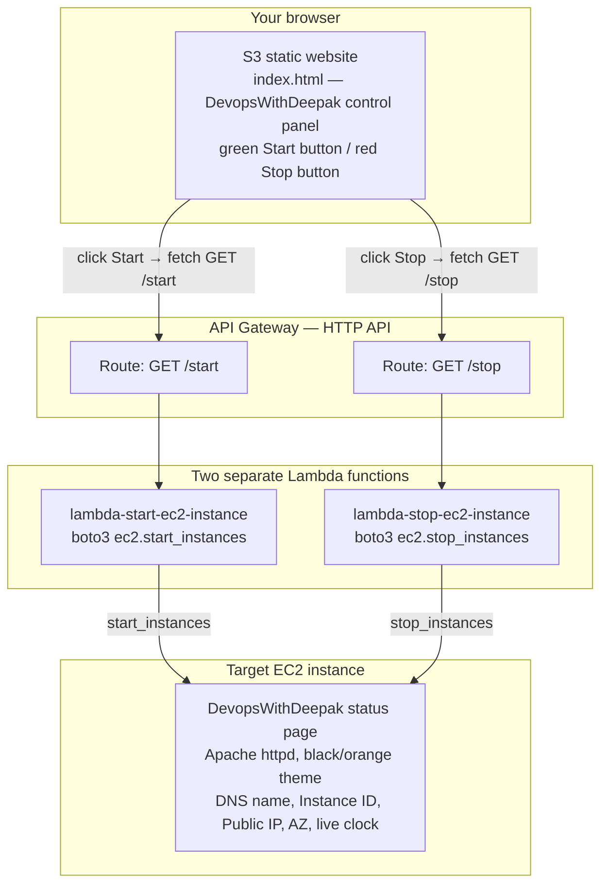

# 09-10.01 - Hands-On Demo: EC2 Start/Stop Automation via Lambda, API Gateway, and an S3 Control Panel

> Goal: combine the [Lambda EC2 Automation hands-on demo](09-Lambda-EC2-Automation-HandsOn.md) note's "Lambda controls EC2" idea with the [Lambda Triggers](10-Lambda-Triggers.md) note's "something else presses the invoke button" idea, and take both all the way to a real, clickable web page — a themed EC2 status page, two separate Lambda functions (one to start, one to stop), a simple **API Gateway HTTP API** in front of them, and an S3-hosted static control panel with a green **Start** button and a red **Stop** button that actually trigger them. Every AWS-side action is via the **AWS Console**, no CLI, no automation — only the EC2 **User data** box (the console's own way of accepting a boot script, same exception already used in the [CloudFront Origin Group Failover demo](../Cloudfront_CDN/15.01-Origin-Group-Failover_Demo.md)).

---

## 1. What you're building



This is deliberately the same shape as a real "internal ops tool" pattern: a tiny static front end, a thin API layer, and small single-purpose Lambda functions doing exactly one thing each — no framework, no server to manage anywhere in the chain.

---

## 2. Step 1 — Launch and theme the target EC2 instance

### Step 1a — Launch the instance
1. **EC2 console** → **Instances** → **Launch instances**.
2. **Name**: `DevopsWithDeepak-Lambda-Target`.
3. **Application and OS Images**: **Amazon Linux 2023 AMI** (Free tier eligible).
4. **Instance type**: `t2.micro` (Free tier eligible).
5. **Key pair**: **Proceed without a key pair** — nothing here needs SSH; the page is built entirely by the user data script at boot.
6. **Network settings** → **Edit**:
   - **Auto-assign public IP**: **Enable**.
   - **Firewall (security groups)**: **Create security group** → **Add security group rule**: **Type**: `HTTP`, **Source type**: `Anywhere` (`0.0.0.0/0`), so you can view the status page in a browser.
7. **Configure storage**: leave the default (8 GiB gp3).
8. **Advanced details** → scroll to **User data** → paste:
   ```bash
   #!/bin/bash
   dnf install -y httpd
   systemctl enable --now httpd

   TOKEN=$(curl -s -X PUT "http://169.254.169.254/latest/api/token" -H "X-aws-ec2-metadata-token-ttl-seconds: 21600")
   PUBLIC_IP=$(curl -s -H "X-aws-ec2-metadata-token: $TOKEN" http://169.254.169.254/latest/meta-data/public-ipv4)
   PUBLIC_DNS=$(curl -s -H "X-aws-ec2-metadata-token: $TOKEN" http://169.254.169.254/latest/meta-data/public-hostname)
   INSTANCE_ID=$(curl -s -H "X-aws-ec2-metadata-token: $TOKEN" http://169.254.169.254/latest/meta-data/instance-id)
   AZ=$(curl -s -H "X-aws-ec2-metadata-token: $TOKEN" http://169.254.169.254/latest/meta-data/placement/availability-zone)

   cat > /var/www/html/index.html <<'PAGE'
   <!DOCTYPE html>
   <html lang="en">
   <head>
   <meta charset="UTF-8">
   <title>DevopsWithDeepak - Lambda</title>
   <style>
     :root { --aws-orange:#FF9900; --aws-dark:#131A22; --aws-darker:#0F1111; --aws-text:#E9ECEF; }
     * { box-sizing:border-box; margin:0; padding:0; }
     body {
       background: radial-gradient(circle at top, #1B2430, var(--aws-darker));
       color: var(--aws-text);
       font-family: 'Segoe UI', Arial, sans-serif;
       min-height: 100vh;
       display: flex; align-items: center; justify-content: center;
       padding: 20px;
     }
     .card {
       background: var(--aws-dark);
       border: 1px solid #2b3542;
       border-top: 4px solid var(--aws-orange);
       border-radius: 12px;
       max-width: 640px; width: 100%;
       padding: 36px 40px;
       box-shadow: 0 20px 60px rgba(0,0,0,0.5);
     }
     .badge {
       display: inline-block;
       background: var(--aws-orange);
       color: #131A22;
       font-weight: 700; font-size: 12px; letter-spacing: 1px;
       padding: 6px 14px; border-radius: 999px;
       text-transform: uppercase;
       margin-bottom: 18px;
     }
     h1 { font-size: 28px; margin-bottom: 4px; }
     h1 span { color: var(--aws-orange); }
     .subtitle { color:#9AA5B1; margin-bottom:28px; font-size:14px; }
     .clock {
       font-size: 42px; font-weight: 700;
       color: var(--aws-orange); letter-spacing: 2px;
       margin-bottom: 28px;
       font-variant-numeric: tabular-nums;
     }
     .grid { display:grid; grid-template-columns:1fr 1fr; gap:16px; }
     .field { background:#0F1111; border:1px solid #2b3542; border-radius:8px; padding:14px 16px; }
     .field .label { color:#9AA5B1; font-size:11px; text-transform:uppercase; letter-spacing:1px; margin-bottom:6px; }
     .field .value { color:#fff; font-size:14px; font-family:Consolas,Monaco,monospace; word-break:break-all; }
     footer { margin-top:28px; text-align:center; color:#5C6773; font-size:12px; }
   </style>
   </head>
   <body>
     <div class="card">
       <span class="badge">EC2 Automation Target</span>
       <h1>DevopsWith<span>Deepak</span> - Lambda</h1>
       <div class="subtitle">This instance is remotely started/stopped by a Lambda function, via API Gateway</div>
       <div class="clock" id="clock">--:--:--</div>
       <div class="grid">
         <div class="field"><div class="label">Public DNS</div><div class="value">__PUBLIC_DNS__</div></div>
         <div class="field"><div class="label">Public IP</div><div class="value">__PUBLIC_IP__</div></div>
         <div class="field"><div class="label">Instance ID</div><div class="value">__INSTANCE_ID__</div></div>
         <div class="field"><div class="label">Availability Zone</div><div class="value">__AZ__</div></div>
       </div>
       <footer>Served by Apache httpd on EC2 — if you're seeing this, the instance is running.</footer>
     </div>
     <script>
       function tick() {
         var d = new Date();
         var pad = function(n) { return n < 10 ? '0' + n : n; };
         document.getElementById('clock').textContent = pad(d.getHours()) + ':' + pad(d.getMinutes()) + ':' + pad(d.getSeconds());
       }
       tick();
       setInterval(tick, 1000);
     </script>
   </body>
   </html>
   PAGE

   sed -i "s/__PUBLIC_DNS__/$PUBLIC_DNS/; s/__PUBLIC_IP__/$PUBLIC_IP/; s/__INSTANCE_ID__/$INSTANCE_ID/; s/__AZ__/$AZ/" /var/www/html/index.html
   ```
   > 🧠 Same pattern as the [CloudFront Origin Group Failover demo](../Cloudfront_CDN/15.01-Origin-Group-Failover_Demo.md)'s user data script: a **quoted** heredoc delimiter (`<<'PAGE'`) keeps the embedded CSS/JS's own `$` characters from being interpreted by bash, and the `__PLACEHOLDER__` tokens are swapped for real instance metadata **after** the file is written, via `sed`.
9. **Launch instance**.


Instance ID : **i-0a691cd364da58a8d**

### Step 1b — Note the Instance ID
Once the instance shows **Running** and **2/2 checks passed**, copy its **Instance ID** (e.g. `i-0123456789abcdef0`) from the instance list — you'll paste this into **both** Lambda functions' code in Sections 3 and 5. Also open `http://<public-ipv4-dns>/` in a browser to confirm the black/orange **DevopsWithDeepak - Lambda** card renders with a ticking clock and your real DNS/IP/Instance ID/AZ filled in.

> ⚠️ Unlike the [Origin Group Failover demo](../Cloudfront_CDN/15.01-Origin-Group-Failover_Demo.md), this instance deliberately has **no Elastic IP** — its whole point is to be stopped and started repeatedly, and each **Start** will legitimately hand it a fresh public IP/DNS (visible again by re-opening the EC2 console). That's expected behavior here, not a bug to work around.

---

## 3. Step 2 — Create the Start Lambda function

1. **Lambda console** → **Create function** → **Author from scratch**.
2. **Function name**: `lambda-start-ec2-instance`.
3. **Runtime**: newest Python 3.x available.
4. **Permissions**: leave at the default (auto-creates a basic CloudWatch Logs execution role — the [Create Your First Lambda Function](05-Create-First-Lambda-Function-HandsOn.md) note's Section 2; Section 4 below adds EC2 permissions to it).
5. **Create function**.
6. Replace the code in `lambda_function.py` with:
   ```python
   import boto3

   ec2 = boto3.client('ec2')
   INSTANCE_ID = "i-0123456789abcdef0"  # <-- replace with your real Instance ID from Section 2, Step 1b

   def lambda_handler(event, context):
       ec2.start_instances(InstanceIds=[INSTANCE_ID])
       message = f"Start request sent for instance {INSTANCE_ID}"
       print(message)
       return {
           "statusCode": 200,
           "body": message
       }
   ```
7. **Deploy**.

---

## 4. Step 3 — Grant the execution role EC2 start/stop permissions

The default role only allows writing logs (the [Lambda Execution Role](08-Lambda-Execution-Role.md) note's Section 3) — calling `start_instances()` right now would fail with `AccessDenied`. Attach a scoped inline policy covering **both** actions now, so the second function (Section 5) can reuse this same role instead of repeating this step:

1. **Configuration** tab → **Permissions** → click the **Role name** link (opens IAM console).
2. **Add permissions** → **Create inline policy**.
3. Switch to the **JSON** editor and paste:
   ```json
   {
       "Version": "2012-10-17",
       "Statement": [
           {
               "Effect": "Allow",
               "Action": [
                   "ec2:StartInstances",
                   "ec2:StopInstances",
                   "ec2:DescribeInstances"
               ],
               "Resource": "*"
           }
       ]
   }
   ```
   > 🧠 `Resource: "*"` is used here for the same reason the [Lambda EC2 Automation hands-on demo](09-Lambda-EC2-Automation-HandsOn.md) note's Section 5 used it — scoping `StartInstances`/`StopInstances` to one specific instance ID via IAM conditions needs tag-based conditions that add real complexity for a first automation demo. In production, scope this down to instances carrying a specific tag.
4. **Next** → **Policy name**: `EC2StartStopPolicy` → **Create policy**.

---

## 5. Step 4 — Create the Stop Lambda function, reusing the same role

This function needs **different code** (stop instead of start), but there's no need to repeat the IAM policy step — attach the role you just permissioned in Section 4 directly at creation time:

1. **Lambda console** → **Create function** → **Author from scratch**.
2. **Function name**: `lambda-stop-ec2-instance`.
3. **Runtime**: the same Python version used in Section 3.
4. Expand **Additional settings** → **General** → toggle **Custom execution role** **on**. In the **Configure custom execution role** panel that slides out on the right, **Choose an existing role** → select the role that was auto-created for `lambda-start-ec2-instance` (Section 3) — it already carries the `EC2StartStopPolicy` from Section 4 — → **Save**. This is the same Additional-settings mechanism the [Create Your First Lambda Function](05-Create-First-Lambda-Function-HandsOn.md) note's Section 2 describes.
5. **Create function**.
6. Replace the code in `lambda_function.py` with:
   ```python
   import boto3

   ec2 = boto3.client('ec2')
   INSTANCE_ID = "i-0123456789abcdef0"  # <-- same Instance ID as Section 3

   def lambda_handler(event, context):
       ec2.stop_instances(InstanceIds=[INSTANCE_ID])
       message = f"Stop request sent for instance {INSTANCE_ID}"
       print(message)
       return {
           "statusCode": 200,
           "body": message
       }
   ```
7. **Deploy**.

---

## 6. Step 5 — Sanity-check both functions from the console first

Before wiring up API Gateway, confirm each function actually works in isolation — this makes any later problem obviously an API Gateway/CORS issue rather than a Lambda/permissions issue:

1. Open `lambda-start-ec2-instance` → **Test** → **Configure test event** → any event name, JSON can stay `{}` (the code ignores the incoming event entirely — the instance ID is hardcoded) → **Save** → **Test**. Confirm the response body and check the **EC2 console** for the instance transitioning to **Running**.
2. Repeat for `lambda-stop-ec2-instance` → confirm the instance transitions to **Stopping**/**Stopped**.

---

## 7. Step 6 — Create the HTTP API and the Start route

1. **API Gateway console** → **Create API** → **HTTP API** → **Build**.
2. **Integrations** → **Add integration** → **Lambda**.
3. **Lambda function**: select `lambda-start-ec2-instance`.
4. **API name**: `ec2-automation-api`.
5. **Next**.
6. **Configure routes** — the wizard proposes a route matching the Lambda's name; change it: **Method**: `GET`, **Resource path**: `/start`.
7. **Next**.
8. **Configure stages** — leave the proposed **$default** stage with **Auto-deploy** enabled (the default) — every change to the API deploys immediately, no separate manual "Deploy API" step needed for this simple case.
9. **Next** → **Create**.

> 🧠 This is the exact "push model" trigger the [Lambda Triggers](10-Lambda-Triggers.md) note's Section 2 described — API Gateway calls your Lambda function directly the moment a request hits the route, and the console automatically adds the resource-based permission letting it do so (the same mechanism note's Section 2 table mentions).

---

## 8. Step 7 — Add the Stop route to the same API

1. Open the `ec2-automation-api` you just created → left-hand nav → **Routes**.
2. **Create**.
3. **Method**: `GET`, **Path**: `/stop` → **Create**.
4. Select the new `GET /stop` route → **Attach integration** → **Create and attach an integration** → **Integration type**: **Lambda** → **Lambda function**: `lambda-stop-ec2-instance` → **Attach integration**.

You now have one HTTP API with two independent routes, each pointing at its own single-purpose Lambda function.

---

## 9. Step 8 — Configure CORS

The browser control panel (Section 10) runs on an **S3 website** origin and calls this **API Gateway** origin — a genuine cross-origin request, so without CORS the browser will block reading the response even though the request itself succeeds:

1. Still inside `ec2-automation-api` → left-hand nav → **CORS** → **Configure**.
2. **Access-Control-Allow-Origin**: type `*` → **Add**. (For a real deployment, use your exact S3 website endpoint URL here instead of `*`, to only allow your own front end to call the API.)
3. **Access-Control-Allow-Methods**: type `GET` → **Add**.
4. **Access-Control-Allow-Headers**: type `*` → **Add**.
5. **Save**.

> 🧠 HTTP APIs have CORS support **built into API Gateway itself** — once configured here, API Gateway adds the CORS headers to every response automatically, and (per AWS's own docs) actually **ignores** any CORS headers your Lambda code might try to return. You never need to add `Access-Control-Allow-Origin` inside the Python code in Sections 3 or 5.

---

## 10. Step 9 — Test the API directly, before touching the front end

1. Back on the API's main page, copy the **Invoke URL** (e.g. `https://abc123xyz.execute-api.ap-south-1.amazonaws.com`).
2. Paste `<invoke-url>/start` directly into a browser's address bar. You should see the plain-text response `Start request sent for instance i-...`, and the **EC2 console** should show the instance transitioning to **Running**.
3. Paste `<invoke-url>/stop` the same way — confirm the instance stops.

This isolates the API Gateway + Lambda chain from the browser/CORS/front-end layer entirely — if this step works but Section 11 doesn't, the problem is specifically in the front end or CORS, not the API itself.

---

## 11. Step 10 — Build the S3-hosted control panel

### Step 10a — Create the bucket and enable static website hosting
1. **S3 console** → **Create bucket**.
2. **Bucket name**: something globally unique, e.g. `lambda-ec2-control-panel-<your-name-or-date>`.
3. **AWS Region**: any Region you prefer.
4. **Block Public Access settings for this bucket**: uncheck **Block all public access**, then check the acknowledgement box.
5. Leave everything else default → **Create bucket**.
6. Open the bucket → **Properties** tab → **Static website hosting** → **Edit** → **Enable**, **Hosting type**: Host a static website, **Index document**: `index.html` → **Save changes**. Note the **Bucket website endpoint** URL shown.
7. **Permissions** tab → **Bucket policy** → **Edit** → paste (replacing `<BUCKET_NAME>`):
   ```json
   {
     "Version": "2012-10-17",
     "Statement": [
       {
         "Sid": "PublicReadForWebsite",
         "Effect": "Allow",
         "Principal": "*",
         "Action": "s3:GetObject",
         "Resource": "arn:aws:s3:::<BUCKET_NAME>/*"
       }
     ]
   }
   ```
   → **Save changes**.

### Step 10b — Upload the control panel page
This file already exists at [`demo-site/index.html`](demo-site/index.html), right next to this note — no need to type it by hand. **Before uploading**, edit the `API_BASE_URL` constant near the bottom of the file to your own Invoke URL from Section 9. Full content shown below for reference:

```html
<!DOCTYPE html>
<html lang="en">
<head>
<meta charset="UTF-8">
<meta name="viewport" content="width=device-width, initial-scale=1.0">
<title>DevopsWithDeepak - Lambda EC2 Control Panel</title>
<style>
  :root { --aws-orange:#FF9900; --aws-dark:#131A22; --aws-darker:#0F1111; --aws-text:#E9ECEF; --green:#2ECC71; --red:#E74C3C; }
  * { box-sizing:border-box; margin:0; padding:0; }
  body {
    background: radial-gradient(circle at top, #1B2430, var(--aws-darker));
    color: var(--aws-text);
    font-family: 'Segoe UI', Arial, sans-serif;
    min-height: 100vh;
    display: flex; align-items: center; justify-content: center;
    padding: 20px;
  }
  .card {
    background: var(--aws-dark);
    border: 1px solid #2b3542;
    border-top: 4px solid var(--aws-orange);
    border-radius: 12px;
    max-width: 640px; width: 100%;
    padding: 36px 40px;
    box-shadow: 0 20px 60px rgba(0,0,0,0.5);
  }
  .badge {
    display: inline-block;
    background: var(--aws-orange);
    color: #131A22;
    font-weight: 700; font-size: 12px; letter-spacing: 1px;
    padding: 6px 14px; border-radius: 999px;
    text-transform: uppercase;
    margin-bottom: 18px;
  }
  h1 { font-size: 28px; margin-bottom: 4px; }
  h1 span { color: var(--aws-orange); }
  .subtitle { color:#9AA5B1; margin-bottom:28px; font-size:14px; }
  .clock {
    font-size: 34px; font-weight: 700;
    color: var(--aws-orange); letter-spacing: 2px;
    margin-bottom: 28px;
    font-variant-numeric: tabular-nums;
  }
  .field { background:#0F1111; border:1px solid #2b3542; border-radius:8px; padding:14px 16px; margin-bottom: 20px; }
  .field .label { color:#9AA5B1; font-size:11px; text-transform:uppercase; letter-spacing:1px; margin-bottom:6px; }
  .field .value { color:#fff; font-size:14px; font-family:Consolas,Monaco,monospace; word-break:break-all; }
  .btn-row { display:grid; grid-template-columns:1fr 1fr; gap:16px; margin-bottom: 20px; }
  button {
    border: none; border-radius: 8px; padding: 16px 0;
    font-size: 16px; font-weight: 700; letter-spacing: 1px;
    text-transform: uppercase; cursor: pointer;
    color: #0F1111; transition: transform 0.1s ease, opacity 0.2s ease;
  }
  button:hover { opacity: 0.9; }
  button:active { transform: scale(0.97); }
  button:disabled { opacity: 0.5; cursor: not-allowed; }
  #startBtn { background: var(--green); }
  #stopBtn { background: var(--red); color: #fff; }
  #status {
    background:#0F1111; border:1px solid #2b3542; border-radius:8px;
    padding:14px 16px; font-size:13px; font-family:Consolas,Monaco,monospace;
    min-height: 20px; color: #9AA5B1;
  }
  footer { margin-top:24px; text-align:center; color:#5C6773; font-size:12px; }
</style>
</head>
<body>
  <div class="card">
    <span class="badge">Lambda + API Gateway Control Panel</span>
    <h1>DevopsWith<span>Deepak</span> - Lambda</h1>
    <div class="subtitle">Static S3 website &rarr; API Gateway &rarr; Lambda &rarr; EC2 start/stop automation</div>
    <div class="clock" id="clock">--:--:--</div>

    <div class="field">
      <div class="label">API Gateway Invoke URL</div>
      <div class="value" id="apiUrlDisplay">EDIT_ME: paste your invoke URL into the API_BASE_URL constant below</div>
    </div>

    <div class="btn-row">
      <button id="startBtn">Start Instance</button>
      <button id="stopBtn">Stop Instance</button>
    </div>

    <div id="status">Ready. Click a button to call the API Gateway endpoint.</div>

    <footer>Every click here fires a real GET request to API Gateway, which invokes a real Lambda function, which calls real EC2 start_instances/stop_instances.</footer>
  </div>

  <script>
    // Replace with your own HTTP API invoke URL from Section 9, e.g.
    // "https://abc123xyz.execute-api.ap-south-1.amazonaws.com"
    const API_BASE_URL = "https://REPLACE_WITH_YOUR_INVOKE_URL";

    document.getElementById('apiUrlDisplay').textContent = API_BASE_URL;

    function tick() {
      const d = new Date();
      const pad = (n) => (n < 10 ? '0' + n : n);
      document.getElementById('clock').textContent = pad(d.getHours()) + ':' + pad(d.getMinutes()) + ':' + pad(d.getSeconds());
    }
    tick();
    setInterval(tick, 1000);

    async function callApi(action) {
      const statusEl = document.getElementById('status');
      const startBtn = document.getElementById('startBtn');
      const stopBtn = document.getElementById('stopBtn');
      startBtn.disabled = true;
      stopBtn.disabled = true;
      statusEl.textContent = `Calling ${API_BASE_URL}/${action} ...`;
      try {
        const response = await fetch(`${API_BASE_URL}/${action}`, { method: 'GET' });
        const text = await response.text();
        statusEl.textContent = `[${response.status}] ${text}`;
      } catch (err) {
        statusEl.textContent = `Request failed: ${err.message} (check CORS config and invoke URL)`;
      } finally {
        startBtn.disabled = false;
        stopBtn.disabled = false;
      }
    }

    document.getElementById('startBtn').addEventListener('click', () => callApi('start'));
    document.getElementById('stopBtn').addEventListener('click', () => callApi('stop'));
  </script>
</body>
</html>
```

1. **S3 console** → open your new bucket → **Upload** → **Add files** → select the edited `index.html` → **Upload**.

---

## 12. Step 11 — Test end-to-end from the control panel

1. Open the bucket's **Bucket website endpoint** URL from Step 10a in a browser. You should see the black/orange **DevopsWithDeepak - Lambda** control panel, with a ticking clock, the green **Start Instance** and red **Stop Instance** buttons, and your Invoke URL displayed.
2. **Stop** the EC2 instance first (via the EC2 console, or the **Stop Instance** button itself) so the next step is visibly meaningful.
3. Click **Start Instance**. The status box should show `[200] Start request sent for instance i-...` within a second or two. Confirm in the **EC2 console** that the instance transitions to **Running**.
4. Once running, open the instance's own status page (`http://<public-ipv4-dns>/` from Section 2) in a **separate tab** to see the live "DevopsWithDeepak - Lambda" EC2 card itself — proof the whole chain, front end to back end, genuinely controls a real running instance.
5. Click **Stop Instance** on the control panel and confirm the instance stops.

---

## 13. Troubleshooting

| Symptom | Likely cause |
|---|---|
| Control panel shows `Request failed: Failed to fetch` | CORS wasn't saved (Section 9), or `API_BASE_URL` in `index.html` still has a typo/trailing slash — the URL must exactly match the Invoke URL, no trailing `/` |
| Direct browser test of `<invoke-url>/start` (Section 10) works, but the control panel button doesn't | Confirms it's a CORS/front-end issue, not Lambda/API Gateway — recheck Section 9's three CORS fields were actually **Added** and **Saved** |
| `403`/`AccessDenied` from Lambda's own execution | The inline policy from Section 4 wasn't attached to the role the Stop function is actually using — recheck Section 5, Step 4 selected the **same** role, not a newly auto-created one |
| Stop function shows success but the instance never actually stops | `start_instances`/`stop_instances` are asynchronous — the call succeeding only means the request was accepted; refresh the EC2 console after a few seconds |
| `{"message":"Not Found"}` from the Invoke URL | Wrong path (`/start` vs `/stop`) or method — HTTP APIs are exact about which method+path combination a route matches (the [Lambda Triggers](10-Lambda-Triggers.md) note's Section 2 push-model idea, applied here) |
| EC2 status page shows a **different** public DNS than before after clicking Start | Expected — this instance has no Elastic IP (Section 2, Step 1b); every start can hand it a new public IP/DNS |

---

## 14. Cleanup

1. **S3 console** → empty and delete the `lambda-ec2-control-panel-<...>` bucket.
2. **API Gateway console** → select `ec2-automation-api` → **Actions** → **Delete**.
3. **Lambda console** → delete `lambda-start-ec2-instance` and `lambda-stop-ec2-instance` (offers to delete their execution role — only delete the role once, since both functions share it).
4. **EC2 console** → terminate `DevopsWithDeepak-Lambda-Target`.

---

## 15. Recap

- A **push-model trigger** (API Gateway, the [Lambda Triggers](10-Lambda-Triggers.md) note's Section 2) turns a manually-tested function into one that responds to real HTTP requests — no schedule or polling involved.
- Using **two separate, single-purpose Lambda functions** (start vs. stop) instead of one function with an `action` parameter keeps each function's code, permissions, and API route trivially simple — a genuinely common real-world pattern for small automations.
- A shared **execution role**, permissioned once, can be reused across multiple functions via **Additional settings → Custom execution role** at creation time — no need to repeat an IAM policy per function.
- **HTTP APIs** in API Gateway have CORS handling built in at the API level — configured once in the **CORS** tab, it overrides anything a backend Lambda tries to return, and needs no CORS code in Python at all.
- Testing the API directly (Section 10) before testing through the browser front end (Section 12) isolates exactly which layer — Lambda, API Gateway, or the front end/CORS — is responsible if something doesn't work.
- This demo is the real, end-to-end version of what the [Lambda EC2 Automation hands-on demo](09-Lambda-EC2-Automation-HandsOn.md) and [Lambda Triggers](10-Lambda-Triggers.md) notes introduced separately — manual console testing, replaced by a genuine push-button web UI.

### Sources
- [Get started with API Gateway (HTTP API + Lambda) — AWS docs](https://docs.aws.amazon.com/apigateway/latest/developerguide/getting-started.html)
- [Configure CORS for HTTP APIs — AWS docs](https://docs.aws.amazon.com/apigateway/latest/developerguide/http-api-cors.html)
- [Create routes for HTTP APIs — AWS docs](https://docs.aws.amazon.com/apigateway/latest/developerguide/http-api-develop-routes.html)
- [Boto3 EC2 client — start_instances / stop_instances — AWS docs](https://boto3.amazonaws.com/v1/documentation/api/latest/reference/services/ec2.html)
- [Hosting a static website using Amazon S3 — AWS docs](https://docs.aws.amazon.com/AmazonS3/latest/userguide/WebsiteHosting.html)
