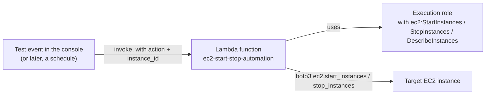

# 09 - Hands-On: Lambda Execute & Validate EC2 Automation

> Goal: put the [Lambda Execution Role](08-Lambda-Execution-Role.md) note's concept to real use — build a Lambda function that can **start and stop an EC2 instance**, a genuinely common real-world automation pattern (e.g. shutting down dev/test instances overnight to save cost). Entirely via the **AWS Console**, no CLI.

---

## 1. Why this is a realistic, common pattern

Non-production EC2 instances (dev, test, staging) often don't need to run 24/7 — leaving them running overnight and on weekends is pure wasted spend. A tiny Lambda function that starts instances at 8 AM and stops them at 8 PM (via a schedule — the [Lambda Triggers](10-Lambda-Triggers.md) note covers scheduled triggers next) is one of the single most common "first real automation" projects teams build with Lambda.

---

## 2. Architecture & workflow



---

## 3. Step 1 — Launch a small EC2 instance to automate

1. **EC2 console** → **Instances** → **Launch instances**.
2. **Name**: `Lambda-Automation-Target`.
3. **AMI**: **Amazon Linux 2023** (Free tier eligible).
4. **Instance type**: `t2.micro`.
5. **Key pair**: **Proceed without a key pair** (nothing in this demo needs SSH access).
6. Leave networking/storage at their defaults.
7. **Launch instance**. Once it's **Running**, copy its **Instance ID** (e.g. `i-0123456789abcdef0`) from the instance list — you'll need it in Section 5.

---

## 4. Step 2 — Create the Lambda function

1. **Lambda console** → **Create function** → **Author from scratch**.
2. **Function name**: `ec2-start-stop-automation`.
3. **Runtime**: newest Python 3.x available.
4. **Permissions**: leave at the default (the console auto-creates a basic CloudWatch Logs execution role, exactly like the [Create Your First Lambda Function](05-Create-First-Lambda-Function-HandsOn.md) note's Section 2 — this alone isn't enough for EC2 access, which Section 5 adds next).
5. **Create function**.
6. Replace the code in `lambda_function.py` with:
   ```python
   import boto3

   ec2 = boto3.client('ec2')

   def lambda_handler(event, context):
       action = event.get('action')
       instance_id = event.get('instance_id')

       if action == 'start':
           ec2.start_instances(InstanceIds=[instance_id])
           result = f"Starting instance {instance_id}"
       elif action == 'stop':
           ec2.stop_instances(InstanceIds=[instance_id])
           result = f"Stopping instance {instance_id}"
       else:
           result = f"Unknown action '{action}' — expected 'start' or 'stop'"

       print(result)
       return {"statusCode": 200, "body": result}
   ```
7. **Deploy**.

---

## 5. Step 3 — Grant the execution role EC2 permissions

The function's default role only allows writing logs (the [Lambda Execution Role](08-Lambda-Execution-Role.md) note's Section 3) — calling `ec2.start_instances()` right now would fail with `AccessDenied`. Fix this with a scoped custom policy, not a broad managed one, to practice least privilege:

1. **Configuration** tab → **Permissions** → click the **Role name** link (opens IAM console).
2. **Add permissions** → **Create inline policy**.
3. Switch to the **JSON** editor and paste:
   ```json
   {
       "Version": "2012-10-17",
       "Statement": [
           {
               "Effect": "Allow",
               "Action": [
                   "ec2:StartInstances",
                   "ec2:StopInstances",
                   "ec2:DescribeInstances"
               ],
               "Resource": "*"
           }
       ]
   }
   ```
   > 🧠 `Resource: "*"` is used here because IAM condition-based scoping of `StartInstances`/`StopInstances` to one specific instance ID requires tag-based conditions that add real complexity for a first automation demo — in production, scope this down using a condition on the instance's tags (e.g. only instances tagged `AutoStop: true`), exactly the least-privilege point the [Lambda Execution Role](08-Lambda-Execution-Role.md) note's Section 4 raised.
4. **Next** → **Policy name**: `EC2StartStopPolicy` → **Create policy**.

---

## 6. Step 4 — Test starting and stopping the instance

### Stop the instance
1. Back on the Lambda function → **Test** → **Configure test event**.
2. **Event name**: `StopInstance`. **Event JSON**:
   ```json
   {
     "action": "stop",
     "instance_id": "i-0123456789abcdef0"
   }
   ```
   (replace with your actual instance ID from Section 3).
3. **Save** → **Test**.
4. Check the **Execution results** — should show `"Stopping instance i-..."` with `statusCode: 200`.
5. **EC2 console** → confirm the instance's state transitions to **Stopping** then **Stopped**.

### Start the instance
1. Create a second test event, **Event name**: `StartInstance`, same JSON but `"action": "start"`.
2. **Test** → confirm the response, then confirm in the **EC2 console** that the instance transitions back to **Running**.

---

## 7. Validate — what "validate" means here beyond just the green checkmark

Don't just trust the console's success message — actually confirm the **real-world effect**:
1. **EC2 console** → **Instances** → select `Lambda-Automation-Target` → check the **Instance state** column directly reflects what you just triggered.
2. Check **CloudWatch Logs** (the [Create Your First Lambda Function](05-Create-First-Lambda-Function-HandsOn.md) note's Section 5) for the function's `print()` output — confirms the code path that ran matched what you expected.

This "trigger it, then independently verify the actual AWS resource changed" habit is exactly how you'd debug a real automation that isn't behaving as expected.

---

## 8. Where this goes next

Right now, this function only runs when you manually click **Test** — not useful as *automation* yet. The [Lambda Triggers](10-Lambda-Triggers.md) note covers how to make this run automatically on a **schedule** (e.g. stop every day at 8 PM, start every day at 8 AM) using an EventBridge Scheduler rule as the trigger, with zero code changes needed to this function. The [EC2 Start/Stop Automation demo](09-10.01-EC2-Start-Stop-Automation_Demo.md) takes this further still — a themed EC2 status page, two separate start/stop functions, an API Gateway HTTP API in front of them, and a real S3-hosted web page with clickable buttons.

---

## 9. Troubleshooting

| Symptom | Likely cause |
|---|---|
| `AccessDenied` calling `start_instances`/`stop_instances` | The inline policy from Section 5 wasn't actually created/attached, or has a typo in the action names |
| `InvalidInstanceID.NotFound` | Wrong instance ID in the test event JSON — recheck it against the EC2 console |
| Function times out | Shouldn't happen for this simple call (default timeout is 3 seconds, usually enough) — but if it does, increase **Configuration** → **General configuration** → **Timeout** |
| Instance state doesn't change even though Lambda reports success | `start_instances`/`stop_instances` are asynchronous — the call succeeding just means the request was accepted; give it a few seconds and refresh the EC2 console |

---

## 10. Cleanup

1. **EC2 console** → terminate `Lambda-Automation-Target` if you no longer need it.
2. **Lambda console** → delete `ec2-start-stop-automation` (this also offers to delete its execution role).

---

## 11. Recap

- A Lambda function's ability to control EC2 instances comes entirely from its **execution role** — the code itself is a handful of lines, the permission is what makes it real.
- `boto3.client('ec2').start_instances()`/`stop_instances()` are asynchronous — always independently verify the instance's actual state rather than trusting a success response alone.
- This function is currently manually triggered — the natural next step is wiring it to a **schedule**, covered in the [Lambda Triggers](10-Lambda-Triggers.md) note.

### Sources
- [Boto3 EC2 client — start_instances / stop_instances — AWS docs](https://boto3.amazonaws.com/v1/documentation/api/latest/reference/services/ec2.html)
- [Tutorial: Schedule AWS Lambda functions — AWS docs](https://docs.aws.amazon.com/lambda/latest/dg/services-cloudwatchevents-tutorial.html)
