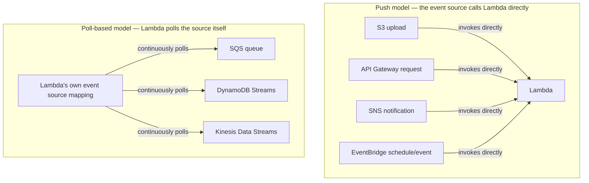

# 10 - Lambda Trigger

> Goal: understand what actually causes a Lambda function to run — and the important distinction between event sources that call Lambda directly versus ones Lambda has to poll itself, a genuinely testable SAA-C03 concept.

---

## 1. What a trigger is, simply

A **trigger** is whatever causes a Lambda function to run. Every function in this folder so far has been triggered **manually**, by clicking the console's **Test** button — a trigger is just the "real" version of that same idea: something else (an S3 upload, an API request, a schedule, a database change) automatically presses that same "invoke" button on your behalf.

---

## 2. The two fundamentally different trigger models

This is the part that's easy to gloss over but genuinely matters: not every AWS service triggers Lambda the same way.

| | Push model | Poll-based (event source mapping) |
|---|---|---|
| **Who initiates the invocation** | The event source itself (S3, SNS, API Gateway, EventBridge) | Lambda's own polling infrastructure, on your behalf |
| **Examples** | S3, SNS, API Gateway, EventBridge | SQS, DynamoDB Streams, Kinesis Data Streams |
| **What you configure** | A resource-based policy allowing the service to invoke your function (usually auto-added by the console — the [Lambda Execution Role](08-Lambda-Execution-Role.md) note's Section 5) | An **event source mapping** — a Lambda-side resource that continuously checks the source for new records and batches them into an invocation |

> 🧠 **Simple analogy**: push is like someone **ringing your doorbell** — they initiate contact with you. Poll-based is like Lambda **repeatedly checking the mailbox** itself, on a source that has no way to "ring a bell" on its own (a queue just sits there holding messages; nothing about SQS itself can reach out and call anything).

---

## 3. Add a schedule trigger (Console) — completing the EC2 automation demo

The [Lambda EC2 Automation hands-on demo](09-Lambda-EC2-Automation-HandsOn.md) ended with a function that only ran when manually tested. **EventBridge Scheduler** (a push-model trigger) is what actually automates it:

1. Open the `ec2-start-stop-automation` function from that note → **Configuration** tab → **Triggers** → **Add trigger**.
2. **Trigger configuration** dropdown → select **EventBridge (CloudWatch Events)**.
3. **Rule**: **Create a new rule**.
4. **Rule name**: `StopInstanceEvery8PM`.
5. **Rule type**: **Schedule expression**.
6. **Schedule expression**: `cron(0 20 * * ? *)` — runs daily at 20:00 UTC. (`rate(1 day)` is the simpler alternative if exact time-of-day doesn't matter.)
7. **Add**.

> ⚠️ There's a real gap to notice here: the schedule alone doesn't pass `{"action": "stop", "instance_id": "..."}` as the event — by default, EventBridge sends its own event shape (rule metadata), not your custom JSON. For this specific function to work correctly on a real schedule, you'd need to either configure the rule's **target input** to send fixed constant JSON matching what the function expects, or adjust the function's code to not depend on a specific incoming event shape when triggered this way. This is a genuine, common real-world gotcha worth knowing rather than glossing over — always check what shape of event your actual trigger delivers, since it isn't always the same shape you tested with manually.

---

## 4. Common trigger types, at a glance

| Trigger | Model | Typical use case |
|---|---|---|
| **S3** | Push | Process a file the moment it's uploaded (image resize, CSV processing) |
| **API Gateway** | Push | Expose the function as an HTTP API endpoint |
| **EventBridge (schedule)** | Push | Run on a cron-like schedule (the EC2 automation example above) |
| **EventBridge (event pattern)** | Push | React to a specific AWS-service event, e.g. "an EC2 instance just entered the `running` state" |
| **SNS** | Push | Fan-out a single notification to multiple subscribers, one of which is a Lambda function |
| **SQS** | Poll-based | Process messages from a queue at your own function's pace, with built-in retry via the queue |
| **DynamoDB Streams** | Poll-based | React to every insert/update/delete on a table, in order |
| **Kinesis Data Streams** | Poll-based | Process a high-throughput, ordered stream of records |

---

## 5. Recap

- A **trigger** is whatever causes a Lambda function to run automatically instead of being manually tested.
- **Push-model** sources (S3, API Gateway, SNS, EventBridge) call Lambda directly and need a resource-based policy allowing it.
- **Poll-based** sources (SQS, DynamoDB Streams, Kinesis) don't call Lambda at all — Lambda's own **event source mapping** continuously polls them instead.
- Always check the actual **shape** of the event a given trigger delivers — it isn't automatically the same JSON you used for manual testing.
- Next: the [Introduction to Amazon Q](11-Introduction-to-Amazon-Q.md) note, covering AWS's AI assistant — including where it shows up while you're writing Lambda code.

### Sources
- [Using AWS Lambda with other services — AWS docs](https://docs.aws.amazon.com/lambda/latest/dg/lambda-services.html)
- [AWS Lambda event source mappings — AWS docs](https://docs.aws.amazon.com/lambda/latest/dg/invocation-eventsourcemapping.html)
- [Schedule AWS Lambda functions using EventBridge Scheduler — AWS docs](https://docs.aws.amazon.com/lambda/latest/dg/services-eventbridgescheduler-tutorial.html)
