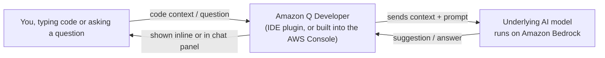

# 12 - Amazon Q Developer

> Goal: understand what Amazon Q Developer actually does for a developer — and its real, current status as of 2026, which meaningfully changes what a hands-on walkthrough for this topic should even look like.

---

## 1. What Amazon Q Developer was built to do

Amazon Q Developer (the successor to AWS's earlier tool, **CodeWhisperer**) is a generative-AI coding assistant with four main capabilities:

| Capability | What it means |
|---|---|
| **Inline code suggestions** | As you type, it suggests the next line(s) of code — similar to autocomplete, but generating real logic, not just syntax |
| **Chat** | Ask it questions in plain English about your code, an error message, or how to use a specific AWS service |
| **Code transformation/agentic tasks** | Point it at a larger task (e.g. "upgrade this project's dependencies," "write tests for this function") and it can plan and execute multiple steps |
| **Console-aware help** | Inside certain AWS consoles (including Lambda's), it can see the context of what you're working on and tailor its suggestions |

> 🧠 **Simple analogy**: think of it like a very well-read pair-programming partner sitting next to you, who's also read the entire AWS documentation site — they can both write code with you and answer "how do I actually do X in AWS" without you needing to leave your editor.

---

## 2. Architecture & workflow — where it sits

Amazon Q Developer doesn't run *inside* your Lambda function or affect it at runtime in any way — it's purely a **development-time** tool that helps you **write** the code faster. Once your function is deployed, Amazon Q Developer has no ongoing role in how it executes.

---

## 3. ⚠️ Current status (2026) — this changes what you can actually do today

As the [Introduction to Amazon Q](11-Introduction-to-Amazon-Q.md) note flagged: **new signups for Amazon Q Developer were blocked starting May 15, 2026**, and AWS is directing everyone toward its replacement, **Kiro** — an agentic, spec-driven IDE. Concretely, this means:

- If you **already** enabled Amazon Q Developer on an existing AWS account before that date, it continues to work (full end-of-support April 30, 2027).
- If you're a **new** learner setting this up today, you will likely find you **cannot start a fresh subscription** — the console may show it as unavailable for new activation, exactly as AWS intended with the signup block.
- For genuinely current AI-coding-assistant hands-on practice, AWS's own guidance now points to **Kiro** instead.

Rather than walk through enabling a feature that AWS itself has closed off to new users, this note explains what the feature *does* conceptually (still relevant for understanding the tool and for the SAA-C03 exam, which may still reference Amazon Q Developer by name) and is honest that a fresh console walkthrough for **activating** it isn't a reliable thing to hand a new learner right now.

> 🎯 **Exam tip:** the SAA-C03 exam tests **recognizing what Amazon Q Developer is for** (an AI coding/console assistant, aware of your AWS context) far more than any specific console click-path — the conceptual understanding in Section 1 above is the exam-relevant part.

---

## 4. If you already have access (existing accounts)

For accounts where it's already enabled, the general shape is:
1. **AWS Toolkit** (an IDE extension) or the relevant **AWS Console panel** → sign in with AWS Builder ID or your organization's identity provider.
2. Once connected, inline suggestions appear as you type in a supported file; a **chat panel** is available for direct questions.
3. In the **Lambda console** specifically (covered next in the [Lambda + Amazon Q](14-Lambda-Plus-Amazon-Q.md) note), it appears directly inside the code editor for supported runtimes.

---

## 5. Recap

- Amazon Q Developer offers inline code suggestions, chat, and agentic code-transformation tasks, aware of your actual AWS context — a development-time tool with no runtime role in your deployed functions.
- **New signups have been blocked since May 15, 2026** — AWS is retiring it in favor of **Kiro**; existing subscriptions continue until April 30, 2027.
- The concept remains SAA-C03-relevant; the specific "how to sign up" console flow currently is not, for new learners.
- Next: the [Amazon Q vs ChatGPT](13-Amazon-Q-vs-ChatGPT.md) note, a conceptual comparison that stays useful regardless of this transition.

### Sources
- [Amazon Q Developer end-of-support announcement — AWS DevOps & Developer Productivity Blog](https://aws.amazon.com/blogs/devops/amazon-q-developer-end-of-support-announcement/)
- [Amazon Q Developer User Guide — AWS docs](https://docs.aws.amazon.com/amazonq/latest/qdeveloper-ug/what-is.html)
