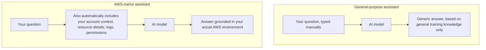

# 13 - Amazon Q Vs ChatGPT

> Goal: understand the real, practical difference between a general-purpose AI assistant like ChatGPT and an AWS-native one like Amazon Q — this comparison stays useful regardless of the [Amazon Q Developer](12-Amazon-Q-Developer.md) note's 2026 Kiro transition, since the same distinction applies to Kiro (or any AWS-native assistant) too.

---

## 1. The core difference, in one sentence

**ChatGPT is a general-purpose assistant that knows about the world; Amazon Q is an AWS-native assistant that knows about *your specific AWS account*.** That one difference explains almost every practical distinction below.

---

## 2. Side-by-side comparison

| | ChatGPT (general-purpose) | Amazon Q (AWS-native) |
|---|---|---|
| **Knowledge scope** | Broad, general knowledge across every topic | Deep, specific knowledge of AWS services — and, when connected, your actual account |
| **Awareness of your resources** | None, unless you manually paste in details | Can be connected directly to your AWS account, IAM permissions, and resources |
| **Can take actions in AWS** | No — it's just a conversation, you'd still copy/paste any commands yourself | Depending on the product/integration, can directly interact with or modify AWS resources on your behalf |
| **Permission awareness** | Doesn't know or care what your IAM permissions actually allow | Operates within your actual IAM permissions — it can't do anything you yourself aren't allowed to do |
| **Best for** | Broad brainstorming, general coding help, explaining concepts | AWS-specific troubleshooting, working directly inside AWS consoles/IDEs, questions grounded in your real infrastructure |

---

## 3. A simple example that makes the difference concrete

Ask both "why is my Lambda function timing out?"

- **ChatGPT**: gives you a generally correct, useful explanation of common reasons Lambda functions time out (network calls taking too long, insufficient timeout configured, etc.) — genuinely helpful, but entirely generic. It has no idea what *your* function's actual timeout setting is, or what *your* function's code is actually doing.
- **Amazon Q** (when connected to your account/console): can look at the **actual function**, see its **actual configured timeout**, see its **actual recent CloudWatch logs**, and give you an answer grounded in what's really happening — potentially even pointing at the exact line or exact AWS resource causing the delay.

---

## 4. Architecture & workflow — why the difference exists

The general-purpose assistant's answer is only as good as what **you manually describe** to it. The AWS-native assistant's answer is grounded in what's **actually true** in your account, without you having to describe it all yourself.

---

## 5. Neither one replaces the other

This isn't really an "either/or" comparison in practice:

- **ChatGPT** (or any general-purpose assistant) is excellent for broad conceptual learning, comparing architectural approaches, or getting a second opinion that isn't scoped to any one vendor.
- **Amazon Q** (or its successor, Kiro — the [Amazon Q Developer](12-Amazon-Q-Developer.md) note's Section 3) is stronger specifically when the question is grounded in **your actual AWS resources** — it can look at what's real instead of only what you describe.

Many developers use both, for different kinds of questions.

> 🎯 **Exam tip:** the SAA-C03 exam is unlikely to ask you to choose between the two directly, but understanding **why** an AWS-native assistant can do things a general one can't — direct account/resource awareness and IAM-permission-bounded actions — is the transferable concept worth retaining.

---

## 6. Recap

- ChatGPT knows the world in general; Amazon Q (when connected) knows your **specific AWS account**.
- Amazon Q's answers can be grounded in your real, current resource state and logs — a general assistant can only work with what you tell it.
- Amazon Q operates within your actual IAM permissions; it can't act outside what you're already allowed to do.
- The two are complementary tools, not strict substitutes for each other.
- Next: the [Lambda + Amazon Q](14-Lambda-Plus-Amazon-Q.md) note, seeing exactly where this AWS-native awareness shows up inside the Lambda console specifically.

### Sources
- [What is Amazon Q? — AWS docs](https://docs.aws.amazon.com/amazonq/latest/qbusiness-ug/what-is.html)
- [Amazon Q Developer User Guide — AWS docs](https://docs.aws.amazon.com/amazonq/latest/qdeveloper-ug/what-is.html)
