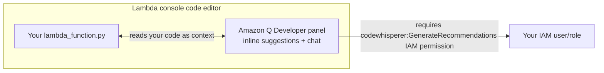

# 14 - Lambda + Amazon Q

> Goal: see specifically where Amazon Q Developer was designed to show up inside the Lambda console's own code editor — and be upfront that, per the [Amazon Q Developer](12-Amazon-Q-Developer.md) note's Section 3, this is one of the notes in this folder where a fresh, guaranteed-reproducible console walkthrough isn't honestly possible for a brand-new learner in 2026.

---

## 1. What this integration was designed to do

AWS added Amazon Q Developer directly into the **Lambda console's code editor** (the same panel the [Create Your First Lambda Function](05-Create-First-Lambda-Function-HandsOn.md) note used to write `lambda_function.py`) so that you never had to leave the Lambda console to get AI coding help. For supported runtimes (**Python and Node.js** in the Lambda console specifically), it offered:

- **Inline code suggestions** as you type inside the function's code editor.
- A **chat panel**, right next to your code, for asking questions like "why is this throwing a KeyError?" or "how do I add an S3 trigger's event data to this function?"
- Suggestions that could see the **function's own code**, not just your typed question in isolation.

---

## 2. Architecture & workflow — where it sat, when it worked

The key detail worth remembering even without hands-on access: this integration required a specific IAM permission (`codewhisperer:GenerateRecommendations`) on whichever IAM identity was signed into the console — another concrete, practical instance of the [Lambda Execution Role](08-Lambda-Execution-Role.md) note's broader theme that **nothing in AWS works without an explicit permission grant**, even a feature as seemingly "just there" as an AI assistant panel.

---

## 3. ⚠️ Why this note doesn't include a guaranteed console walkthrough

Consistent with the [Amazon Q Developer](12-Amazon-Q-Developer.md) note's Section 3: since **new signups for Amazon Q Developer have been blocked since May 15, 2026**, a brand-new AWS account today is very unlikely to be able to activate this panel inside the Lambda console at all. Rather than present click-by-click steps that would fail for most readers right now, this note keeps the explanation conceptual (Sections 1-2 above), and instead offers what to do about it in Section 4.

---

## 4. If you already have access, or you're using Kiro instead

- **If your account already had Amazon Q Developer enabled** before the signup block: the panel should still appear in the Lambda code editor for Python/Node.js functions — try opening any function's **Code source** panel and look for a **Q** icon/panel alongside the editor.
- **If you're on a newer account**: AWS's current guidance points to **Kiro** (the [Amazon Q Developer](12-Amazon-Q-Developer.md) note's Section 3) as the actively-supported path for AI-assisted coding — but Kiro is a **separate, standalone IDE**, not something embedded inside the Lambda console itself. Practically, this means: write and iterate on your function's code inside Kiro (or any AI-assisted editor you have access to), then **paste the finished code** into the Lambda console's editor (exactly as notes 05 and 09 in this folder did manually) and **Deploy** it there as normal — the actual deployment workflow doesn't change at all, only where the AI-assisted authoring happens.

> 🎯 **Exam tip:** the SAA-C03 exam is testing whether you know **that AWS integrates AI assistance into its consoles for developer productivity** — not the exact current product name or button location, both of which have already shifted once in 2026 and could shift again. Understand the concept; don't over-memorize the specific UI.

---

## 5. Recap

- Amazon Q Developer was built directly into the Lambda console's code editor for Python/Node.js functions, offering inline suggestions and an in-context chat panel.
- It required a specific IAM permission (`codewhisperer:GenerateRecommendations`) — another concrete example of Lambda's broader "nothing works without an explicit permission" theme.
- Because new signups are blocked as of May 15, 2026, this note stays conceptual rather than presenting steps most readers can't currently reproduce; existing accounts may still have access, and Kiro is AWS's current recommended alternative (used as a separate IDE, then pasted into the Lambda console the same way any code is).
- Next: the [AWS Lambda Execution Environment](15-Lambda-Execution-Environment.md) note, moving from developer-experience tooling back into how Lambda itself actually runs your code.

### Sources
- [Using Amazon Q Developer with AWS Lambda — AWS docs](https://docs.aws.amazon.com/amazonq/latest/qdeveloper-ug/lambda-setup.html)
- [Amazon Q Developer end-of-support announcement — AWS DevOps & Developer Productivity Blog](https://aws.amazon.com/blogs/devops/amazon-q-developer-end-of-support-announcement/)
