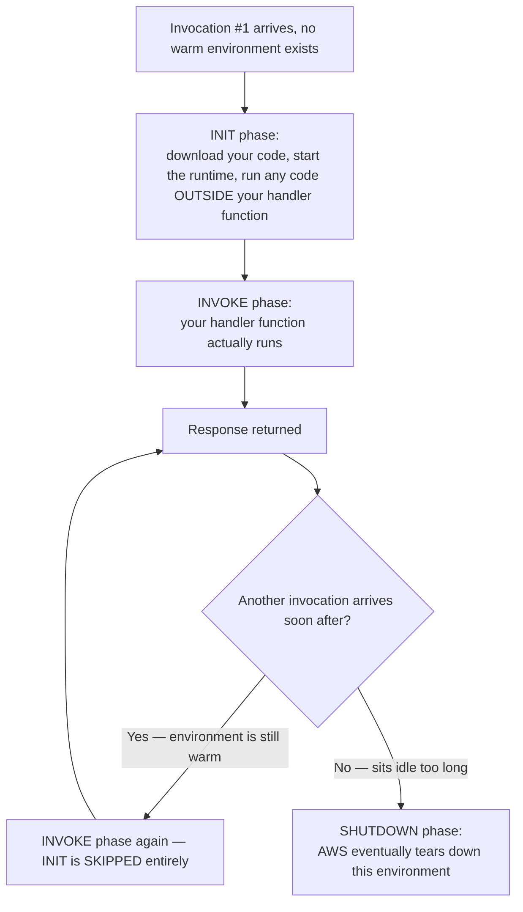

# 15 - AWS Lambda Execution Environment

> Goal: understand what actually happens, behind the scenes, between "your function gets invoked" and "your code starts running" — the cold-start/warm-start distinction is one of the most frequently tested real-world Lambda behaviors on the SAA-C03.

---

## 1. The core idea: Lambda doesn't keep your code "running" all the time

Earlier notes in this folder established that Lambda only runs your code when invoked. But *how* does AWS go from "nothing running" to "your code executing" so quickly? The answer is the **execution environment** — a lightweight, isolated sandbox (think of it as a tiny, temporary container) that AWS creates specifically to run your function.

> 🧠 **Simple analogy**: imagine a pop-up food stall that only assembles itself when a customer orders something. **Setting up the stall** (unpacking equipment, turning on the grill) takes real time and only needs to happen once — but once it's set up, it can serve the **next few customers instantly**, reusing the same already-hot grill, until it's quiet for long enough that the stall gets packed away again.

---

## 2. Architecture & workflow — the full lifecycle of an execution environment



- **Cold start** = an invocation that has to go through the full **INIT** phase first (no warm environment available) — slower.
- **Warm start** = an invocation that reuses an **already-initialized** environment — skips INIT entirely, much faster.

---

## 3. What actually happens during INIT (the slow part)

1. AWS provisions the sandbox and downloads your function's code/container image.
2. The chosen **runtime** (e.g. the Python interpreter) starts up.
3. Any code **outside your handler function** runs exactly once — e.g. `import boto3` at the top of a file, or creating a database connection object before `def lambda_handler(...)`.

That third point is the practical, actionable lesson: **code placed outside the handler only runs once per cold start, not on every invocation** — which is exactly why it's a common, deliberate performance optimization to put expensive setup (like creating a `boto3` client) **outside** the handler function, so warm invocations skip re-doing that work.

```python
import boto3

# Runs ONCE per cold start (during INIT) — not on every invocation
s3 = boto3.client('s3')

def lambda_handler(event, context):
    # Runs on EVERY invocation (during INVOKE), warm or cold
    return s3.list_buckets()
```

---

## 4. `/tmp` and execution context reuse

A warm execution environment doesn't just skip re-running your INIT code — it can also **reuse other things** from the previous invocation, within the same environment:

- **`/tmp` storage** (up to 10 GB) — any file your code wrote to `/tmp` during a previous invocation may still be there on the next warm invocation. This is genuinely useful (e.g. caching a downloaded reference file so you don't re-download it every single time) — but it's **not guaranteed to persist**, since a cold start (a fresh environment) starts with an empty `/tmp` every time.
- **Global variables / open connections** — anything set up outside the handler (Section 3) is still sitting in memory on a warm invocation, ready to reuse immediately.

> ⚠️ **Never rely on `/tmp` or global state actually being there.** Because you can't control or predict exactly when a cold start happens, your code must work correctly whether or not that cached file/connection/variable exists — treat reuse as a performance bonus when it happens, never as a guarantee.

---

## 5. Why cold starts happen, and what makes them worse

| Factor | Effect on cold start time |
|---|---|
| **Runtime choice** | Interpreted languages (Python, Node.js) generally cold-start faster than JVM-based ones (Java) |
| **Package/container size** | Larger deployment packages take longer to download and initialize |
| **VPC attachment** | Historically added meaningful cold-start latency (network interface setup) — the [Lambda VPC Connectivity](23-Lambda-VPC-Connectivity-HandsOn.md) note covers this specific trade-off |
| **How much code runs during INIT** | Heavy setup work outside the handler (Section 3) directly extends the cold-start time |
| **Traffic pattern** | Infrequent, spiky invocations hit cold starts far more often than steady, frequent traffic (which keeps environments warm) |

---

## 6. The fix for latency-sensitive cold starts: Provisioned Concurrency

If cold starts are genuinely unacceptable for a specific use case (e.g. a user-facing API with a strict latency requirement), AWS lets you **pre-initialize** execution environments ahead of time, so they're already warm and waiting before traffic even arrives — this is **Provisioned Concurrency**, covered in full in the [Configure Provisioned Concurrency in Lambda](20-Lambda-Provisioned-Concurrency-HandsOn.md) note, after the [Understanding AWS Lambda Concurrency](18-Lambda-Concurrency.md) note builds up the concurrency model it depends on.

> 🎯 **Exam tip:** "the first request after a period of inactivity is noticeably slower than subsequent ones" is the textbook description of a **cold start**. "We need consistently low latency, even for the very first request, no matter how long it's been idle" is the textbook signal for **Provisioned Concurrency**.

---

## 7. Recap

- Lambda runs your code inside a temporary **execution environment**, which goes through **INIT** (setup) then **INVOKE** (your handler) phases.
- A **cold start** pays the INIT cost; a **warm start** skips it entirely by reusing an already-initialized environment.
- Code placed **outside the handler function** only runs once per cold start — a real, practical place to put expensive one-time setup.
- `/tmp` and in-memory state can persist across warm invocations, but must never be relied upon as guaranteed.
- **Provisioned Concurrency** is the direct fix when cold starts are unacceptable for a specific workload.
- Next: the [Version Control In AWS Lambda](16-Lambda-Versions.md) note, covering how to freeze a working copy of your function's code and configuration.

### Sources
- [Lambda execution environment — AWS docs](https://docs.aws.amazon.com/lambda/latest/dg/lambda-runtime-environment.html)
- [Understanding AWS Lambda scaling and throughput — AWS docs](https://docs.aws.amazon.com/lambda/latest/dg/lambda-concurrency.html)
