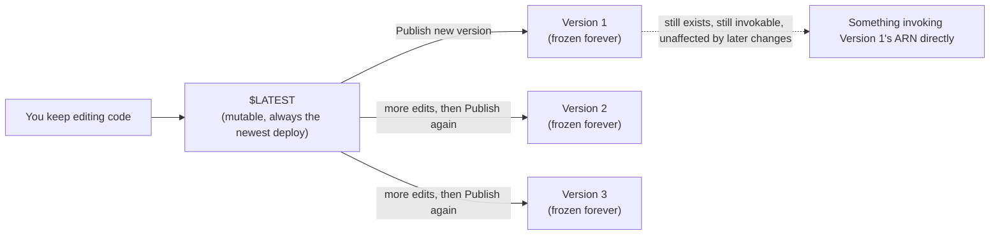

# 16 - Version Control In AWS Lambda

> Goal: understand `$LATEST` versus a published version — how Lambda lets you freeze a known-good snapshot of your function so ongoing code edits can't accidentally break something already relying on it.

---

## 1. The problem this solves

Every function you've built so far in this folder has one single, ever-changing copy of its code: **`$LATEST`**. Every time you click **Deploy**, `$LATEST` is overwritten with your newest code. That's fine while you're actively developing — but imagine something else (another team, a production API, a scheduled automation) is depending on this function, and you deploy a change with a bug in it. `$LATEST` just changed for **everyone** depending on it, instantly, with no way to keep the old, working copy running alongside it.

**Publishing a version** solves exactly this: it takes an **immutable, numbered snapshot** of the function — its code, its configuration, everything — that can never be changed again, no matter how many more times you edit and deploy `$LATEST` afterward.

---

## 2. `$LATEST` vs. a published version

| | `$LATEST` | A published version (e.g. `1`, `2`, `3`) |
|---|---|---|
| **Mutable?** | Yes — every Deploy overwrites it | No — frozen forever the moment it's published |
| **What's frozen** | N/A, always changing | Code, memory, timeout, environment variables, layers, VPC configuration — the entire configuration as it existed at that moment |
| **Has its own ARN?** | Yes, but that ARN always points at whatever is currently deployed | Yes, and that ARN will **always** point at exactly this frozen snapshot |
| **Typical use** | Active development | A known-good release, safe for something else to depend on |

> 🧠 **Simple analogy**: `$LATEST` is like a **live document** everyone's still editing — the content changes under you. Publishing a version is like **exporting that document to a read-only PDF** with a version number stamped on it — no matter how much the live document changes afterward, that PDF stays exactly as it was.

---

## 3. Architecture & workflow

Notice that publishing Version 2 or 3 doesn't remove or affect Version 1 at all — every published version exists independently, forever (until you explicitly delete it), each invokable by its own specific ARN.

---

## 4. Publish a version (Console)

1. Open the `hello-lambda-demo` function from the [Create Your First Lambda Function](05-Create-First-Lambda-Function-HandsOn.md) note.
2. **Actions** (top-right dropdown) → **Publish new version**.
3. **Version description** (optional): `Initial working version`.
4. **Publish**.
5. You're now looking at **Version 1** specifically — notice the function's ARN in the top of the page now ends in `:1`, and the code editor is now **read-only** (you can't edit a published version's code — that's the whole point).
6. To get back to editable `$LATEST`, use the **Qualifiers** dropdown near the top of the page and switch back to `$LATEST`.

---

## 5. Why you'd rarely invoke a version directly

In practice, hardcoding "invoke Version 3's exact ARN" into whatever calls your function is inconvenient — every time you publish a new version, you'd need to update every caller to point at the new number. This is exactly the problem the next note, [Aliases In AWS Lambda](17-Lambda-Aliases.md), solves: an **alias** is a friendly, stable name (like `prod` or `dev`) that **points at** a specific version — callers use the alias's stable name/ARN, and you just repoint the alias when you want them to start using a newer version, with zero change needed on the caller's side.

> 🎯 **Exam tip:** "we need a stable, unchanging snapshot of a function's code and configuration for production use, while development continues" is the textbook **Publish a version** scenario. If the scenario also mentions traffic shifting, canary deployments, or "without changing the client's configuration," that's pointing toward the [Lambda Aliases](17-Lambda-Aliases.md) note's territory, layered on top of versions.

---

## 6. Recap

- **`$LATEST`** is the mutable, always-changing pointer to whatever you most recently deployed.
- **Publishing a version** creates a permanently frozen, numbered snapshot of the function's entire code and configuration.
- Published versions coexist — publishing a new one never affects or removes an earlier one.
- Versions alone are rarely invoked directly in practice — the next note's **aliases** are the practical, stable way callers actually reference them.
- Next: the [Aliases In AWS Lambda](17-Lambda-Aliases.md) note.

### Sources
- [Lambda function versions — AWS docs](https://docs.aws.amazon.com/lambda/latest/dg/configuration-versions.html)
