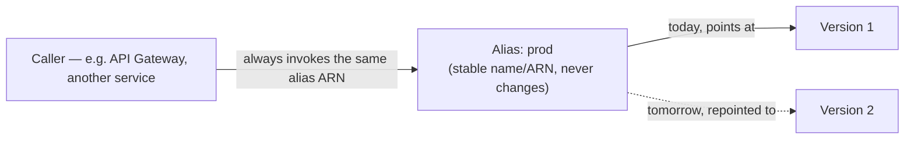
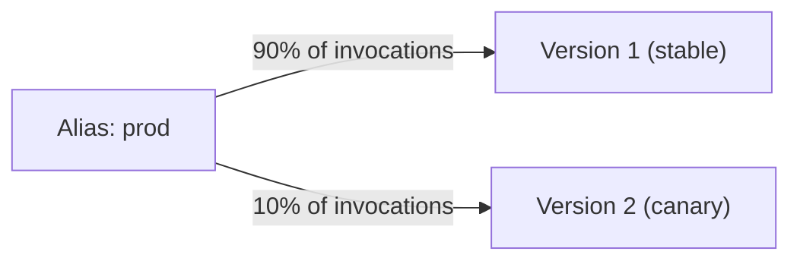

# 17 - Aliases In AWS Lambda

> Goal: understand how an alias gives callers a stable, friendly name to invoke — and how splitting traffic between two versions behind one alias enables safe, gradual (canary) deployments, without changing anything on the caller's side.

---

## 1. The problem this solves

The [Version Control In AWS Lambda](16-Lambda-Versions.md) note ended on this exact gap: published versions are numbered (`1`, `2`, `3`...), but hardcoding a specific version number into every caller is brittle — every new release means updating every caller's configuration.

An **alias** is a named pointer — like `prod`, `staging`, or `dev` — that **points at one specific version** (or, as Section 3 covers, splits traffic between two). Callers invoke the **alias's** stable ARN. When you want them to start using a new version, you just **repoint the alias** — the caller's configuration never has to change.

> 🧠 **Simple analogy**: think of a version as a specific, dated **house address** (`123 Main St, Unit 4`), and an alias as a **nickname like "Mom's house."** People can just say "go to Mom's house" — if Mom actually moves to a new address, you update what "Mom's house" points to once, and everyone who already knew that nickname automatically goes to the right place next time, with no need to tell each person individually.

---

## 2. Architecture & workflow

The caller's configuration (its ARN it invokes) never changes across this diagram — only what the alias points **to**, behind the scenes, changes.

---

## 3. Create an alias (Console)

1. Open the `hello-lambda-demo` function from the [Create Your First Lambda Function](05-Create-First-Lambda-Function-HandsOn.md) note (with at least Version 1 already published, per the [Version Control In AWS Lambda](16-Lambda-Versions.md) note).
2. **Aliases** tab (next to Code/Test/Monitor) → **Create alias**.
3. **Name**: `prod`.
4. **Description** (optional): `Production alias`.
5. **Version**: select **1**.
6. **Create alias**.
7. The alias now has its own stable ARN, e.g. `arn:aws:lambda:ap-south-1:123456789012:function:hello-lambda-demo:prod` — this ARN will keep working the same way even after you publish Version 2, 3, etc., until you deliberately repoint it.

---

## 4. Weighted aliases — gradual traffic shifting (canary deployments)

An alias doesn't have to point at just **one** version — it can split invocation traffic between **two** versions by percentage, which is exactly how a **canary deployment** works: send a small slice of real traffic to the new version first, watch for errors, then gradually increase that slice to 100% if it looks healthy.

1. Publish a **Version 2** of the function (the [Version Control In AWS Lambda](16-Lambda-Versions.md) note's Section 4), with some code change.
2. Open the `prod` alias → **Edit**.
3. Under **Additional version**, select **Version 2**, and set a **weight** — e.g. **10%** to Version 2, meaning the remaining 90% stays on Version 1.
4. **Save**.
5. Now, roughly 10% of invocations through the `prod` alias run **Version 2**, while 90% still run **Version 1** — the exact same alias ARN, unchanged from the caller's point of view.
6. Monitor Version 2's behavior (error rate, duration) via **CloudWatch**. If it looks healthy, gradually increase its weight — 25%, 50%, 100% — until it's fully rolled out, then remove Version 1 from the alias entirely.

> ⚠️ If Version 2 turns out to be broken, the fix is immediate and low-risk: edit the alias back to **100% Version 1** — no redeploy needed, no caller-side change, and only that small percentage of traffic was ever affected in the first place. This is the entire point of the pattern: **limit the blast radius of a bad deployment**, automatically, without anyone downstream noticing anything changed except a brief partial rollout.

---

## 5. Recap

- An **alias** is a stable, named pointer (e.g. `prod`) to a specific published version — callers use the alias's unchanging ARN, so repointing it never requires a caller-side change.
- A **weighted alias** splits traffic between two versions by percentage — the mechanism behind safe, gradual **canary deployments**.
- A bad canary rollout is cheaply and instantly reversible by editing the alias's weights back, since only a fraction of traffic was ever exposed.
- Next: the [Weighted Alias hands-on demo](17.01-Lambda-Aliases_Demo.md), actually watching a 90/10 split happen across real invocations. Then the [Understanding AWS Lambda Concurrency](18-Lambda-Concurrency.md) note, moving from deployment safety into how many requests a function can actually handle at once.

### Sources
- [Lambda function aliases — AWS docs](https://docs.aws.amazon.com/lambda/latest/dg/configuration-aliases.html)
- [Implement Lambda canary deployments using a weighted alias — AWS docs](https://docs.aws.amazon.com/lambda/latest/dg/configuring-alias-routing.html)
