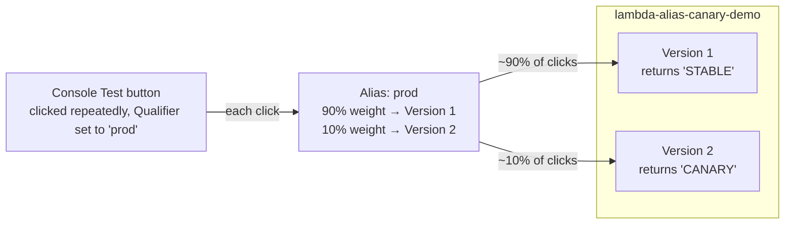

# 17.01 - Hands-On Demo: Watching a Weighted Alias Actually Split Traffic

> Goal: make the [Lambda Aliases](17-Lambda-Aliases.md) note's canary-deployment idea concrete — publish two versions with visibly different output, put a weighted alias in front of them, and actually watch invocations land on each version roughly according to the configured split. Deliberately simple and console-only: no API Gateway, no S3 front end, just the Lambda console's own **Qualifiers** dropdown and **Test** button — the same mechanism the [Version Control In AWS Lambda](16-Lambda-Versions.md) note's Section 4 already used to switch between `$LATEST` and a published version.

---

## 1. What you're building



Every click of **Test** is a real invocation through the alias — there's no simulation here. Clicking it enough times and tallying which version answered each time is the most direct, hands-on way to see a weighted alias actually behave probabilistically, exactly as the [Lambda Aliases](17-Lambda-Aliases.md) note's Section 4 described in theory.

---

## 2. Step 1 — Create the function and publish Version 1

1. **Lambda console** → **Create function** → **Author from scratch**.
2. **Function name**: `lambda-alias-canary-demo`.
3. **Runtime**: newest Python 3.x available.
4. **Permissions**: leave at the default (the [Create Your First Lambda Function](05-Create-First-Lambda-Function-HandsOn.md) note's Section 2).
5. **Create function**.
6. Replace the code in `lambda_function.py` with:
   ```python
   def lambda_handler(event, context):
       return {
           "statusCode": 200,
           "body": "This is Version 1 — STABLE"
       }
   ```
7. **Deploy**.
8. **Versions** → **Publish new version** → **Version description**: `Stable release` → **Publish**. This freezes exactly this code as **Version 1** (the [Version Control In AWS Lambda](16-Lambda-Versions.md) note's Section 4).
9. **Qualifiers** dropdown near the top of the page → switch back to **$LATEST** to keep editing.

---

## 3. Step 2 — Change the code and publish Version 2

1. With **$LATEST** selected, replace the code with:
   ```python
   def lambda_handler(event, context):
       return {
           "statusCode": 200,
           "body": "This is Version 2 — CANARY"
       }
   ```
2. **Deploy**.
3. **Actions** → **Publish new version** → **Version description**: `Canary release` → **Publish**. This freezes the new code as **Version 2** — Version 1 still exists, completely untouched.

---

## 4. Step 3 — Create the weighted alias

1. **Aliases** tab → **Create alias**.
2. **Name**: `prod`.
3. **Version**: **1** (this becomes the primary version).
4. Expand **Weighted alias**.
5. **Additional version**: **2**.
6. **Weight (%)**: `10` — Version 2 gets 10% of traffic, Version 1 automatically receives the remaining 90%.
7. **Create alias** (or **Save**, depending on the console flow at this point).

---

## 5. Step 4 — Point the console at the alias, then invoke it repeatedly

This is the part that makes the split observable, not just configured:

1. **Qualifiers** dropdown near the top of the page → switch from **$LATEST** to the **`prod`** alias. The page now reflects the alias's context — this matters, because the **Test** button always invokes whichever qualifier is currently selected here.
2. **Test** tab → **Configure test event** → any name, JSON can stay `{}` (neither version reads the incoming event) → **Save**.
3. Click **Test**. Note the returned `body` — either `"This is Version 1 — STABLE"` or `"This is Version 2 — CANARY"`.
4. Click **Test** again, **10-20 times in a row**, tallying how many times each message appeared.
5. You should see roughly **9 out of every 10** responses say **STABLE**, and roughly **1 out of every 10** say **CANARY** — never an exact 90/10 split on a small sample (Lambda's own docs describe this as a "simple probabilistic model," with real variance at low invocation counts), but the STABLE message should clearly dominate.

> 🧠 **A more precise way to confirm which version actually ran**, beyond just reading the message: every invocation's response includes an `x-amz-executed-version` value, and every CloudWatch Logs entry starts with a line like `START RequestId: ... Version: 2` — the **Monitor** tab's **Recent invocations** table (the [Create Your First Lambda Function](05-Create-First-Lambda-Function-HandsOn.md) note's Section 5) lets you expand any past invocation and see this directly, if you want proof beyond the message text itself.

---

## 6. Step 5 — Simulate a bad canary, and roll back instantly

1. Switch **Qualifiers** back to **$LATEST** → break Version 2's code on purpose, e.g.:
   ```python
   def lambda_handler(event, context):
       raise Exception("Simulated bug in the canary release")
   ```
2. **Deploy** → **Actions** → **Publish new version** → this becomes **Version 3** (not a new Version 2 — remember, published versions are immutable and never overwritten, per the [Version Control In AWS Lambda](16-Lambda-Versions.md) note's Section 1).
3. **Aliases** tab → `prod` → **Edit** → change **Additional version** from **2** to **3**, keep the weight at **10%** → **Save**.
4. Switch **Qualifiers** to `prod` again → **Test** repeatedly — roughly 1 in 10 invocations now **fails** with the simulated exception, while the other 9 keep succeeding on Version 1.
5. **Roll back**: `prod` alias → **Edit** → remove the weighted **Additional version** entirely (or set its weight to `0`) so **100%** of traffic goes back to **Version 1** → **Save**.
6. **Test** repeatedly again — every invocation now returns the STABLE message, with zero failures.

> ⚠️ Notice what rollback did **not** require: no redeploy, no code change, no caller-side update of any kind — exactly the [Lambda Aliases](17-Lambda-Aliases.md) note's Section 4 point about limiting blast radius. Only ever 10% of traffic was exposed to the broken version, and fixing it was a single alias edit.

---

## 7. Troubleshooting

| Symptom | Likely cause |
|---|---|
| Every single **Test** click returns the same version, no split at all | **Qualifiers** dropdown is still on `$LATEST` or directly on a version, not the `prod` **alias** — the split only exists when invoking through the alias itself |
| Alias creation fails with a version-related error | An alias's weighted routing can only point at **published** versions, never `$LATEST` (the [Lambda Aliases](17-Lambda-Aliases.md) note's prerequisite) — recheck Section 2/3 actually published, not just deployed |
| Split looks nowhere near 90/10 after only a few clicks | Expected at low sample sizes — Lambda's routing is probabilistic, not a strict round-robin; run 20-30 invocations for the split to visibly trend toward the configured weight |
| Can't edit code while looking at a version or the alias | Expected — published versions (and by extension, whatever a qualifier is pointing at) are read-only; switch **Qualifiers** back to `$LATEST` to edit (Section 2, Step 9) |

---

## 8. Cleanup

1. **Lambda console** → open `lambda-alias-canary-demo` → **Aliases** tab → delete `prod`.
2. **Versions** tab → delete Version 1, 2, and 3 individually.
3. Delete the `lambda-alias-canary-demo` function itself (offers to delete its execution role).

---

## 9. Recap

- The **Qualifiers** dropdown, already used in the [Version Control In AWS Lambda](16-Lambda-Versions.md) note's Section 4 to switch between `$LATEST` and a version, is also how you point the console's own **Test** button at a specific **alias** — this is what makes a weighted alias's split observable directly from the console, no API Gateway or front end required.
- A small sample of invocations (10-20 clicks) won't hit an exact percentage — Lambda's routing is probabilistic, and the [Lambda Aliases](17-Lambda-Aliases.md) note's split becomes visibly true only over enough invocations.
- Rolling back a bad canary is a single alias edit — no redeploy, no caller-side change, and only the configured percentage of traffic was ever exposed to the broken version in the first place.
- Next: the [Understanding AWS Lambda Concurrency](18-Lambda-Concurrency.md) note, moving from deployment safety into how many requests a function can actually handle at once.

### Sources
- [Lambda function aliases — AWS docs](https://docs.aws.amazon.com/lambda/latest/dg/configuration-aliases.html)
- [Implement Lambda canary deployments using a weighted alias — AWS docs](https://docs.aws.amazon.com/lambda/latest/dg/configuring-alias-routing.html)
