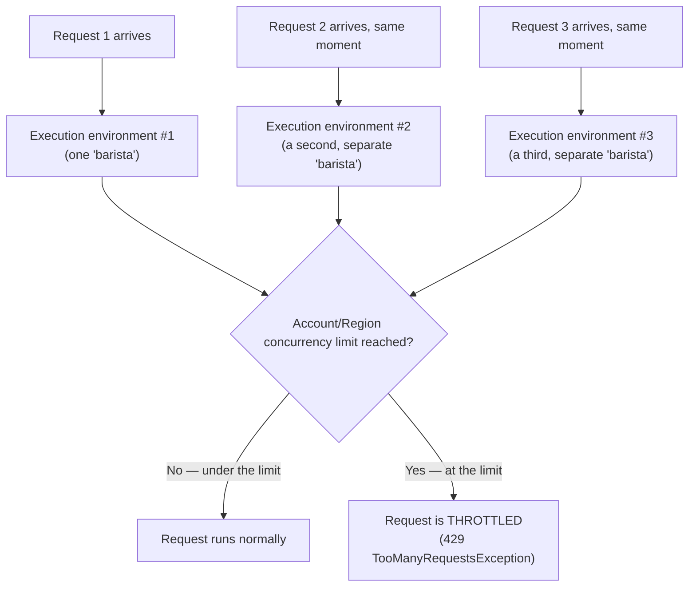

# 18 - Understanding AWS Lambda Concurrency

> Goal: understand what "concurrency" actually means for Lambda (it's not the same as "requests per second"), and how the account-wide limit works before the next two notes cover how to control it per-function.

---

## 1. What "concurrency" actually means here

**Concurrency** = the number of **invocations of your function running at the exact same instant**. It's easy to confuse this with "requests per second," but they're not the same thing:

> 🧠 **Simple analogy**: imagine a coffee shop with 5 baristas. **Concurrency** is "how many baristas are actively making a drink right now" — at most 5, ever, no matter how fast orders come in. **Requests per second** is "how many orders arrive per second" — if each drink takes 30 seconds to make, 5 baristas can only ever be making 5 drinks at once, but they might *finish* 10 drinks/minute total. Concurrency is about **simultaneous, in-progress work**, not total throughput over time.

Every single Lambda invocation — whether triggered manually, by S3, by API Gateway, or by a schedule — consumes **one unit of concurrency** for as long as that specific invocation is running.

---

## 2. Architecture & workflow — how Lambda scales concurrently

This is the mechanism behind Lambda's famous "automatic scaling" — when three requests arrive at the exact same moment, Lambda doesn't queue them behind one execution environment; it simply spins up **three separate, parallel** execution environments (potentially three cold starts, per the [AWS Lambda Execution Environment](15-Lambda-Execution-Environment.md) note) to handle all three genuinely at once.

---

## 3. The account-wide (Regional) concurrency limit

By default, every AWS account has a **Regional concurrency limit** — a hard ceiling on how many Lambda invocations, **across every function in that Region combined**, can be running at the exact same instant. (This default is commonly 1,000, but it's a **soft limit** — a quota AWS can raise on request, not a hard architectural cap — so always verify the actual current value for a given account in the **Service Quotas** console rather than assuming a fixed number.)

Two critical, exam-relevant consequences follow directly from this:

- This limit is **shared across every function in the Region**, not per-function. If one runaway function is somehow invoked thousands of times simultaneously, it can consume the **entire** account's concurrency budget, causing every **other** function in that Region to start getting throttled too — even ones that have nothing to do with the runaway function.
- Once the limit is hit, **new invocations are throttled** — synchronous callers (like API Gateway) get an immediate error back; asynchronous/poll-based sources typically retry automatically.

---

## 4. Why this matters in practice — the "noisy neighbor" problem

Imagine an account running two functions: `critical-payment-processor` and `low-priority-log-cleanup`. If `low-priority-log-cleanup` suddenly gets invoked 950 times simultaneously (e.g. a huge batch of S3 uploads all landing at once), it could consume most of the account's shared concurrency pool — leaving `critical-payment-processor` starved of capacity and getting throttled, even though nothing is actually wrong with it. This exact scenario — one function's traffic accidentally starving another, unrelated function — is precisely the problem the next note, [Understanding Reserved Concurrency](19-Lambda-Reserved-Concurrency.md), solves.

> 🎯 **Exam tip:** "one Lambda function's traffic spike is causing throttling on other, unrelated Lambda functions in the same account" is the textbook description of the shared-concurrency-pool problem this note describes — and the textbook fix is **reserved concurrency**, covered next.

---

## 5. Recap

- **Concurrency** = simultaneous, in-progress invocations — not the same thing as total requests per second.
- Lambda scales by running **multiple parallel execution environments**, one per concurrent invocation.
- The Regional concurrency limit is a **shared pool across every function** in that account/Region — a soft limit AWS can raise, not a fixed hard number to memorize.
- One function's traffic spike can starve unrelated functions of concurrency, since they all draw from the same shared pool by default.
- Next: the [Understanding Reserved Concurrency](19-Lambda-Reserved-Concurrency.md) note, covering how to protect (or cap) a specific function's slice of that shared pool.

### Sources
- [Managing Lambda reserved concurrency — AWS docs](https://docs.aws.amazon.com/lambda/latest/dg/configuration-concurrency.html)
- [Lambda quotas — AWS docs](https://docs.aws.amazon.com/lambda/latest/dg/gettingstarted-limits.html)
