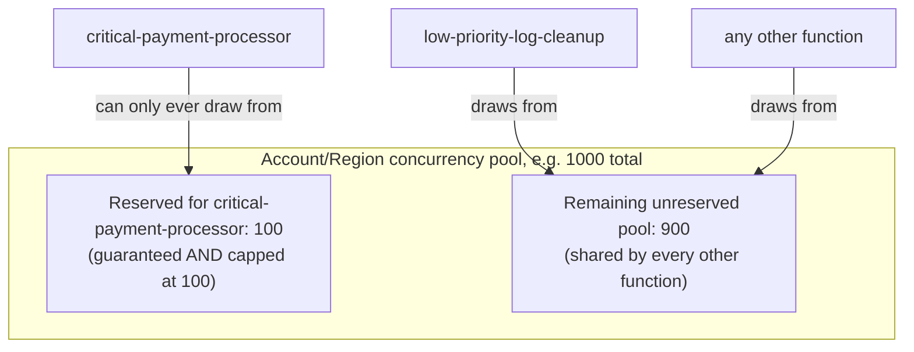

# 19 - Understanding Reserved Concurrency

> Goal: solve the exact "noisy neighbor" problem the [Understanding AWS Lambda Concurrency](18-Lambda-Concurrency.md) note ended on — one function's traffic spike starving another, unrelated function of capacity.

---

## 1. What reserved concurrency actually does — two effects at once

Setting **reserved concurrency** on a function does two things simultaneously, and both matter:

1. **Guarantees** that many units of concurrency are always available for **this function specifically**, carved out of the shared account pool — no other function can ever consume this reserved slice, even during a traffic spike.
2. **Caps** this function's concurrency at that exact same number — it can never use *more* than its reserved amount, even if the rest of the account's pool is sitting completely idle.

> 🧠 **Simple analogy**: back to the coffee shop with 5 total baristas (the [Understanding AWS Lambda Concurrency](18-Lambda-Concurrency.md) note's shared pool). Reserved concurrency is like saying **"2 of these 5 baristas are dedicated to VIP orders only, no matter what."** Two direct effects: VIP orders are now guaranteed to always have a barista, even if the other 3 baristas are completely swamped with regular orders — **and** VIP orders can never use more than those 2 dedicated baristas, even if the other 3 are sitting idle.

---

## 2. Architecture & workflow

This directly fixes the [Understanding AWS Lambda Concurrency](18-Lambda-Concurrency.md) note's scenario: even if `low-priority-log-cleanup` spikes to consume every last bit of the 900-unit unreserved pool, `critical-payment-processor`'s 100 reserved units are completely untouched and unaffected — it can keep running normally.

---

## 3. Set reserved concurrency (Console)

1. Open the `hello-lambda-demo` function from the [Create Your First Lambda Function](05-Create-First-Lambda-Function-HandsOn.md) note.
2. **Configuration** tab → **Concurrency** (in the left-hand list of configuration sections).
3. Under **Unreserved account concurrency**, click **Edit**.
4. Select **Reserve concurrency**, and enter a value — e.g. `10`.
5. **Save**.
6. Notice the console now shows this function's concurrency as reserved, and the account's shared **unreserved pool** total has shrunk by that same amount — it's genuinely carved out, not just a soft label.

---

## 4. The trade-off: reserving concurrency also limits it

Because reserved concurrency is a **ceiling** as much as a **floor**, setting it too low can cause your own function to throttle itself even when the rest of the account has plenty of spare capacity sitting unused. This is a real, deliberate trade-off: you're trading "maximum possible scale" for "guaranteed, predictable, protected capacity."

> ⚠️ Setting a function's reserved concurrency to **0** is a real, intentional technique — it means the function can never run at all (every invocation gets throttled) until you change it back. This is sometimes used as an emergency "kill switch" to instantly stop a misbehaving function from running, without needing to delete it or remove its triggers.

---

## 5. Reserved vs. Provisioned Concurrency — don't confuse these two

This is one of the most commonly mixed-up pairs on the exam, so it's worth stating clearly even before the next note covers Provisioned Concurrency in full:

| | Reserved Concurrency | Provisioned Concurrency |
|---|---|---|
| **What it controls** | How much of the shared concurrency **pool** is guaranteed/capped for this function | Whether execution environments are **pre-warmed** ahead of time |
| **Solves** | The "noisy neighbor" / capacity-starvation problem | The **cold start** problem (the [AWS Lambda Execution Environment](15-Lambda-Execution-Environment.md) note) |
| **Extra cost?** | No additional charge | Yes — you pay for the pre-warmed capacity whether it's invoked or not |

The next note, [Configure Provisioned Concurrency in Lambda](20-Lambda-Provisioned-Concurrency-HandsOn.md), covers that second one in full, including a console walkthrough.

> 🎯 **Exam tip:** "protect a critical function from being starved of capacity by other functions" or "limit how much concurrency a specific function can consume" → **Reserved Concurrency**. "Eliminate cold-start latency for a latency-sensitive function" → **Provisioned Concurrency**. Don't let the similar names cause you to mix these up — they solve genuinely different problems.

---

## 6. Recap

- **Reserved concurrency** both guarantees and caps a specific slice of the account's shared concurrency pool for one function.
- It directly solves the "one function's spike starves another" problem from the [Understanding AWS Lambda Concurrency](18-Lambda-Concurrency.md) note.
- The trade-off: a reserved function can never exceed its reserved amount, even if the rest of the account is idle — setting it too low can throttle your own function unnecessarily.
- Reserved concurrency ≠ Provisioned Concurrency — one is about capacity protection/limits, the other is about pre-warming to avoid cold starts.
- Next: the [Configure Provisioned Concurrency in Lambda](20-Lambda-Provisioned-Concurrency-HandsOn.md) note.

### Sources
- [Managing Lambda reserved concurrency — AWS docs](https://docs.aws.amazon.com/lambda/latest/dg/configuration-concurrency.html)
