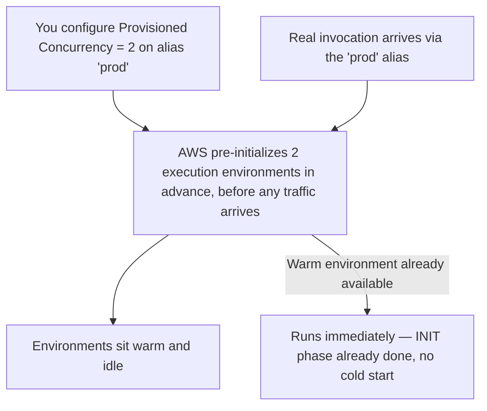

# 20 - Hands-On: Configure Provisioned Concurrency in Lambda

> Goal: eliminate cold starts for a specific version/alias by having AWS keep execution environments pre-warmed ahead of time — and actually observe the difference in the logs. Entirely via the **AWS Console**, no CLI.

---

## 1. What Provisioned Concurrency actually does

The [AWS Lambda Execution Environment](15-Lambda-Execution-Environment.md) note explained that a **cold start** happens when there's no already-initialized execution environment ready to reuse. **Provisioned Concurrency** is AWS proactively keeping a specified number of execution environments **initialized and idle, waiting**, ahead of any actual traffic — so that when a real invocation arrives, it's guaranteed to hit an already-warm environment.

> 🧠 **Simple analogy**: back to the coffee-shop analogy from the [Understanding AWS Lambda Concurrency](18-Lambda-Concurrency.md) note — Provisioned Concurrency is like telling 3 baristas to **show up and have their equipment already turned on and ready**, before the shop even opens, instead of only firing up a grill the moment the first order of the day actually arrives.

---

## 2. A critical requirement: it needs a version or alias, never `$LATEST`

Provisioned Concurrency can only be configured on a **published version** or an **alias** — never on the mutable `$LATEST`. This makes sense given the [Version Control In AWS Lambda](16-Lambda-Versions.md) note's core idea: AWS needs to pre-initialize environments running **specific, frozen code** — if it pre-warmed `$LATEST`, that code could change underneath it at any moment, making the pre-warmed environment potentially stale or wrong.

---

## 3. Architecture & workflow

---

## 4. Configure it (Console)

1. Open the `hello-lambda-demo` function, with the `prod` alias already pointing at **Version 1** (the [Aliases In AWS Lambda](17-Lambda-Aliases.md) note's Section 3).
2. **Configuration** tab → **Concurrency** → **Provisioned concurrency configurations** → **Add configuration**.
3. **Qualifier**: select **Alias** → `prod`.
4. **Provisioned concurrency**: `2`.
5. **Save**.
6. The console shows a status of **In progress** while AWS actually initializes those 2 environments — wait for it to become **Ready** (usually well under a minute for a small, simple function like this one).

> ⚠️ **This has a real, ongoing cost** — unlike Reserved Concurrency (the [Understanding Reserved Concurrency](19-Lambda-Reserved-Concurrency.md) note), you're billed for provisioned environments **whether or not they're actually invoked**, for as long as the configuration exists. Don't leave this running indefinitely on a demo function — Section 6 covers cleanup.

---

## 5. Observe the difference

1. Invoke the function through the `prod` alias — the console's **Test** button can target a specific qualifier via the **Qualifier** dropdown near the top of the page; select `prod`.
2. **Test** → check the **Execution results** → **Details**. Look for an **Init Duration** field.
3. **With Provisioned Concurrency active**: no `Init Duration` appears at all for this invocation — it reused an already-warm, pre-initialized environment.
4. For comparison, switch the **Qualifier** back to `$LATEST` (which has **no** Provisioned Concurrency configured) and invoke after the function has been idle a little while — you should see an `Init Duration` value reported this time, proving a real cold start actually happened on that unprotected path.

---

## 6. Cleanup

Provisioned Concurrency bills continuously while configured — remove it once you're done experimenting:
1. **Configuration** → **Concurrency** → select the `prod` alias's provisioned concurrency configuration → **Delete**.

---

## 7. When Provisioned Concurrency is actually worth the extra cost

| Situation | Worth it? |
|---|---|
| A user-facing API with a strict, consistent latency requirement | Yes — cold starts would be directly visible to users |
| An infrequently-invoked internal automation task (like the [Lambda EC2 Automation hands-on demo](09-Lambda-EC2-Automation-HandsOn.md)) | Usually not — an occasional extra second of cold-start latency rarely matters for a scheduled background task |
| A function that's already invoked frequently enough to naturally stay warm most of the time | Often not worth the extra cost — it's already mostly avoiding cold starts for free |

> 🎯 **Exam tip:** "a latency-sensitive, customer-facing API needs consistently fast response times, including the very first request after a period of inactivity" → **Provisioned Concurrency**. If the scenario is instead about protecting one function's capacity from another function's traffic spike, that's **Reserved Concurrency** (the [Understanding Reserved Concurrency](19-Lambda-Reserved-Concurrency.md) note) — re-read Section 5 there if these two still feel similar.

---

## 8. Recap

- Provisioned Concurrency pre-initializes execution environments ahead of real traffic, eliminating cold starts for invocations that hit them.
- It can only be applied to a **published version or alias**, never `$LATEST`, since AWS needs frozen, known code to pre-warm against.
- It has a real, continuous cost regardless of actual invocation volume — reserve it for genuinely latency-sensitive workloads.
- The `Init Duration` field in a test's execution details is the concrete, observable proof of whether a given invocation was a cold start or not.
- Next: the [Lambda Layers](21-Lambda-Layers.md) note, moving from execution/scaling behavior into how to share reusable code across multiple functions.

### Sources
- [Configuring provisioned concurrency — AWS docs](https://docs.aws.amazon.com/lambda/latest/dg/provisioned-concurrency.html)
